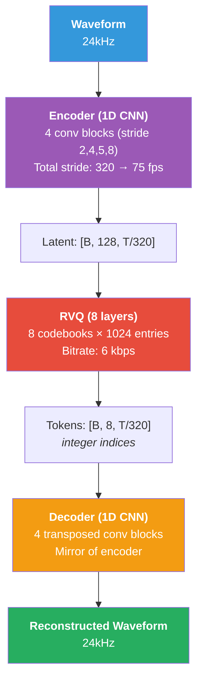
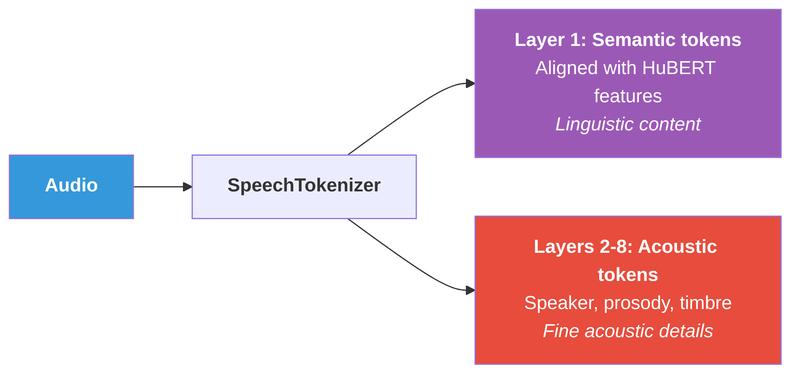

## Tại sao cần Neural Audio Codecs?

Neural audio codecs giải quyết bài toán **nén audio thành discrete tokens**  -  cầu nối trực tiếp giữa speech và language modeling:

$$
\text{Waveform} \xrightarrow{\text{Encoder}} \text{Latent} \xrightarrow{\text{RVQ}} \text{Discrete Tokens} \xrightarrow{\text{Decoder}} \text{Reconstructed Waveform}
$$ {#eq-codec-overview}

::: {.callout-tip title="NLP Parallel: Tokenizer cho Audio"}
| Text Processing | Audio Processing |
|----------------|------------------|
| BPE tokenizer | Neural codec (EnCodec) |
| Vocabulary (32K–128K) | Codebook (1024 per layer × 8 layers) |
| Lossless (exact reconstruction) | Near-lossless (perceptual) |
| Deterministic | Learned (neural network) |
| Input to GPT/BERT | Input to VALL-E/AudioLM |
:::

## Vector Quantization (VQ)

### Basic VQ

Vector Quantization [@oord2017vqvae] ánh xạ continuous vector sang nearest codebook entry:

$$
q(\mathbf{z}) = \arg\min_{\mathbf{e}_k \in \mathcal{C}} \|\mathbf{z} - \mathbf{e}_k\|_2
$$ {#eq-vq}

trong đó $\mathcal{C} = \{\mathbf{e}_1, \mathbf{e}_2, \ldots, \mathbf{e}_K\}$ là codebook với $K$ entries.

**Vấn đề**: argmin không differentiable → cần **Straight-Through Estimator (STE)**:

$$
\hat{\mathbf{z}} = \mathbf{z} + \text{sg}(\mathbf{e}_{k^*} - \mathbf{z})
$$ {#eq-ste}

trong đó $\text{sg}(\cdot)$ là stop-gradient operator. Forward pass: $\hat{\mathbf{z}} = \mathbf{e}_{k^*}$. Backward pass: gradient flows straight through to $\mathbf{z}$.

### VQ-VAE Loss

$$
\mathcal{L}_{\text{VQ-VAE}} = \underbrace{\|\mathbf{x} - \hat{\mathbf{x}}\|_2^2}_{\text{reconstruction}} + \underbrace{\|\text{sg}(\mathbf{z}) - \mathbf{e}\|_2^2}_{\text{codebook loss}} + \beta \underbrace{\|\mathbf{z} - \text{sg}(\mathbf{e})\|_2^2}_{\text{commitment loss}}
$$ {#eq-vqvae-loss}

### Hạn chế của Single VQ

Với codebook size $K = 1024$ và dimension $d = 128$:

- Mỗi frame chỉ chọn 1 trong 1024 entries → **10 bits** per frame
- Ở 50 fps: bitrate = $50 \times 10 = 500$ bps  -  **quá thấp** cho audio quality

→ Cần **Residual Vector Quantization** để tăng capacity.

## Residual Vector Quantization (RVQ)

### Ý tưởng

Thay vì 1 codebook lớn, dùng **nhiều codebooks nhỏ** quantize **residual** (phần dư):

$$
\begin{aligned}
\mathbf{r}_0 &= \mathbf{z} & \text{// Original latent} \\
\hat{\mathbf{z}}_1 &= q_1(\mathbf{r}_0), \quad \mathbf{r}_1 = \mathbf{r}_0 - \hat{\mathbf{z}}_1 & \text{// Quantize + compute residual} \\
\hat{\mathbf{z}}_2 &= q_2(\mathbf{r}_1), \quad \mathbf{r}_2 = \mathbf{r}_1 - \hat{\mathbf{z}}_2 & \text{// Quantize residual} \\
&\vdots \\
\hat{\mathbf{z}}_Q &= q_Q(\mathbf{r}_{Q-1}) & \text{// Final quantization} \\
\hat{\mathbf{z}} &= \sum_{q=1}^{Q} \hat{\mathbf{z}}_q & \text{// Reconstructed latent}
\end{aligned}
$$ {#eq-rvq}

### Bitrate Calculation

Với $Q$ codebooks, mỗi codebook size $K$, ở frame rate $f$:

$$
\text{Bitrate} = Q \times \log_2(K) \times f \text{ bps}
$$ {#eq-rvq-bitrate}

**EnCodec example**: $Q=8, K=1024, f=75$:

$$
\text{Bitrate} = 8 \times 10 \times 75 = 6{,}000 \text{ bps} = 6 \text{ kbps}
$$ {#eq-encodec-bitrate}

::: {.callout-note title="RVQ Hierarchy"}
Các codebook layers mang thông tin khác nhau:

- **Layer 1**: Semantic/linguistic content (phonemes, words)
- **Layers 2–4**: Prosody, speaker identity
- **Layers 5–8**: Fine acoustic details, timbre

Đây là lý do AudioLM và VALL-E xử lý codebook 1 (AR) và codebooks 2–8 (NAR) khác nhau.
:::

```{python}
#| eval: false
#| code-fold: true
#| code-summary: "Residual Vector Quantization"
import torch
import torch.nn as nn
import torch.nn.functional as F
from torch import Tensor


class VectorQuantize(nn.Module):
    """Single-codebook vector quantization with EMA updates."""

    def __init__(
        self,
        dim: int = 128,
        codebook_size: int = 1024,
        decay: float = 0.99,
    ) -> None:
        super().__init__()
        self.codebook_size: int = codebook_size
        self.decay: float = decay

        self.codebook = nn.Embedding(codebook_size, dim)
        nn.init.uniform_(self.codebook.weight, -1.0 / codebook_size, 1.0 / codebook_size)

    def forward(self, z: Tensor) -> tuple[Tensor, Tensor, Tensor]:
        """Quantize input vectors.

        Args:
            z: [batch, T, dim] - float32

        Returns:
            z_q: Quantized vectors [batch, T, dim] - float32
            indices: Codebook indices [batch, T] - int64
            commit_loss: Commitment loss scalar - float32
        """
        # Find nearest codebook entry
        # z: [B, T, D], codebook: [K, D]
        dist: Tensor = (
            z.pow(2).sum(-1, keepdim=True)          # [B, T, 1]
            - 2 * z @ self.codebook.weight.T         # [B, T, K]
            + self.codebook.weight.pow(2).sum(-1)     # [K]
        )  # [B, T, K] - float32 (squared distances)

        indices: Tensor = dist.argmin(dim=-1)  # [B, T] - int64
        z_q: Tensor = self.codebook(indices)   # [B, T, D] - float32

        # Commitment loss
        commit_loss: Tensor = F.mse_loss(z, z_q.detach())  # scalar

        # Straight-Through Estimator
        z_q = z + (z_q - z).detach()  # [B, T, D] - float32

        return z_q, indices, commit_loss


class ResidualVQ(nn.Module):
    """Residual Vector Quantization with Q codebooks."""

    def __init__(
        self,
        dim: int = 128,
        codebook_size: int = 1024,
        n_quantizers: int = 8,
    ) -> None:
        super().__init__()
        self.n_quantizers: int = n_quantizers
        self.quantizers = nn.ModuleList([
            VectorQuantize(dim=dim, codebook_size=codebook_size)
            for _ in range(n_quantizers)
        ])

    def forward(
        self, z: Tensor,  # [batch, T, dim] - float32
    ) -> tuple[Tensor, Tensor, Tensor]:
        """Apply residual vector quantization.

        Args:
            z: Input latent [B, T, dim] - float32

        Returns:
            z_q: Quantized sum [B, T, dim] - float32
            all_indices: Codebook indices [B, Q, T] - int64
            total_loss: Sum of commitment losses - float32
        """
        residual: Tensor = z.clone()  # [B, T, D] - float32
        z_q: Tensor = torch.zeros_like(z)  # [B, T, D] - float32
        all_indices: list[Tensor] = []
        total_loss: Tensor = torch.tensor(0.0, device=z.device)

        for q, quantizer in enumerate(self.quantizers):
            zq_i, indices_i, loss_i = quantizer(residual)
            # zq_i: [B, T, D], indices_i: [B, T], loss_i: scalar

            residual = residual - zq_i.detach()  # [B, T, D] - float32
            z_q = z_q + zq_i  # [B, T, D] - float32
            all_indices.append(indices_i)
            total_loss = total_loss + loss_i

        indices_stacked: Tensor = torch.stack(
            all_indices, dim=1
        )  # [B, Q, T] - int64

        return z_q, indices_stacked, total_loss
```

## EnCodec

### Architecture

EnCodec [@defossez2022encodec] là neural audio codec của Meta:

{#fig-encodec-arch width=60%}

### Training Losses

$$
\mathcal{L}_{\text{EnCodec}} = \lambda_t \mathcal{L}_{\text{time}} + \lambda_f \mathcal{L}_{\text{freq}} + \lambda_g \mathcal{L}_{\text{gan}} + \lambda_{\text{fm}} \mathcal{L}_{\text{feat}} + \lambda_w \mathcal{L}_{\text{vq}}
$$ {#eq-encodec-loss}

| Loss | Formula | Purpose |
|------|---------|---------|
| Time domain | $\|\mathbf{x} - \hat{\mathbf{x}}\|_1$ | Waveform reconstruction |
| Frequency domain | $\sum_s \|\text{STFT}_s(\mathbf{x}) - \text{STFT}_s(\hat{\mathbf{x}})\|_1 + \|\log \text{STFT}_s\|_1$ | Multi-scale spectral |
| GAN | $\sum_k \max(0, 1 - D_k(\mathbf{x})) + \max(0, 1 + D_k(\hat{\mathbf{x}}))$ | Perceptual quality |
| Feature matching | $\sum_k \sum_l \|D_k^l(\mathbf{x}) - D_k^l(\hat{\mathbf{x}})\|_1$ | Discriminator features |
| VQ commitment | $\|\mathbf{z} - \text{sg}(\hat{\mathbf{z}})\|_2^2$ | Encoder-codebook alignment |

: EnCodec loss components {#tbl-encodec-losses}

### EnCodec Specifications

| Parameter | Value |
|-----------|-------|
| Sample rate | 24 kHz |
| Encoder stride | 320 (→ 75 fps) |
| Codebook size | 1024 per layer |
| RVQ layers | 1–32 (adjustable) |
| Bitrate | 1.5 / 3 / 6 / 12 / 24 kbps |
| Latent dim | 128 |
| Model params | ~15M |
| Latency | 13.3ms (1 frame at 75 Hz) |

: EnCodec specifications {#tbl-encodec-specs}

## DAC (Descript Audio Codec)

DAC [@kumar2024dac] cải tiến EnCodec với:

1. **Improved codebook utilization**: Factorized codes + L2 normalization
2. **Snake activation**: $\text{Snake}(x) = x + \frac{1}{\alpha}\sin^2(\alpha x)$  -  tốt hơn cho periodic signals
3. **Higher quality**: Đặc biệt ở bitrate thấp

| Codec | ViSQOL (↑) @ 6kbps | Codebook Usage |
|-------|---------------------|----------------|
| EnCodec | 3.69 | ~60% |
| **DAC** | **4.01** | **~95%** |

: DAC vs EnCodec quality {#tbl-dac-vs-encodec}

## SpeechTokenizer

### Disentangled Semantic/Acoustic Tokens

SpeechTokenizer tách biệt **semantic** và **acoustic** information:

{#fig-speechtokenizer width=75%}

Training: Thêm **semantic distillation loss** cho layer 1:

$$
\mathcal{L}_{\text{semantic}} = \|\hat{\mathbf{z}}^{(1)} - \text{HuBERT}(\mathbf{x})\|_2^2
$$ {#eq-speechtokenizer}

**Lợi ích**: Speech LLMs có thể xử lý semantic tokens (layer 1) riêng → tốt hơn cho language understanding tasks.

## Mimi  -  Ultra-Low Latency Codec

### Key Innovation

Mimi (dùng trong Moshi [@defossez2024moshi]) đạt **ultra-low frame rate**:

$$
\text{EnCodec: 75 Hz} \quad \xrightarrow{\text{Mimi}} \quad \text{12.5 Hz}
$$ {#eq-mimi-framerate}

### Cách đạt 12.5 Hz

1. **Larger encoder stride**: 1920 (vs 320 cho EnCodec)
2. **Transformer layers** trong encoder/decoder: Capture long-range dependencies
3. **Semantic distillation**: Layer 1 aligned với WavLM features
4. **Split RVQ**: 1 semantic codebook + 7 acoustic codebooks

### Tại sao 12.5 Hz quan trọng?

$$
\text{Tokens per second} = 12.5 \times 8 = 100 \text{ tokens/s (total)}
$$ {#eq-mimi-tokens}

So sánh: EnCodec = $75 \times 8 = 600$ tokens/s. Mimi giảm **6×** số tokens → Transformer self-attention nhanh hơn **36×** ($O(L^2)$).

::: {.callout-warning title="Latency Warning"}
| Codec | Frame Rate | Tokens/sec | 10s Audio Tokens | Self-Attn Cost |
|-------|-----------|------------|-----------------|---------------|
| EnCodec | 75 Hz | 600 | 6,000 | $O(36M)$ |
| **Mimi** | 12.5 Hz | 100 | 1,000 | $O(1M)$ |
| Reduction | 6× | 6× | 6× | **36×** |

Mimi's low frame rate là yếu tố quyết định cho full-duplex dialogue trong Moshi.
:::

## Codec Comparison

| Codec | Frame Rate | RVQ Layers | Bitrate | Quality | Semantic? |
|-------|-----------|------------|---------|---------|-----------|
| EnCodec | 75 Hz | 8 | 6 kbps | Good | No |
| DAC | 86 Hz | 9 | 8 kbps | **Better** | No |
| SpeechTokenizer | 50 Hz | 8 | 4 kbps | Good | **Layer 1** |
| **Mimi** | **12.5 Hz** | 8 | 1.1 kbps | Good | **Layer 1** |

: Audio codec comparison {#tbl-codec-comparison}

```{python}
#| eval: false
#| code-fold: true
#| code-summary: "EnCodec-style encoder architecture"
import torch
import torch.nn as nn
from torch import Tensor


class EnCodecEncoder(nn.Module):
    """Simplified EnCodec encoder.

    Waveform → Latent features via strided convolutions.
    """

    def __init__(
        self,
        in_channels: int = 1,
        latent_dim: int = 128,
        channels: int = 64,
        strides: tuple[int, ...] = (2, 4, 5, 8),  # total = 320
    ) -> None:
        super().__init__()
        self.conv_in = nn.Conv1d(
            in_channels, channels, kernel_size=7, padding=3,
        )

        blocks: list[nn.Module] = []
        ch: int = channels
        for stride in strides:
            ch_out: int = ch * 2
            blocks.extend([
                nn.ELU(),
                nn.Conv1d(ch, ch, kernel_size=3, padding=1),
                nn.ELU(),
                nn.Conv1d(
                    ch, ch_out,
                    kernel_size=2 * stride,
                    stride=stride,
                    padding=stride // 2,
                ),
            ])
            ch = ch_out

        self.encoder = nn.Sequential(*blocks)
        self.conv_out = nn.Sequential(
            nn.ELU(),
            nn.Conv1d(ch, latent_dim, kernel_size=3, padding=1),
        )

    def forward(self, x: Tensor) -> Tensor:
        """Encode waveform to latent features.

        Args:
            x: Waveform [batch, 1, T_samples] - float32

        Returns:
            z: Latent features [batch, latent_dim, T'] - float32
               where T' = T_samples / prod(strides)
        """
        h: Tensor = self.conv_in(x)     # [B, 64, T] - float32
        h = self.encoder(h)              # [B, 1024, T'] - float32
        z: Tensor = self.conv_out(h)     # [B, 128, T'] - float32
        return z
```

## Tóm tắt

| Concept | Equation | Role |
|---------|----------|------|
| VQ | $q(\mathbf{z}) = \arg\min_k \|\mathbf{z} - \mathbf{e}_k\|$ | Discretize latent |
| STE | $\hat{\mathbf{z}} = \mathbf{z} + \text{sg}(\mathbf{e} - \mathbf{z})$ | Gradient through argmin |
| RVQ | $\hat{\mathbf{z}} = \sum_q q_q(\mathbf{r}_{q-1})$ | Multi-layer quantization |
| Bitrate | $Q \times \log_2(K) \times f$ | Quality control |

: Audio codec key concepts {#tbl-codec-summary}

Neural audio codecs là **nền tảng** cho Speech LLMs. Chương tiếp theo sẽ khám phá cách AudioLM, Qwen2-Audio, và Moshi xây dựng trên codec tokens để tạo ra speech-native language models.
