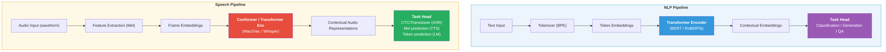

# NLP ↔ Speech Complete Mapping

## Concept Mapping Table

Bảng ánh xạ đầy đủ giữa các khái niệm NLP và Speech  -  giúp NLP researchers nhanh chóng tìm được counterpart trong speech domain.

### Data & Representation

| NLP Concept | Speech Counterpart | Notes |
|------------|-------------------|-------|
| Raw text (string) | Raw waveform (1D signal) | Text: discrete characters. Audio: continuous samples |
| Character | Audio sample (16-bit, 16kHz) | Smallest unit |
| Word / Subword (BPE) | Phoneme / Syllable | Linguistic unit |
| Vocabulary (32K–128K) | Codebook (1024 × 8 RVQ layers) | Discrete symbol set |
| Token ID (integer) | Codec token (integer per codebook) | Index into vocabulary/codebook |
| Token embedding | Audio frame embedding | Dense vector per unit |
| Sentence | Utterance | Complete expression |
| Document | Audio recording / Episode | Long-form content |
| Corpus | Speech corpus (hours) | Training data |
| Text length (tokens) | Duration (seconds / frames) | Sequence measure |

### Preprocessing

| NLP | Speech | Notes |
|-----|--------|-------|
| Tokenization (BPE/WordPiece) | Feature extraction (Mel/MFCC) | Convert raw → model input |
| Lowercasing | Pre-emphasis filter | Normalization |
| Stopword removal | Silence removal (VAD) | Remove uninformative parts |
| Text normalization | Audio normalization | Standardize input |
| Data augmentation (back-translation) | SpecAugment (time/freq masking) | Training regularization |
| Positional encoding | Sinusoidal / Relative position | Encode sequence order |

### Model Architectures

| NLP Model | Speech Model | Shared Principle |
|-----------|-------------|-----------------|
| BERT | Wav2Vec 2.0 / HuBERT | Masked prediction pre-training |
| GPT (autoregressive LM) | AudioLM / VALL-E | Next-token prediction |
| T5 (encoder-decoder) | Whisper | Seq2seq with cross-attention |
| Transformer encoder | Conformer | Feature extraction backbone |
| Transformer decoder | Tacotron 2 decoder | Autoregressive generation |
| VAE | VQ-VAE / VITS | Latent variable model |
| Diffusion model | Grad-TTS / F5-TTS | Iterative denoising/flow |
| GAN (text) | HiFi-GAN / WaveGAN | Adversarial training |

### Training Paradigms

| NLP Paradigm | Speech Paradigm | Details |
|-------------|----------------|---------|
| Masked Language Model (MLM) | Masked speech prediction | Mask → predict (BERT ↔ HuBERT) |
| Causal LM (next token) | Codec LM (next audio token) | GPT ↔ AudioLM |
| Contrastive learning (SimCLR) | Contrastive learning (Wav2Vec 2.0) | Positive/negative pairs |
| Knowledge distillation | Distil-Whisper | Teacher → Student |
| RLHF (preference learning) | MOS-based optimization | Human feedback |
| Instruction tuning | Audio instruction tuning | Qwen2-Audio Stage 2 |
| Few-shot prompting | Zero-shot voice cloning (3s) | In-context learning |

### Tasks

| NLP Task | Speech Task | Mapping |
|----------|------------|---------|
| Text classification | Audio classification | Classify input |
| Named Entity Recognition | Speaker diarization | Segment + label |
| Machine Translation | Speech Translation | Cross-lingual |
| Text Generation | Speech Synthesis (TTS) | Generate output |
| Summarization | Audio summarization | Compress information |
| Question Answering | Audio QA | Answer from input |
| Sentiment Analysis | Emotion Recognition | Detect affect |
| Language Identification | Language ID from audio | Detect language |
| Text-to-Text | Speech-to-Speech | Direct transformation |

### Losses & Metrics

| NLP | Speech | Notes |
|-----|--------|-------|
| Cross-entropy (token prediction) | Cross-entropy (CTC, token prediction) | Standard classification loss |
| Perplexity |  -  | LM evaluation |
| BLEU / ROUGE | WER / CER | Generation quality |
| BERTScore |  -  | Semantic similarity |
|  -  | MOS (Mean Opinion Score) | Human perceptual quality |
|  -  | PESQ / ViSQOL | Automated audio quality |
|  -  | Speaker similarity (cosine) | Voice cloning evaluation |
| KL divergence | KL divergence (VAE) | Distribution matching |

### Production & Deployment

| NLP Production | Speech Production | Notes |
|---------------|-------------------|-------|
| Tokenizer latency | Feature extraction latency | Preprocessing time |
| KV cache (autoregressive) | KV cache (Whisper decoder) | Memory optimization |
| Quantization (INT8/INT4) | Quantization (INT8/FP16) | Model compression |
| Batched inference | Dynamic batching | Throughput optimization |
| Streaming (token-by-token) | Streaming ASR/TTS | Real-time processing |
| vLLM / TGI | TensorRT-LLM + Triton | Inference servers |
| Context window limit | Max audio duration (30s) | Input length constraint |
| Token budget | Latency budget (<1s) | Resource constraint |

## Architecture Mapping Diagram

<figure markdown id="fig-nlp-speech-mapping">
  
  <figcaption>NLP Pipeline vs Speech Pipeline  -  Architecture Mapping</figcaption>
</figure>

## Scale Comparison

| Dimension | NLP | Speech | Ratio |
|-----------|-----|--------|-------|
| Input dim per step | 1 (token ID) | 80 (mel) or 16000 (raw) | 80–16000× |
| Typical sequence length | 512–4096 tokens | 1500 frames (30s) or 480K samples | ~1–100× |
| Vocabulary size | 32K–128K | 1024 (per codebook) × 8 | 4–16× |
| Pre-training data | ~1–15T tokens | ~680K hours | Different units |
| Model size (SOTA) | 70B–405B | 1.5B–7B | 10–100× smaller |
| Inference speed | ~50 tokens/s | Real-time (RTF ≤ 1) | Different metrics |
| Human eval | Preference ranking | MOS (1–5 scale) | Different scales |
