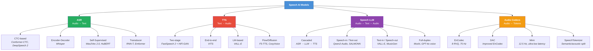

# From NLP to Speech  -  The Conceptual Bridge

## Tại sao NLP Researcher cần hiểu Speech?

Trong kỷ nguyên multimodal AI, ranh giới giữa text và speech đang dần biến mất. GPT-4o có thể nghe, nói, và suy luận đồng thời. Moshi [^defossez2024moshi] cho phép full-duplex dialogue  -  người và AI nói cùng lúc. Qwen2-Audio [^chu2023qwen2audio] hiểu audio ở mức semantic.

Tất cả đều xây dựng trên **cùng một nền tảng Transformer** mà NLP researchers đã quen thuộc. Sự khác biệt chính nằm ở **cách biểu diễn input/output**  -  và đó chính là cầu nối mà chương này xây dựng.

## Text vs Audio: Discrete vs Continuous

| Chiều so sánh | Text (NLP) | Speech (Audio) |
|--------------|-----------|---------------|
| **Input representation** | Discrete tokens (BPE, ~50K vocab) | Continuous waveform (16,000 samples/sec) |
| **Sequence length** | ~512 tokens cho 1 paragraph | ~160,000 samples cho 10 giây |
| **Tokenization** | BPE / SentencePiece | Mel spectrogram hoặc neural codec tokens |
| **Information density** | Cao (mỗi token mang ý nghĩa) | Thấp (phần lớn là redundant acoustic info) |
| **Alignment** | 1:1 (input token → output token) | Many:1 (hàng trăm frames → một từ) |
| **Modality** | 1D symbolic sequence | 1D continuous signal → 2D spectrogram |
| **Key challenge** | Long-range dependencies | Time-frequency analysis + alignment |

: So sánh Text vs Audio <a id="tbl-text-vs-audio"></a>

!!! note "Core Insight"
    Khi audio được chuyển thành discrete tokens (qua neural codecs như EnCodec), speech trở thành **bài toán language modeling**  -  và tất cả kỹ thuật LLM áp dụng trực tiếp.


## Ba Cách Tiếp cận Biểu diễn Audio

### Spectrogram-based

Pipeline quen thuộc nhất, tương tự cách xử lý ảnh:

$$
\text{Waveform} \xrightarrow{\text{STFT}} \text{Power Spectrum} \xrightarrow{\text{Mel Filterbank}} \text{Mel Spectrogram}
$$ <a id="eq-spectrogram-pipeline"></a>

- **Output**: Ma trận 2D kích thước $(n_{\text{mels}}, T_{\text{frames}})$
- **Ví dụ**: 10 giây audio → $(80, 1000)$ ở 100 frames/sec
- **Sử dụng bởi**: Whisper, Tacotron 2, FastSpeech 2
- **NLP parallel**: Giống như OCR  -  xử lý text dưới dạng hình ảnh

### Self-Supervised Representations

Học continuous representations trực tiếp từ raw waveform:

$$
\text{Waveform} \xrightarrow{\text{CNN Encoder}} \text{Latent} \xrightarrow{\text{Transformer}} \text{Contextualized Representations}
$$ <a id="eq-self-supervised-pipeline"></a>

- **Output**: Sequence of vectors $(T', d_{\text{model}})$ ở ~50 fps
- **Sử dụng bởi**: Wav2Vec 2.0 [^baevski2020wav2vec], HuBERT [^hsu2021hubert]
- **NLP parallel**: Trực tiếp tương đương **BERT embeddings**

### Neural Codec Tokens

Nén audio thành discrete token sequences  -  **cầu nối trực tiếp đến LLM**:

$$
\text{Waveform} \xrightarrow{\text{Encoder}} \text{Latent} \xrightarrow{\text{RVQ}} \text{Discrete Tokens} \in \{0, 1, \ldots, C-1\}^{Q \times T''}
$$ <a id="eq-codec-pipeline"></a>

trong đó $Q$ là số quantization layers (codebooks) và $C$ là codebook size.

- **Output**: Ma trận integer $(Q, T'')$  -  ví dụ $(8, 750)$ cho 10 giây ở 75 fps
- **Sử dụng bởi**: VALL-E [^wang2023valle], AudioLM [^borsos2023audiolm], Moshi
- **NLP parallel**: **Hoàn toàn tương đương BPE tokenization**  -  chỉ khác vocabulary

!!! tip "NLP Parallel: BPE vs Neural Codecs"
    | | BPE (Text) | Neural Codec (Audio) |
    |---|-----------|---------------------|
    | Input | Raw text | Raw waveform |
    | Process | Statistical subword splitting | Learned compression + VQ |
    | Output | Integer token IDs | Integer codebook indices |
    | Vocab size | 32K–128K | 1024 per codebook × 8 layers |
    | Reversible? | Lossless | Near-lossless (perceptual) |
    | LM applicable? | Yes (GPT, BERT) | **Yes** (VALL-E, AudioLM) |


## Architecture Taxonomy

<figure markdown id="fig-speech-taxonomy">
  
  <figcaption>Phân loại các mô hình Speech AI</figcaption>
</figure>

## NLP↔Speech Concept Mapping

Đây là bảng mapping quan trọng nhất trong chương này  -  mỗi khái niệm NLP quen thuộc đều có speech equivalent:

| NLP Concept | Speech Equivalent | Ghi chú |
|------------|-------------------|---------|
| Token | Audio frame / Codec token | 1 token ≈ 1 frame (10–80ms) |
| BPE tokenizer | Mel spectrogram / EnCodec | Spectrogram = handcrafted; codec = learned |
| Embedding layer | Audio encoder (CNN) | Maps raw signal → latent space |
| BERT pre-training | Wav2Vec 2.0 / HuBERT | Masked prediction on speech |
| GPT (autoregressive LM) | VALL-E / AudioLM | Next-token prediction on codec tokens |
| Sequence classification | Audio classification | Speaker ID, emotion, language |
| Token classification | Frame classification + CTC | ASR = classify each frame → text |
| Seq2seq (translation) | Whisper (ASR) / TTS | Audio→Text or Text→Audio |
| Text generation | Audio generation | TTS, voice cloning, music |
| Vocabulary size | Codebook size × layers | 1024 × 8 = 8192 effective |
| Context window | Audio duration × frame rate | 30s × 100fps = 3000 frames |
| Positional encoding | Time encoding | Sinusoidal or learned |
| Attention mask | Causal / streaming mask | Streaming = limited look-ahead |
| Cross-attention | Encoder-decoder attention | Text conditions speech (TTS) |
| KV-cache | KV-cache (same!) | Autoregressive speech generation |
| Beam search | Beam search (same!) | ASR/TTS decoding |
| Perplexity | Perplexity on codec tokens | Language model evaluation |
| BLEU/ROUGE | WER (ASR) / MOS (TTS) | Task-specific metrics |
| Fine-tuning | Fine-tuning (same!) | Adapter, LoRA work on speech models too |
| Distillation | Distil-Whisper | Same technique, applied to ASR |

: NLP↔Speech concept mapping <a id="tbl-nlp-speech-mapping"></a>

## Kích thước Dữ liệu: Text vs Audio

Hiểu được scale difference là rất quan trọng cho system design:

$$
\text{Data rate}_{\text{text}} \approx 4 \text{ tokens/sec} \quad \text{vs} \quad \text{Data rate}_{\text{audio}} \approx 16{,}000 \text{ samples/sec}
$$ <a id="eq-data-rate"></a>

Điều này có nghĩa:

| Metric | Text | Audio (16kHz, 16-bit) |
|--------|------|----------------------|
| Raw data per second | ~20 bytes | 32,000 bytes |
| 1 hour of data | ~72 KB | 115 MB |
| Typical dataset | ~100 GB text | ~680K hours (Whisper) |
| Tokens per second | ~4 (words) | 100 (mel frames) / 75 (codec) |
| Sequence length (10s) | ~40 tokens | 1,000 frames / 600 codec tokens |

: So sánh kích thước dữ liệu Text vs Audio <a id="tbl-data-scale"></a>

!!! warning "Latency Warning"
    Audio sequence dài hơn text ~25× ở mel frame level. Self-attention $O(L^2)$ trở thành bottleneck nghiêm trọng  -  đây là lý do Conformer [^gulati2020conformer] kết hợp convolution (local) với attention (global).


## Feature Comparison

```python
#| eval: false
#| code-fold: true
#| code-summary: "So sánh ba cách biểu diễn audio"
import torch
from torch import Tensor


def compare_representations(
    duration_sec: float = 1.0,
    sample_rate: int = 16000,
) -> dict[str, dict[str, int | float]]:
    """So sánh kích thước ba biểu diễn audio.

    Args:
        duration_sec: Độ dài audio (giây)
        sample_rate: Tần số lấy mẫu (Hz)

    Returns:
        Dictionary chứa thông tin từng biểu diễn
    """
    n_samples: int = int(duration_sec * sample_rate)

    # 1. Mel spectrogram
    n_mels: int = 80
    hop_length: int = 160  # 10ms frames
    n_frames: int = n_samples // hop_length  # [n_mels, n_frames] - float32
    mel_size_bytes: int = n_mels * n_frames * 4  # float32 = 4 bytes

    # 2. Self-supervised (Wav2Vec 2.0 / HuBERT)
    ssl_fps: int = 50  # 50 frames/sec (320x downsampling)
    ssl_dim: int = 768  # hidden dimension
    ssl_frames: int = int(duration_sec * ssl_fps)  # [ssl_frames, ssl_dim] - float32
    ssl_size_bytes: int = ssl_frames * ssl_dim * 4

    # 3. Neural codec tokens (EnCodec)
    codec_fps: int = 75  # 75 frames/sec
    n_codebooks: int = 8  # 8 RVQ layers
    codec_frames: int = int(duration_sec * codec_fps)  # [n_codebooks, codec_frames] - int64
    codec_size_bytes: int = n_codebooks * codec_frames * 8  # int64 = 8 bytes

    return {
        "mel_spectrogram": {
            "shape": f"({n_mels}, {n_frames})",
            "total_values": n_mels * n_frames,
            "size_bytes": mel_size_bytes,
            "fps": sample_rate // hop_length,
        },
        "self_supervised": {
            "shape": f"({ssl_frames}, {ssl_dim})",
            "total_values": ssl_frames * ssl_dim,
            "size_bytes": ssl_size_bytes,
            "fps": ssl_fps,
        },
        "codec_tokens": {
            "shape": f"({n_codebooks}, {codec_frames})",
            "total_values": n_codebooks * codec_frames,
            "size_bytes": codec_size_bytes,
            "fps": codec_fps,
        },
    }


# So sánh cho 1 giây audio
result: dict = compare_representations(duration_sec=1.0)
for name, info in result.items():
    print(f"{name:20s}: shape={info['shape']:15s}  "
          f"values={info['total_values']:>8,}  "
          f"size={info['size_bytes']:>8,} bytes  "
          f"fps={info['fps']}")
```

## Tóm tắt

Chương này đã thiết lập cầu nối khái niệm giữa NLP và Speech:

1. **Audio là continuous**  -  cần chuyển thành discrete representation trước khi áp dụng LM
2. **Ba cách tiếp cận**: spectrogram (handcrafted), self-supervised (learned), codec tokens (discrete)
3. **Neural codec tokens** là cầu nối trực tiếp  -  biến speech thành language modeling problem
4. **Mọi khái niệm NLP** đều có speech equivalent  -  [Bảng](#tbl-nlp-speech-mapping) là tham chiếu chính

Chương tiếp theo sẽ đi sâu vào **Audio Signal Fundamentals**  -  nền tảng toán học cho tất cả speech processing.


---

<!-- References (auto-generated from .bib) -->
[^defossez2024moshi]: D{\'e}fossez, Alexandre and Musicant, Laurent and others, "Moshi: A Speech-Text Foundation Model for Real-Time Dialogue", arXiv preprint arXiv:2410.00037
[^chu2023qwen2audio]: Chu, Yunfei and Xu, Jin and Zhou, Xiaohuan and others, "Qwen-Audio: Advancing Universal Audio Understanding via Unified Large-Scale Audio-Language Models", arXiv preprint arXiv:2311.07919
[^baevski2020wav2vec]: Baevski, Alexei and Zhou, Yuhao and Mohamed, Abdelrahman and Auli, Michael, "wav2vec 2.0: A Framework for Self-Supervised Learning of Speech Representations", Advances in Neural Information Processing Systems
[^hsu2021hubert]: Hsu, Wei-Ning and Bolte, Benjamin and Tsai, Yao-Hung Hubert and Lakhotia, Kushal and Salakhutdinov, Ruslan and Mohamed, Abdelrahman, "HuBERT: Self-Supervised Speech Representation Learning by Masked Prediction of Hidden Units", IEEE/ACM Transactions on Audio, Speech, and Language Processing
[^wang2023valle]: Wang, Chengyi and Chen, Sanyuan and Wu, Yu and others, "Neural Codec Language Models are Zero-Shot Text to Speech Synthesizers", arXiv preprint arXiv:2301.02111
[^borsos2023audiolm]: Borsos, Zal{\'a}n and Marinier, Rapha{\"e}l and others, "AudioLM: A Language Modeling Approach to Audio Generation", IEEE/ACM Transactions on Audio, Speech, and Language Processing
[^gulati2020conformer]: Gulati, Anmol and Qin, James and Chiu, Chung-Cheng and others, "Conformer: Convolution-augmented Transformer for Speech Recognition", Interspeech
