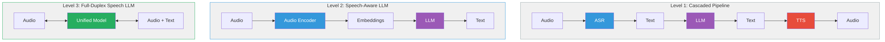
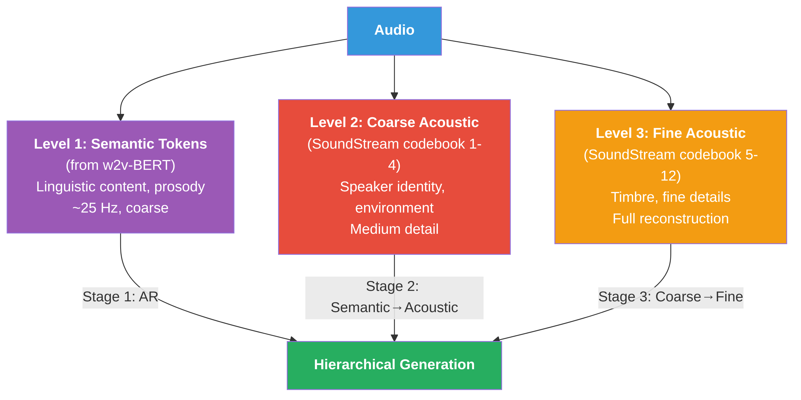
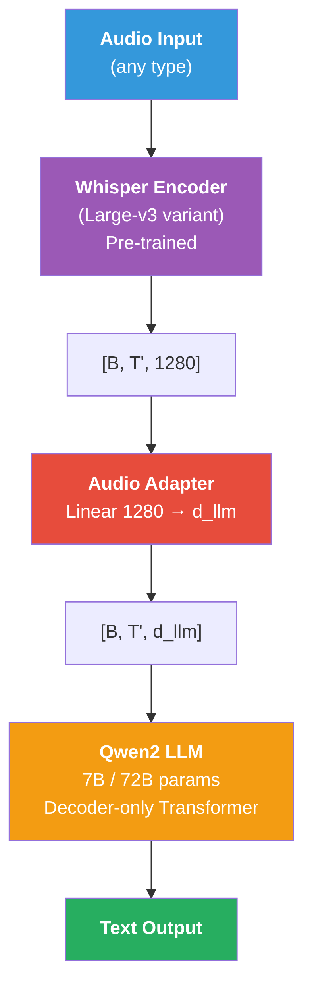
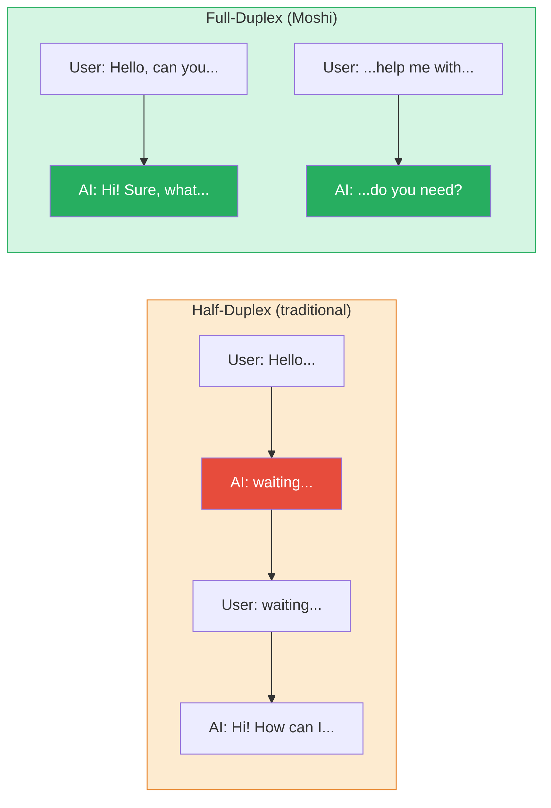
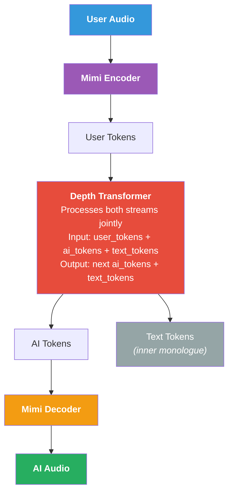
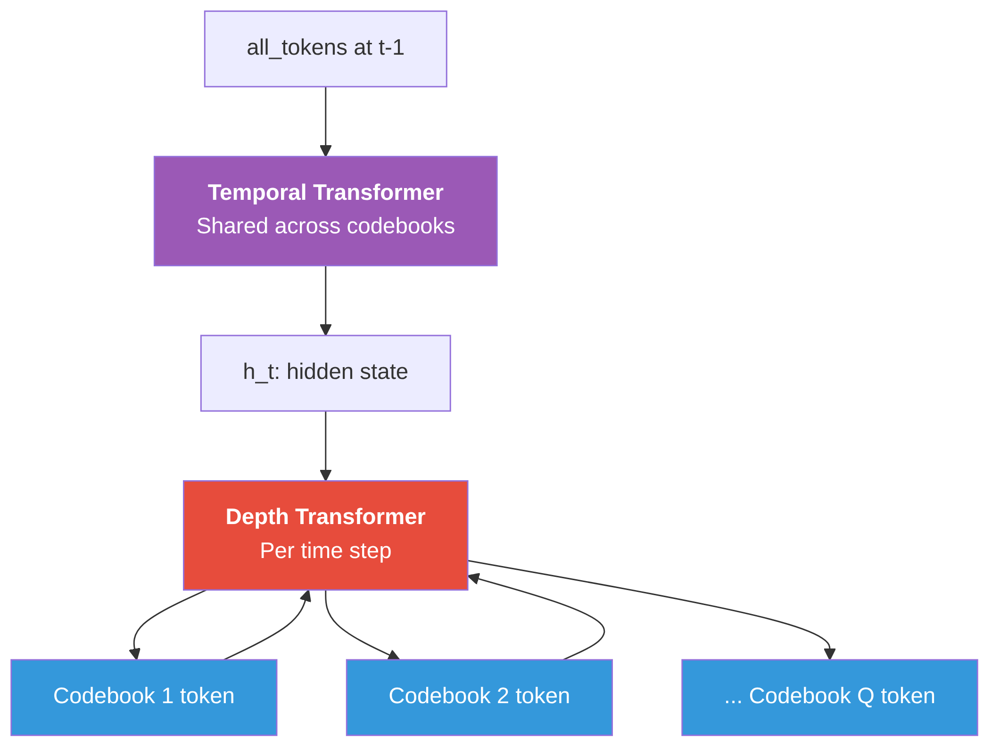
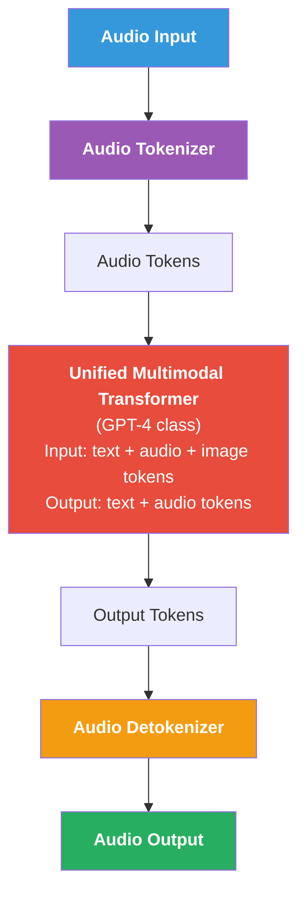

# Speech Language Models

## Từ Text LLM đến Speech LLM

Speech Language Models mở rộng paradigm LLM sang audio modality. Có 3 cấp độ tích hợp:

<figure markdown id="fig-speech-llm-levels">
  
  <figcaption>3 cấp độ tích hợp Speech vào LLM</figcaption>
</figure>

## AudioLM  -  Hierarchical Audio Language Model

### Key Insight

AudioLM [^borsos2023audiolm] là model đầu tiên chứng minh rằng **audio generation = language modeling on discrete tokens**. Sử dụng hierarchical token structure:

<figure markdown id="fig-audiolm-hierarchy">
  
  <figcaption>AudioLM: Hierarchical Token Structure</figcaption>
</figure>

### Three-Stage Generation

<a id="eq-audiolm-stages"></a>

$$
\begin{aligned}
\text{Stage 1:} \quad & P(\mathbf{s}_{t+1:T} \mid \mathbf{s}_{1:t}) & \text{// Semantic token continuation} \\
\text{Stage 2:} \quad & P(\mathbf{a}^{1:4} \mid \mathbf{s}) & \text{// Semantic → coarse acoustic} \\
\text{Stage 3:} \quad & P(\mathbf{a}^{5:12} \mid \mathbf{a}^{1:4}) & \text{// Coarse → fine acoustic}
\end{aligned}
$$

Mỗi stage là một **autoregressive Transformer**  -  cùng architecture, khác tokenization level.

!!! note "Tại sao Hierarchical?"
    Semantic tokens không đủ để reconstruct audio (missing speaker info). Acoustic tokens quá detailed cho LM (sequence quá dài). Hierarchy cho phép:

    1. Plan high-level (semantic) trước
    2. Fill in details (acoustic) sau
    3. Giữ sequence lengths manageable cho Transformer


### AudioLM Results

- **Speech continuation**: Nghe tự nhiên, maintain speaker identity
- **Music generation**: Coherent melodies
- **No text conditioning needed**: Purely audio-to-audio

## Qwen2-Audio  -  Universal Audio Understanding

### Architecture

Qwen2-Audio [^chu2023qwen2audio] là Speech-Aware LLM  -  hiểu audio nhưng output text:

<figure markdown id="fig-qwen2audio-arch">
  
  <figcaption>Kiến trúc Qwen2-Audio: Whisper Encoder + Adapter + LLM</figcaption>
</figure>

### Capabilities

Qwen2-Audio hỗ trợ **đa dạng audio tasks** qua text prompting:

| Task | Prompt Example | Output |
|------|---------------|--------|
| ASR | "Transcribe this audio" | Text transcription |
| Translation | "Translate to English" | Translated text |
| Audio QA | "What instrument is playing?" | "Piano" |
| Emotion | "What emotion?" | "Happy, excited" |
| Sound event | "What sounds do you hear?" | "Dog barking, rain" |
| Speaker ID | "How many speakers?" | "2 speakers" |

: Qwen2-Audio capabilities <a id="tbl-qwen2-audio-tasks"></a>

### Training

2-stage training:

<a id="eq-qwen2-training"></a>

$$
\begin{aligned}
\text{Stage 1:} \quad & \text{Audio-text alignment} & \text{(freeze LLM, train adapter)} \\
\text{Stage 2:} \quad & \text{Instruction tuning} & \text{(unfreeze all, multitask)}
\end{aligned}
$$

## Moshi  -  Full-Duplex Speech Dialogue

### What is Full-Duplex?

<figure markdown id="fig-half-vs-full-duplex">
  
  <figcaption>Half-Duplex vs Full-Duplex Speech</figcaption>
</figure>

### Architecture

Moshi [^defossez2024moshi] xử lý **2 audio streams song song** (user + AI):

<figure markdown id="fig-moshi-arch">
  
  <figcaption>Kiến trúc Moshi: Dual-stream full-duplex speech</figcaption>
</figure>

### Dual-Stream Processing

Moshi processes **2 parallel token streams** tại mỗi time step:

<a id="eq-moshi-dual"></a>

$$
P(a_t^{\text{AI}}, w_t \mid a_{<t}^{\text{user}}, a_{<t}^{\text{AI}}, w_{<t})
$$

trong đó:

- $a_t^{\text{user}}$: Mimi tokens từ user audio tại time $t$
- $a_t^{\text{AI}}$: Mimi tokens cho AI audio tại time $t$
- $w_t$: Text token (inner monologue) tại time $t$

### Depth Transformer

Moshi sử dụng **Depth Transformer** để handle multi-codebook prediction:

<figure markdown id="fig-depth-temporal">
  
  <figcaption>Moshi: Temporal + Depth Transformer</figcaption>
</figure>

<a id="eq-depth-transformer"></a>

$$
\begin{aligned}
\mathbf{h}_t &= \text{TemporalTransformer}(\text{tokens}_{1:t-1}) \\
c_t^{(q)} &= \text{DepthTransformer}(\mathbf{h}_t, c_t^{(1)}, \ldots, c_t^{(q-1)})
\end{aligned}
$$

### Inner Monologue

Moshi có khả năng **text reasoning** đồng thời với speech:

<a id="eq-inner-monologue"></a>

$$
\text{Audio tokens (speech)} \parallel \text{Text tokens (reasoning)}
$$

Text stream hoạt động như "inner thought"  -  giúp model plan response trước khi nói.

### Moshi Specifications

| Parameter | Value |
|-----------|-------|
| Audio codec | Mimi (12.5 Hz, 8 codebooks) |
| Total parameters | ~7B |
| Temporal Transformer | 32 layers, 4096 dim |
| Depth Transformer | 6 layers, 1024 dim |
| Latency | **~200ms** (end-to-end) |
| Training data | 7M hours audio |
| Full-duplex | Yes (simultaneous listen + speak) |

: Moshi specifications <a id="tbl-moshi-specs"></a>

!!! warning "Latency Warning"
    Latency breakdown cho Moshi:

    | Component | Latency |
    |-----------|---------|
    | Mimi encoder (1 frame) | 80ms (= 1/12.5 Hz) |
    | Temporal Transformer | ~50ms |
    | Depth Transformer (8 codebooks) | ~30ms |
    | Mimi decoder | ~40ms |
    | **Total** | **~200ms** |

    200ms là dưới ngưỡng cảm nhận delay trong conversation (~300ms). Đây là breakthrough so với cascaded pipeline (ASR ~1s + LLM ~1s + TTS ~0.5s = **~2.5s**).


```python
#| eval: false
#| code-fold: true
#| code-summary: "Simplified dual-stream generation"
import torch
import torch.nn as nn
from torch import Tensor


class DualStreamGenerator(nn.Module):
    """Simplified dual-stream speech generation (Moshi-style).

    Processes user and AI audio streams jointly.
    """

    def __init__(
        self,
        vocab_size: int = 1024,       # codec vocabulary
        n_codebooks: int = 8,         # RVQ layers
        d_model: int = 1024,
        n_heads: int = 16,
        n_temporal_layers: int = 12,
        n_depth_layers: int = 4,
        text_vocab_size: int = 32000,
    ) -> None:
        super().__init__()
        self.n_codebooks: int = n_codebooks

        # Embeddings for user/AI codec tokens
        self.user_embed = nn.ModuleList([
            nn.Embedding(vocab_size, d_model // n_codebooks)
            for _ in range(n_codebooks)
        ])
        self.ai_embed = nn.ModuleList([
            nn.Embedding(vocab_size, d_model // n_codebooks)
            for _ in range(n_codebooks)
        ])
        self.text_embed = nn.Embedding(text_vocab_size, d_model)

        # Temporal transformer (processes time steps)
        temporal_layer = nn.TransformerEncoderLayer(
            d_model=d_model,
            nhead=n_heads,
            dim_feedforward=d_model * 4,
            batch_first=True,
        )
        self.temporal = nn.TransformerEncoder(
            temporal_layer, num_layers=n_temporal_layers,
        )

        # Depth transformer (processes codebooks at each time step)
        depth_layer = nn.TransformerEncoderLayer(
            d_model=d_model,
            nhead=n_heads // 2,
            dim_feedforward=d_model * 2,
            batch_first=True,
        )
        self.depth = nn.TransformerEncoder(
            depth_layer, num_layers=n_depth_layers,
        )

        # Output heads
        self.ai_heads = nn.ModuleList([
            nn.Linear(d_model, vocab_size)
            for _ in range(n_codebooks)
        ])
        self.text_head = nn.Linear(d_model, text_vocab_size)

    def forward_temporal(
        self,
        user_tokens: Tensor,    # [B, T, n_codebooks] - int64
        ai_tokens: Tensor,      # [B, T, n_codebooks] - int64
        text_tokens: Tensor,    # [B, T] - int64
    ) -> Tensor:
        """Temporal transformer: process sequence of time steps.

        Args:
            user_tokens: User codec tokens [B, T, Q] - int64
            ai_tokens: AI codec tokens [B, T, Q] - int64
            text_tokens: Text tokens [B, T] - int64

        Returns:
            h: Hidden states [B, T, d_model] - float32
        """
        B, T, Q = user_tokens.shape

        # Embed and sum codebook embeddings
        user_emb: Tensor = torch.cat([
            self.user_embed[q](user_tokens[:, :, q])
            for q in range(Q)
        ], dim=-1)  # [B, T, d_model] - float32

        ai_emb: Tensor = torch.cat([
            self.ai_embed[q](ai_tokens[:, :, q])
            for q in range(Q)
        ], dim=-1)  # [B, T, d_model] - float32

        text_emb: Tensor = self.text_embed(text_tokens)
        # [B, T, d_model] - float32

        # Combine streams
        combined: Tensor = user_emb + ai_emb + text_emb
        # [B, T, d_model] - float32

        # Causal mask
        mask: Tensor = nn.Transformer.generate_square_subsequent_mask(
            T, device=combined.device,
        )  # [T, T]

        h: Tensor = self.temporal(combined, mask=mask)
        # [B, T, d_model] - float32
        return h

    @torch.no_grad()
    def generate_step(
        self,
        h_t: Tensor,  # [B, 1, d_model] - float32 (temporal output at time t)
    ) -> tuple[Tensor, Tensor]:
        """Generate one time step: all codebooks + text token.

        Args:
            h_t: Temporal hidden state [B, 1, d_model] - float32

        Returns:
            ai_codes: Predicted AI codec tokens [B, n_codebooks] - int64
            text_tok: Predicted text token [B] - int64
        """
        # Depth transformer processes codebooks sequentially
        depth_input: Tensor = h_t  # [B, 1, d_model] - float32
        ai_codes: list[Tensor] = []

        for q in range(self.n_codebooks):
            depth_out: Tensor = self.depth(depth_input)
            # [B, q+1, d_model] - float32

            logits_q: Tensor = self.ai_heads[q](
                depth_out[:, -1, :]
            )  # [B, vocab] - float32
            code_q: Tensor = logits_q.argmax(dim=-1)  # [B] - int64
            ai_codes.append(code_q)

            # Add predicted code embedding for next depth step
            code_emb: Tensor = self.ai_embed[q](code_q).unsqueeze(1)
            # [B, 1, d_model//Q] - float32
            padded: Tensor = torch.zeros_like(h_t)
            padded[:, :, :code_emb.size(-1)] = code_emb
            depth_input = torch.cat([depth_input, padded], dim=1)

        # Text token prediction
        text_logits: Tensor = self.text_head(h_t[:, 0, :])
        # [B, text_vocab] - float32
        text_tok: Tensor = text_logits.argmax(dim=-1)  # [B] - int64

        return torch.stack(ai_codes, dim=1), text_tok
        # [B, Q] - int64, [B] - int64
```

## GPT-4o Voice Mode

### Capabilities (2024)

GPT-4o voice mode từ OpenAI là first commercial full-duplex Speech LLM:

- **End-to-end**: Audio in → Audio out (không qua ASR/TTS cascade)
- **Emotion/style control**: Whisper, sing, laugh
- **Multilingual**: Realtime translation
- **Low latency**: ~300ms response time
- **Reasoning**: Full GPT-4 reasoning capabilities

### Kiến trúc (suy đoán)

Dựa trên published information, GPT-4o voice likely uses:

<figure markdown id="fig-gpt4o-arch">
  
  <figcaption>GPT-4o Voice (suy đoán): Unified Multimodal Transformer</figcaption>
</figure>

## Comparison of Speech LLMs

| Model | Type | Audio In | Audio Out | Full-Duplex | Latency | Open? |
|-------|------|----------|-----------|-------------|---------|-------|
| Cascaded (ASR+LLM+TTS) | Pipeline | ✓ | ✓ | ✗ | ~2.5s | ✓ |
| Qwen2-Audio | Speech-aware | ✓ | ✗ | ✗ | ~500ms | ✓ |
| AudioLM | Audio LM | ✓ | ✓ | ✗ | ~1s | ✗ |
| VALL-E | TTS LM | ✗ | ✓ | ✗ | ~2s | ✗ |
| **Moshi** | Full-duplex | ✓ | ✓ | **✓** | **~200ms** | **✓** |
| GPT-4o Voice | Full-duplex | ✓ | ✓ | **✓** | **~300ms** | ✗ |

: Speech LLM comparison <a id="tbl-speech-llm-comparison"></a>

## Tóm tắt

| Evolution | Model | Key Innovation |
|-----------|-------|----------------|
| Audio → Tokens → LM | AudioLM | Hierarchical token LM |
| Audio → LLM → Text | Qwen2-Audio | Audio adapter for LLM |
| Full-duplex dialogue | Moshi | Dual-stream + Depth Transformer |
| Commercial | GPT-4o | End-to-end multimodal |

: Speech LLM evolution <a id="tbl-speech-llm-summary"></a>

Chương tiếp theo sẽ khám phá **Vietnamese Speech Processing**  -  thách thức đặc thù của tiếng Việt (6 tones, dialects) và các solutions hiện có.


---

<!-- References (auto-generated from .bib) -->
[^borsos2023audiolm]: Borsos, Zal{\'a}n and Marinier, Rapha{\"e}l and others, "AudioLM: A Language Modeling Approach to Audio Generation", IEEE/ACM Transactions on Audio, Speech, and Language Processing
[^chu2023qwen2audio]: Chu, Yunfei and Xu, Jin and Zhou, Xiaohuan and others, "Qwen-Audio: Advancing Universal Audio Understanding via Unified Large-Scale Audio-Language Models", arXiv preprint arXiv:2311.07919
[^defossez2024moshi]: D{\'e}fossez, Alexandre and Musicant, Laurent and others, "Moshi: A Speech-Text Foundation Model for Real-Time Dialogue", arXiv preprint arXiv:2410.00037
