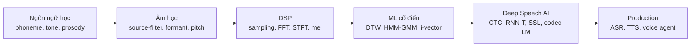
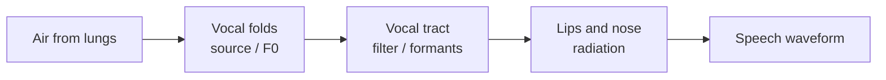
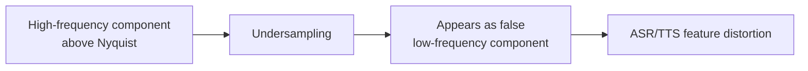
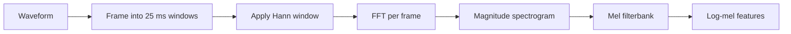
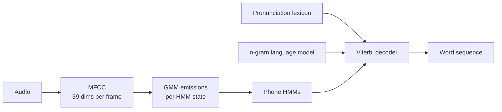
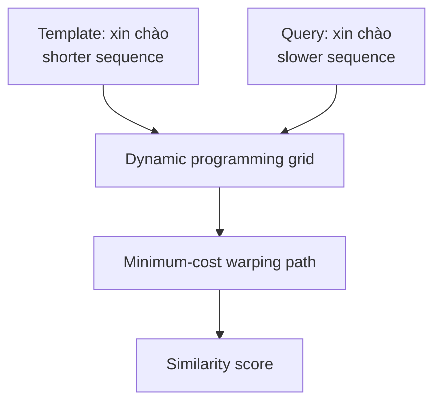
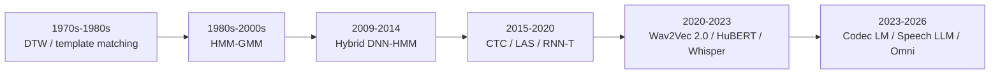

# Chương 0: Nền tảng cổ điển — Ngôn ngữ học, Âm học, DSP và ML truyền thống

## Vì sao cần một chương "ôn tập"

Cuốn sách này được thiết kế cho data scientist nền tảng NLP/LLM và CV chuyển sang Speech AI. Phần lớn độc giả mục tiêu đã thành thạo Transformer, attention, BPE, fine-tuning, và RLHF. Nhưng có một số khái niệm cơ bản mà mọi giáo trình Speech AI đều giả định người đọc đã biết: phoneme là gì, mel scale từ đâu ra, định lý lấy mẫu nói gì, HMM khác seq2seq ở đâu. Nếu thiếu một trong số này, các chương sau sẽ thường xuyên dùng thuật ngữ không định nghĩa, và bạn phải dừng lại tra Google liên tục.

Chương 0 phục vụ đúng mục đích này: bù lấp gap về **ngôn ngữ học**, **âm học**, **digital signal processing (DSP)** và **machine learning cổ điển** trước khi bước vào deep learning hiện đại. Mục tiêu không phải biến bạn thành phonetician hay DSP engineer, mà là cung cấp vốn từ và mô hình tư duy tối thiểu để bạn đọc các chương sau trôi chảy.

Nếu bạn đã có background EE/CS với một khoá xử lý tín hiệu và đã từng làm việc với HMM trong Kaldi hoặc CMU Sphinx, chương này có thể đọc lướt hoặc bỏ qua. Nếu bạn từ pure CS/NLP/CV, đầu tư 2-3 giờ ở đây sẽ làm các chương về Audio Fundamentals (Chương 2), ASR Foundations (Chương 4), và Modern ASR (Chương 5) trở nên dễ thở hơn rất nhiều.

> **Cấu trúc chương**
>
> - **Phần 1**: ngôn ngữ học cơ bản (phonetics, phonology, prosody) và đặc thù tiếng Việt.
> - **Phần 2**: âm học (sóng âm, thính giác, source-filter model, các thang nhận thức).
> - **Phần 3**: DSP nền tảng (sampling, quantization, convolution, Fourier).
> - **Phần 4**: machine learning cổ điển cho speech (DTW, HMM, GMM, hybrid GMM-HMM, i-vectors).
> - **Phần 5**: cầu nối sang Speech AI hiện đại, vì sao deep learning thay thế các cách tiếp cận truyền thống.

> **Tham khảo sâu hơn**
>
> - Jurafsky, D. và Martin, J. H. (2024). *Speech and Language Processing* (SLP3). Free online: <https://web.stanford.edu/~jurafsky/slp3/>. Chương 16, 25, 26 cover phonetics, HMM-ASR và speech recognition cổ điển rất kỹ.
> - Aalto University. *Speech Processing Book*. <https://speechprocessingbook.aalto.fi/>. Modern, interactive, free.
> - Rabiner, L. R. và Schafer, R. W. (2010). *Theory and Applications of Digital Speech Processing*. Pearson. Engineering reference toàn diện về DSP cho speech.
> - Huang, X., Acero, A., và Hon, H. W. (2001). *Spoken Language Processing*. Prentice Hall. Sách classical về speech recognition pre-deep-learning.

### Bản đồ học tập của Chương 0

Hãy xem Chương 0 như một “bộ chuyển đổi hệ tọa độ”. Nếu bạn đến từ NLP, bạn quen với text token, embedding, Transformer và language modeling. Speech AI thêm một lớp thực tại vật lý trước khi dữ liệu đi vào model: con người tạo ra âm thanh bằng cơ quan phát âm, âm thanh lan truyền như sóng, microphone số hóa sóng đó, rồi DSP biến waveform thành feature mà neural network có thể học.

**Cách đọc chương này hiệu quả:** đừng cố học thuộc mọi công thức. Điều quan trọng là nắm được câu hỏi mà mỗi khái niệm trả lời:

| Câu hỏi | Khái niệm trả lời | Chương sau dùng lại |
|---|---|---|
| Âm nào làm thay đổi nghĩa? | phoneme, tone, phonology | Ch4, Ch8, Ch16 |
| Vì sao giọng người có phổ đặc trưng? | source-filter, formant, F0 | Ch2, Ch8, Ch10 |
| Vì sao audio thành ma trận mel? | sampling, STFT, mel scale | Ch2, Ch6 |
| Làm sao train khi không biết alignment? | HMM, Viterbi, forward-backward | Ch4, Appendix B |
| Vì sao deep learning thay thế pipeline cũ? | representation learning, end-to-end | Ch3-Ch7 |

### Kết quả học tập kỳ vọng

Sau Chương 0, bạn nên tự tin trả lời được năm câu hỏi cơ bản:

1. **Phoneme khác chữ cái như thế nào?** Ví dụ tiếng Việt có chữ “ngh”, “ng”, “g” nhưng đơn vị âm học không trùng hoàn toàn với chữ viết.
2. **Pitch, formant và loudness khác nhau ở đâu?** Pitch liên quan F0 và tone; formant liên quan hình dạng vocal tract; loudness liên quan năng lượng cảm nhận theo log scale.
3. **Vì sao speech thường dùng 16 kHz?** Vì dải quan trọng cho intelligibility nằm dưới khoảng 8 kHz, nên Nyquist gợi ý sample rate 16 kHz.
4. **Vì sao STFT cần window 25 ms và hop 10 ms?** Vì speech gần stationary trong đoạn rất ngắn, nhưng thay đổi nhanh theo thời gian.
5. **HMM-GMM để lại di sản gì cho ASR hiện đại?** Alignment, Viterbi, forced alignment và tư duy probabilistic decoding vẫn còn trong CTC/RNN-T.

---

## Phần 1 — Ngôn ngữ học cơ bản

### 1.1 Phonetics và phonology, hai mặt của cùng một đối tượng

Hai thuật ngữ này thường bị nhầm lẫn, nhưng phân biệt rõ ngay từ đầu giúp định hướng tư duy.

**Phonetics** nghiên cứu vật lý của âm thanh ngôn ngữ: sóng âm được tạo ra như thế nào, lan truyền ra sao, được tai người tiếp nhận thế nào. Có ba nhánh chính:

- **Articulatory phonetics**: cơ chế sinh học tạo ra âm (môi, lưỡi, dây thanh).
- **Acoustic phonetics**: tính chất vật lý của sóng âm khi truyền trong không khí (tần số, biên độ, thời lượng).
- **Auditory phonetics**: cách tai và não xử lý âm.

**Phonology** thì khác. Phonology nghiên cứu hệ thống và quy luật của âm thanh trong một ngôn ngữ cụ thể: âm nào phân biệt nghĩa, âm nào không, các âm kết hợp theo quy tắc nào.

Một cách tóm tắt: phonetics là vật lý cộng sinh học, phonology là logic cộng ngữ pháp âm thanh.

Đối với người làm Speech AI, **acoustic phonetics** là phần liên quan trực tiếp nhất, vì mô hình xử lý chính là tín hiệu acoustic.

Một ví dụ thực tế: khi một ASR model nhầm “ban” và “bang”, lỗi có thể không nằm ở language model mà nằm ở acoustic evidence của âm cuối. Nếu đoạn audio bị cắt sớm hoặc noise che mất nasal coda /ŋ/, model khó phân biệt hai từ. Vì vậy, hiểu phonetics giúp ta debug lỗi ASR sâu hơn thay vì chỉ nhìn WER tổng thể.

| Góc nhìn | Câu hỏi chính | Ví dụ lỗi trong Speech AI |
|---|---|---|
| Phonetics | Âm được tạo ra và nghe như thế nào? | TTS phát /s/ quá sắc hoặc /t/ thiếu burst |
| Phonology | Âm nào phân biệt nghĩa trong ngôn ngữ này? | ASR bỏ thanh hỏi/ngã trong tiếng Việt |
| Orthography | Chữ viết biểu diễn âm ra sao? | G2P đọc sai tên riêng hoặc từ vay mượn |

> **Ghi nhớ cho người học NLP**
>
> Text model thường nhìn thấy chữ viết đã được chuẩn hóa. Speech model nhìn thấy hiện tượng vật lý trước khi nhìn thấy ngôn ngữ. Vì vậy, cùng một câu “tôi đi học” có thể có nhiều waveform rất khác nhau tùy speaker, micro, tốc độ nói, phương ngữ và cảm xúc.

### 1.2 Phoneme, đơn vị âm có ý nghĩa nhỏ nhất

**Phoneme** là đơn vị âm nhỏ nhất có khả năng phân biệt nghĩa trong một ngôn ngữ. Ví dụ trong tiếng Anh:

- /p/ trong *pen* và /b/ trong *Ben* là hai phoneme khác nhau, vì thay /p/ bằng /b/ làm thay đổi nghĩa.
- /t/ trong *top* và /t/ trong *stop* là cùng một phoneme, dù phát âm hơi khác (một có aspiration, một không). Các biến thể như vậy gọi là **allophones** của cùng một phoneme.

Tiếng Anh có khoảng 44 phoneme. Tiếng Việt có khoảng 46 phoneme tuỳ cách đếm phương ngữ.

> **Bắc cầu sang NLP**
>
> Nếu bạn quen với BPE tokens, phoneme là analog gần nhất ở mức "tiền-ngôn-ngữ". Tuy nhiên có khác biệt quan trọng: BPE token tự nó mang một mảnh nghĩa (subword), còn phoneme chỉ là một đơn vị âm thanh không mang nghĩa riêng. Một từ là chuỗi phoneme cộng với nghĩa được gán bởi từ vựng; một phoneme đơn độc không có nghĩa.

### 1.3 IPA, hệ ký hiệu phổ quát

**International Phonetic Alphabet (IPA)** là hệ ký hiệu universal cho phép viết mọi âm thanh ngôn ngữ một cách thống nhất, một-một, không ambiguity giữa các ngôn ngữ.

| Từ | IPA | Ghi chú |
|---|---|---|
| English *cat* | /kæt/ | /æ/ là nguyên âm mở front |
| English *see* | /siː/ | /iː/ là long vowel |
| English *thin* | /θɪn/ | /θ/ là voiceless dental fricative |
| Tiếng Việt *cát* | /kaːt˧˥/ | superscript 35 ký hiệu thanh sắc (rising) |
| Tiếng Việt *tôi* | /toj˧/ | /j/ là semi-vowel, ˧ là thanh ngang |

Bạn không cần học thuộc bảng IPA. Nhưng khi đọc paper ASR/TTS gặp ký hiệu kiểu /ʃ/, /θ/, /ŋ/, bạn nên biết đó là IPA notation và tra cứu khi cần.

Trong production TTS, IPA hoặc phoneme inventory thường xuất hiện ở bước **G2P** (grapheme-to-phoneme). G2P trả lời câu hỏi: từ một chuỗi chữ, model nên phát âm thành chuỗi âm nào? Với tiếng Anh, đây là bài toán khó vì chữ viết không regular: *read* có thể là /riːd/ hoặc /rɛd/. Với tiếng Việt, chữ viết regular hơn nhưng vẫn có thách thức: tên riêng, từ nước ngoài, viết tắt, số, đơn vị đo và code-switching.

Ví dụ:

| Input text | Vấn đề G2P/TTS |
|---|---|
| “AI” | đọc là “ây ai”, “ai”, hay giữ tiếng Anh tùy ngữ cảnh |
| “TP.HCM” | cần expand thành “Thành phố Hồ Chí Minh” hoặc đọc từng chữ |
| “Qwen3-Omni” | tên model nước ngoài, cần chính sách đọc nhất quán |
| “1.5 giây” | text normalization trước G2P: “một phẩy năm giây” |

Điều này giải thích vì sao TTS production không chỉ là neural network. Nó luôn có một lớp text normalization và pronunciation policy trước model.

### 1.4 Vowels và consonants, hai loại âm với tính chất acoustic khác nhau

**Vowels** (nguyên âm) được tạo ra với vocal tract mở, vocal cords rung. Đặc điểm acoustic:

- Thời lượng tương đối dài (50-200 ms).
- Phổ ổn định, có các **formant** (đỉnh năng lượng ở tần số cụ thể) rõ ràng.
- Dễ visualize trong spectrogram.

**Consonants** (phụ âm) được tạo ra với một dạng cản trở nào đó trong vocal tract: tắc hoàn toàn (như /p/, /t/, /k/), ma sát (như /s/, /f/, /ʃ/), hoặc tắc-mở (như /tʃ/). Đặc điểm:

- Thời lượng ngắn hơn (20-50 ms).
- Phổ thay đổi nhanh.
- Phụ thuộc mạnh vào ngữ cảnh xung quanh (co-articulation).

Đối với ASR, vowels nói chung dễ nhận dạng hơn vì có signal mạnh và ổn định. Consonants khó hơn, đặc biệt là voiceless stops như /p/, /t/, /k/, vốn về bản chất là một khoảng silence ngắn theo sau một burst năng lượng. Đây là một trong những nguyên nhân khiến error rate của ASR thường cao hơn ở các consonant này.

### 1.5 Phonology: allophones, phonotactics, và những quy luật

Phonology cung cấp các quy luật mà phoneme tuân theo trong một ngôn ngữ cụ thể.

**Allophones** là các realization khác nhau của cùng một phoneme tuỳ ngữ cảnh. Ví dụ /t/ trong tiếng Anh:

- *top*: aspirated [tʰ], có một puff of air sau /t/.
- *stop*: unaspirated [t], không có puff.
- *butter* (American English): flapped [ɾ], một tap nhanh gần như /d/.

Người bản ngữ không nhận biết các allophone này là khác nhau, vì chúng không phân biệt nghĩa. Nhưng ASR model phải implicit học cách xử lý chúng, và TTS model phải sinh đúng allophone trong từng ngữ cảnh để output nghe tự nhiên.

**Phonotactics** là các quy luật về việc phoneme nào có thể đứng cạnh phoneme nào. Tiếng Anh cho phép cluster /str-/ (như *string*) nhưng không cho phép /tlb-/. Tiếng Việt có một cấu trúc syllable rất chặt chẽ sẽ được trình bày ở mục sau.

### 1.6 Prosody, đặc trưng siêu đoạn quyết định "tự nhiên"

Prosody là tập hợp các đặc trưng vượt cấp phoneme: pitch contour, stress, rhythm, intonation, tone. Đây là phần mà nhiều người đến từ NLP/LLM thường bỏ qua nhưng cực kỳ quan trọng cho Speech AI.

Cùng một chuỗi phoneme với prosody khác nhau cho ra nghĩa khác hoàn toàn:

- *Really?* (intonation đi lên ở cuối, biểu hiện câu hỏi hoặc ngạc nhiên).
- *Really.* (intonation đi xuống, statement bình thường).

Trong tiếng Việt:

- "Anh ăn cơm chưa?" (rising intonation cuối câu, câu hỏi).
- "Anh ăn cơm rồi." (falling intonation, statement).

Đối với TTS, prosody quyết định mức độ tự nhiên (*naturalness*). Một hệ TTS robot thường là một hệ TTS không model được prosody tốt: mọi câu có cùng pitch contour, cùng rhythm, cùng pacing. Các hệ TTS hiện đại như VITS, F5-TTS, hay các sản phẩm thương mại như ElevenLabs đầu tư rất nhiều vào modeling prosody, hoặc explicit (qua predictor cho duration, pitch, energy) hoặc implicit (qua codec token).

Đối với Speech LLMs (Moshi, GPT-Realtime), prosody được preserve qua codec token. Khi người dùng nói "What?" với intonation ngạc nhiên, model phải nhận biết được surprise và phản hồi tương ứng, không chỉ transcribe văn bản chữ.

### 1.7 Đặc thù tiếng Việt mà người làm Speech AI phải nắm

Nếu bạn xây dựng sản phẩm Speech AI cho thị trường Việt Nam, có ba đặc điểm sau bạn phải nắm rõ.

#### 1.7.1 Sáu thanh điệu (tonal language)

Tiếng Việt là một **tonal language**: cùng chuỗi nguyên âm và phụ âm, nếu thanh điệu khác nhau thì nghĩa khác hoàn toàn. Ví dụ kinh điển với âm tiết *ma*:

| Thanh điệu | Dấu | Pitch contour | Từ | Nghĩa |
|---|---|---|---|---|
| Ngang | (không dấu) | Mid level, phẳng | *ma* | ghost |
| Huyền | ` | Low, falling | *mà* | but |
| Sắc | ´ | High, rising | *má* | mother (phương ngữ Nam) |
| Hỏi | ̉ | Low, dipping rồi rising nhẹ | *mả* | tomb |
| Ngã | ˜ | Rising với glottal stop | *mã* | horse |
| Nặng | ̣ | Low, ngắn, glottalized | *mạ* | rice seedling |

Đối với ASR tiếng Việt, model phải capture chính xác F0 (fundamental frequency, tức pitch contour). Nếu model chỉ học mel spectrogram mà không nhấn mạnh pitch, các thanh điệu sẽ bị nhầm liên tục.

> **Vì sao Whisper kém trên tiếng Việt hơn trên tiếng Anh**
>
> Whisper được train chủ yếu trên dữ liệu tiếng Anh, vốn không phải tonal language. Model học các đặc trưng phổ mà không có động lực mạnh để nhấn mạnh pitch contour. Khi áp dụng cho tiếng Việt, thanh điệu thường bị bỏ sót. Đó là lý do PhoWhisper (VinAI fine-tune Whisper trên 844 giờ tiếng Việt) đạt WER thấp hơn Whisper-large-v3 khoảng 35% trên benchmark VLSP 2020 Task-1 (Le và cộng sự, ICLR Tiny Papers 2024).

#### 1.7.2 Ba phương ngữ (Bắc, Trung, Nam)

Tiếng Việt có ba phương ngữ chính, với khác biệt rõ rệt về phonology:

- **Bắc (Hà Nội)**: sáu thanh điệu distinct, /tr/ phát âm rõ thành [tʂ] (ví dụ *trời* phát âm rõ).
- **Trung (Huế và một số vùng lân cận)**: một số thanh điệu sát nhập (đặc biệt hỏi-ngã), một số nguyên âm khác biệt.
- **Nam (Sài Gòn)**: thanh hỏi sát nhập với thanh ngã, /tr/ thường phát âm thành /j/ hoặc /tʃ/.

Phần lớn ASR và TTS tiếng Việt được train chủ yếu trên dữ liệu Bắc, dẫn đến error rate cao hơn cho người nói Trung và Nam. Đây là một bài toán mở của ngành.

#### 1.7.3 Cấu trúc syllable chặt chẽ và syllable-timed

Tiếng Việt là một ngôn ngữ **syllable-timed**, với cấu trúc CVCT chặt chẽ cho mỗi âm tiết:

- **C** (consonant onset, tuỳ chọn).
- **V** (vowel nucleus, bắt buộc, có thể là diphthong).
- **C** (consonant coda, tuỳ chọn).
- **T** (tone, bắt buộc, đánh dấu trên nguyên âm).

Ví dụ *việt* = v + iê + t + thanh sắc.

Điều này có một hệ quả thực tiễn: tiếng Việt **dễ tokenize ở mức syllable** hơn tiếng Anh, vì syllable boundary trong chữ viết hoàn toàn rõ ràng (mỗi âm tiết là một "từ" cách nhau bằng khoảng trắng). Đây là một lợi thế khi thiết kế vocabulary cho ASR và TTS tiếng Việt.

#### 1.7.4 Case study: vì sao tiếng Việt khó hơn vẻ ngoài

Nhiều người nghĩ tiếng Việt “dễ” cho Speech AI vì chữ viết khá gần âm đọc. Nhận định này chỉ đúng một phần. Tiếng Việt dễ hơn ở G2P cơ bản, nhưng khó hơn ở tone, phương ngữ và code-switching.

| Hiện tượng | Vì sao khó cho ASR | Vì sao khó cho TTS |
|---|---|---|
| Thanh hỏi/ngã sát nhập ở miền Nam | transcript chuẩn vẫn phân biệt hỏi/ngã, audio thì có thể gần nhau | nếu sinh sai contour, người nghe thấy “không Việt” |
| Âm cuối /n/ và /ŋ/ | bị che bởi noise hoặc micro kém | cần đóng âm đúng, nếu không nghe như accent lạ |
| Code-switching “deploy model lên cloud” | language ID thay đổi trong cùng câu | phải quyết định đọc tiếng Anh theo accent nào |
| Tên riêng “Nguyễn”, “Quỳnh”, “Trương” | nhiều biến thể phát âm theo vùng | G2P phải xử lý tên ngoài từ điển |
| Tốc độ nói nhanh | co-articulation mạnh, âm bị nuốt | duration model phải tự nhiên, không đều như robot |

> **Bài học sản phẩm**
>
> Với tiếng Việt, một test set chỉ có giọng Hà Nội đọc câu sạch trong studio không đủ để kết luận model tốt cho thị trường. Cần tách test theo miền, giới tính, độ tuổi, noise, thiết bị thu, domain từ vựng và mức code-switching.

### 1.8 Bài tập tư duy ngắn

Không cần code, hãy tự trả lời trước khi sang Phần 2:

1. Vì sao cùng một chữ “ma” nhưng sáu thanh điệu lại tạo ra sáu từ khác nghĩa?
2. Nếu một ASR model thường nhầm “tin” và “tinh”, bạn sẽ nghi ngờ lỗi ở acoustic feature, language model hay data distribution?
3. Vì sao TTS đọc đúng chữ nhưng vẫn có thể nghe “không tự nhiên”?
4. Với một voice agent tiếng Việt, bạn sẽ ưu tiên thu thêm dữ liệu phương ngữ nào nếu sản phẩm hướng tới toàn quốc?

---

## Phần 2 — Âm học cơ bản

### 2.1 Sóng âm: bản chất vật lý

Âm thanh là sóng cơ học dọc lan truyền trong môi trường đàn hồi (không khí, nước, vật rắn). Bốn đại lượng cơ bản:

- **Tần số (Hz)**: số dao động trên một giây. Tai người nghe được khoảng 20 Hz đến 20,000 Hz.
- **Biên độ**: độ lớn của dao động áp suất.
- **Bước sóng (m)**: $\lambda = c / f$ trong đó $c$ là tốc độ âm trong môi trường (khoảng 343 m/s trong không khí ở 20°C).
- **Pha**: vị trí trong chu kỳ.

Đối với speech, phần lớn năng lượng nằm trong dải 80 Hz đến 4000 Hz. Băng thông điện thoại cổ điển (300-3400 Hz) đủ cho intelligibility. Âm nhạc cần dải đầy đủ 20-20,000 Hz để chất lượng tốt.

Một cách trực giác: speech không cần toàn bộ phổ để hiểu nội dung. Ta vẫn nghe được lời nói qua điện thoại cũ vì phoneme và formant quan trọng nằm trong dải hẹp. Nhưng “nghe được nội dung” khác với “nghe tự nhiên”. TTS chất lượng cao cần giữ nhiều chi tiết hơn: breathiness, sibilance, room tone, timbre và micro-prosody.

| Mục tiêu | Dải tần quan trọng | Hệ quả engineering |
|---|---|---|
| ASR điện thoại | khoảng 300-3400 Hz | 8 kHz hoặc 16 kHz có thể đủ |
| ASR wideband | đến khoảng 8 kHz | 16 kHz là chuẩn phổ biến |
| TTS tự nhiên | cao hơn, tùy target quality | 22.05 kHz, 24 kHz hoặc 48 kHz thường được dùng |
| Music/audio generation | gần full-band | cần sample rate cao và codec tốt hơn |

Đây là lý do cùng là “audio model” nhưng ASR, TTS và music generation có yêu cầu input/output rất khác nhau.

### 2.2 Hệ thính giác con người: cơ sở sinh học của mel scale

Hiểu cách tai người nghe giúp giải thích tại sao mel filterbank và MFCC là feature design tốt cho speech.

#### 2.2.1 Cochlea, "FFT sinh học"

**Cochlea** (ốc tai) là cấu trúc hình ốc sên trong tai trong, thực hiện phân tích phổ. Các vị trí khác nhau dọc theo cochlea phản ứng với các tần số khác nhau, và quan trọng nhất, sự phân bố này là **logarithmic**:

- Tần số thấp (20-1000 Hz): phân bố gần linear, độ phân giải mịn.
- Tần số cao (trên 1000 Hz): phân bố logarithmic, độ phân giải thô.

Đây chính là cơ sở sinh học của **mel scale**: chúng ta thiết kế mel filterbank theo logarithmic distribution của tần số để bắt chước cách cochlea xử lý âm. Đó là lý do mel spectrogram là feature tốt hơn linear spectrogram cho speech, vì nó phù hợp với perceptual sensitivity của tai người.

#### 2.2.2 Auditory masking và ứng dụng trong codec

Tai người không thể nghe một âm nhỏ nếu có một âm lớn ở tần số tương tự (frequency masking) hoặc gần kề thời gian (temporal masking).

Hiện tượng này được khai thác bởi các audio codec (MP3, AAC, và hiện đại hơn là EnCodec, Mimi) để nén audio: thông tin bị masked có thể bị loại bỏ mà tai vẫn không phát hiện ra mất mát.

#### 2.2.3 Nhận thức về độ to (loudness)

Cảm nhận về độ to không tuyến tính theo biên độ. Tai người phản ứng theo log:

$$
L_{\text{dB SPL}} = 20 \log_{10}\left(\frac{p}{p_0}\right)
$$

trong đó $p$ là áp suất âm, $p_0 = 20\ \mu\text{Pa}$ là áp suất tham chiếu (ngưỡng nghe).

Hệ quả: trong Speech AI, **log-mel** features thường được dùng thay vì linear-mel, vì log scale phù hợp hơn với perceptual loudness.

### 2.3 Source-filter model của tiếng nói

Một mô hình kinh điển từ speech engineering, vẫn được dùng rộng rãi:

$$
\text{Speech signal} = \text{Source} \times \text{Filter}
$$

- **Source**: rung động của dây thanh đối với voiced sounds (vowels, /b/, /d/, /g/, ...) hoặc turbulence đối với voiceless sounds (/s/, /f/, ...).
- **Filter**: cấu hình vocal tract (vị trí lưỡi, môi, hàm) shape phổ của source.

Phân tách này là cơ sở của:

- **Linear Predictive Coding (LPC)**, codec cổ điển trong viễn thông.
- **WaveNet, WaveRNN, HiFi-GAN**, các neural vocoder hiện đại, học cách map đặc trưng phổ (representing filter) sang waveform.

**Trực giác:** source quyết định “cao hay thấp” ở mức pitch, còn filter quyết định “âm gì”. Nếu cùng một F0 đi qua vocal tract shape khác nhau, ta nghe thành các nguyên âm khác nhau. Nếu cùng vocal tract shape nhưng F0 khác nhau, ta nghe cùng âm nhưng giọng cao hoặc thấp hơn.

Trong TTS, tách source và filter giúp hiểu vì sao có các predictor riêng cho **pitch**, **duration**, **energy** và acoustic decoder. Trong voice conversion, mục tiêu thường là giữ linguistic content nhưng thay đổi speaker identity, tức can thiệp vào phần source/filter theo cách có kiểm soát.

### 2.4 Các thang nhận thức (perceptual scales)

Ngoài mel scale, một số thang khác xuất hiện trong literature:

#### 2.4.1 Mel scale

$$
\text{mel}(f) = 2595 \log_{10}\left(1 + \frac{f}{700}\right)
$$

Đây là thang chuẩn cho mel spectrogram và MFCC. Phổ biến nhất trong Speech AI.

#### 2.4.2 Bark scale

$$
\text{Bark}(f) = 13 \arctan(0.00076 f) + 3.5 \arctan\left(\left(\frac{f}{7500}\right)^2\right)
$$

Dùng trong phân tích **critical bands** (dải tần mà trong đó masking xảy ra mạnh). Ít phổ biến hơn mel trong deep learning hiện đại, nhưng xuất hiện trong các codec cổ điển.

#### 2.4.3 ERB scale (Equivalent Rectangular Bandwidth)

Một thang khác mô tả độ rộng của các filter cochlear. Dùng trong các nghiên cứu psychoacoustics.

---

## Phần 3 — Digital Signal Processing nền tảng

DSP là nền tảng toán học cho việc xử lý audio. Phần này phủ các khái niệm tối thiểu để hiểu Chương 2 (Audio Fundamentals), không đi sâu vào chứng minh kỹ thuật.

### 3.1 Định lý lấy mẫu Nyquist-Shannon

**Định lý**: một tín hiệu liên tục có thể được tái tạo hoàn hảo từ các mẫu rời rạc nếu và chỉ nếu tần số lấy mẫu $f_s$ ít nhất bằng hai lần tần số cao nhất $f_{\max}$ có trong tín hiệu:

$$
f_s \geq 2 f_{\max}
$$

**Ứng dụng cho speech**: tiếng nói con người có năng lượng đáng kể đến khoảng 8 kHz. Do đó lấy mẫu ở $f_s = 16$ kHz (Nyquist = 8 kHz) là đủ. Đây là chuẩn cho ASR và TTS hiện đại.

**Ứng dụng cho âm nhạc**: cần $f_s = 44.1$ kHz (chuẩn CD) hoặc 48 kHz (chuẩn studio).

**Aliasing**: nếu bạn lấy mẫu dưới Nyquist, các tần số cao sẽ "fold" xuống các tần số thấp hơn, làm hỏng tín hiệu. Để tránh, luôn áp dụng anti-aliasing low-pass filter trước khi lấy mẫu.

Một ví dụ số: nếu sample rate là 8 kHz, Nyquist frequency là 4 kHz. Một thành phần ở 5 kHz không thể được biểu diễn đúng; nó sẽ bị “gập” xuống vùng thấp hơn và xuất hiện như một tín hiệu giả. Trong audio production, đây là lỗi rất khó sửa sau khi đã xảy ra, vì model không biết thành phần thấp đó là tín hiệu thật hay alias.

> **Quy tắc thực hành**
>
> Khi chuẩn hóa dataset speech, hãy resample bằng thư viện đáng tin cậy (`sox`, `torchaudio`, `librosa` với resampler chất lượng cao) thay vì chỉ drop samples thủ công. Resampling sai có thể tạo artifact mà model học nhầm là đặc trưng speaker hoặc microphone.

### 3.2 Quantization

Sau khi lấy mẫu, biên độ phải được biểu diễn bằng số rời rạc. Số bit quyết định độ phân giải:

| Bit depth | Số mức | SNR xấp xỉ | Ứng dụng |
|---|---|---|---|
| 8-bit | 256 | 48 dB | Thấp, voice over phone cổ |
| 16-bit | 65,536 | 96 dB | Chuẩn cho speech và CD |
| 24-bit | 16,777,216 | 144 dB | Studio chuyên nghiệp |

Speech AI mặc định dùng **16-bit signed integer** (-32768 đến 32767) làm format input.

### 3.3 Tín hiệu rời rạc và các phép biến đổi cơ bản

Một tín hiệu rời rạc $x[n]$ là một chuỗi mẫu đánh chỉ số bằng số nguyên $n$.

#### 3.3.1 Convolution

$$
(x * h)[n] = \sum_{k=-\infty}^{\infty} x[k] \cdot h[n - k]
$$

Convolution là phép toán nền tảng: filter (low-pass, high-pass), reverb (impulse response của phòng), và CNN layer trong deep learning đều dựa trên convolution.

#### 3.3.2 Filter

Một filter biến đổi phổ của tín hiệu:

- **Low-pass**: giữ tần số thấp, loại tần số cao. Dùng cho anti-aliasing.
- **High-pass**: ngược lại. Dùng cho pre-emphasis trong speech.
- **Band-pass**: giữ một dải tần. Dùng trong mel filterbank.
- **Band-stop / notch**: loại một dải tần. Dùng để loại bỏ noise điện 50/60 Hz.

#### 3.3.3 Pre-emphasis filter, một bước tiền xử lý kinh điển cho speech

Pre-processing chuẩn cho speech truyền thống:

$$
y[n] = x[n] - 0.97 \cdot x[n-1]
$$

Đây là một high-pass filter nhẹ, bù lại độ suy giảm tự nhiên của phổ glottal source ở tần số cao. Các hệ thống ASR cổ điển (HMM-GMM) luôn dùng pre-emphasis.

Trong deep learning hiện đại (Whisper, Wav2Vec 2.0), pre-emphasis thường được bỏ qua vì model có thể tự học biến đổi tương đương.

### 3.4 Phân tích trong miền tần số

**Discrete Fourier Transform (DFT)** chuyển tín hiệu từ miền thời gian sang miền tần số:

$$
X[k] = \sum_{n=0}^{N-1} x[n] \cdot e^{-j 2\pi k n / N}
$$

Trực giác: $X[k]$ biểu thị "thành phần tần số $k$ trong tín hiệu $x[n]$ mạnh đến đâu".

- Đầu vào: $N$ mẫu trong miền thời gian.
- Đầu ra: $N$ hệ số phức trong miền tần số, mỗi hệ số chứa magnitude và phase.

**Fast Fourier Transform (FFT)** tính DFT trong $O(N \log N)$ thay vì $O(N^2)$ naive.

Trong Speech AI, chúng ta áp dụng DFT trên các cửa sổ ngắn (thường 25 ms), gọi là **Short-Time Fourier Transform (STFT)**. STFT là cơ sở của mel spectrogram, MFCC, và phần lớn feature extraction pipeline. Chương 2 sẽ phát triển STFT chi tiết với hình vẽ minh hoạ.

Điểm sư phạm quan trọng: STFT không phải “biến toàn bộ audio thành tần số” một lần duy nhất. Nó lặp lại phân tích tần số trên từng frame ngắn, vì speech thay đổi liên tục. Đây chính là lý do spectrogram có hai trục: thời gian và tần số.

| Tham số | Giá trị thường gặp | Ý nghĩa trực giác |
|---|---|---|
| Frame length | 25 ms | đủ ngắn để gần stationary, đủ dài để thấy phổ |
| Hop length | 10 ms | cứ 10 ms cập nhật một frame mới |
| FFT size | 400 hoặc 512 ở 16 kHz | độ phân giải tần số |
| Mel bins | 80 | nén phổ theo thính giác người |

Chương 2 sẽ đi vào công thức chi tiết. Ở đây, chỉ cần nhớ pipeline: **waveform → frame → window → FFT → mel → log**.

### 3.5 Windowing và spectral leakage

Vì sao cần windowing trước khi tính STFT? Một tín hiệu có độ dài hữu hạn implicit có một "rectangular window", gây ra **spectral leakage**, làm bẩn phổ.

$$
y[n] = x[n] \cdot w[n]
$$

trong đó $w[n]$ là một hàm cửa sổ tapered (giảm dần ở hai đầu). Các cửa sổ phổ biến:

- **Rectangular**: $w[n] = 1$ trong cửa sổ, 0 ngoài. Gây leakage mạnh.
- **Hann**: $w[n] = 0.5 - 0.5 \cos\left(\frac{2\pi n}{N-1}\right)$. Smooth taper, ít leakage.
- **Hamming**: $w[n] = 0.54 - 0.46 \cos\left(\frac{2\pi n}{N-1}\right)$. Tương tự Hann, hơi khác về roll-off.

Speech AI thường dùng Hann window.

---

## Phần 4 — Machine learning cổ điển cho speech

Trước khi deep learning bùng nổ vào khoảng năm 2014, speech recognition chủ yếu dùng HMM-GMM, GMM-UBM cho speaker verification, và DTW cho keyword spotting. Hiểu các phương pháp này có ba lợi ích:

1. Giúp đọc legacy code và paper trước 2015.
2. Hiểu vì sao deep learning là một breakthrough thực sự, không chỉ là incremental.
3. Một số khái niệm (forced alignment, Viterbi decoding) vẫn còn dùng trong các framework hiện đại.

### 4.1 Hidden Markov Model (HMM)

**Hidden Markov Model** là mô hình xác suất cho dữ liệu tuần tự, trong đó trạng thái thực sự là "ẩn" (hidden) nhưng các quan sát phát ra từ trạng thái thì có thể đo được.

Một HMM được đặc trưng bởi:

- Tập trạng thái $\{s_1, s_2, \ldots, s_N\}$, hidden, trong ASR thường đại diện cho các sub-unit của phoneme (mỗi phoneme có 3 trạng thái).
- **Transition probabilities** $A_{ij} = P(s_t = j \mid s_{t-1} = i)$.
- **Emission probabilities** $b_j(o_t) = P(o_t \mid s_t = j)$, xác suất phát ra quan sát $o_t$ khi đang ở trạng thái $j$.
- **Initial probabilities** $\pi_i = P(s_1 = i)$.

Trong ASR cổ điển:

- Trạng thái = sub-unit phoneme (3 trạng thái cho mỗi phoneme).
- Quan sát = vector feature acoustic, thường là MFCC 39 chiều (13 MFCC + 13 delta + 13 delta-delta).
- Phân phối phát = **Gaussian Mixture Model (GMM)**, hỗn hợp các Gaussian.

#### 4.1.1 Ba thuật toán kinh điển của HMM

1. **Forward-backward algorithm**: tính xác suất chuỗi quan sát $P(O \mid \lambda)$ cho mô hình $\lambda = (A, B, \pi)$. Dùng để evaluate khả năng của một mô hình trên data.
2. **Viterbi algorithm**: tìm chuỗi trạng thái có xác suất cao nhất cho một chuỗi quan sát cho trước. Độ phức tạp $O(N^2 T)$. Đây là thuật toán decoding chính cho ASR HMM.
3. **Baum-Welch algorithm**: huấn luyện tham số HMM từ data bằng EM (Expectation-Maximization).

Phụ lục B sẽ phát triển forward-backward chi tiết, vì nó cũng là cơ sở cho CTC forward-backward trong Chương 4.

#### 4.1.2 Pipeline ASR HMM-GMM cổ điển

Pipeline này nhìn phức tạp so với end-to-end ASR, nhưng rất có tính sư phạm: nó tách rõ ba nguồn tri thức. Acoustic model trả lời “âm thanh này giống phoneme nào”, lexicon trả lời “phoneme nào tạo thành từ nào”, language model trả lời “chuỗi từ nào hợp lý trong ngôn ngữ”.

Mỗi phoneme có một HMM riêng. Word HMM được xây dựng bằng cách nối các phoneme HMM lại. Sentence HMM nối các word HMM, kết hợp với một **language model** (n-gram) cho prior xác suất chuỗi từ.

**Hạn chế của HMM-GMM**:

- GMM có capacity hữu hạn, không capture được các pattern acoustic phức tạp.
- HMM giả định Markov memoryless, quá hạn chế cho dependency dài.
- Pipeline phức tạp, nhiều stage tách rời (acoustic model, lexicon, language model, decoder).

### 4.2 Gaussian Mixture Model (GMM)

**GMM** xấp xỉ một phân phối bất kỳ bằng tổng có trọng số của nhiều Gaussian:

$$
p(x) = \sum_{k=1}^{K} \pi_k \cdot \mathcal{N}(x \mid \mu_k, \Sigma_k)
$$

trong đó:

- $K$ là số component.
- $\pi_k$ là weight, với $\sum_k \pi_k = 1$.
- $\mathcal{N}(x \mid \mu_k, \Sigma_k)$ là Gaussian với mean $\mu_k$ và covariance $\Sigma_k$.

GMM được train bằng EM. Trong HMM-GMM ASR, mỗi trạng thái HMM có một GMM riêng làm emission distribution, với $K$ thường 16-32 component và covariance diagonal để giảm tham số.

### 4.3 Dynamic Time Warping (DTW)

**DTW** tính alignment tối ưu giữa hai chuỗi với độ dài khác nhau, thông qua programming động.

Cho hai chuỗi $X = (x_1, \ldots, x_M)$ và $Y = (y_1, \ldots, y_N)$, DTW tính:

$$
d(i, j) = c(i, j) + \min\{d(i-1, j),\ d(i, j-1),\ d(i-1, j-1)\}
$$

trong đó $c(i, j)$ là local distance giữa $x_i$ và $y_j$ (thường Euclidean trên feature vector).

DTW từng là phương pháp chủ đạo cho **keyword spotting** và **isolated word recognition** trước khi HMM thay thế. Hiện nay vẫn được dùng trong:

- Speaker verification dựa trên template.
- Wake-word detection cá nhân hoá (user-specific, ít data).
- So sánh similarity giữa các đoạn audio.

Trực giác DTW rất gần với bài toán so khớp hai câu nói cùng nội dung nhưng tốc độ khác nhau. Người A nói “xin chào” trong 0.8 giây, người B nói trong 1.2 giây. Nếu so sánh frame-by-frame tuyến tính, hai chuỗi lệch nhau. DTW cho phép “kéo giãn” trục thời gian để tìm alignment có cost nhỏ nhất.

DTW không cần training lớn, nên hữu ích khi mỗi người dùng chỉ cung cấp vài mẫu wake-word. Nhưng nó kém robust hơn neural KWS khi có nhiều speaker, noise và phrase variations.

### 4.4 Speaker verification cổ điển: GMM-UBM và i-vectors

**Speaker verification** trả lời câu hỏi: "Audio này có phải do người đã đăng ký nói không?". Hai phương pháp chính trước deep learning:

#### 4.4.1 GMM-UBM (Universal Background Model)

Train một GMM lớn ("UBM") trên data của hàng nghìn speaker. Khi user mới đăng ký, adapt UBM bằng MAP adaptation để có một GMM riêng cho user. Tại thời điểm verification, so sánh likelihood giữa GMM của user và UBM.

#### 4.4.2 i-vectors (Dehak và cộng sự, 2011)

**i-vector** là một vector cố định kích thước (thường 400-600) đại diện cho đặc trưng speaker và session, được trích xuất từ Total Variability subspace. Đây là một dạng tiền-thân của **speaker embedding** hiện đại (x-vector, ECAPA-TDNN).

i-vector vẫn còn xuất hiện trong một số production pipeline, dù x-vector dựa trên TDNN (Snyder và cộng sự, 2018) là chuẩn mới.

---

## Phần 5 — Cầu nối sang Speech AI hiện đại

### 5.1 Vì sao deep learning thay thế HMM-GMM

Khoảng 2009-2014, hybrid HMM-DNN (giữ HMM nhưng thay GMM bằng DNN ở phần emission) bắt đầu vượt HMM-GMM với khoảng cách lớn (Hinton và cộng sự, 2012). Nguyên nhân:

1. **DNN học representation tốt hơn GMM**: DNN khai thác được correlations phức tạp giữa các feature dimensions mà GMM (với diagonal covariance) bỏ qua.
2. **Pretraining và discriminative training**: DNN có thể pretrain (RBM-style trong thời kỳ đầu, sau này supervised) và fine-tune end-to-end.
3. **Capacity scale tốt**: thêm tham số cho DNN cải thiện accuracy đều, GMM thì bão hoà.

Đến khoảng 2015, **end-to-end ASR** (CTC, attention seq2seq, RNN-T) bắt đầu vượt cả hybrid HMM-DNN. Lý do:

- Loại bỏ pipeline phức tạp (acoustic model, lexicon, decoder thành một network).
- Học alignment cùng với recognition.
- Train trên data lớn hiệu quả hơn.

### 5.2 Timeline tiến hoá: từ template matching tới Speech LLM

Mỗi giai đoạn không xóa sạch giai đoạn trước. Nó hấp thụ một phần ý tưởng và thay thế phần còn yếu. CTC vẫn dùng forward-backward giống HMM. RNN-T vẫn là một mô hình alignment monotonic. Speech LLM vẫn cần codec, VAD, endpointing và latency engineering.

### 5.3 Những gì còn lại từ kỷ nguyên cổ điển

Mặc dù deep learning đã thay thế HMM cho ASR chính, một số khái niệm cổ điển vẫn sống mạnh trong Speech AI hiện đại:

| Khái niệm cổ điển | Vai trò hiện đại |
|---|---|
| Mel filterbank, MFCC | Vẫn là feature input chuẩn cho Whisper, Conformer, nhiều model ASR. |
| Viterbi decoding | Vẫn dùng trong CTC decoding, beam search forced alignment. |
| Forced alignment | Dùng cho TTS data preparation, để align text với audio. |
| GMM-HMM | Vẫn dùng trong các framework legacy (Kaldi, Sphinx) cho low-resource languages. |
| Phoneme dictionary, G2P | Dùng cho TTS (Tacotron, FastSpeech) và một số ASR. |
| DTW | Dùng cho wake-word detection cá nhân hoá. |

### 5.4 Sai lầm thường gặp khi người NLP bắt đầu học Speech

| Sai lầm | Vì sao sai | Cách nghĩ đúng |
|---|---|---|
| “Audio sample giống token text” | một sample không có nghĩa độc lập | cần frame, feature hoặc learned tokenizer |
| “Mel spectrogram là lossless” | mel bỏ phase và nén tần số | mel là perceptual feature, không phải waveform đầy đủ |
| “ASR chỉ là translation audio→text” | alignment monotonic và length mismatch rất khác MT | cần CTC/RNN-T/attention đặc thù |
| “TTS chỉ cần đọc đúng chữ” | naturalness phụ thuộc prosody, duration, speaker, emotion | phải model acoustic và expressive speech |
| “Tiếng Việt dễ vì chữ viết gần âm đọc” | tone, dialect, code-switching làm bài toán khó | cần evaluation theo miền và domain |

### 5.5 Bản đồ sang các chương tiếp theo

Bốn mảng nền tảng trong chương này map sang các chương sau như sau:

- **Phonetics, phonology, prosody**: nền tảng cho Chương 16 (Vietnamese Speech), Chương 8 (TTS Foundations), Chương 13 (Full-Duplex Dialogue).
- **Sóng âm, mel scale, source-filter**: nền tảng cho Chương 2 (Audio Fundamentals) và Chương 10 (Audio Codecs).
- **DSP (sampling, FFT, windowing)**: phát triển chi tiết trong Chương 2.
- **HMM, GMM, forced alignment, i-vectors**: bối cảnh lịch sử cho Chương 4 (ASR Foundations), Chương 14 (Speech Classification), Chương 21 (Wake-Word Detection).

---

## Tóm tắt

Chương 0 cung cấp vốn từ cơ bản về bốn mảng nền tảng cho Speech AI:

1. **Ngôn ngữ học**: phoneme là đơn vị phân biệt nghĩa nhỏ nhất, prosody quyết định tự nhiên trong TTS và mang ngữ nghĩa thực dụng trong Speech LLM, tiếng Việt có sáu thanh điệu và ba phương ngữ chính cần được xử lý đặc thù.
2. **Âm học**: cochlea phân tích phổ theo thang logarithmic, đó là lý do mel scale phù hợp với perceptual sensitivity, source-filter model tách phát âm thành nguồn (dây thanh) và bộ lọc (vocal tract).
3. **DSP**: định lý Nyquist xác định tần số lấy mẫu tối thiểu (16 kHz cho speech), STFT là cơ sở cho mel spectrogram và MFCC, windowing với Hann là chuẩn để giảm spectral leakage.
4. **ML cổ điển**: HMM-GMM thống trị ASR đến khoảng 2012, DNN-HMM hybrid là cầu nối, end-to-end deep learning chiếm ưu thế từ 2015 trở đi, nhưng nhiều khái niệm cổ điển (Viterbi, forced alignment, mel filterbank, i-vector) vẫn còn nguyên giá trị.

Đến đây, bạn đã có đủ vốn từ để đọc Chương 1 (NLP-to-Speech Bridge) mà không bị bí ở các khái niệm như mel spectrogram, phoneme, hay forced alignment. Các chương sau sẽ tham chiếu lại Chương 0 khi cần, đặc biệt là Chương 2 (Audio Fundamentals) phát triển kỹ thuật STFT, mel filterbank, MFCC ở mức chi tiết hơn, và Chương 4 (ASR Foundations) đặt CTC và attention seq2seq trong bối cảnh kế tiếp HMM-GMM.

### Checklist tự đánh giá

Trước khi sang Chương 1, hãy thử tự giải thích bằng lời của mình:

- Vì sao phoneme không giống chữ cái và cũng không giống BPE token?
- Vì sao tone làm tiếng Việt nhạy với F0 hơn nhiều ngôn ngữ không thanh điệu?
- Vì sao mel scale là logarithmic thay vì linear?
- Vì sao windowing cần thiết trước FFT?
- Vì sao HMM cần Viterbi, còn CTC cần forward-backward?
- Vì sao deep learning không làm các khái niệm cổ điển biến mất hoàn toàn?

Nếu bạn trả lời được các câu này ở mức trực giác, bạn đã có nền đủ tốt để đi tiếp. Nếu chưa, hãy đọc lại các bảng trong chương này trước khi sang Chương 2.

## Tài liệu tham khảo

1. Jurafsky, D. và Martin, J. H. (2024). *Speech and Language Processing* (SLP3). Stanford. <https://web.stanford.edu/~jurafsky/slp3/>.
2. Rabiner, L. R. và Schafer, R. W. (2010). *Theory and Applications of Digital Speech Processing*. Pearson.
3. Huang, X., Acero, A., và Hon, H. W. (2001). *Spoken Language Processing*. Prentice Hall.
4. Hinton, G. và cộng sự (2012). "Deep Neural Networks for Acoustic Modeling in Speech Recognition". *IEEE Signal Processing Magazine*.
5. Dehak, N. và cộng sự (2011). "Front-End Factor Analysis for Speaker Verification". *IEEE TASLP*.
6. Snyder, D. và cộng sự (2018). "X-vectors: Robust DNN Embeddings for Speaker Recognition". *ICASSP*.
7. Le, T.-T., Nguyen, L. T., và Nguyen, D. Q. (2024). "PhoWhisper: Automatic Speech Recognition for Vietnamese". *ICLR Tiny Papers*.
8. Aalto University. *Speech Processing Book*. <https://speechprocessingbook.aalto.fi/>.
