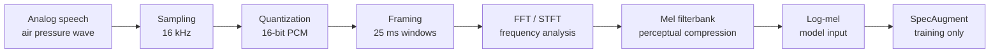
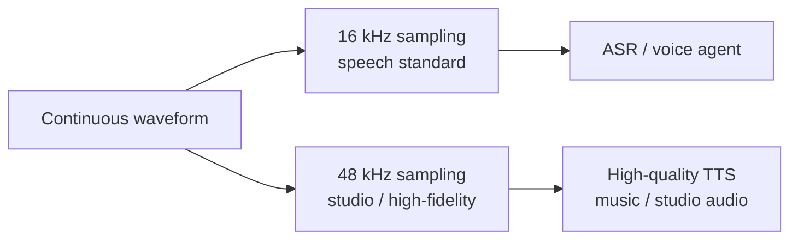
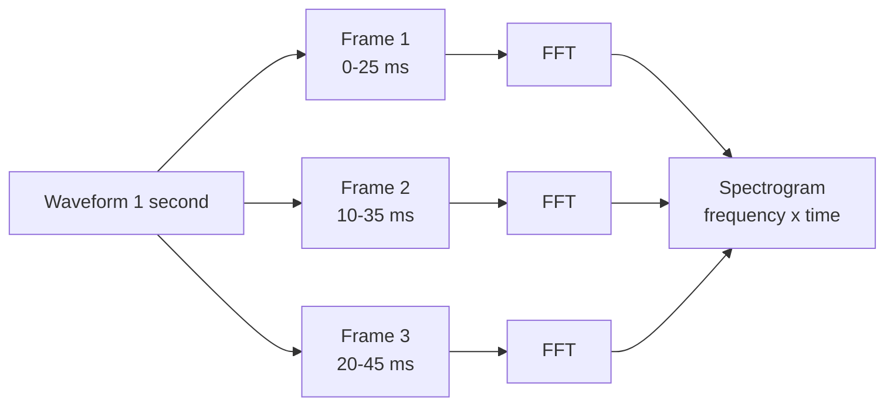
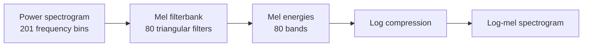
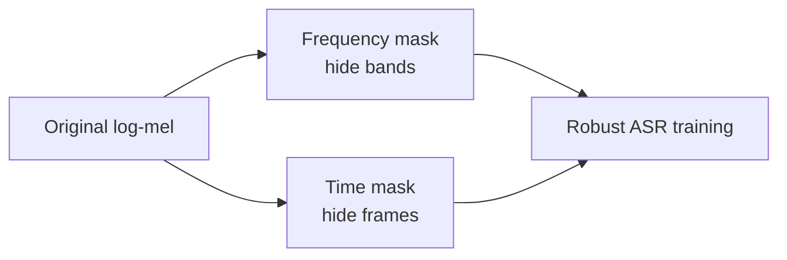

# Chương 2: Audio Signal Fundamentals

## Vì sao chương này quan trọng

Nếu bạn đến từ NLP/LLM, có lẽ bạn chưa từng đụng nhiều tới Fourier transform, mel filterbank, hoặc spectrogram. Đó là vốn nền tảng "ai cũng giả định bạn biết" trong literature Speech AI, từ paper Whisper đến code Wav2Vec 2.0. Chương 2 phát triển bốn khái niệm cốt lõi cho phép bạn đọc và sử dụng feature audio thành thạo:

- Sampling và quantization: cách tín hiệu analog của giọng nói được chuyển thành chuỗi số mà model có thể tiêu thụ.
- DFT và FFT: phân tích tín hiệu trong miền tần số, nền tảng toán học của mọi feature acoustic hiện đại.
- STFT, mel filterbank, MFCC: pipeline feature extraction chuẩn cho ASR và TTS.
- SpecAugment: kỹ thuật augmentation chuẩn cho ASR training.

Sau khi đọc xong, bạn có thể đọc một mel spectrogram, hiểu vì sao chọn `n_fft = 400`, `hop_length = 160`, `n_mels = 80`, và viết được pipeline feature extraction từ waveform thô.

> **Cấu trúc chương**
>
> - **Phần 1**: waveform, sampling, quantization, Nyquist theorem, pre-emphasis filter.
> - **Phần 2**: Discrete Fourier Transform và FFT, nền tảng toán học cho phân tích phổ.
> - **Phần 3**: Short-Time Fourier Transform (STFT) và windowing.
> - **Phần 4**: Mel scale, mel filterbank, mel spectrogram, log-mel features.
> - **Phần 5**: MFCC và Delta features cho ASR cổ điển.
> - **Phần 6**: SpecAugment, kỹ thuật augmentation tiêu chuẩn cho ASR.
> - **Phần 7**: pipeline đầy đủ từ waveform tới feature, kèm code PyTorch.

Tham khảo nền tảng nếu bạn cần đi sâu hơn: Rabiner và Schafer, *Theory and Applications of Digital Speech Processing*, hoặc Chương 16 của Jurafsky và Martin SLP3.

### Bản đồ pipeline của chương

Chương này đi theo đúng hành trình của một file audio trước khi vào model:



Nếu bạn quen với NLP, hãy xem pipeline này như “tokenizer cho audio” ở mức handcrafted. Nó không tạo discrete token IDs như BPE, nhưng biến một waveform dài thành ma trận feature ngắn hơn, giàu thông tin hơn và phù hợp với neural network hơn.

### Ví dụ shape xuyên suốt chương

Giả sử ta có 1 giây speech mono ở 16 kHz:

| Bước | Shape hoặc kích thước | Ý nghĩa |
|---|---|---|
| Waveform | `[16000]` | 16,000 samples trong 1 giây |
| Frame 25 ms, hop 10 ms | khoảng 100 frames/s | mỗi frame nhìn một lát cắt ngắn |
| STFT với `n_fft = 400` | `[201, 100]` | 201 frequency bins, 100 time frames |
| Mel filterbank 80 bins | `[80, 100]` | nén frequency theo thính giác |
| Batch input ASR | `[B, 80, T]` | tensor đưa vào encoder |

Điểm quan trọng: audio raw có 16,000 điểm mỗi giây, nhưng model thường không xử lý trực tiếp từng sample. Feature extraction giảm độ dài và chuyển tín hiệu sang miền dễ học hơn.

## Phần 1 — Waveform và Sampling

### 1.1 Tín hiệu âm thanh từ analog tới digital

Âm thanh là sóng cơ học truyền qua không khí. Khi thu bằng microphone, tín hiệu analog liên tục được chuyển thành tín hiệu số (digital) thông qua quá trình **sampling** (lấy mẫu) và **quantization** (lượng tử hoá).

<a id="eq-sampling"></a>

<a id="eq-nyquist"></a>

$$
x[n] = x_a(n \cdot T_s), \quad n = 0, 1, 2, \ldots
$$

trong đó $x_a(t)$ là tín hiệu analog, $T_s = 1/f_s$ là sampling period, và $f_s$ là **sample rate** (tần số lấy mẫu).

Trực giác: sampling là chụp ảnh sóng âm theo thời gian. Sample rate càng cao, ta chụp càng dày. Nhưng chụp dày hơn không phải lúc nào cũng tốt hơn cho ASR, vì tăng sample rate làm sequence dài hơn và compute lớn hơn. Với speech, 16 kHz là điểm cân bằng tốt giữa đủ thông tin ngôn ngữ và chi phí xử lý.



### Nyquist Theorem

> **📝 Định lý Nyquist-Shannon**
>
> Một tín hiệu có tần số tối đa $f_{\max}$ có thể được khôi phục hoàn hảo từ các mẫu rời rạc nếu và chỉ nếu:
>
> $$
> f_s \geq 2 f_{\max}
> $$
>
> Tần số $f_N = f_s / 2$ được gọi là **Nyquist frequency**.


Đối với speech processing:

| Parameter | Giá trị | Lý do |
|-----------|---------|-------|
| Sample rate $f_s$ | 16,000 Hz | Standard cho speech models |
| Nyquist frequency | 8,000 Hz | Đủ cho speech (F0: 85–300 Hz, formants: ≤5 kHz) |
| Bit depth | 16-bit PCM | Dynamic range ~96 dB |
| 1 giây audio | 16,000 samples × 2 bytes = 32 KB | |

: Thông số chuẩn cho speech audio <a id="tbl-audio-params"></a>

### Aliasing và resampling trong thực tế

Nyquist không chỉ là một định lý đẹp. Nó là lý do resampling sai có thể phá dataset. Nếu audio 48 kHz được chuyển xuống 16 kHz, mọi thành phần trên 8 kHz phải được lọc bỏ trước. Nếu không, chúng sẽ gập xuống dải thấp và tạo artifact.

| Tình huống | Rủi ro | Cách xử lý |
|---|---|---|
| Downsample 48 kHz → 16 kHz | aliasing nếu không low-pass | dùng resampler chất lượng cao |
| Mix dataset 8 kHz và 16 kHz | domain shift theo bandwidth | ghi rõ sample rate, train/eval tách nhóm |
| Upload qua telephony codec | mất high-frequency detail | benchmark riêng trên audio điện thoại |
| Normalize loudness quá mạnh | mất dynamic cues | dùng gain chuẩn, tránh clipping |

Trong production, metadata về sample rate, codec, microphone và kênh thu không phải chi tiết phụ. Chúng là một phần của data distribution.

### Pre-emphasis Filter

Bộ lọc high-pass đơn giản để bù spectral rolloff tự nhiên của giọng nói:

<a id="eq-pre-emphasis"></a>

$$
y[n] = x[n] - \alpha \cdot x[n-1], \quad \alpha \approx 0.97
$$

> **💡 NLP Parallel**
>
> Pre-emphasis có vai trò tương tự **text normalization** trong NLP: một bước tiền xử lý đơn giản nhưng cải thiện kết quả downstream. Các model hiện đại (Whisper, Wav2Vec 2.0) thường bỏ qua pre-emphasis, vì model có thể tự học biến đổi tương đương khi train trên data lớn.

Pre-emphasis xuất hiện nhiều trong tài liệu cổ điển vì giọng nói tự nhiên có xu hướng năng lượng giảm ở tần số cao. High-pass nhẹ giúp consonants như /s/, /f/, /t/ rõ hơn trong feature. Nhưng với model lớn train end-to-end trên log-mel hoặc waveform, bước này không còn bắt buộc. Khi tái hiện paper cũ, hãy đọc kỹ preprocessing để tránh so sánh không công bằng.


## Discrete Fourier Transform (DFT)

### Công thức DFT

DFT chuyển tín hiệu từ miền thời gian sang miền tần số:

Nói trực giác, DFT trả lời câu hỏi: trong đoạn tín hiệu này có bao nhiêu “sóng sin” ở từng tần số? Một waveform phức tạp có thể được xem như tổng của nhiều sóng sin đơn giản. DFT tìm trọng số của từng sóng sin đó.

| Miền thời gian | Miền tần số |
|---|---|
| Trục x là thời gian | Trục x là tần số |
| Dễ thấy biên độ thay đổi | Dễ thấy thành phần phổ |
| Hữu ích để biết “khi nào” | Hữu ích để biết “tần số nào” |
| Waveform raw | Spectrum |

Ví dụ, nguyên âm thường có formant rõ trong phổ; phụ âm ma sát như /s/ có năng lượng ở vùng tần số cao. Vì vậy phổ cung cấp thông tin âm vị mà waveform raw khó đọc bằng mắt.

<a id="eq-dft"></a>

$$
X[k] = \sum_{n=0}^{N-1} x[n] \cdot e^{-j \frac{2\pi k n}{N}}, \quad k = 0, 1, \ldots, N-1
$$

trong đó:

- $x[n]$: tín hiệu đầu vào (time domain)
- $X[k]$: hệ số Fourier tại frequency bin $k$ (complex number)
- $N$: kích thước DFT (thường = `n_fft`)
- $j = \sqrt{-1}$: đơn vị ảo

**Inverse DFT:**

<a id="eq-idft"></a>

$$
x[n] = \frac{1}{N} \sum_{k=0}^{N-1} X[k] \cdot e^{j \frac{2\pi k n}{N}}
$$

### Tính chất Quan trọng

- **Số frequency bins hữu ích**: $N/2 + 1$ (do conjugate symmetry cho real input)
- **Frequency resolution**: $\Delta f = f_s / N$
- **Tần số tại bin** $k$: $f_k = k \times f_s / N$

> **📝 Ý nghĩa Vật lý**
>
> $|X[k]|$ cho biết **biên độ** (amplitude) của thành phần tần số $f_k$, còn $\angle X[k]$ cho biết **pha** (phase). Mel spectrogram chỉ giữ lại magnitude và loại bỏ phase. Đây là lý do cần vocoder (HiFi-GAN, BigVGAN) để tái tạo waveform từ mel spectrogram trong pipeline TTS.


### Fast Fourier Transform (FFT)

FFT là thuật toán tính DFT hiệu quả với complexity $O(N \log N)$ thay vì $O(N^2)$:

<a id="eq-fft-complexity"></a>

$$
\text{DFT}: O(N^2) \quad \xrightarrow{\text{FFT}} \quad O(N \log N)
$$

Khi $N = 512$: DFT cần ~262K phép tính, FFT chỉ cần ~4.6K.

Trong speech, FFT không phải tối ưu nhỏ. Một câu 10 giây ở hop 10 ms có khoảng 1000 frames. Nếu mỗi frame phải tính DFT chậm, feature extraction sẽ thành bottleneck. FFT giúp STFT đủ nhanh để dùng trong training và streaming.

## Short-Time Fourier Transform (STFT)

### Tại sao cần STFT?

DFT phân tích **toàn bộ** tín hiệu nên không có thông tin về **khi nào** một tần số xuất hiện. Speech là non-stationary, nghĩa là đặc tính phổ thay đổi liên tục theo thời gian. Vì vậy, ta cần phân tích **từng đoạn ngắn**:



<a id="eq-stft"></a>

$$
\text{STFT}(m, k) = \sum_{n=0}^{N-1} x[n + m \cdot H] \cdot w[n] \cdot e^{-j \frac{2\pi k n}{N}}
$$

trong đó:

- $m$: frame index (thời gian)
- $k$: frequency bin index (tần số)
- $H$: **hop length** (frame shift, tính bằng samples)
- $w[n]$: window function (cửa sổ)
- $x[n + m \cdot H]$: đoạn tín hiệu bắt đầu từ frame $m$

### Window Functions

Window function giảm **spectral leakage** (rò rỉ phổ):

**Hann window** (phổ biến nhất):

<a id="eq-hann"></a>

$$
w[n] = 0.5 \times \left(1 - \cos\left(\frac{2\pi n}{N-1}\right)\right), \quad n = 0, 1, \ldots, N-1
$$

### Tham số Thực tế

<a id="eq-stft-params"></a>

$$
\begin{aligned}
f_s &= 16{,}000 \text{ Hz} \\
\text{frame length} &= 25 \text{ ms} \Rightarrow N = f_s \times 0.025 = 400 \\
\text{frame shift} &= 10 \text{ ms} \Rightarrow H = f_s \times 0.010 = 160 \\
\text{Frequency bins} &= N/2 + 1 = 201 \\
\text{Frames per second} &= f_s / H = 100
\end{aligned}
$$

### Power Spectrogram

<a id="eq-power-spectrogram"></a>

$$
P(m, k) = |\text{STFT}(m, k)|^2 = \text{Re}(\text{STFT})^2 + \text{Im}(\text{STFT})^2
$$

**Dimensions:**

- Input: waveform $x$ có $T_{\text{samples}}$ samples
- Output: $P$ có shape $(N/2 + 1, T_{\text{frames}})$
- $T_{\text{frames}} = \lfloor (T_{\text{samples}} - N) / H \rfloor + 1$

## Mel Scale & Mel Spectrogram

### Mel Scale

Tai người cảm nhận tần số theo thang **logarithmic**, không linear. Mel scale mô hình hóa điều này:

<a id="eq-mel-scale"></a>

$$
\text{mel}(f) = 2595 \times \log_{10}\left(1 + \frac{f}{700}\right)
$$

**Inverse:**

<a id="eq-mel-inverse"></a>

$$
f(\text{mel}) = 700 \times \left(10^{\text{mel}/2595} - 1\right)
$$

> **📝 Ý nghĩa Trực giác**
>
> Ở tần số thấp (< 1 kHz), mel scale gần linear  -  tai phân biệt tốt. Ở tần số cao (> 1 kHz), mel scale nén lại  -  tai kém nhạy hơn. Đây là lý do mel filterbank dùng narrow filters ở low freq và wide filters ở high freq.


### Mel Filterbank

Mel filterbank là một ma trận nhân vào power spectrogram để gom các frequency bins tuyến tính thành các bands theo thang mel. Các filter có dạng tam giác chồng lấn nhau: mỗi filter lấy nhiều bins lân cận, center frequency nhận trọng số cao nhất.



Tập hợp $M$ bộ lọc tam giác trên mel scale:

<a id="eq-mel-filterbank"></a>

$$
H_m(k) = \begin{cases}
0 & \text{if } f(k) < f(m-1) \\
\frac{f(k) - f(m-1)}{f(m) - f(m-1)} & \text{if } f(m-1) \leq f(k) \leq f(m) \\
\frac{f(m+1) - f(k)}{f(m+1) - f(m)} & \text{if } f(m) \leq f(k) \leq f(m+1) \\
0 & \text{if } f(k) > f(m+1)
\end{cases}
$$

trong đó $f(m)$ là center frequency của filter $m$, phân bố đều trên mel scale.

### Mel Spectrogram

<a id="eq-mel-spectrogram"></a>

$$
S_{\text{mel}}(m, t) = \log\left(\sum_{k=0}^{N/2} H_m(k) \cdot P(t, k) + \epsilon\right)
$$

với $\epsilon = 10^{-10}$ để tránh $\log(0)$.

Log compression có hai tác dụng. Thứ nhất, nó làm dynamic range nhỏ lại, vì năng lượng audio có thể chênh nhiều bậc độ lớn. Thứ hai, nó gần với cách tai người cảm nhận loudness theo thang log. Đây là lý do nhiều model nhận **log-mel** thay vì mel tuyến tính.

**Dimensions tiêu biểu:**

- $M = 80$ mel filters (Whisper, VITS) hoặc $M = 128$ (một số model)
- Input: Power spectrogram $(201, T_{\text{frames}})$
- Output: Mel spectrogram $(80, T_{\text{frames}})$  -  torch.float32

```python
#| eval: false
#| code-fold: true
#| code-summary: "Tính mel spectrogram với torchaudio"
import torch
import torchaudio
from torch import Tensor


def compute_mel_spectrogram(
    waveform: Tensor,         # [1, T_samples] - torch.float32
    sample_rate: int = 16000,
    n_fft: int = 400,         # 25ms window
    hop_length: int = 160,    # 10ms hop
    n_mels: int = 80,
) -> Tensor:
    """Tính log mel spectrogram từ waveform.

    Args:
        waveform: Audio tensor [1, T_samples] - float32
        sample_rate: Tần số lấy mẫu (Hz)
        n_fft: FFT size
        hop_length: Hop length (samples)
        n_mels: Số mel filters

    Returns:
        log_mel: Log mel spectrogram [1, n_mels, T_frames] - float32
    """
    mel_transform = torchaudio.transforms.MelSpectrogram(
        sample_rate=sample_rate,
        n_fft=n_fft,
        hop_length=hop_length,
        n_mels=n_mels,
        power=2.0,  # power spectrogram
    )

    mel_spec: Tensor = mel_transform(waveform)  # [1, n_mels, T_frames] - float32

    # Log compression
    log_mel: Tensor = torch.log(mel_spec + 1e-10)  # [1, n_mels, T_frames] - float32

    return log_mel


# Example: 1 giây audio
waveform: Tensor = torch.randn(1, 16000)  # [1, 16000] - float32
log_mel: Tensor = compute_mel_spectrogram(waveform)
print(f"Input shape:  {waveform.shape}")   # [1, 16000]
print(f"Output shape: {log_mel.shape}")    # [1, 80, 100]
```

## MFCC (Mel-Frequency Cepstral Coefficients)

### Từ Mel đến MFCC

MFCC áp dụng **Discrete Cosine Transform (DCT)** lên log mel spectrogram để decorrelate các mel bands:

<a id="eq-mfcc"></a>

$$
\text{MFCC}(c, t) = \sum_{m=0}^{M-1} S_{\text{mel}}(m, t) \cdot \cos\left(\frac{\pi c (2m + 1)}{2M}\right)
$$

trong đó $c = 0, 1, \ldots, C-1$ là MFCC index (thường $C = 13$ hoặc $C = 40$).

### MFCC vs Mel Spectrogram

| Feature | Mel Spectrogram | MFCC |
|---------|----------------|------|
| Dimensions | $(80, T)$ | $(13, T)$ |
| Correlation | Correlated bands | Decorrelated |
| Information | Full spectral detail | Compressed envelope |
| Used by | Whisper, VITS, modern models | GMM-HMM (classic ASR) |
| Deep learning | **Preferred** | Legacy, rarely used now |

: Mel Spectrogram vs MFCC <a id="tbl-mel-vs-mfcc"></a>

MFCC rất quan trọng trong lịch sử vì GMM-HMM hoạt động tốt hơn khi feature ít tương quan và có số chiều nhỏ. Deep learning hiện đại lại thích giữ nhiều thông tin hơn, để encoder tự học cách lọc. Vì vậy, log-mel thường thay thế MFCC trong Whisper, Conformer và TTS.

> **⚠️ Latency Warning**
>
> MFCC bỏ mất thông tin spectral detail mà deep models có thể khai thác. Hầu hết models hiện đại (Whisper, Conformer, VITS) sử dụng **mel spectrogram trực tiếp** thay vì MFCC.


## SpecAugment

SpecAugment [^park2019specaugment] là kỹ thuật data augmentation rất phổ biến cho ASR. Trong nhiều thiết lập được báo cáo, nó giúp giảm WER tương đối đáng kể mà không cần thu thêm dữ liệu.

### Ba phép augmentation

1. **Time warping**: biến dạng nhẹ theo trục thời gian.
2. **Frequency masking**: che $F$ consecutive mel bands.
3. **Time masking**: che $T$ consecutive time steps.



Trực giác: SpecAugment ép model không phụ thuộc quá mức vào một dải tần hoặc một đoạn thời gian cụ thể. Nếu một phần spectrogram bị che mà model vẫn nhận dạng đúng, representation học được sẽ robust hơn với noise, packet loss hoặc microphone khác nhau.

<a id="eq-specaugment"></a>

$$
\begin{aligned}
\text{Freq mask}: \quad S'(m, t) &= \begin{cases} 0 & \text{if } f_0 \leq m < f_0 + F \\ S(m, t) & \text{otherwise} \end{cases} \\[6pt]
\text{Time mask}: \quad S'(m, t) &= \begin{cases} 0 & \text{if } t_0 \leq t < t_0 + T \\ S(m, t) & \text{otherwise} \end{cases}
\end{aligned}
$$

trong đó $f_0, t_0$ được chọn ngẫu nhiên, $F$ và $T$ là mask widths.

> **💡 NLP Parallel**
>
> SpecAugment tương đương **token dropout / span masking** trong NLP. Frequency masking ≈ masking specific features, time masking ≈ masking contiguous tokens.


```python
#| eval: false
#| code-fold: true
#| code-summary: "SpecAugment implementation"
import torch
from torch import Tensor


def spec_augment(
    mel: Tensor,              # [batch, n_mels, T] - torch.float32
    freq_mask_param: int = 27,
    time_mask_param: int = 100,
    n_freq_masks: int = 2,
    n_time_masks: int = 2,
) -> Tensor:
    """Apply SpecAugment to mel spectrogram.

    Args:
        mel: Mel spectrogram [B, M, T] - float32
        freq_mask_param: Max frequency mask width F
        time_mask_param: Max time mask width T
        n_freq_masks: Number of frequency masks
        n_time_masks: Number of time masks

    Returns:
        augmented: Augmented mel spectrogram [B, M, T] - float32
    """
    augmented: Tensor = mel.clone()  # [B, M, T] - float32
    B, M, T = augmented.shape

    for _ in range(n_freq_masks):
        f: int = torch.randint(0, freq_mask_param, (1,)).item()
        f0: int = torch.randint(0, max(1, M - f), (1,)).item()
        augmented[:, f0:f0 + f, :] = 0.0  # mask freq bands

    for _ in range(n_time_masks):
        t: int = torch.randint(0, time_mask_param, (1,)).item()
        t0: int = torch.randint(0, max(1, T - t), (1,)).item()
        augmented[:, :, t0:t0 + t] = 0.0  # mask time steps

    return augmented  # [B, M, T] - float32
```

## Complete Feature Extraction Pipeline

```python
#| eval: false
#| code-fold: true
#| code-summary: "End-to-end feature extraction pipeline"
import torch
import torch.nn as nn
from torch import Tensor


class AudioFeatureExtractor(nn.Module):
    """Complete audio feature extraction pipeline.

    Waveform → STFT → Mel Filterbank → Log → SpecAugment
    """

    def __init__(
        self,
        sample_rate: int = 16000,
        n_fft: int = 400,
        hop_length: int = 160,
        n_mels: int = 80,
        apply_augment: bool = True,
    ) -> None:
        super().__init__()
        self.sample_rate: int = sample_rate
        self.n_fft: int = n_fft
        self.hop_length: int = hop_length
        self.n_mels: int = n_mels
        self.apply_augment: bool = apply_augment

        # Hann window
        self.register_buffer(
            "window",
            torch.hann_window(n_fft),  # [n_fft] - float32
        )

        # Mel filterbank matrix
        mel_fb: Tensor = self._create_mel_filterbank()
        self.register_buffer("mel_fb", mel_fb)  # [n_mels, n_fft//2+1] - float32

    def _create_mel_filterbank(self) -> Tensor:
        """Create mel filterbank matrix.

        Returns:
            mel_fb: [n_mels, n_fft//2+1] - float32
        """
        n_freqs: int = self.n_fft // 2 + 1

        # Mel scale boundaries
        mel_low: float = 0.0
        mel_high: float = 2595.0 * torch.log10(
            torch.tensor(1.0 + self.sample_rate / 2.0 / 700.0)
        ).item()

        mel_points: Tensor = torch.linspace(
            mel_low, mel_high, self.n_mels + 2
        )  # [n_mels + 2]
        hz_points: Tensor = 700.0 * (10 ** (mel_points / 2595.0) - 1)  # [n_mels + 2]

        freq_bins: Tensor = torch.linspace(
            0, self.sample_rate / 2, n_freqs
        )  # [n_freqs]

        fb: Tensor = torch.zeros(self.n_mels, n_freqs)  # [n_mels, n_freqs]

        for m in range(self.n_mels):
            f_left: float = hz_points[m].item()
            f_center: float = hz_points[m + 1].item()
            f_right: float = hz_points[m + 2].item()

            # Rising slope
            mask_up: Tensor = (freq_bins >= f_left) & (freq_bins <= f_center)
            fb[m, mask_up] = (freq_bins[mask_up] - f_left) / (f_center - f_left + 1e-10)

            # Falling slope
            mask_down: Tensor = (freq_bins > f_center) & (freq_bins <= f_right)
            fb[m, mask_down] = (f_right - freq_bins[mask_down]) / (f_right - f_center + 1e-10)

        return fb  # [n_mels, n_freqs] - float32

    def forward(self, waveform: Tensor) -> Tensor:
        """Extract log mel spectrogram from waveform.

        Args:
            waveform: [batch, T_samples] - float32

        Returns:
            log_mel: [batch, n_mels, T_frames] - float32
        """
        # STFT
        stft: Tensor = torch.stft(
            waveform,
            n_fft=self.n_fft,
            hop_length=self.hop_length,
            window=self.window,
            return_complex=True,
        )  # [batch, n_fft//2+1, T_frames] - complex64

        # Power spectrogram
        power: Tensor = stft.abs().pow(2)  # [batch, n_fft//2+1, T_frames] - float32

        # Mel filterbank: [n_mels, n_freqs] @ [batch, n_freqs, T]
        mel: Tensor = torch.matmul(
            self.mel_fb, power
        )  # [batch, n_mels, T_frames] - float32

        # Log compression
        log_mel: Tensor = torch.log(mel + 1e-10)  # [batch, n_mels, T_frames] - float32

        return log_mel
```

## Tóm tắt

| Khái niệm | Công thức chính | Kết quả |
|-----------|----------------|---------|
| Sampling | $x[n] = x_a(nT_s)$ | Waveform [T_samples] |
| DFT | $X[k] = \sum x[n] e^{-j2\pi kn/N}$ | Frequency spectrum [N/2+1] |
| STFT | DFT per frame with window | Spectrogram [N/2+1, T_frames] |
| Mel scale | $\text{mel}(f) = 2595 \log_{10}(1+f/700)$ | Perceptual frequency |
| Mel spectrogram | $\log(\mathbf{H} \cdot P + \epsilon)$ | Features [n_mels, T_frames] |
| MFCC | DCT on log mel | Coefficients [C, T_frames] |
| SpecAugment | Random freq/time masking | Augmented features |

: Tóm tắt các phép biến đổi audio <a id="tbl-audio-summary"></a>

### Checklist thực hành

Khi chuẩn bị audio cho ASR/TTS, hãy kiểm tra các điểm sau:

- **Sample rate thống nhất**: 16 kHz cho ASR phổ biến, 22.05/24/48 kHz cho TTS tùy model.
- **Không clipping**: waveform không bị cắt đỉnh ở -1 hoặc 1 sau normalization.
- **Channel rõ ràng**: mono hay stereo, có cần downmix hay không.
- **Loudness hợp lý**: tránh file quá nhỏ hoặc quá lớn so với phân phối train.
- **Feature params khớp model**: `n_fft`, `hop_length`, `n_mels`, log base và normalization phải đúng.
- **Train/test consistency**: preprocessing train và inference phải giống nhau.

Một lỗi rất phổ biến là fine-tune model với feature extraction khác so với pretraining. Chỉ cần lệch `n_mels` hoặc normalization, performance có thể giảm mạnh dù architecture không đổi.

Với nền tảng signal processing này, Chương 3 sẽ trình bày **Speech Representations** (Wav2Vec 2.0, HuBERT, codec tokens), và Chương 4 sẽ phát triển **ASR Foundations**: cách chuyển mel spectrogram thành text qua CTC, attention seq2seq, và RNN-Transducer.


---

<!-- References (auto-generated from .bib) -->
[^park2019specaugment]: Park, Daniel S and Chan, William and Zhang, Yu and Chiu, Chung-Cheng and Zoph, Barret and Cubuk, Ekin D and Le, Quoc V, "SpecAugment: A Simple Data Augmentation Method for Automatic Speech Recognition", Interspeech
