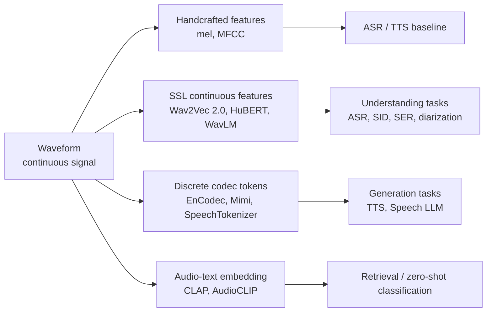
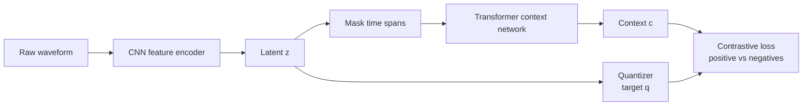
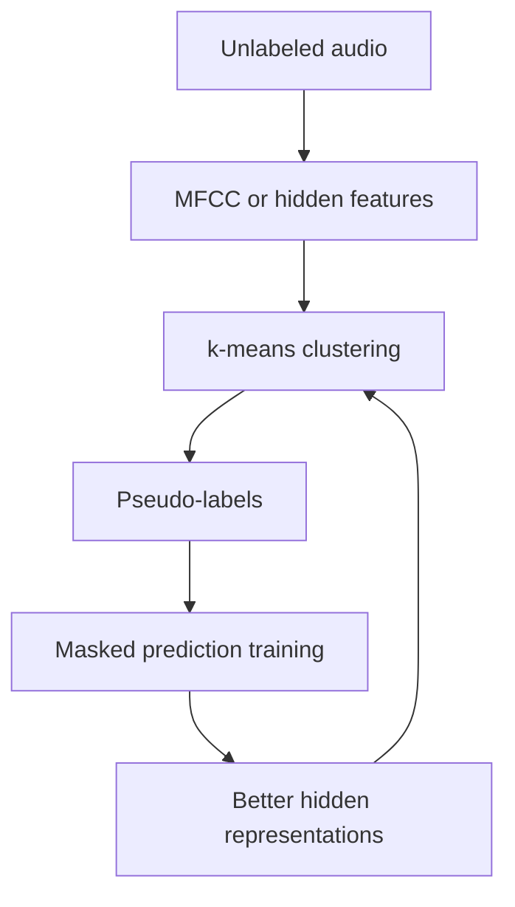
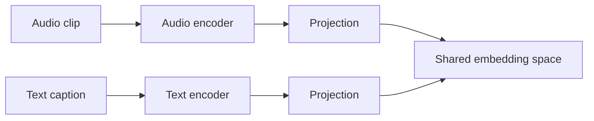
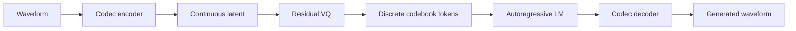

# Chương 3: Speech Representations và Self-Supervised Pretraining

## Vì sao chương này quan trọng

Chương 2 đã giới thiệu mel spectrogram, một biểu diễn audio dạng *handcrafted* dựa trên kiến thức về thính giác con người. Tuy hiệu quả, mel spectrogram không phải là biểu diễn duy nhất, và càng không phải biểu diễn tối ưu cho mọi tác vụ Speech AI hiện đại. Chương này trình bày ba họ representation đang định hình toàn bộ ngành:

- **Self-supervised continuous representations** (Wav2Vec 2.0, HuBERT, WavLM): học features từ hàng nghìn giờ audio không có nhãn, vai trò tương tự BERT MLM trong NLP.
- **Neural audio codec tokens** (EnCodec, DAC, Mimi, SpeechTokenizer): biến tín hiệu liên tục thành chuỗi token rời rạc, cho phép áp dụng paradigm autoregressive LM trực tiếp lên audio.
- **Contrastive multimodal embedding** (CLAP, AudioCLIP): căn cứ audio với text trong cùng không gian embedding, cho phép zero-shot classification và retrieval.

Đối với độc giả NLP/LLM, chương này có giá trị đặc biệt: ba họ representation trên chính là tương đương Speech của BERT, BPE, và CLIP. Hiểu chúng là chìa khoá để đọc paper Speech LLM hiện đại (Moshi, Qwen3-Omni, GPT-Realtime) và để xây dựng Speech AI pipeline có hiệu suất ngang với baseline NLP.

> **Cấu trúc chương**
>
> - **Phần 1**: tổng quan và động lực cho self-supervised pretraining trong speech.
> - **Phần 2**: Wav2Vec 2.0, HuBERT, WavLM (Big 3 của SSL speech).
> - **Phần 3**: contrastive learning cho audio (CLAP, AudioCLIP, multimodal).
> - **Phần 4**: neural audio codec tokens (EnCodec, DAC, Mimi, SpeechTokenizer).
> - **Phần 5**: SUPERB benchmark và đánh giá representation chất lượng.
> - **Phần 6**: lựa chọn representation cho bài toán cụ thể.

## Tổng quan

Trước khi đi sâu vào các bài toán cụ thể như ASR hay TTS, chúng ta cần hiểu **cách biểu diễn speech** (speech representations), nền tảng của mọi hệ thống speech AI hiện đại. Chương này trình bày ba paradigm chính: **self-supervised learning (SSL)**, **contrastive learning**, và **neural codec tokenization**.

Một mô hình speech không “nghe” giống con người. Nó chỉ nhận tensor. Vì vậy, câu hỏi trung tâm của chương này là: **tensor nào là biểu diễn tốt cho speech?** Câu trả lời phụ thuộc vào task. ASR cần giữ nội dung ngôn ngữ; speaker verification cần giữ đặc trưng người nói; TTS cần giữ prosody và timbre; Speech LLM cần token đủ rời rạc để language model dự đoán được.



**Hình:** Bốn hướng biểu diễn audio. Điểm cần nhớ là không có representation phù hợp tuyệt đối cho mọi bài toán. Representation tốt là representation giữ đúng thông tin cần cho task và loại bỏ thông tin gây nhiễu.

### Từ feature engineering tới representation learning

Trong ASR cổ điển, ta thiết kế feature bằng hiểu biết thính giác: MFCC, delta, delta-delta. Trong deep learning hiện đại, ta để model học representation trực tiếp từ dữ liệu lớn. Tuy nhiên, hai cách không đối lập tuyệt đối. Mel spectrogram vẫn sống rất khỏe trong Whisper và TTS; SSL features vẫn có thể dùng cùng CTC hoặc attention; codec tokens vẫn cần neural decoder để quay về waveform.

| Thời kỳ | Biểu diễn chính | Ai thiết kế representation? | Task phù hợp |
|---|---|---|---|
| Classical ASR | MFCC + delta | con người | HMM-GMM, speaker verification cũ |
| Deep ASR/TTS | log-mel spectrogram | con người + neural encoder | Whisper, Conformer, FastSpeech, VITS |
| SSL speech | Wav2Vec/HuBERT/WavLM hidden states | model học từ unlabeled audio | ASR, classification, diarization |
| Codec LM | EnCodec/Mimi tokens | model học tokenizer rời rạc | TTS, voice cloning, Speech LLM |
| Audio-text | CLAP embeddings | contrastive audio-text training | retrieval, zero-shot audio understanding |


## Self-Supervised Speech Learning

### Từ NLP đến Speech SSL

Trong NLP, BERT [^devlin2019bert] đã cách mạng hóa representation learning bằng masked language modeling. Tương tự, speech SSL học representations từ **unlabeled audio** - nguồn tài nguyên dồi dào hơn labeled data rất nhiều.

Điểm khác biệt lớn là BERT mask token rời rạc, còn speech SSL phải mask một tín hiệu liên tục. Khi che một đoạn audio, model không thể chỉ đoán “token ID”; nó phải học rằng đoạn bị che có khả năng là phoneme nào, speaker nào, môi trường nào và nằm trong ngữ cảnh âm học nào.

| NLP SSL | Speech SSL |
|---|---|
| Input là token IDs | Input là waveform hoặc acoustic frames |
| Mask subword tokens | Mask latent frames hoặc time spans |
| Target là token/vocab | Target là quantized latent, pseudo-label hoặc teacher representation |
| Học syntax/semantics | Học phonetic, speaker, prosody, noise robustness |

Vì transcript đắt hơn audio rất nhiều, SSL có ý nghĩa đặc biệt với ngôn ngữ ít tài nguyên. Một tổ chức có thể thu hàng chục nghìn giờ audio tiếng Việt từ call center, podcast hoặc video, nhưng chỉ gán nhãn được một phần nhỏ. SSL cho phép tận dụng phần không nhãn trước, sau đó fine-tune trên tập có nhãn nhỏ hơn.

> **📝 Core Insight**
>
> Speech SSL cho phép học representations từ hàng trăm nghìn giờ audio không cần transcript. Nói cách khác, chỉ cần audio thô, model vẫn học được cấu trúc âm vị, speaker, prosody và noise pattern thông qua bài toán tự giám sát.


### Wav2Vec 2.0

Wav2Vec 2.0 [^baevski2020wav2vec] là mô hình SSL tiên phong, kết hợp **contrastive learning** với **masked prediction**:

Trực giác của Wav2Vec 2.0 gồm ba bước:

1. CNN encoder nén waveform dài thành chuỗi latent ngắn hơn.
2. Một số latent positions bị mask, tương tự BERT mask tokens.
3. Transformer phải chọn đúng target quantized latent trong một tập gồm target thật và nhiều distractors.



**Hình:** Wav2Vec 2.0 học bằng cách dự đoán đúng latent target bị che giữa nhiều negative samples. Đây là lý do nó học representation phân biệt tốt cho ASR.

**Architecture:**

1. **Feature Encoder** (CNN): Raw waveform $\mathbf{x} \in \mathbb{R}^T$ được encode thành latent representations $\mathbf{z}_1, \ldots, \mathbf{z}_L$

<a id="eq-wav2vec-encoder"></a>

$$
\mathbf{z} = f_{\text{CNN}}(\mathbf{x}), \quad \mathbf{z} \in \mathbb{R}^{L \times d}
$$

2. **Quantization Module**: Discretize $\mathbf{z}$ thành $\mathbf{q}$ qua product quantization với $G$ codebook groups, mỗi group có $V$ entries:

<a id="eq-wav2vec-quant"></a>

$$
\mathbf{q}_t = \text{argmin}_{v \in [V], g \in [G]} \| \mathbf{z}_t - \mathbf{e}_{g,v} \|^2
$$

3. **Transformer Encoder**: Masked latent $\tilde{\mathbf{z}}$ được đưa vào Transformer để tạo context representations $\mathbf{c}_t$

**Training Objective - Contrastive Loss:**

<a id="eq-wav2vec-loss"></a>

$$
\mathcal{L}_{\text{contrastive}} = -\log \frac{\exp(\text{sim}(\mathbf{c}_t, \mathbf{q}_t) / \kappa)}{\sum_{\tilde{\mathbf{q}} \in \mathcal{Q}_t} \exp(\text{sim}(\mathbf{c}_t, \tilde{\mathbf{q}}) / \kappa)}
$$

trong đó $\kappa$ là temperature, $\mathcal{Q}_t$ gồm 1 positive và $K$ distractors (negative samples).

Công thức trên có thể đọc như sau: tại vị trí bị mask $t$, representation ngữ cảnh $\mathbf{c}_t$ phải giống target thật $\mathbf{q}_t$ hơn tất cả target giả trong $\mathcal{Q}_t$. Nếu bạn quen với contrastive learning trong sentence embedding, đây là cùng một ý tưởng: kéo positive pair lại gần, đẩy negative pairs ra xa.

**Điểm engineering quan trọng:** Wav2Vec 2.0 rất mạnh khi có nhiều unlabeled audio cùng domain. Nếu pretrain trên đọc sách sạch rồi fine-tune cho call center nhiễu, model vẫn có domain gap. Vì vậy, trong dự án thực tế, unlabeled audio nội bộ thường có giá trị rất lớn.

**Diversity Loss** để tránh codebook collapse:

<a id="eq-wav2vec-diversity"></a>

$$
\mathcal{L}_{\text{diversity}} = \frac{1}{GV} \sum_{g=1}^{G} H(\bar{p}_g) = -\frac{1}{GV} \sum_{g=1}^{G} \sum_{v=1}^{V} \bar{p}_{g,v} \log \bar{p}_{g,v}
$$

**Total loss**: $\mathcal{L} = \mathcal{L}_{\text{contrastive}} + \alpha \mathcal{L}_{\text{diversity}}$

```python
#| eval: false
#| code-fold: true
#| code-summary: "Wav2Vec 2.0 forward pass demo"
import torch
import torch.nn as nn
from typing import Tuple

class Wav2Vec2ForwardDemo(nn.Module):
    """Simplified Wav2Vec 2.0 forward pass."""

    def __init__(
        self,
        d_model: int = 768,
        n_codebooks: int = 2,
        codebook_size: int = 320,
    ) -> None:
        super().__init__()
        self.feature_encoder = nn.Sequential(
            nn.Conv1d(1, 512, 10, stride=5),   # [B,1,T] -> [B,512,L]
            nn.GELU(),
            nn.Conv1d(512, 512, 3, stride=2),  # [B,512,L] -> [B,512,L']
            nn.GELU(),
            nn.Conv1d(512, d_model, 3, stride=2),  # -> [B,d_model,L'']
        )
        self.quantizer = nn.Linear(d_model, n_codebooks * codebook_size)
        self.transformer = nn.TransformerEncoder(
            nn.TransformerEncoderLayer(
                d_model=d_model, nhead=12, dim_feedforward=3072,
                batch_first=True
            ),
            num_layers=12
        )

    def forward(
        self, waveform: torch.Tensor  # [B, T] - torch.float32
    ) -> Tuple[torch.Tensor, torch.Tensor]:
        z = self.feature_encoder(
            waveform.unsqueeze(1)  # [B, 1, T] - torch.float32
        )  # [B, d_model, L] - torch.float32
        z = z.transpose(1, 2)  # [B, L, d_model] - torch.float32
        c = self.transformer(z)  # [B, L, d_model] - torch.float32
        return c, z

# Demo
model = Wav2Vec2ForwardDemo()
x = torch.randn(2, 16000)  # [2, 16000] - 1 sec audio
c, z = model(x)
print(f"Input: {x.shape}")  # [2, 16000]
print(f"Latent z: {z.shape}")  # [2, L, 768]
print(f"Context c: {c.shape}")  # [2, L, 768]
```

### HuBERT

HuBERT [^hsu2021hubert] thay thế contrastive loss bằng **masked prediction** với pseudo-labels:

**Training Procedure (Iterative):**

1. **Iteration 0**: Cluster MFCC features bằng k-means $\rightarrow$ pseudo-labels $\hat{y}_t$
2. **Iteration k**: Train model với masked prediction loss, sau đó cluster hidden features của layer $l$ $\rightarrow$ new pseudo-labels

**Masked Prediction Loss:**

<a id="eq-hubert-loss"></a>

$$
\mathcal{L}_{\text{HuBERT}} = \sum_{t \in \mathcal{M}} -\log p(c_t = \hat{y}_t \mid \tilde{\mathbf{X}})
$$

trong đó $\mathcal{M}$ là tập các masked positions và $\hat{y}_t$ là pseudo-label.

HuBERT có một intuition rất đẹp: nếu chưa có transcript, ta tự tạo “nhãn tạm” bằng clustering. Ở iteration đầu, cluster MFCC có thể rất thô. Nhưng sau khi model học được representation tốt hơn, ta cluster lại hidden states của model để tạo pseudo-label chất lượng hơn. Quá trình này giống một vòng lặp bootstrapping.



**So với Wav2Vec 2.0**, HuBERT tránh negative sampling phức tạp và chuyển bài toán thành classification trên pseudo-labels. Điều này làm training ổn định hơn trong nhiều thiết lập.

> **📝 HuBERT vs Wav2Vec 2.0**
>
> | | Wav2Vec 2.0 | HuBERT |
> |---|---|---|
> | **Objective** | Contrastive | Masked prediction |
> | **Target** | Quantized latent | Pseudo-label (k-means) |
> | **Negative samples** | Cần | Không cần |
> | **Iterative** | Không | Có (re-cluster) |
> | **Performance** | Mạnh | Thường mạnh hơn sau các vòng re-cluster trong báo cáo gốc |


### WavLM

WavLM [^chen2022wavlm] mở rộng HuBERT với **denoising objective** - train trên cả clean và noisy/overlapping speech:

<a id="eq-wavlm-loss"></a>

$$
\mathcal{L}_{\text{WavLM}} = \mathcal{L}_{\text{masked}} + \lambda \mathcal{L}_{\text{denoising}}
$$

Điều này giúp WavLM học representations **robust với noise** và **hiểu speaker overlap**, rất quan trọng cho speaker diarization và separation.

### data2vec

data2vec [^baevski2022data2vec] tiến tới **modality-agnostic SSL**:

- **Teacher**: EMA của student model, predict **contextualized representations** (không chỉ tokens)
- **Student**: Predict teacher's output tại masked positions
- **Loss**: Smooth L1 giữa student và teacher representations

<a id="eq-data2vec-loss"></a>

$$
\mathcal{L}_{\text{data2vec}} = \sum_{t \in \mathcal{M}} \text{SmoothL1}(\mathbf{c}_t^{\text{student}}, \mathbf{c}_t^{\text{teacher}})
$$

### BEST-RQ

BEST-RQ [^chiu2022selfsupervised] đơn giản hóa quantization bằng **random projection**:

- Không cần learned codebook
- Project features bằng random matrix, sau đó nearest-neighbor lookup
- Kết quả được báo cáo cạnh tranh với Wav2Vec 2.0 trong một số thiết lập, trong khi pipeline đơn giản hơn

## Lựa chọn layer và pooling trong SSL models

Một chi tiết thực tế thường bị bỏ qua: representation của Wav2Vec/HuBERT/WavLM không phải chỉ có một vector duy nhất. Mỗi Transformer layer học một mức thông tin khác nhau.

| Layer range | Thông tin thường nổi bật | Task hay dùng |
|---|---|---|
| Early layers | acoustic detail, local phonetic cues | phoneme recognition, enhancement |
| Middle layers | linguistic content, syllable/word cues | ASR, keyword spotting |
| Late layers | task/pretraining-specific abstraction | classification, intent, downstream fine-tune |

Khi dùng frozen SSL encoder, bạn cần quyết định lấy layer nào và pooling ra sao:

- **Frame-level output**: giữ shape `[T, D]`, phù hợp cho CTC ASR hoặc forced alignment.
- **Mean pooling**: nén cả utterance thành `[D]`, phù hợp speaker/emotion classification.
- **Attention pooling**: học trọng số frame nào quan trọng, phù hợp audio classification dài.
- **Weighted layer sum**: học tổ hợp nhiều layer, thường tốt hơn chọn một layer cố định.

> **Bài học thực hành**
>
> Nếu downstream task cần timing chính xác, đừng pooling quá sớm. Nếu task là utterance-level classification, pooling là cần thiết để biến sequence dài thành vector cố định.

## Contrastive Learning for Audio (CLAP)

### CLAP Architecture

CLAP (Contrastive Language-Audio Pretraining) [^elizalde2023clap] là phiên bản audio của CLIP [^radford2021clip]:

Nếu Wav2Vec/HuBERT học từ audio đơn thuần, CLAP học từ cặp audio-text. Cặp này không nhất thiết là transcript. Text có thể là caption như “dog barking in a park”, “rain falling on a metal roof”, hoặc “a crowd applauding”. Vì vậy CLAP phù hợp với **audio understanding rộng**, không chỉ speech.



Trong không gian embedding chung, audio “tiếng chó sủa” nằm gần text prompt “dog barking”. Đây là cơ sở cho zero-shot audio classification: ta encode audio một lần, encode nhiều label text, rồi chọn label có cosine similarity cao nhất.

**Architecture:**

- **Audio Encoder** $f_a$: CNN hoặc Audio Transformer (HTS-AT)
- **Text Encoder** $f_t$: BERT hoặc RoBERTa
- **Projection**: Linear layers project cả 2 vào chung embedding space

**Contrastive Loss (InfoNCE):**

<a id="eq-clap-loss"></a>

$$
\mathcal{L}_{\text{CLAP}} = -\frac{1}{2N} \sum_{i=1}^{N} \left[ \log \frac{\exp(\mathbf{a}_i^\top \mathbf{t}_i / \tau)}{\sum_{j=1}^{N} \exp(\mathbf{a}_i^\top \mathbf{t}_j / \tau)} + \log \frac{\exp(\mathbf{t}_i^\top \mathbf{a}_i / \tau)}{\sum_{j=1}^{N} \exp(\mathbf{t}_i^\top \mathbf{a}_j / \tau)} \right]
$$

trong đó $\mathbf{a}_i = f_a(\text{audio}_i)$, $\mathbf{t}_i = f_t(\text{text}_i)$, $\tau$ là learnable temperature.

### Ứng dụng của CLAP

| Ứng dụng | Mô tả |
|----------|-------|
| Zero-shot audio classification | Classify audio bằng text prompts |
| Audio retrieval | Tìm audio từ text query |
| Audio captioning | Describe audio content |
| Sound event detection | Detect events với text anchors |
| TTS evaluation | Đánh giá naturalness qua audio-text alignment |

### Audio-Text Datasets cho Contrastive Learning

| Dataset | Số cặp audio-text | Nguồn |
|---------|-------------------|-------|
| AudioCaps [^kim2019audiocaps] | 50K | YouTube |
| Clotho [^drossos2020clotho] | 5K | Freesound |
| WavCaps [^mei2024wavcaps] | 400K | Mixed |
| AudioSet [^gemmeke2017audioset] | 2M | YouTube (weak labels) |
| LAION-Audio-630K [^wu2023large] | 630K | Web crawl |

## Neural codec tokens như “BPE cho audio”

SSL continuous features rất tốt cho understanding, nhưng generation cần một dạng biểu diễn khác. Nếu muốn dùng language modeling để sinh audio, ta cần token rời rạc. Neural audio codec giải quyết đúng bài toán này: encode waveform thành chuỗi codebook IDs, rồi decode IDs trở lại waveform.



Điểm tương đồng với BPE:

| Text LM | Codec speech LM |
|---|---|
| tokenizer biến text thành token IDs | codec biến waveform thành codebook IDs |
| LM dự đoán next text token | LM dự đoán next audio token |
| detokenizer ghép subwords thành text | codec decoder sinh waveform |
| lossless gần như tuyệt đối | lossy nhưng tối ưu theo cảm nhận |

Điểm khác biệt quan trọng là audio codec thường có **multi-codebook**. Một frame có thể có nhiều token ở nhiều tầng RVQ. Tầng đầu thường giữ nội dung thô, các tầng sau thêm timbre, prosody và chi tiết acoustic. Chương 10 sẽ phân tích kỹ cơ chế này.

| Codec | Đặc điểm chính | Liên hệ với Speech LLM |
|---|---|---|
| EnCodec | RVQ, nhiều bitrate | nền tảng cho AudioLM/VALL-E-style systems |
| DAC | chất lượng reconstruction mạnh | hữu ích cho generation chất lượng cao |
| Mimi | frame rate thấp, streaming-friendly | dùng trong Moshi real-time dialogue |
| SpeechTokenizer | tách semantic và acoustic tokens | giúp điều khiển content/prosody rõ hơn |

## Các Objective Pretraining Truyền thống

### Tổng hợp các Paradigm

| Paradigm | Mô hình | Mechanism | Ưu điểm |
|----------|---------|-----------|---------|
| **Masked Prediction** | HuBERT, data2vec | Mask frames, predict target | Học local + global context |
| **Contrastive** | Wav2Vec 2.0, CLAP | Positive/negative pairs | Discriminative representations |
| **Autoregressive** | AudioLM, VALL-E | Predict next token | Natural cho generation |
| **Denoising** | WavLM | Reconstruct clean từ noisy | Robust representations |
| **Multi-task** | UniSpeech-SAT [^chen2022unispeech] | SSL + speaker labels | Task-aware features |

### Autoregressive Pretraining

**AudioLM** [^borsos2023audiolm] và **VALL-E** [^wang2023neural] sử dụng autoregressive modeling trên codec tokens:

<a id="eq-ar-pretrain"></a>

$$
p(\mathbf{c}_{1:T}) = \prod_{t=1}^{T} p(c_t \mid c_1, \ldots, c_{t-1})
$$

Đây chính là **language modeling on audio tokens** - cầu nối trực tiếp giữa NLP và speech.

### Multi-task Pretraining

**UniSpeech-SAT** [^chen2022unispeech] kết hợp SSL với speaker supervision:

<a id="eq-unispeech-loss"></a>

$$
\mathcal{L} = \mathcal{L}_{\text{SSL}} + \alpha \mathcal{L}_{\text{speaker}} + \beta \mathcal{L}_{\text{utterance}}
$$

## Chọn representation theo bài toán

Một cách học tốt là bắt đầu từ câu hỏi: “Task này cần giữ thông tin gì?” Nếu task cần nhận dạng chữ, giữ linguistic content. Nếu task cần nhận speaker, giữ speaker identity. Nếu task cần sinh giọng tự nhiên, giữ cả content, prosody, timbre và fine acoustic detail.

| Task | Representation nên thử đầu tiên | Vì sao |
|---|---|---|
| ASR supervised | log-mel hoặc SSL encoder + CTC | giữ timing và phonetic detail |
| ASR low-resource | Wav2Vec/HuBERT/WavLM fine-tune | tận dụng unlabeled audio |
| Speaker verification | x-vector/ECAPA hoặc WavLM pooling | giữ speaker identity |
| Emotion recognition | WavLM/SSL middle-late layers | giữ prosody và voice quality |
| Audio event classification | CLAP hoặc PANNs/AST | không chỉ speech, cần audio-text semantics |
| TTS acoustic modeling | mel spectrogram | compact, ổn định cho vocoder |
| Speech LLM/TTS codec LM | EnCodec/Mimi/SpeechTokenizer tokens | cần token rời rạc để LM dự đoán |
| Voice cloning | codec tokens + speaker/prosody embedding | cần giữ timbre và style |

Với tiếng Việt, lựa chọn representation còn phụ thuộc vào tone. Một ASR hoặc TTS representation tốt cho tiếng Việt phải giữ được F0 contour và năng lượng theo âm tiết. Nếu augmentation hoặc codec làm mờ tone, transcript có thể sai dù phoneme segment vẫn đúng.

## So sánh Speech Representation Models

| Model | Params | Pre-train Data | SSL Objective | Downstream |
|-------|--------|----------------|---------------|------------|
| Wav2Vec 2.0 Large | 317M | 60K hrs (LS) | Contrastive | ASR, classification |
| HuBERT Large | 317M | 60K hrs (LS) | Masked prediction | ASR, classification |
| WavLM Large | 317M | 94K hrs (LS+VoxPopuli) | Masked + denoising | ASR, separation, diarization |
| data2vec 2.0 | 317M | 60K hrs (LS) | Teacher-student | ASR, classification |
| CLAP | ~200M | 630K audio-text pairs | Contrastive (audio-text) | Zero-shot classification |
| Whisper Large-v3 | 1.5B | 5M hrs (weak supervised) | Seq2seq (supervised) | ASR, translation |

: So sánh các mô hình speech representation <a id="tbl-ssl-comparison"></a>

## Đánh giá representation: linear probe, fine-tune và production eval

Khi một paper nói representation “mạnh”, cần hỏi: mạnh theo kiểu nào?

- **Frozen encoder + linear probe**: đo xem representation có sẵn thông tin task hay không.
- **Full fine-tuning**: đo khả năng thích nghi khi cập nhật toàn bộ model.
- **Parameter-efficient fine-tuning**: dùng adapter/LoRA, quan trọng khi model lớn.
- **Production eval**: đo latency, memory, robustness, domain shift và lỗi theo nhóm người dùng.

| Cách đánh giá | Ưu điểm | Hạn chế |
|---|---|---|
| Linear probe | cô lập chất lượng representation | có thể thấp hơn fine-tune thực tế |
| Fine-tune full | gần workload thật | tốn compute, dễ overfit low-resource |
| SUPERB | chuẩn hóa nhiều task | không thay thế benchmark domain riêng |
| Production shadow test | phản ánh người dùng thật | cần infrastructure và human review |

## SUPERB Benchmark

**SUPERB** (Speech processing Universal PERformance Benchmark) [^yang2021superb] là benchmark chuẩn để đánh giá speech representations trên 10 tasks:

| Task | Metric | Description |
|------|--------|-------------|
| ASR | WER | Automatic speech recognition |
| KS | Accuracy | Keyword spotting |
| QbE | MTWV | Query by example |
| IC | Accuracy | Intent classification |
| SF | F1 + CER | Slot filling |
| SID | Accuracy | Speaker identification |
| SV | EER | Speaker verification |
| SD | DER | Speaker diarization |
| ER | Accuracy | Emotion recognition |
| SE | PESQ + STOI | Speech enhancement |

: SUPERB benchmark tasks <a id="tbl-superb-tasks"></a>

## Tóm tắt

1. **Representation quyết định task**: ASR, TTS, speaker verification và Speech LLM cần giữ các loại thông tin khác nhau.
2. **Self-supervised learning** học từ unlabeled audio, rất quan trọng cho low-resource và domain adaptation.
3. **Wav2Vec 2.0** dùng contrastive learning; **HuBERT** dùng masked prediction với pseudo-labels; **WavLM** thêm denoising để robust hơn với noise và overlap.
4. **CLAP** mở rộng contrastive learning sang audio-text pairs, phù hợp zero-shot classification và retrieval.
5. **Neural codec tokens** là cầu nối trực tiếp tới language modeling trên audio, nền tảng cho AudioLM, VALL-E, Moshi và nhiều Speech LLM.
6. **Đánh giá representation** cần phân biệt linear probe, fine-tuning benchmark và production eval.

Chương tiếp theo sẽ đi vào **ASR Foundations**, nơi các representations này được dùng để giải bài toán nhận dạng giọng nói. Hãy giữ một câu hỏi xuyên suốt: model đang nhìn thấy representation nào, representation đó giữ thông tin gì, và nó đã loại bỏ thông tin gì?


---

<!-- References (auto-generated from .bib) -->
[^devlin2019bert]: Devlin, Jacob and Chang, Ming-Wei and Lee, Kenton and Toutanova, Kristina, "BERT: Pre-training of Deep Bidirectional Transformers for Language Understanding", North American Chapter of the Association for Computational Linguistics
[^baevski2020wav2vec]: Baevski, Alexei and Zhou, Yuhao and Mohamed, Abdelrahman and Auli, Michael, "wav2vec 2.0: A Framework for Self-Supervised Learning of Speech Representations", Advances in Neural Information Processing Systems
[^hsu2021hubert]: Hsu, Wei-Ning and Bolte, Benjamin and Tsai, Yao-Hung Hubert and Lakhotia, Kushal and Salakhutdinov, Ruslan and Mohamed, Abdelrahman, "HuBERT: Self-Supervised Speech Representation Learning by Masked Prediction of Hidden Units", IEEE/ACM Transactions on Audio, Speech, and Language Processing
[^chen2022wavlm]: Chen, Sanyuan and Wang, Chengyi and others, "WavLM: Large-Scale Self-Supervised Pre-Training for Full Stack Speech Processing", IEEE Journal of Selected Topics in Signal Processing
[^baevski2022data2vec]: Baevski, Alexei and Hsu, Wei-Ning and Xu, Qiantong and Babu, Arun and Gu, Jiatao and Auli, Michael, "data2vec: A General Framework for Self-supervised Learning in Speech, Vision and Language", International Conference on Machine Learning
[^chiu2022selfsupervised]: Chiu, Chung-Cheng and Qin, James and Zhang, Yu and Yu, Jiahui and Wu, Yonghui, "Self-supervised Learning with Random-projection Quantizer for Speech Recognition", International Conference on Machine Learning
[^elizalde2023clap]: Elizalde, Benjamin and Deshmukh, Soham and Al Ismail, Mahmoud and Wang, Huaming, "CLAP: Learning Audio Concepts from Natural Language Supervision", IEEE International Conference on Acoustics, Speech and Signal Processing
[^radford2021clip]: Radford, Alec and Kim, Jong Wook and Hallacy, Chris and others, "Learning Transferable Visual Models From Natural Language Supervision", International Conference on Machine Learning
[^kim2019audiocaps]: Kim, Chris Dongjoo and Kim, Byeongchang and Lee, Hyunmin and Kim, Gunhee, "AudioCaps: Generating Captions for Audios in the Wild", North American Chapter of the Association for Computational Linguistics
[^drossos2020clotho]: Drossos, Konstantinos and Lipping, Samuel and Virtanen, Tuomas, "Clotho: An Audio Captioning Dataset", IEEE International Conference on Acoustics, Speech and Signal Processing
[^mei2024wavcaps]: Mei, Xinhao and others, "WavCaps: A ChatGPT-Assisted Weakly-Labelled Audio Captioning Dataset", arXiv preprint arXiv:2303.17395
[^gemmeke2017audioset]: Gemmeke, Jort F and Ellis, Daniel PW and others, "Audio Set: An Ontology and Human-Labeled Dataset for Audio Events", IEEE International Conference on Acoustics, Speech and Signal Processing
[^wu2023large]: Wu, Yusong and Chen, Ke and others, "Large-Scale Contrastive Language-Audio Pretraining with Feature Fusion and Keyword-to-Caption Augmentation", IEEE International Conference on Acoustics, Speech and Signal Processing
[^chen2022unispeech]: Chen, Sanyuan and Wu, Yu and others, "UniSpeech-SAT: Universal Speech Representation Learning with Speaker Aware Pre-Training", IEEE International Conference on Acoustics, Speech and Signal Processing
[^borsos2023audiolm]: Borsos, Zal{\'a}n and Marinier, Rapha{\"e}l and others, "AudioLM: A Language Modeling Approach to Audio Generation", IEEE/ACM Transactions on Audio, Speech, and Language Processing
[^wang2023neural]: Wang, Chengyi and Chen, Sanyuan and Wu, Yu and Zhang, Ziqiang and Zhou, Long and Liu, Shujie and Chen, Zhuo and Liu, Yanqing and Wang, Huaming and Li, Jinyu and He, Lei and Zhao, Sheng and Wei, Furu, "Neural Codec Language Models are Zero-Shot Text to Speech Synthesizers", arXiv preprint arXiv:2301.02111
[^yang2021superb]: Yang, Shu-wen and Chi, Po-Han and others, "SUPERB: Speech Processing Universal PERformance Benchmark", Interspeech
