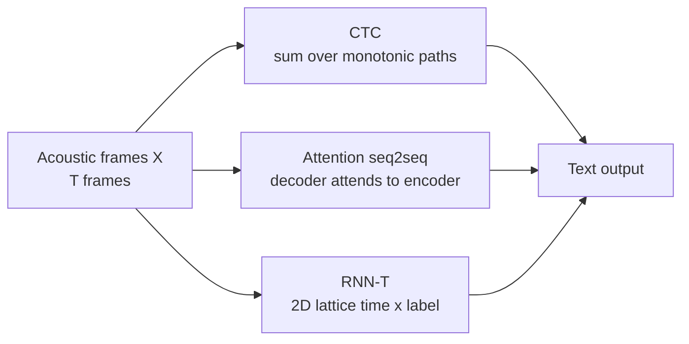
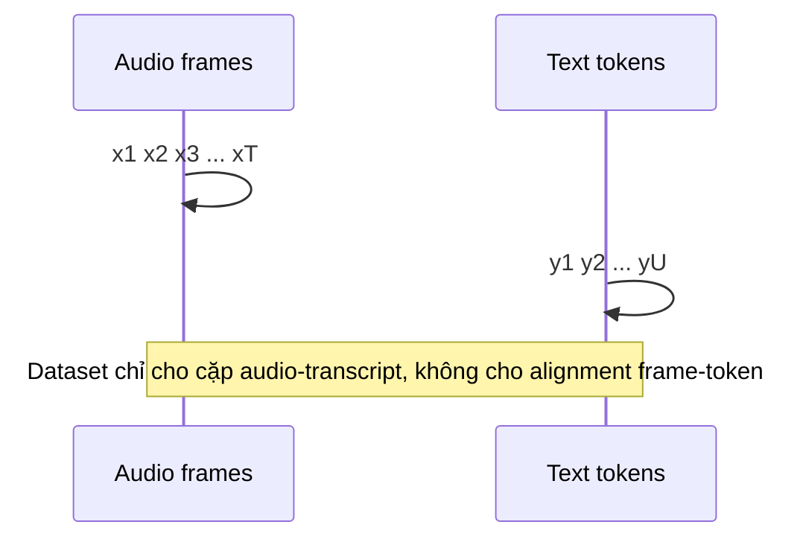
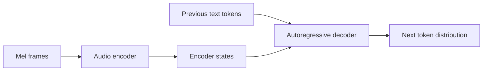
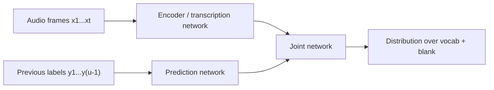
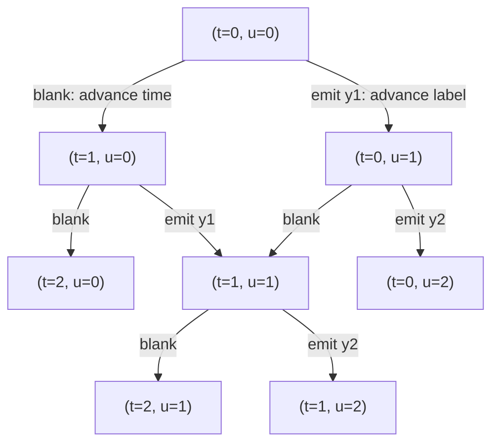

# Chương 4: ASR Foundations

## Vì sao chương này quan trọng

Automatic Speech Recognition (ASR) là bài toán Speech AI lâu đời nhất và có ứng dụng rộng nhất, từ trợ lý ảo (Siri, Google Assistant) tới transcription, voice search, và call center analytics. Đối với người làm NLP/LLM, ASR là điểm vào tự nhiên vào Speech AI: input là audio, output là text, pipeline mang nhiều cấu trúc quen thuộc của seq2seq translation.

Tuy nhiên, ASR có một đặc trưng kỹ thuật khác hẳn machine translation: **input và output không có sẵn alignment một-một**. Một câu nói dài 3 giây tạo ra khoảng 300 mel frames, nhưng transcript có thể chỉ 20 ký tự. Làm sao train model học mapping này khi ta không biết frame nào sinh ký tự nào? Đây là câu hỏi trung tâm của ASR foundations, và ba paradigm chính trả lời câu hỏi đó là chủ đề của chương:

- **CTC (Connectionist Temporal Classification)**: marginalize trên mọi alignment khả dĩ.
- **Attention-based seq2seq**: học alignment implicit qua cross-attention.
- **RNN-Transducer (RNN-T)**: streaming-friendly seq2seq với joint network.

Sau khi đọc xong chương, bạn có thể đọc paper Whisper (attention seq2seq), Conformer (CTC + attention), và các paper streaming production-grade (RNN-T) mà không bị bí ở thuật ngữ alignment, blank token, joint network.

> **Cấu trúc chương**
>
> - **Phần 1**: bài toán ASR và metric đánh giá (WER, CER).
> - **Phần 2**: CTC loss, forward-backward algorithm, blank token, decoding.
> - **Phần 3**: attention-based seq2seq, listen-attend-spell, cross-attention.
> - **Phần 4**: RNN-Transducer, joint network, streaming.
> - **Phần 5**: so sánh ba paradigm và lựa chọn theo bài toán.

### Bản đồ tư duy của chương

Ba họ mô hình ASR trong chương này khác nhau chủ yếu ở cách xử lý **alignment** giữa acoustic frames và text tokens:



Nếu chỉ nhớ một câu: **ASR không khó vì input là audio; ASR khó vì ta không biết frame nào tương ứng với token nào.** CTC, attention và RNN-T là ba cách trả lời câu hỏi alignment này.

### Ví dụ xuyên suốt

Giả sử người dùng nói “mở app”. Sau feature extraction, ta có khoảng 100 frames cho 1 giây audio. Transcript chỉ có vài ký tự hoặc subword tokens. Model phải học rằng nhiều frame liên tiếp cùng phục vụ một âm tiết, có frame im lặng, có frame chuyển tiếp giữa âm, và có frame không nên phát token nào.

| Thành phần | Ví dụ |
|---|---|
| Audio frames | `x1, x2, ..., x100` |
| Character target | `m ở _ a p p` hoặc dạng chuẩn hóa tương ứng |
| Subword target | `mở`, ` app` |
| Alignment | không có trong dataset, model phải tự học |

Trong dataset ASR thông thường, ta chỉ có cặp `(audio, transcript)`. Không có nhãn “frame 37 là âm /a/”. Đây là lý do loss function của ASR quan trọng hơn nhiều so với classification thông thường.

## Phần 1 — Bài toán ASR

Automatic Speech Recognition (ASR) là bài toán ánh xạ từ tín hiệu âm thanh sang chuỗi ký tự/từ:

<a id="eq-asr-objective"></a>

$$
\hat{Y} = \arg\max_{Y} P(Y \mid X)
$$

trong đó $X = (x_1, x_2, \ldots, x_T)$ là chuỗi acoustic frames và $Y = (y_1, y_2, \ldots, y_U)$ là chuỗi text tokens, với $T \gg U$ (audio dài hơn text rất nhiều).

Trong thực tế, $Y$ có thể là ký tự, byte, wordpiece, BPE token hoặc phoneme. Mỗi lựa chọn tạo ra trade-off khác nhau:

| Output unit | Ưu điểm | Nhược điểm | Khi nào dùng |
|---|---|---|---|
| Character | vocabulary nhỏ, không OOV | sequence dài hơn subword | CTC đơn giản, low-resource |
| Byte | xử lý mọi Unicode | khó học ngôn ngữ hơn | multilingual robust systems |
| BPE/subword | sequence ngắn, gần NLP | cần tokenizer tốt | Whisper-style ASR |
| Word | sequence rất ngắn | OOV, khó với tên riêng | ASR cổ điển kèm lexicon |
| Phoneme | gần âm học | cần G2P/lexicon | TTS, forced alignment |

Với tiếng Việt, character và syllable/subword đều đáng cân nhắc. Character-level giúp tránh OOV; syllable/subword tận dụng đặc điểm chữ viết có khoảng trắng giữa âm tiết, nhưng cần xử lý dấu thanh và code-switching cẩn thận.

**Thách thức chính:** Alignment giữa $X$ và $Y$ không biết trước, nghĩa là ta không biết frame nào tương ứng với ký tự nào.



> **💡 NLP Parallel**
>
> ASR tương đương bài toán **sequence-to-sequence** trong NLP (machine translation), nhưng với input sequence dài hơn output 10–50×. Đây chính là lý do CTC và Transducers ra đời  -  giải quyết **monotonic alignment** mà standard seq2seq không xử lý tốt.


## CTC  -  Connectionist Temporal Classification

### Ý tưởng Cốt lõi

CTC [^graves2006connectionist] giải quyết alignment problem bằng cách:

1. **Thêm blank token** $\langle b \rangle$ vào vocabulary
2. Cho phép model output blank hoặc repeated characters tại mỗi frame
3. **Marginalize** trên tất cả valid alignments

### Ví dụ CTC chạy tay: target “an”

Giả sử target là `an` và ta có 4 acoustic frames. CTC thêm blank `_` vào vocabulary. Một số path hợp lệ collapse thành `an`:

| Path theo frame | Bỏ lặp | Bỏ blank | Kết quả |
|---|---|---|---|
| `_ a n _` | `_ a n _` | `a n` | `an` |
| `a a n _` | `a n _` | `a n` | `an` |
| `_ a _ n` | `_ a _ n` | `a n` | `an` |
| `a _ n n` | `a _ n` | `a n` | `an` |
| `a n n n` | `a n` | `a n` | `an` |

Một số path không hợp lệ:

| Path | Collapse | Vì sao sai |
|---|---|---|
| `a a _ n` | `an` | hợp lệ, vì lặp `a` được gộp trước khi bỏ blank |
| `a _ a n` | `aan` | blank tách hai chữ `a`, nên sinh thêm token |
| `_ n a _` | `na` | sai thứ tự |
| `_ a _ _` | `a` | thiếu `n` |

Điểm quan trọng: CTC không chọn một alignment duy nhất khi train. Nó cộng xác suất của **tất cả** path hợp lệ. Đây là điểm làm CTC phù hợp với dữ liệu không có frame-level labels.

### CTC Alignment

Cho output vocabulary $\mathcal{V} = \{a, b, c, \ldots, z, \langle b \rangle\}$ và acoustic frames $X$ có $T$ frames:

- Model outputs: $P(c_t \mid X)$ cho mỗi frame $t$ và mỗi character $c_t \in \mathcal{V} \cup \{\langle b \rangle\}$
- Một **CTC path** $\pi = (\pi_1, \pi_2, \ldots, \pi_T)$ với $\pi_t \in \mathcal{V} \cup \{\langle b \rangle\}$

**Collapsing function** $\mathcal{B}$: loại bỏ repeated characters và blanks:

<a id="eq-ctc-collapse"></a>

$$
\mathcal{B}(\langle b \rangle h \langle b \rangle e \langle b \rangle l l \langle b \rangle l o \langle b \rangle) = \text{"hello"}
$$

### CTC Loss

CTC loss marginalize trên tất cả valid paths:

<a id="eq-ctc-prob"></a>

$$
P_{\text{CTC}}(Y \mid X) = \sum_{\pi \in \mathcal{B}^{-1}(Y)} \prod_{t=1}^{T} P(\pi_t \mid X)
$$

<a id="eq-ctc-loss"></a>

$$
\mathcal{L}_{\text{CTC}} = -\log P_{\text{CTC}}(Y \mid X)
$$

> **📝 Tại sao cần Blank Token?**
>
> Không có blank, model không thể phân biệt các token lặp liên tiếp. Blank cho phép “reset”: mỗi non-blank emission sau blank hoặc sau token khác có thể được hiểu là token mới.

Ví dụ với target `aa`: path `a a` collapse thành `a`, không phải `aa`, vì CTC gộp lặp trước. Muốn sinh `aa`, path cần có blank tách giữa hai `a`, chẳng hạn `a _ a`. Đây là chi tiết nhỏ nhưng rất quan trọng khi debug CTC output.


### Forward-Backward Algorithm

Tính $P_{\text{CTC}}(Y \mid X)$ bằng dynamic programming. Định nghĩa modified label sequence $Z$ bằng cách chèn blank giữa mỗi label:

<a id="eq-ctc-modified"></a>

$$
Z = (\langle b \rangle, y_1, \langle b \rangle, y_2, \langle b \rangle, \ldots, \langle b \rangle, y_U, \langle b \rangle)
$$

có độ dài $|Z| = 2U + 1$.

**Forward variable:**

<a id="eq-ctc-forward"></a>

$$
\alpha(t, s) = \sum_{\substack{\pi_{1:t}: \\ \mathcal{B}(\pi_{1:t}) = Z_{1:s}}} \prod_{t'=1}^{t} P(\pi_{t'} \mid X)
$$

**Recurrence:**

<a id="eq-ctc-recurrence"></a>

$$
\alpha(t, s) = P(z_s \mid x_t) \times \begin{cases}
\alpha(t-1, s) + \alpha(t-1, s-1) & \text{if } z_s = \langle b \rangle \text{ or } z_s = z_{s-2} \\
\alpha(t-1, s) + \alpha(t-1, s-1) + \alpha(t-1, s-2) & \text{otherwise}
\end{cases}
$$

```python
#| eval: false
#| code-fold: true
#| code-summary: "CTC Loss implementation"
import torch
import torch.nn as nn
from torch import Tensor


class CTCModel(nn.Module):
    """Minimal CTC-based ASR model.

    Architecture: Mel → Linear Encoder → CTC Output
    """

    def __init__(
        self,
        n_mels: int = 80,
        hidden_dim: int = 512,
        vocab_size: int = 29,  # 26 letters + space + apostrophe + blank
        n_layers: int = 4,
    ) -> None:
        super().__init__()
        self.encoder = nn.Sequential(
            nn.Linear(n_mels, hidden_dim),  # [B, T, n_mels] -> [B, T, hidden]
            nn.ReLU(),
            *[
                nn.Sequential(
                    nn.Linear(hidden_dim, hidden_dim),
                    nn.ReLU(),
                    nn.Dropout(0.1),
                )
                for _ in range(n_layers - 1)
            ],
        )
        self.output_proj = nn.Linear(
            hidden_dim, vocab_size
        )  # [B, T, hidden] -> [B, T, vocab]
        self.ctc_loss = nn.CTCLoss(blank=0, reduction="mean", zero_infinity=True)

    def forward(
        self,
        mel: Tensor,          # [batch, n_mels, T_frames] - float32
        targets: Tensor,      # [batch, U] - int64 (target text indices)
        input_lengths: Tensor, # [batch] - int64
        target_lengths: Tensor, # [batch] - int64
    ) -> tuple[Tensor, Tensor]:
        """Forward pass with CTC loss.

        Args:
            mel: Mel spectrogram [B, n_mels, T] - float32
            targets: Target indices [B, U] - int64
            input_lengths: Actual input lengths [B] - int64
            target_lengths: Actual target lengths [B] - int64

        Returns:
            loss: CTC loss scalar - float32
            log_probs: Log probabilities [T, B, vocab] - float32
        """
        # [B, n_mels, T] -> [B, T, n_mels]
        x: Tensor = mel.transpose(1, 2)  # [B, T, n_mels] - float32

        # Encode
        h: Tensor = self.encoder(x)  # [B, T, hidden] - float32

        # Project to vocab
        logits: Tensor = self.output_proj(h)  # [B, T, vocab] - float32
        log_probs: Tensor = logits.log_softmax(dim=-1)  # [B, T, vocab] - float32

        # CTC loss expects [T, B, vocab]
        log_probs_ctc: Tensor = log_probs.transpose(0, 1)  # [T, B, vocab] - float32

        loss: Tensor = self.ctc_loss(
            log_probs_ctc,    # [T, B, vocab]
            targets,          # [B, U]
            input_lengths,    # [B]
            target_lengths,   # [B]
        )  # scalar - float32

        return loss, log_probs

    @torch.no_grad()
    def greedy_decode(self, mel: Tensor) -> list[list[int]]:
        """Greedy CTC decoding.

        Args:
            mel: [batch, n_mels, T] - float32

        Returns:
            decoded: List of decoded token sequences (blanks removed)
        """
        x: Tensor = mel.transpose(1, 2)  # [B, T, n_mels]
        h: Tensor = self.encoder(x)       # [B, T, hidden]
        logits: Tensor = self.output_proj(h)  # [B, T, vocab]

        # Argmax per frame
        best_path: Tensor = logits.argmax(dim=-1)  # [B, T] - int64

        # Collapse: remove blanks and repeated
        decoded: list[list[int]] = []
        for b in range(best_path.size(0)):
            tokens: list[int] = []
            prev: int = -1
            for t in range(best_path.size(1)):
                tok: int = best_path[b, t].item()
                if tok != 0 and tok != prev:  # 0 = blank
                    tokens.append(tok)
                prev = tok
            decoded.append(tokens)

        return decoded
```

### CTC trong thực tế: greedy không phải lúc nào tối ưu

CTC training cộng xác suất của nhiều path, nhưng greedy decoding chỉ lấy token xác suất cao nhất ở từng frame. Hai thao tác này không tương đương. Một transcript có thể có tổng xác suất cao nhờ nhiều path vừa phải, dù không phải path greedy.

| Decoding | Ý tưởng | Ưu điểm | Hạn chế |
|---|---|---|---|
| Greedy | argmax từng frame rồi collapse | nhanh, đơn giản | bỏ qua LM và tổng xác suất nhiều path |
| Prefix beam search | giữ nhiều prefix ứng viên | tốt hơn greedy | tốn compute hơn |
| CTC + external LM | cộng điểm acoustic và LM | sửa lỗi ngôn ngữ | cần LM và tuning weight |
| Rescoring | ASR sinh N-best, LM chấm lại | linh hoạt | pipeline phức tạp hơn |

### CTC Decoding

**Greedy decoding:**

<a id="eq-ctc-greedy"></a>

$$
\hat{\pi}_t = \arg\max_{c} P(c \mid x_t), \quad \hat{Y} = \mathcal{B}(\hat{\pi})
$$

**Beam search decoding** kết hợp language model:

<a id="eq-ctc-beam"></a>

$$
\hat{Y} = \arg\max_{Y} \left[\log P_{\text{CTC}}(Y \mid X) + \lambda \log P_{\text{LM}}(Y)\right]
$$

### Khi nào CTC rất phù hợp?

CTC phù hợp khi alignment gần như monotonic và output không cần reorder. Speech-to-text là bài toán như vậy: người nói phát âm theo thứ tự transcript. CTC cũng rất hữu ích khi cần train model đơn giản, inference nhanh, hoặc thêm auxiliary loss để ổn định encoder.

| Use case | CTC có phù hợp không? | Lý do |
|---|---|---|
| Offline ASR đơn giản | Có | training/inference tương đối gọn |
| Streaming ASR latency thấp | Có, nếu encoder causal | frame-level output |
| Forced alignment | Có | blank/path giúp align text với audio |
| Speech translation trực tiếp | Hạn chế | output có thể reorder theo ngôn ngữ đích |
| TTS | Không trực tiếp | TTS cần text→audio, alignment chiều ngược |

### Hạn chế của CTC

1. **Conditional independence**: $P(\pi_t \mid X)$ được tính independent tại mỗi frame
2. **Monotonic alignment only**: Không thể xử lý reordering (nhưng speech alignment luôn monotonic)
3. **Output tokens ≤ input frames**: $U \leq T$ (mỗi non-blank phải có ít nhất 1 frame)
4. **No implicit LM**: CTC không học language model  -  cần external LM rescoring

## Encoder-Decoder with Attention

### Architecture

Kiến trúc seq2seq kinh điển cho ASR, tương tự machine translation:



Điểm khác biệt với machine translation là encoder input rất dài và liên tục theo thời gian. Vì vậy, ASR encoder thường có convolution/subsampling trước Transformer để giảm frame rate.

<a id="eq-enc-dec"></a>

$$
\begin{aligned}
\mathbf{h} &= \text{Encoder}(X) \quad & \text{// } [\text{batch}, T, d_{\text{model}}] \\
P(y_u \mid y_{<u}, X) &= \text{Decoder}(\mathbf{h}, y_{<u}) \quad & \text{// autoregressive}
\end{aligned}
$$

### Attention và alignment trực quan

Trong encoder-decoder ASR, decoder sinh token thứ $u$ bằng cách nhìn vào toàn bộ encoder states. Attention weight cho biết token đó đang “nghe” đoạn audio nào. Nếu visualize attention tốt, ta thường thấy một đường chéo đi từ trái sang phải: token sau nhìn frame muộn hơn token trước.

| Hiện tượng attention | Diễn giải |
|---|---|
| Đường chéo mượt | alignment tốt, monotonic |
| Nhảy ngược | nguy cơ lặp từ hoặc hallucination |
| Attention quá rộng | model không chắc đoạn audio nào liên quan |
| Attention bỏ qua đoạn dài | nguy cơ deletion trong transcript |

### Attention Mechanism cho ASR

**Cross-attention** giữa decoder query và encoder keys:

<a id="eq-asr-attention"></a>

$$
\text{Attention}(Q_{\text{dec}}, K_{\text{enc}}, V_{\text{enc}}) = \text{softmax}\left(\frac{Q_{\text{dec}} K_{\text{enc}}^\top}{\sqrt{d_k}}\right) V_{\text{enc}}
$$

> **📝 Location-Sensitive Attention**
>
> Standard attention có thể "nhảy"  -  không bảo đảm monotonic alignment. **Location-sensitive attention** (LAS, Listen Attend and Spell) thêm convolution trên attention weights trước đó để khuyến khích monotonic progression.


### So sánh CTC vs Encoder-Decoder

| Tính chất | CTC | Encoder-Decoder |
|-----------|-----|----------------|
| Alignment | Learned (marginalized) | Learned (attention) |
| Decoding | Greedy / beam + LM | Autoregressive beam search |
| Dependencies | Conditional independence | Full output dependency |
| Implicit LM | No | Yes (decoder = LM) |
| Streaming | Easy (frame-by-frame) | Hard (needs full input) |
| Speed | Fast (parallel) | Slow (sequential decoding) |

: CTC vs Encoder-Decoder comparison <a id="tbl-ctc-vs-encdec"></a>

## RNN-Transducer (RNN-T)

### Vì sao RNN-T quan trọng cho production?

Trong voice assistant và call center realtime, hệ thống không thể chờ người dùng nói xong toàn bộ câu rồi mới transcribe. Nó phải phát partial hypothesis liên tục, ví dụ:

| Thời điểm | Partial hypothesis |
|---:|---|
| 300 ms | “m...” |
| 700 ms | “mở” |
| 1200 ms | “mở app” |
| 1600 ms | “mở app ngân...” |
| endpoint | “mở app ngân hàng” |

RNN-T được thiết kế cho kiểu inference này: encoder đọc audio theo thời gian, prediction network giữ lịch sử token đã sinh, joint network quyết định emit blank hay token tiếp theo.

### Motivation

RNN-T [^graves2012sequence] kết hợp ưu điểm của cả CTC (streaming) và Encoder-Decoder (output dependency):

- **CTC**: Frame-level, không có output dependency → streaming nhưng kém chính xác
- **Encoder-Decoder**: Output dependency nhưng không streaming
- **RNN-T**: Cả hai  -  output dependency **và** streaming

### Components

RNN-T gồm 3 thành phần:



Bạn có thể xem encoder như “tai”, prediction network như “language context”, và joint network như nơi hai nguồn thông tin gặp nhau để quyết định bước tiếp theo.

1. **Encoder** (transcription network): $\mathbf{h}_t = \text{Encoder}(x_{1:t})$
2. **Prediction network** (label history): $\mathbf{g}_u = \text{PredNet}(y_{1:u-1})$
3. **Joint network**: kết hợp encoder và prediction outputs

<a id="eq-rnnt-joint"></a>

$$
\mathbf{z}_{t,u} = \text{Joint}(\mathbf{h}_t, \mathbf{g}_u) = \text{Linear}\left(\tanh(\mathbf{W}_h \mathbf{h}_t + \mathbf{W}_g \mathbf{g}_u + \mathbf{b})\right)
$$

<a id="eq-rnnt-output"></a>

$$
P(k \mid t, u) = \text{softmax}(\mathbf{z}_{t,u})_k, \quad k \in \mathcal{V} \cup \{\langle b \rangle\}
$$

### Lattice & Forward-Backward

RNN-T hoạt động trên **lattice** 2D $(T \times U)$:



**Hình:** Lattice RNN-T. Đi xuống nghĩa là emit blank và tiến theo time frame; đi sang phải nghĩa là emit label và tiến theo output sequence.

- Di chuyển **xuống** (↓): emit blank, advance frame $t \to t+1$
- Di chuyển **phải** (→): emit label $y_u$, advance label $u \to u+1$

**Forward variable:**

<a id="eq-rnnt-forward"></a>

$$
\alpha(t, u) = \alpha(t-1, u) \cdot P(\langle b \rangle \mid t-1, u) + \alpha(t, u-1) \cdot P(y_u \mid t, u-1)
$$

**Loss:**

<a id="eq-rnnt-loss"></a>

$$
\mathcal{L}_{\text{RNN-T}} = -\log \alpha(T, U)
$$

> **⚠️ Latency Warning**
>
> RNN-T forward-backward trên lattice $(T \times U)$ yêu cầu memory $O(T \times U \times V)$ cho full lattice. Với $T=1000, U=100, V=5000$: cần ~2 GB per sample. Production systems sử dụng **pruned RNN-T** để giảm memory.


```python
#| eval: false
#| code-fold: true
#| code-summary: "RNN-Transducer architecture"
import torch
import torch.nn as nn
from torch import Tensor


class RNNTransducer(nn.Module):
    """Simplified RNN-Transducer for ASR.

    Components: Encoder + Prediction Network + Joint Network
    """

    def __init__(
        self,
        n_mels: int = 80,
        encoder_dim: int = 512,
        predictor_dim: int = 256,
        joint_dim: int = 512,
        vocab_size: int = 29,  # includes blank at index 0
        encoder_layers: int = 6,
        predictor_layers: int = 2,
    ) -> None:
        super().__init__()

        # Encoder (transcription network)
        self.encoder_proj = nn.Linear(n_mels, encoder_dim)
        self.encoder = nn.LSTM(
            input_size=encoder_dim,
            hidden_size=encoder_dim,
            num_layers=encoder_layers,
            batch_first=True,
            dropout=0.1,
        )

        # Prediction network (label history)
        self.embedding = nn.Embedding(
            vocab_size, predictor_dim
        )  # [vocab] -> [predictor_dim]
        self.predictor = nn.LSTM(
            input_size=predictor_dim,
            hidden_size=predictor_dim,
            num_layers=predictor_layers,
            batch_first=True,
            dropout=0.1,
        )

        # Joint network
        self.joint_enc = nn.Linear(
            encoder_dim, joint_dim, bias=False
        )
        self.joint_pred = nn.Linear(
            predictor_dim, joint_dim, bias=True
        )
        self.joint_out = nn.Linear(
            joint_dim, vocab_size
        )

    def encode(self, mel: Tensor) -> Tensor:
        """Encode mel spectrogram.

        Args:
            mel: [batch, n_mels, T] - float32

        Returns:
            h: [batch, T, encoder_dim] - float32
        """
        x: Tensor = mel.transpose(1, 2)  # [B, T, n_mels] - float32
        x = self.encoder_proj(x)  # [B, T, encoder_dim] - float32
        h, _ = self.encoder(x)  # [B, T, encoder_dim] - float32
        return h

    def predict(self, targets: Tensor) -> Tensor:
        """Run prediction network on target labels.

        Args:
            targets: [batch, U] - int64

        Returns:
            g: [batch, U, predictor_dim] - float32
        """
        emb: Tensor = self.embedding(targets)  # [B, U, predictor_dim] - float32
        g, _ = self.predictor(emb)  # [B, U, predictor_dim] - float32
        return g

    def joint(self, h: Tensor, g: Tensor) -> Tensor:
        """Joint network: combine encoder and predictor.

        Args:
            h: [batch, T, 1, encoder_dim] - float32
            g: [batch, 1, U+1, predictor_dim] - float32

        Returns:
            logits: [batch, T, U+1, vocab_size] - float32
        """
        # Project and broadcast-add
        h_proj: Tensor = self.joint_enc(h)   # [B, T, 1, joint_dim] - float32
        g_proj: Tensor = self.joint_pred(g)  # [B, 1, U+1, joint_dim] - float32

        z: Tensor = torch.tanh(h_proj + g_proj)  # [B, T, U+1, joint_dim] - float32
        logits: Tensor = self.joint_out(z)  # [B, T, U+1, vocab] - float32
        return logits

    def forward(
        self,
        mel: Tensor,      # [B, n_mels, T] - float32
        targets: Tensor,  # [B, U] - int64
    ) -> Tensor:
        """Compute joint logits for RNN-T loss.

        Args:
            mel: [B, n_mels, T] - float32
            targets: [B, U] - int64

        Returns:
            logits: [B, T, U+1, vocab] - float32
        """
        h: Tensor = self.encode(mel)  # [B, T, enc_dim] - float32
        h = h.unsqueeze(2)  # [B, T, 1, enc_dim] - float32

        # Prepend blank (SOS) to targets
        B, U = targets.shape
        blank: Tensor = torch.zeros(
            B, 1, dtype=torch.long, device=targets.device
        )  # [B, 1]
        targets_sos: Tensor = torch.cat(
            [blank, targets], dim=1
        )  # [B, U+1] - int64

        g: Tensor = self.predict(targets_sos)  # [B, U+1, pred_dim] - float32
        g = g.unsqueeze(1)  # [B, 1, U+1, pred_dim] - float32

        logits: Tensor = self.joint(h, g)  # [B, T, U+1, vocab] - float32
        return logits
```

## So sánh Ba Paradigm

| | CTC | Encoder-Decoder | RNN-T |
|---|-----|----------------|-------|
| **Alignment** | Monotonic (marginalized) | Soft (attention) | Monotonic (lattice) |
| **Output dependency** | None (conditional indep.) | Full (autoregressive decoder) | Partial (prediction network) |
| **Streaming** | ✓ (frame-by-frame) | ✗ (needs full input) | ✓ (frame-by-frame) |
| **Training** | Forward-backward $O(TU)$ | Cross-entropy $O(U)$ per step | Forward-backward $O(TU)$ |
| **Inference** | Greedy $O(T)$ / Beam $O(TB)$ | Beam $O(UB)$ | Beam $O((T+U)B)$ |
| **External LM** | Required for good results | Optional (implicit LM) | Helpful |
| **Typical use** | Offline ASR, simpler models | Whisper | Production streaming |
| **Accuracy** | Tốt khi có LM/rescoring | Rất mạnh cho offline | Rất mạnh cho streaming |

: So sánh ba paradigm ASR <a id="tbl-asr-paradigms"></a>

> **📝 Xu hướng triển khai**
>
> - **Streaming/on-device**: encoder causal hoặc chunked + RNN-T/CTC.
> - **Offline transcription**: encoder-decoder kiểu Whisper hoặc Conformer/CTC có rescoring.
> - **Low-resource adaptation**: SSL encoder + CTC fine-tuning hoặc Whisper/PhoWhisper fine-tune.
> - **Hybrid training**: CTC/attention joint loss để ổn định alignment và tăng chất lượng decoding.


## Metrics

### Word Error Rate (WER)

<a id="eq-wer"></a>

$$
\text{WER} = \frac{S + D + I}{N} \times 100\%
$$

trong đó $S$ = substitutions, $D$ = deletions, $I$ = insertions, $N$ = total words in reference.

Ví dụ:

| Reference | Hypothesis |
|---|---|
| “tôi muốn mở tài khoản” | “tôi muốn mở tài khoảng” |

Nếu tính theo word, có 1 substitution (`khoản` → `khoảng`) trên 5 words, nên WER = 20%. Nhưng lỗi này có thể nhỏ về mặt nghe-nhìn vì chỉ sai dấu/âm cuối. Với tiếng Việt, nên xem cả WER và CER để hiểu lỗi dấu, lỗi âm tiết và lỗi tokenization.

| Loại lỗi | Ví dụ | Hệ quả sản phẩm |
|---|---|---|
| Substitution | “bảy” → “ba” | sai thông tin quan trọng |
| Deletion | bỏ mất “không” | đảo nghĩa câu |
| Insertion | thêm “ạ” không có | thường ít nghiêm trọng hơn |
| Punctuation/casing | thiếu dấu câu | ảnh hưởng readability |
| Diacritics | “ma” vs “má” | rất quan trọng với tiếng Việt |

### Character Error Rate (CER)

<a id="eq-cer"></a>

$$
\text{CER} = \frac{S_c + D_c + I_c}{N_c} \times 100\%
$$

Tương tự WER nhưng ở character level, hữu ích cho ngôn ngữ không có word boundaries rõ ràng như tiếng Trung, tiếng Nhật, và cũng hữu ích với tiếng Việt khi muốn đo lỗi dấu/âm tiết chi tiết hơn.

### Metric không thay thế human review

WER/CER là cần thiết nhưng không đủ. Hai transcript có cùng WER có thể khác nhau rất lớn về tác động sản phẩm. Lỗi tên thuốc, số tài khoản, phủ định (“không”), ngày giờ hoặc số tiền nguy hiểm hơn nhiều so với lỗi filler word.

Với hệ thống production, nên phân rã evaluation theo:

- **Domain**: call center, meeting, y tế, pháp lý, giáo dục.
- **Speaker group**: vùng miền, giới tính, tuổi, accent.
- **Acoustic condition**: studio, điện thoại, noise, reverberation.
- **Utterance type**: lệnh ngắn, hội thoại dài, code-switching.
- **Entity sensitivity**: số, tên riêng, địa chỉ, mã đơn hàng.

## Tóm tắt

| Phương pháp | Equation | Ưu điểm chính |
|------------|----------|---------------|
| CTC | $-\log \sum_{\pi \in \mathcal{B}^{-1}(Y)} \prod P(\pi_t \mid X)$ | Simple, parallel, streaming |
| Enc-Dec | $-\sum_u \log P(y_u \mid y_{<u}, X)$ | Output dependency, high accuracy |
| RNN-T | $-\log \alpha(T, U)$ trên lattice | Streaming + output dependency |

: Tóm tắt ba paradigm ASR <a id="tbl-asr-summary"></a>

Chương tiếp theo sẽ khám phá các **kiến trúc ASR hiện đại**, đặc biệt là Conformer, Zipformer và các encoder tối ưu cho sequence audio dài.

### Checklist tự kiểm

Trước khi sang Chương 5, hãy tự trả lời:

1. Vì sao ASR cần giải bài toán alignment?
2. Blank token trong CTC giải quyết vấn đề gì?
3. Vì sao CTC train bằng tổng xác suất nhiều path thay vì một path duy nhất?
4. Encoder-decoder attention mạnh hơn CTC ở đâu và yếu hơn ở đâu?
5. RNN-T khác CTC ở prediction network và joint network như thế nào?
6. Với tiếng Việt, vì sao CER đôi khi hữu ích hơn chỉ nhìn WER?


---

<!-- References (auto-generated from .bib) -->
[^graves2006connectionist]: Graves, Alex and Fern{\'a}ndez, Santiago and Gomez, Faustino and Schmidhuber, J{\"u}rgen, "Connectionist Temporal Classification: Labelling Unsegmented Sequence Data with Recurrent Neural Networks", International Conference on Machine Learning
[^graves2012sequence]: Graves, Alex, "Sequence Transduction with Recurrent Neural Networks", arXiv preprint arXiv:1211.3711
