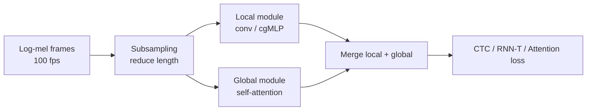
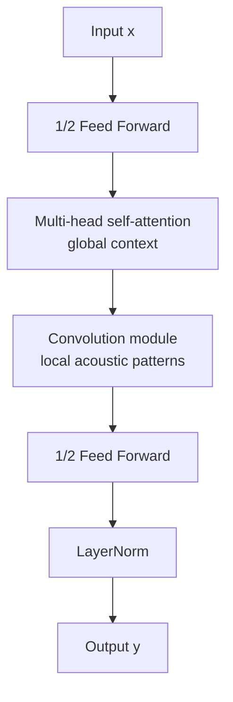
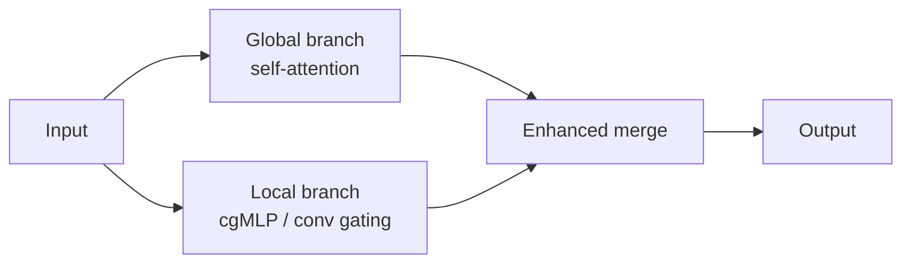
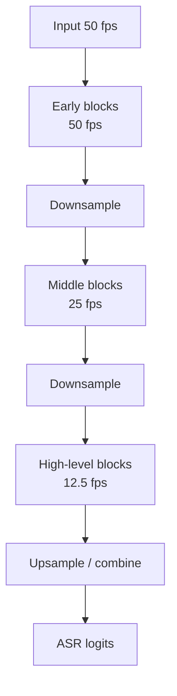

# Chương 5: Modern ASR Architectures

## Vì sao chương này quan trọng

Chương 4 đã giới thiệu ba paradigm cốt lõi cho ASR (CTC, attention seq2seq, RNN-T). Chương này phát triển các **kiến trúc encoder hiện đại** đã định hình production ASR trong năm năm gần đây: **Conformer** (Gulati và cộng sự, 2020), **Zipformer** (Yao và cộng sự, 2023), **E-Branchformer** (Kim và cộng sự, 2022), và **Paraformer**.

Lý do tách thành chương riêng: kiến trúc encoder thường quyết định phần lớn chất lượng và chi phí tính toán của một hệ ASR. Cùng loss và cùng dữ liệu, việc thay Transformer thuần bằng encoder được thiết kế riêng cho speech có thể tạo khác biệt lớn trong WER, latency và memory. Đó là vì encoder cần xử lý sequence audio dài, ví dụ hơn 1000 frames cho một câu 10 giây, với cả local pattern như formant, burst, co-articulation và global pattern như ngữ cảnh câu.

Đối với độc giả NLP/LLM, các kiến trúc trong chương này là tương đương Speech của các Transformer variants (Longformer, BigBird, FlashAttention-based models): cải tiến trên Transformer chuẩn để phù hợp với tính chất riêng của domain.

> **Cấu trúc chương**
>
> - **Phần 1**: vấn đề audio sequence dài và động lực cho hybrid CNN + attention.
> - **Phần 2**: Conformer, kiến trúc encoder phổ biến nhất cho ASR hiện đại.
> - **Phần 3**: Zipformer, E-Branchformer, Paraformer, các cải tiến gần đây.
> - **Phần 4**: so sánh kiến trúc, lựa chọn theo budget compute và latency.

## Tổng quan

Chương này trình bày các kiến trúc ASR hiện đại nhất, từ **Conformer** đến **Zipformer**, **E-Branchformer**, và xu hướng sử dụng **MoE** (Mixture of Experts) cùng **SSM/Mamba** trong speech recognition.

> **📝 Bước tiến từ Transformer đến Conformer**
>
> Transformer thuần túy (self-attention) không có inductive bias mạnh cho local acoustic patterns. Conformer kết hợp **convolution** (local) và **self-attention** (global), nên thường phù hợp hơn cho speech trong nhiều benchmark ASR.

### Bài toán encoder ASR phải giải

Một encoder ASR tốt phải cân bằng ba yêu cầu:

| Yêu cầu | Vì sao quan trọng | Cơ chế thường dùng |
|---|---|---|
| Local acoustic modeling | phoneme phụ thuộc formant, burst, transition ngắn | convolution, depthwise conv, local attention |
| Global context | homophone, phrase context, long utterance | self-attention, chunked attention |
| Compute efficiency | audio sequence dài hơn text nhiều lần | subsampling, multi-scale, streaming cache |



Đây là chủ đề chung của Conformer, E-Branchformer, Zipformer và FastConformer: **đừng dùng Transformer text một cách nguyên xi cho audio; hãy sửa encoder để tôn trọng cấu trúc thời gian của speech.**


## Conformer

### Kiến trúc

Conformer [^gulati2020conformer] xếp chồng các **Conformer blocks**, mỗi block gồm 4 modules theo thứ tự "macaron-style":



Macaron-style nghĩa là FFN được chia thành hai nửa đặt trước và sau attention/conv. Điều này giúp block vừa có năng lực biến đổi phi tuyến mạnh, vừa giữ residual path ổn định khi stack nhiều layers.

<a id="eq-conformer-ffn1"></a>

$$
\mathbf{x}' = \mathbf{x} + \frac{1}{2}\text{FFN}_1(\mathbf{x})
$$

<a id="eq-conformer-mhsa"></a>

$$
\mathbf{x}'' = \mathbf{x}' + \text{MHSA}(\mathbf{x}')
$$

<a id="eq-conformer-conv"></a>

$$
\mathbf{x}''' = \mathbf{x}'' + \text{Conv}(\mathbf{x}'')
$$

<a id="eq-conformer-ffn2"></a>

$$
\mathbf{y} = \text{LayerNorm}\left(\mathbf{x}''' + \frac{1}{2}\text{FFN}_2(\mathbf{x}''')\right)
$$

**Convolution Module** sử dụng depthwise separable convolution:

<a id="eq-conformer-conv-module"></a>

$$
\text{Conv}(\mathbf{x}) = \text{PointwiseConv} \circ \text{GLU} \circ \text{DepthwiseConv}_{k} \circ \text{PointwiseConv}(\mathbf{x})
$$

với kernel size $k = 31$ (capture ~310ms context ở 10ms frame rate).

Vì sao cần convolution nếu đã có attention? Attention giỏi nhìn xa, nhưng không có inductive bias mạnh cho local acoustic transition. Speech có nhiều pattern rất cục bộ: stop burst, formant transition, onset/offset của âm tiết. Depthwise convolution đưa bias này vào model với chi phí thấp.

| Module trong Conformer | Vai trò trực giác |
|---|---|
| FFN 1/2 trước | mở rộng/biến đổi feature ở từng frame |
| MHSA | kết nối frame xa nhau trong cùng utterance |
| Conv module | bắt local pattern và smooth theo thời gian |
| FFN 1/2 sau | refinement sau khi đã trộn local/global |
| LayerNorm/residual | ổn định training sâu |

```python
#| eval: false
#| code-fold: true
#| code-summary: "Conformer Block Implementation"
import torch
import torch.nn as nn
from torch import Tensor

class ConformerBlock(nn.Module):
    """Single Conformer block with macaron-style FFN sandwich."""

    def __init__(
        self,
        d_model: int = 256,
        n_heads: int = 4,
        ff_expansion: int = 4,
        conv_kernel: int = 31,
        dropout: float = 0.1,
    ) -> None:
        super().__init__()
        self.ffn1 = FeedForward(d_model, ff_expansion, dropout)
        self.mhsa = nn.MultiheadAttention(
            d_model, n_heads, dropout=dropout, batch_first=True
        )
        self.conv = ConvolutionModule(d_model, conv_kernel, dropout)
        self.ffn2 = FeedForward(d_model, ff_expansion, dropout)
        self.ln = nn.LayerNorm(d_model)

    def forward(self, x: Tensor) -> Tensor:
        # x: [B, T, D] - float32
        x = x + 0.5 * self.ffn1(x)           # [B, T, D] - float32
        residual = x
        x_att, _ = self.mhsa(x, x, x)        # [B, T, D] - float32
        x = residual + x_att                   # [B, T, D] - float32
        x = x + self.conv(x)                  # [B, T, D] - float32
        x = x + 0.5 * self.ffn2(x)           # [B, T, D] - float32
        return self.ln(x)                      # [B, T, D] - float32


class FeedForward(nn.Module):
    def __init__(self, d: int, expansion: int, dropout: float) -> None:
        super().__init__()
        self.net = nn.Sequential(
            nn.LayerNorm(d),
            nn.Linear(d, d * expansion),  # [B, T, D] -> [B, T, D*4]
            nn.SiLU(),
            nn.Dropout(dropout),
            nn.Linear(d * expansion, d),  # [B, T, D*4] -> [B, T, D]
            nn.Dropout(dropout),
        )

    def forward(self, x: Tensor) -> Tensor:
        return self.net(x)  # [B, T, D] - float32


class ConvolutionModule(nn.Module):
    def __init__(self, d: int, kernel: int, dropout: float) -> None:
        super().__init__()
        self.ln = nn.LayerNorm(d)
        self.pointwise1 = nn.Conv1d(d, 2 * d, 1)     # GLU needs 2x
        self.depthwise = nn.Conv1d(
            d, d, kernel, padding=kernel // 2, groups=d
        )
        self.bn = nn.BatchNorm1d(d)
        self.pointwise2 = nn.Conv1d(d, d, 1)
        self.dropout = nn.Dropout(dropout)

    def forward(self, x: Tensor) -> Tensor:
        # x: [B, T, D]
        x = self.ln(x).transpose(1, 2)     # [B, D, T]
        x = self.pointwise1(x)              # [B, 2D, T]
        x = x.chunk(2, dim=1)[0] * torch.sigmoid(
            x.chunk(2, dim=1)[1]
        )                                    # [B, D, T] - GLU
        x = self.depthwise(x)               # [B, D, T]
        x = self.bn(x)                      # [B, D, T]
        x = nn.functional.silu(x)           # [B, D, T]
        x = self.pointwise2(x)              # [B, D, T]
        return self.dropout(x).transpose(1, 2)  # [B, T, D]
```

### Đọc kết quả benchmark đúng cách

Các bảng LibriSpeech rất hữu ích để so sánh kiến trúc trong điều kiện chuẩn, nhưng không nên xem là bảo chứng production. Một encoder tốt trên LibriSpeech vẫn cần kiểm tra trên accent, noise, domain, streaming constraint và ngôn ngữ mục tiêu.

### Kết quả

| Model | Params | LibriSpeech test-clean | test-other |
|-------|--------|----------------------|------------|
| Transformer | 118M | 2.4% WER | 5.6% |
| **Conformer-L** | 118M | **2.1%** | **4.3%** |
| Conformer-XL | 600M | 1.9% | 3.9% |

: Conformer vs Transformer trên LibriSpeech <a id="tbl-conformer-results"></a>

Bảng trên minh họa xu hướng: thêm convolution và thiết kế encoder phù hợp speech có thể cải thiện rõ rệt so với Transformer thuần trong cùng benchmark. Khi đưa vào sản phẩm, cần đo thêm RTF, memory, batch throughput và độ ổn định trên long-form audio.

## E-Branchformer

E-Branchformer [^kim2023ebranchformer] cải tiến Conformer bằng **parallel branches**:

Khác với Conformer chạy các module theo chuỗi, E-Branchformer tách đường xử lý global và local song song rồi merge. Điều này phản ánh một trực giác sư phạm: audio cần cả “nhìn gần” và “nhìn xa”, nhưng hai thao tác này không nhất thiết phải chờ nhau.



<a id="eq-ebranchformer"></a>

$$
\mathbf{y} = \text{Merge}(\text{GlobalBranch}(\mathbf{x}), \text{LocalBranch}(\mathbf{x})) + \mathbf{x}
$$

- **Global Branch**: Multi-head self-attention (MHSA)
- **Local Branch**: Convolutional gating mechanism (cgMLP)
- **Merge**: Linear projection + concatenation

> **📝 Tại sao E-Branchformer?**
>
> Conformer xử lý tuần tự: FFN → MHSA → Conv → FFN. E-Branchformer chạy **song song** global và local branches, trong một số báo cáo cho tốc độ training tốt hơn và chất lượng cạnh tranh với Conformer.


## Zipformer

Zipformer [^yao2023zipformer] (từ nhóm k2/icefall) cải tiến nhiều khía cạnh:

Zipformer tập trung vào câu hỏi engineering: làm thế nào giữ chất lượng cao nhưng giảm chi phí cho ASR thực tế? Câu trả lời là multi-scale processing: không phải layer nào cũng cần frame rate cao như nhau.



Trực giác: layer đầu cần độ phân giải thời gian cao để bắt acoustic detail. Layer sâu hơn đã có representation trừu tượng hơn, nên có thể xử lý ở frame rate thấp hơn để tiết kiệm compute.

### Temporal Downsampling

Sử dụng **multi-scale architecture** với different frame rates ở các layers khác nhau:

- Layers đầu: 50 fps (10ms)
- Layers giữa: 25 fps (20ms) - downsample 2x
- Layers cuối: 12.5 fps (40ms) - downsample thêm 2x

<a id="eq-zipformer-fps"></a>

$$
\text{fps}_l = \frac{50}{2^{d_l}}, \quad d_l \in \{0, 1, 2\}
$$

### Swoosh Activation

Thay SiLU bằng **Swoosh** activation:

<a id="eq-swoosh"></a>

$$
\text{Swoosh}(x) = x \cdot \sigma(x - 1)
$$

### BiasNorm thay LayerNorm

<a id="eq-biasnorm"></a>

$$
\text{BiasNorm}(\mathbf{x}) = \frac{\mathbf{x} + \mathbf{b}}{\text{learn scale} \cdot \|\mathbf{x} + \mathbf{b}\|_{\text{RMS}}}
$$

| Model | Params | test-clean | test-other | Speed |
|-------|--------|-----------|------------|-------|
| Conformer | 116M | 2.1% | 4.3% | 1.0x |
| E-Branchformer | 116M | 2.1% | 4.2% | 1.1x |
| **Zipformer-L** | 148M | **1.9%** | **4.0%** | **1.3x** |

: So sánh kiến trúc ASR hiện đại <a id="tbl-modern-asr-comparison"></a>

Các con số trong bảng nên được đọc như ví dụ benchmark, không phải thứ hạng tuyệt đối. Kết quả thay đổi theo dataset, tokenizer, augmentation, decoding, LM rescoring và cấu hình streaming/offline.

## FastConformer (NVIDIA)

FastConformer [^rekesh2023fast] từ NVIDIA NeMo tối ưu Conformer cho production:

FastConformer là ví dụ tốt về khác biệt giữa “model paper” và “model production”. Trong production, giảm WER không đủ; ta còn cần throughput cao, RTF thấp, memory ổn định và dễ export/serve.

- **8x downsampling** ở CNN frontend (thay vì 4x) - giảm sequence length
- **Multi-blank CTC** - thêm blank symbols cho phép skip nhiều frames
- **Hybrid CTC/RNNT** training

<a id="eq-fastconformer-rtf"></a>

$$
	ext{RTF}_{	ext{FastConformer}} pprox 0.01 	ext{ trong một số cấu hình GPU được báo cáo}
$$

**Real-time factor (RTF)** là thước đo rất quan trọng:

| RTF | Ý nghĩa |
|---:|---|
| 1.0 | xử lý 1 giây audio mất 1 giây |
| 0.5 | nhanh hơn realtime 2 lần |
| 0.01 | nhanh hơn realtime khoảng 100 lần trong điều kiện benchmark |
| >1.0 | chậm hơn realtime, không phù hợp streaming |

RTF phụ thuộc mạnh vào hardware, batch size, precision, decoding beam, audio length và I/O. Vì vậy khi đọc con số RTF, luôn hỏi: đo trên GPU nào, batch bao nhiêu, offline hay streaming, có LM rescoring không?

## MoE trong Speech Recognition

### Tại sao MoE cho Speech?

Mixture of Experts (MoE) [^shazeer2017outrageously] cho phép **scale model capacity** mà không tăng compute proportionally:

Trong ASR, MoE hấp dẫn vì các frame khác nhau có thể cần chuyên gia khác nhau: speech sạch, speech nhiễu, âm nhạc nền, accent vùng miền, hoặc code-switching. Tuy nhiên MoE cũng làm production phức tạp hơn: routing, load balancing, memory footprint và latency tail đều khó kiểm soát hơn dense model.

<a id="eq-moe-speech"></a>

$$
\text{MoE}(\mathbf{x}) = \sum_{i=1}^{N} g_i(\mathbf{x}) \cdot E_i(\mathbf{x})
$$

với $g_i(\mathbf{x})$ là routing weights (chỉ top-$k$ experts được activate).

### Branchformer-MoE

Kết hợp E-Branchformer với MoE routing [^you2024moe]:

- Thay FFN layers bằng MoE layers (8-64 experts, top-2 routing)
- Load balancing loss để tránh expert collapse:

<a id="eq-moe-balance"></a>

$$
\mathcal{L}_{\text{balance}} = N \sum_{i=1}^{N} f_i \cdot P_i
$$

trong đó $f_i$ là fraction of tokens routed to expert $i$, $P_i$ là average routing probability.

## Mamba/SSM trong Speech

### State Space Models cho Audio

S4 [^gu2022efficiently] và Mamba [^gu2023mamba] xử lý sequences dài hiệu quả - rất phù hợp cho audio (16kHz = 16000 samples/sec):

<a id="eq-ssm-speech"></a>

$$
\begin{aligned}
\mathbf{h}_{t+1} &= \bar{\mathbf{A}} \mathbf{h}_t + \bar{\mathbf{B}} x_t \\
y_t &= \mathbf{C} \mathbf{h}_t + D x_t
\end{aligned}
$$

### Khi nào nên quan tâm SSM/Mamba?

SSM/Mamba đáng chú ý khi sequence rất dài hoặc cần chi phí tuyến tính theo thời gian. Tuy nhiên, ASR không chỉ cần long-range modeling; nó cần alignment, streaming, robustness và decoding ổn định. Vì vậy, ở thời điểm hiện tại, SSM thường nên được xem như thành phần lai hoặc hướng nghiên cứu, không phải lựa chọn mặc định thay Conformer trong production.

### Hybrid Attention-SSM cho ASR

Jamba-style architectures [^lieber2024jamba] cho speech kết hợp:

- **Attention layers**: Capture global dependencies (cross-utterance context)
- **Mamba layers**: Xử lý long sequences hiệu quả (raw waveform hoặc high-resolution features)

| Kiến trúc | Complexity | Long Audio | Global Context |
|-----------|-----------|------------|----------------|
| Pure Attention | $O(T^2)$ | Kém | Tốt |
| Pure Mamba | $O(T)$ | Tốt | Trung bình |
| **Hybrid** | thường gần tuyến tính tùy thiết kế | Tốt | Tốt nếu vẫn giữ attention/global module |

: Attention vs Mamba vs Hybrid cho speech <a id="tbl-hybrid-ssm-speech"></a>

> **⚠️ SSM cho Speech còn rất mới**
>
> Tính đến 2025-2026, nghiên cứu về Mamba/SSM cho speech vẫn đang phát triển. Conformer, E-Branchformer, Zipformer và FastConformer vẫn là các lựa chọn thực dụng hơn trong nhiều pipeline ASR. Hybrid architectures hứa hẹn nhưng cần được benchmark kỹ theo domain.


## Lựa chọn kiến trúc theo ràng buộc

| Ràng buộc chính | Lựa chọn nên thử | Lý do |
|---|---|---|
| Offline accuracy | Conformer/E-Branchformer + attention/CTC | local + global mạnh |
| Streaming production | FastConformer hoặc Conformer causal + RNN-T | latency kiểm soát được |
| Low-resource | SSL encoder hoặc Conformer nhỏ + augmentation | tận dụng transfer và regularization |
| On-device | small Conformer/Zipformer, quantization | giảm compute và memory |
| Long-form meeting | chunked Conformer/Zipformer + endpointing | ổn định trên audio dài |
| Research sequence dài | hybrid attention-SSM | thử nghiệm scaling theo thời gian |

### Sai lầm thường gặp

- **Chỉ nhìn WER mà bỏ qua RTF**: model tốt nhưng không chạy realtime thì không dùng được cho voice agent.
- **Dùng encoder bidirectional cho streaming**: nhìn tương lai quá nhiều sẽ làm latency không đạt yêu cầu.
- **So benchmark khác decoding**: greedy, beam, LM rescoring có thể làm bảng so sánh lệch.
- **Không tách eval theo noise/accent**: một WER trung bình che giấu lỗi nghiêm trọng ở nhóm người dùng cụ thể.
- **Quên frontend/downsampling**: nhiều khác biệt đến từ subsampling, SpecAugment và tokenizer, không chỉ block encoder.

## Tóm tắt

| Kiến trúc | Năm | Đặc điểm chính | Use case |
|-----------|-----|----------------|----------|
| Conformer | 2020 | Conv + Attention (macaron) | ASR offline/streaming phổ biến |
| E-Branchformer | 2022 | Parallel branches | ESPnet default |
| Zipformer | 2023 | Multi-scale + Swoosh | k2/icefall |
| FastConformer | 2023 | 8x downsample | NVIDIA NeMo |
| MoE-ASR | 2024 | Sparse expert routing | Scale capacity |
| Hybrid SSM | 2024+ | Attention + Mamba | Long-form audio |

: Tổng hợp kiến trúc ASR hiện đại <a id="tbl-asr-summary"></a>

Chương tiếp theo sẽ chuyển từ kiến trúc encoder tổng quát sang một case study quan trọng: Whisper và Canary. Khi đọc Chương 6, hãy để ý rằng thành công của Whisper không chỉ đến từ architecture, mà còn đến từ dữ liệu weakly supervised quy mô lớn, multitask tokens và thiết kế inference thực dụng.


---

<!-- References (auto-generated from .bib) -->
[^gulati2020conformer]: Gulati, Anmol and Qin, James and Chiu, Chung-Cheng and others, "Conformer: Convolution-augmented Transformer for Speech Recognition", Interspeech
[^kim2023ebranchformer]: Kim, Kwangyoun and Wu, Felix and Peng, Yifan and others, "E-Branchformer: Branchformer with Enhanced Merging for Speech Recognition", IEEE Spoken Language Technology Workshop
[^yao2023zipformer]: Yao, Zengwei and Guo, Liyong and Yang, Xiaoyu and others, "Zipformer: A Faster and Better Encoder for Automatic Speech Recognition", International Conference on Learning Representations
[^rekesh2023fast]: Rekesh, Dima and Koluguri, Nithin Rao and Kriman, Samuel and others, "Fast Conformer with Linearly Scalable Attention for Efficient Speech Recognition", IEEE Automatic Speech Recognition and Understanding Workshop
[^shazeer2017outrageously]: Shazeer, Noam and others, "Outrageously Large Neural Networks: The Sparsely-Gated Mixture-of-Experts Layer", International Conference on Learning Representations
[^you2024moe]: You, Yifan and others, "E-Branchformer-based MoE Model for Efficient ASR", Interspeech
[^gu2022efficiently]: Gu, Albert and Goel, Karan and R{\'e, "Efficiently Modeling Long Sequences with Structured State Spaces", International Conference on Learning Representations
[^gu2023mamba]: Gu, Albert and Dao, Tri, "Mamba: Linear-Time Sequence Modeling with Selective State Spaces", arXiv preprint arXiv:2312.00752
[^lieber2024jamba]: Lieber, Opher and others, "Jamba: A Hybrid Transformer-Mamba Language Model", arXiv preprint arXiv:2403.19887
