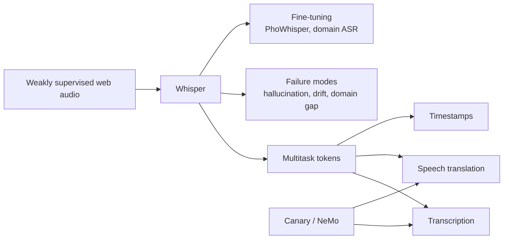
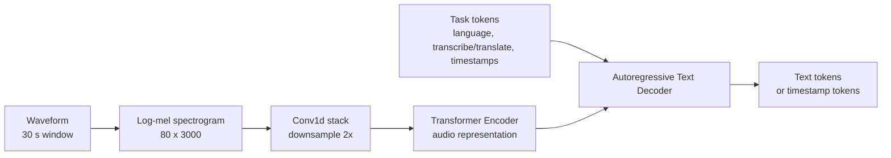
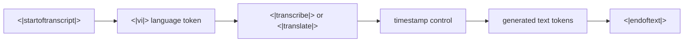
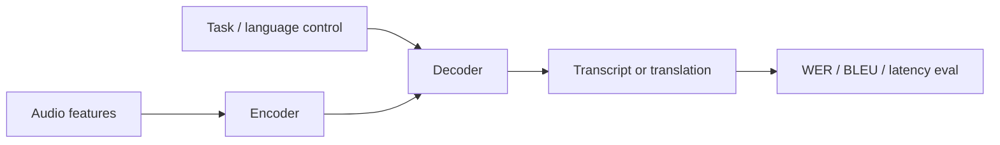

# Chương 6: Whisper, Canary và Large-Scale Weakly-Supervised ASR

## Vì sao chương này quan trọng

Whisper (OpenAI, 2022) là một dấu mốc quan trọng cho ngành ASR. Một mô hình open-source duy nhất, train trên 680,000 giờ audio đa ngôn ngữ với supervision yếu, cho thấy khả năng tổng quát hóa mạnh trên nhiều domain, ngôn ngữ và mức nhiễu khác nhau. Sau Whisper là loạt mô hình kế tiếp đáng chú ý: Canary của NVIDIA (2024) bổ sung multitask cho ASR và speech translation, cùng nhiều Whisper-derivative cho ngôn ngữ ít tài nguyên, trong đó có PhoWhisper cho tiếng Việt (VinAI, ICLR Tiny Papers 2024).

Chương này không chỉ trình bày kiến trúc Whisper, mà còn phân tích vì sao công thức "Transformer encoder-decoder cộng weak supervision ở quy mô lớn" lại hiệu quả đến vậy, và mặt trái của nó (hallucination, drift trên silence, kém với tonal language nếu không fine-tune).

> **Cấu trúc chương**
>
> - **Phần 1**: Whisper, weak supervision at scale, kiến trúc encoder-decoder, multitask format.
> - **Phần 2**: phân tích thực nghiệm Whisper: hiệu suất theo ngôn ngữ, robustness, failure modes.
> - **Phần 3**: Canary của NVIDIA, multitask ASR + AST + diarization.
> - **Phần 4**: Whisper fine-tune cho ngôn ngữ ít tài nguyên, case study PhoWhisper cho tiếng Việt.

### Bản đồ chương



Chương này nên được đọc như một case study về **data scale + task formatting**. Whisper không chỉ là một Transformer encoder-decoder; điểm mạnh của nó nằm ở cách chuẩn hóa nhiều task thành một protocol token duy nhất và train trên dữ liệu rất lớn.

## Phần 1 — Whisper: Weak Supervision at Scale

Whisper [^radford2023robust] là ASR model của OpenAI, được train trên **680,000 giờ** audio với weak supervision, không cần human-annotated transcriptions.

### Key Insight

Thay vì tự tạo labels (self-supervised) hay thuê người gán nhãn (supervised), Whisper thu thập **audio + transcript pairs từ internet**, noisy nhưng ở quy mô cực lớn:

<a id="eq-whisper-scale"></a>

$$
\underbrace{\text{680K hours}}_{\text{Whisper (weak supervision)}} \gg \underbrace{\text{60K hours}}_{\text{Wav2Vec 2.0 (self-supervised)}} \gg \underbrace{\text{960 hours}}_{\text{LibriSpeech (supervised)}}
$$

> **💡 NLP Parallel**
>
> Cách tiếp cận của Whisper tương tự **GPT pre-training** ở tinh thần scaling: dữ liệu internet có noise, nhưng quy mô rất lớn giúp model học được nhiều biến thiên thực tế. Trong speech, nguồn dữ liệu có thể là audio kèm subtitles, podcast transcript hoặc caption tự động đã qua lọc.

Weak supervision không có nghĩa là “dữ liệu kém chất lượng thì cứ ném vào model”. Ở quy mô lớn, filtering vẫn rất quan trọng: loại bỏ transcript lệch audio, đoạn im lặng, ngôn ngữ sai, phụ đề không đồng bộ, hoặc nội dung quá nhiễu. Bài học production là: nếu không có 680K giờ, chất lượng lọc dữ liệu càng quan trọng hơn.


## Architecture

### Overview

Whisper là **encoder-decoder Transformer** kinh điển:



**Hình:** Kiến trúc Whisper ở mức hệ thống. Điểm quan trọng là encoder xử lý log-mel spectrogram cố định, còn decoder nhận task tokens để cùng một model thực hiện transcription, translation và timestamp prediction.

### Vì sao Whisper dùng cửa sổ 30 giây?

Whisper chuẩn hóa audio thành các đoạn 30 giây, tương ứng log-mel shape `80 × 3000` ở 100 fps. Cách này có lợi vì encoder luôn nhận input shape gần cố định, dễ batch và dễ train. Nhưng nó cũng tạo trade-off:

| Lựa chọn | Ưu điểm | Hạn chế |
|---|---|---|
| Window 30 giây | đủ context câu, batching đơn giản | không phải streaming tự nhiên |
| Chunk ngắn hơn | latency thấp hơn | dễ mất context, tăng boundary errors |
| Chunk dài hơn | nhiều context hơn | memory/attention cost lớn hơn |
| VAD trước khi chunk | giảm silence/hallucination | phụ thuộc chất lượng VAD |

Trong production, Whisper thường được bọc bằng VAD, chunking, overlap và stitching. Phần khó không chỉ là model, mà là cách cắt audio sao cho transcript không mất từ ở ranh giới chunk.

### Audio Encoder

<a id="eq-whisper-encoder"></a>

$$
\begin{aligned}
\mathbf{x}_{\text{mel}} &\in \mathbb{R}^{80 \times 3000} & \text{// Log mel spectrogram} \\
\mathbf{x}_1 &= \text{GELU}(\text{Conv1d}(\mathbf{x}_{\text{mel}}, k{=}3, s{=}1)) & \text{// [d, 3000]} \\
\mathbf{x}_2 &= \text{GELU}(\text{Conv1d}(\mathbf{x}_1, k{=}3, s{=}2)) & \text{// [d, 1500]  -  2× downsampling} \\
\mathbf{h} &= \text{TransformerEncoder}(\mathbf{x}_2 + \mathbf{p}_{\text{sin}}) & \text{// [1500, d]}
\end{aligned}
$$

### Text Decoder

Autoregressive decoder với **special tokens** cho multitask:



Đối với người học LLM, đây chính là instruction prompting ở mức tokenizer. Thay vì có nhiều model riêng cho language ID, transcription, translation và timestamp, Whisper đưa task spec vào prefix tokens.

<a id="eq-whisper-decoder"></a>

$$
P(y_u \mid y_{<u}, \mathbf{h}) = \text{softmax}(\mathbf{W}_o \cdot \text{TransformerDecoder}(y_{<u}, \mathbf{h}))
$$

### Model Sizes

| Model | Layers | Width | Heads | Params | English WER |
|-------|--------|-------|-------|--------|-------------|
| Tiny | 4+4 | 384 | 6 | 39M | 7.6% |
| Base | 6+6 | 512 | 8 | 74M | 5.0% |
| Small | 12+12 | 768 | 12 | 244M | 3.4% |
| Medium | 24+24 | 1024 | 16 | 769M | 2.9% |
| Large-v3 | 32+32 | 1280 | 20 | 1550M | **2.2%** |

: Whisper model sizes <a id="tbl-whisper-sizes"></a>

## Multitask Training Format

### Special Token Protocol

Whisper sử dụng sequence of special tokens để chỉ định task:

```
<|startoftranscript|> <|lang|> <|task|> [<|notimestamps|>] ...text... <|endoftext|>
```

- `<|lang|>`: Language token (e.g., `<|en|>`, `<|vi|>`, `<|zh|>`)
- `<|task|>`: `<|transcribe|>` hoặc `<|translate|>` (→ English)
- `<|notimestamps|>`: Optional, nếu không cần word-level timestamps

### Timestamp tokens

Whisper biểu diễn timestamp bằng special tokens rời rạc. Điều này cho phép decoder sinh xen kẽ text và mốc thời gian, ví dụ một segment bắt đầu ở 12.40s và kết thúc ở 15.20s. Đây là một thiết kế rất thực dụng: timestamp trở thành bài toán token prediction, không cần thêm regression head riêng.

Tuy nhiên, timestamp của Whisper thường phù hợp ở mức segment hơn là word-level tuyệt đối. Nếu sản phẩm cần word-level alignment chính xác để karaoke/subtitle, cần thêm forced alignment hoặc model chuyên dụng.

### Tasks

| Task | Input | Output | Token |
|------|-------|--------|-------|
| Transcription | Audio (any lang) | Text (same lang) | `<|transcribe|>` |
| Translation | Audio (any lang) | Text (English) | `<|translate|>` |
| Language ID | Audio | Language token | Predict `<|lang|>` |
| VAD | Audio | Timestamps | `<|0.00|>` ... `<|30.00|>` |

: Whisper multitask format <a id="tbl-whisper-tasks"></a>

> **📝 Multitask = Prompt Engineering for ASR**
>
> Whisper's special token system tương đương **prompt engineering** cho LLM. Thay vì train riêng models cho mỗi task, dùng prompt tokens để điều khiển behavior  -  giống GPT-3 instruction following.


## Failure modes của Whisper

Whisper robust, nhưng không hoàn hảo. Các lỗi quan trọng cần hiểu:

| Failure mode | Biểu hiện | Nguyên nhân thường gặp | Cách giảm rủi ro |
|---|---|---|---|
| Hallucination trên silence | sinh câu dù audio im lặng | decoder LM quá mạnh, VAD kém | VAD, no-speech threshold, temperature fallback |
| Repetition | lặp cụm từ nhiều lần | decoding drift, chunk boundary | compression ratio threshold, beam/temperature tuning |
| Language mis-ID | nhận nhầm ngôn ngữ | code-switching, audio ngắn | force language token khi biết trước |
| Timestamp drift | mốc thời gian lệch | long audio, chunk stitching | overlap, alignment hậu xử lý |
| Domain terms sai | tên riêng, thuật ngữ | thiếu domain data | fine-tune, biasing, glossary/post-edit |
| Tone/diacritics sai | lỗi dấu tiếng Việt | tonal/accent mismatch | fine-tune tiếng Việt, eval theo vùng miền |

Điểm cần nhớ: Whisper có decoder giống language model. Khi acoustic evidence yếu, decoder có thể “đoán hợp lý” theo ngôn ngữ, nhưng đoán hợp lý không đồng nghĩa đúng transcript.

## Training Details

### Data Distribution

- **680K hours** total audio
- **96 languages** (nhưng phân bố rất không đều)
- English: ~438K hours (~65%)
- Top 10 languages: ~90% tổng data
- Vietnamese: không được công bố chi tiết trong paper; các ước lượng bên ngoài cần được đọc thận trọng

### Training Setup

<a id="eq-whisper-training"></a>

$$
\begin{aligned}
\text{Optimizer} &: \text{AdamW}, \quad \beta = (0.9, 0.98), \quad \epsilon = 10^{-6} \\
\text{LR schedule} &: \text{Linear warmup (2048 steps)} \to \text{cosine decay} \\
\text{Batch size} &: 256 \text{ segments} \times 30\text{s} = 2.13 \text{ hours/batch} \\
\text{Total steps} &: \sim 2^{20} \approx 1{,}048{,}576 \\
\text{Total compute} &: \text{không nên xem là con số tái lập đơn giản nếu thiếu setup gốc}
\end{aligned}
$$

### Loss Function

Standard cross-entropy trên text tokens:

<a id="eq-whisper-loss"></a>

$$
\mathcal{L} = -\frac{1}{U} \sum_{u=1}^{U} \log P(y_u \mid y_{<u}, \mathbf{h}_{\text{encoder}})
$$

## Inference & Decoding

```python
#| eval: false
#| code-fold: true
#| code-summary: "Whisper-style encoder-decoder"
import torch
import torch.nn as nn
import math
from torch import Tensor


class WhisperEncoder(nn.Module):
    """Simplified Whisper audio encoder.

    Conv1d downsampling + Transformer encoder.
    """

    def __init__(
        self,
        n_mels: int = 80,
        d_model: int = 512,
        n_heads: int = 8,
        n_layers: int = 6,
        max_len: int = 1500,
    ) -> None:
        super().__init__()
        # Two conv layers for downsampling
        self.conv1 = nn.Conv1d(
            n_mels, d_model, kernel_size=3, padding=1,
        )  # [B, 80, T] -> [B, d, T]
        self.conv2 = nn.Conv1d(
            d_model, d_model, kernel_size=3, stride=2, padding=1,
        )  # [B, d, T] -> [B, d, T//2]
        self.gelu = nn.GELU()

        # Sinusoidal positional encoding
        pe: Tensor = torch.zeros(max_len, d_model)  # [max_len, d]
        position: Tensor = torch.arange(0, max_len).unsqueeze(1).float()
        div_term: Tensor = torch.exp(
            torch.arange(0, d_model, 2).float() * (-math.log(10000.0) / d_model)
        )
        pe[:, 0::2] = torch.sin(position * div_term)
        pe[:, 1::2] = torch.cos(position * div_term)
        self.register_buffer("pe", pe)  # [max_len, d]

        # Transformer encoder layers
        encoder_layer = nn.TransformerEncoderLayer(
            d_model=d_model,
            nhead=n_heads,
            dim_feedforward=d_model * 4,
            dropout=0.1,
            activation="gelu",
            batch_first=True,
        )
        self.transformer = nn.TransformerEncoder(
            encoder_layer, num_layers=n_layers,
        )
        self.ln = nn.LayerNorm(d_model)

    def forward(self, mel: Tensor) -> Tensor:
        """Encode mel spectrogram.

        Args:
            mel: [batch, n_mels, T_frames] - float32
                 T_frames = 3000 for 30s audio at 100fps

        Returns:
            h: [batch, T_frames//2, d_model] - float32
               T_frames//2 = 1500 for 30s audio
        """
        x: Tensor = self.gelu(self.conv1(mel))  # [B, d, T] - float32
        x = self.gelu(self.conv2(x))  # [B, d, T//2] - float32
        x = x.transpose(1, 2)  # [B, T//2, d] - float32

        T: int = x.size(1)
        x = x + self.pe[:T]  # [B, T//2, d] - float32

        h: Tensor = self.transformer(x)  # [B, T//2, d] - float32
        h = self.ln(h)  # [B, T//2, d] - float32
        return h


class WhisperDecoder(nn.Module):
    """Simplified Whisper text decoder."""

    def __init__(
        self,
        vocab_size: int = 51865,
        d_model: int = 512,
        n_heads: int = 8,
        n_layers: int = 6,
        max_len: int = 448,
    ) -> None:
        super().__init__()
        self.token_emb = nn.Embedding(vocab_size, d_model)
        self.pos_emb = nn.Embedding(max_len, d_model)

        decoder_layer = nn.TransformerDecoderLayer(
            d_model=d_model,
            nhead=n_heads,
            dim_feedforward=d_model * 4,
            dropout=0.1,
            activation="gelu",
            batch_first=True,
        )
        self.transformer = nn.TransformerDecoder(
            decoder_layer, num_layers=n_layers,
        )
        self.ln = nn.LayerNorm(d_model)
        self.proj = nn.Linear(d_model, vocab_size, bias=False)

    def forward(
        self,
        tokens: Tensor,    # [batch, U] - int64
        encoder_out: Tensor,  # [batch, T', d_model] - float32
    ) -> Tensor:
        """Decode tokens with encoder context.

        Args:
            tokens: Input token IDs [B, U] - int64
            encoder_out: Encoder output [B, T', d] - float32

        Returns:
            logits: [B, U, vocab_size] - float32
        """
        U: int = tokens.size(1)
        positions: Tensor = torch.arange(
            U, device=tokens.device
        )  # [U]

        x: Tensor = self.token_emb(tokens) + self.pos_emb(positions)
        # [B, U, d] - float32

        # Causal mask
        causal_mask: Tensor = nn.Transformer.generate_square_subsequent_mask(
            U, device=tokens.device,
        )  # [U, U] - float32

        h: Tensor = self.transformer(
            x, encoder_out, tgt_mask=causal_mask,
        )  # [B, U, d] - float32

        h = self.ln(h)  # [B, U, d] - float32
        logits: Tensor = self.proj(h)  # [B, U, vocab] - float32
        return logits
```

## Canary và NeMo ASR

Canary là họ mô hình encoder-decoder của NVIDIA NeMo hướng tới multitask speech recognition và speech translation. Về mặt tư duy, Canary nằm cùng gia đình “large-scale encoder-decoder ASR” với Whisper, nhưng được phát triển trong ecosystem NeMo, thuận tiện cho fine-tuning, deployment và tích hợp pipeline NVIDIA.

| Khía cạnh | Whisper | Canary / NeMo |
|---|---|---|
| Kiến trúc tổng quát | encoder-decoder Transformer | encoder-decoder, thường trong NeMo stack |
| Task | ASR, translate-to-English, timestamps, LID | ASR và speech translation đa ngôn ngữ tùy checkpoint |
| Ecosystem | open-source weights, nhiều implementation | NeMo training/fine-tuning/deployment recipes |
| Production angle | phổ biến qua faster-whisper/CTranslate2 | mạnh khi dùng NVIDIA stack |
| Điểm cần kiểm tra | hallucination, chunking, language forcing | license, checkpoint language coverage, latency |

Canary quan trọng về mặt giáo trình vì nó cho thấy Whisper không phải công thức duy nhất. Cùng là encoder-decoder ASR, nhưng data recipe, tokenizer, training objective, language coverage và deployment tooling có thể khác nhau đáng kể.



### Khi nào cân nhắc Canary?

- Khi bạn đã dùng NVIDIA NeMo cho training/inference.
- Khi cần recipe fine-tune ASR hoặc speech translation có cấu trúc rõ.
- Khi muốn benchmark một encoder-decoder ASR khác Whisper trên domain của mình.
- Khi triển khai trên GPU NVIDIA và muốn tận dụng tooling sẵn có.

## Faster Whisper & Optimizations

### Distil-Whisper

Distil-Whisper [^gandhi2023distilwhisper] giảm kích thước và tăng tốc inference bằng knowledge distillation:

<a id="eq-distil-whisper"></a>

$$
\mathcal{L}_{\text{distil}} = \alpha \cdot \mathcal{L}_{\text{CE}}(y, \hat{y}_{\text{student}}) + (1-\alpha) \cdot \text{KL}(\hat{p}_{\text{teacher}} \| \hat{p}_{\text{student}})
$$

| Model | Params | Speed (vs Large-v3) | WER (test-clean) |
|-------|--------|---------------------|-------------------|
| Whisper Large-v3 | 1550M | 1× | 2.2% trong benchmark được báo cáo |
| Distil-Whisper Large-v3 | 756M | 6.3× | 2.5% trong benchmark được báo cáo |

: Distil-Whisper performance <a id="tbl-distil-whisper"></a>

### faster-whisper (CTranslate2)

Tối ưu inference bằng:

- **INT8 quantization**: Giảm memory 2–4×
- **KV-cache optimization**: Reuse computed attention keys/values
- **Batched beam search**: Parallel decoding
- **VAD-based chunking**: Chỉ process segments có speech

> **⚠️ Latency Warning**
>
> | Configuration | RTF (Real-Time Factor) | Latency (30s audio) | VRAM |
> |--------------|----------------------|---------------------|------|
> | Whisper Large-v3 (FP16, A100) | 0.03 | ~1s | 6 GB |
> | Whisper Large-v3 (INT8, T4) | 0.15 | ~4.5s | 3 GB |
> | faster-whisper Large-v3 (INT8, T4) | 0.05 | ~1.5s | 2 GB |
> | Distil-Whisper (INT8, T4) | 0.02 | ~0.6s | 1.5 GB |


### Whisper cho Tiếng Việt

| Cấu hình | Kỳ vọng tương đối | Ghi chú |
|-------|------------------------|---------|
| Whisper Tiny/Base | thường yếu hơn rõ rệt | phù hợp demo nhanh, không nên dùng để kết luận chất lượng tiếng Việt |
| Whisper Small/Medium | cân bằng hơn | cần benchmark trên domain thực tế |
| Whisper Large-v3 | thường mạnh hơn các bản nhỏ | nặng hơn về VRAM/latency |
| PhoWhisper/fine-tuned variants | có thể tốt hơn cho tiếng Việt | phụ thuộc tập fine-tune và benchmark |

: Đọc kết quả Whisper tiếng Việt theo hướng tương đối <a id="tbl-whisper-vi"></a>

> **📝 Vietnamese Challenges**
>
> Tiếng Việt là tonal language (6 tones)  -  Whisper thường gặp lỗi với:
>
> - **Hỏi vs Ngã** tone confusion (Southern dialect merger)
> - **Regional accents**: Bắc/Trung/Nam rất khác biệt
> - **Code-switching**: Vietnamese + English trong business contexts
> - **Proper nouns**: Tên riêng Việt Nam thường bị sai
>
> Fine-tuning trên dữ liệu tiếng Việt thường giúp cải thiện lỗi domain, dấu thanh và tên riêng, nhưng cần đánh giá riêng theo vùng miền và điều kiện thu. Xem thêm các chương về dữ liệu và tiếng Việt ở Phần VI.


## Tóm tắt

| Aspect | Whisper |
|--------|---------|
| Architecture | Encoder-decoder Transformer |
| Pre-training | 680K hours weak supervision |
| Input | 30s mel spectrogram (80, 3000) |
| Tasks | Transcription, translation, timestamps, language ID |
| Multilingual | 96 languages trong paper gốc |
| Strength | robust zero-shot/multilingual ASR trong nhiều điều kiện |
| Vietnamese | cần benchmark riêng; fine-tuned variants như PhoWhisper đáng cân nhắc |
| Optimization | Distil-Whisper, faster-whisper, INT8 |

: Whisper summary <a id="tbl-whisper-summary"></a>

Chương tiếp theo chuyển sang **Streaming ASR**, nơi ta phân tích latency, chunking, endpointing, partial hypothesis và các ràng buộc production realtime.


---

<!-- References (auto-generated from .bib) -->
[^radford2023robust]: Radford, Alec and Kim, Jong Wook and Xu, Tao and Brockman, Greg and McLeavey, Christine and Sutskever, Ilya, "Robust Speech Recognition via Large-Scale Weak Supervision", International Conference on Machine Learning
[^gandhi2023distilwhisper]: Gandhi, Sanchit and von Platen, Patrick and Rush, Alexander M, "Distil-Whisper: Robust Knowledge Distillation via Large-Scale Pseudo Labelling", arXiv preprint arXiv:2311.00430
[^nvidia2024canary]: NVIDIA NeMo Team, "Canary: multilingual ASR and speech translation models", NVIDIA NeMo documentation and model cards, 2024.
