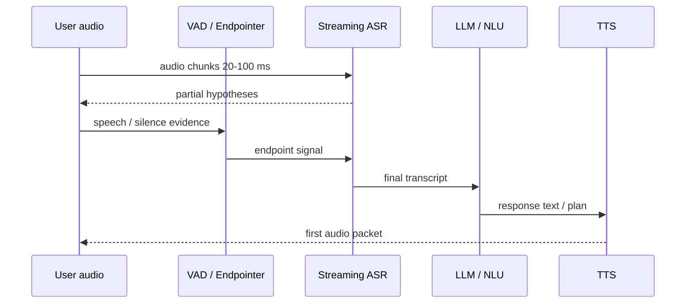
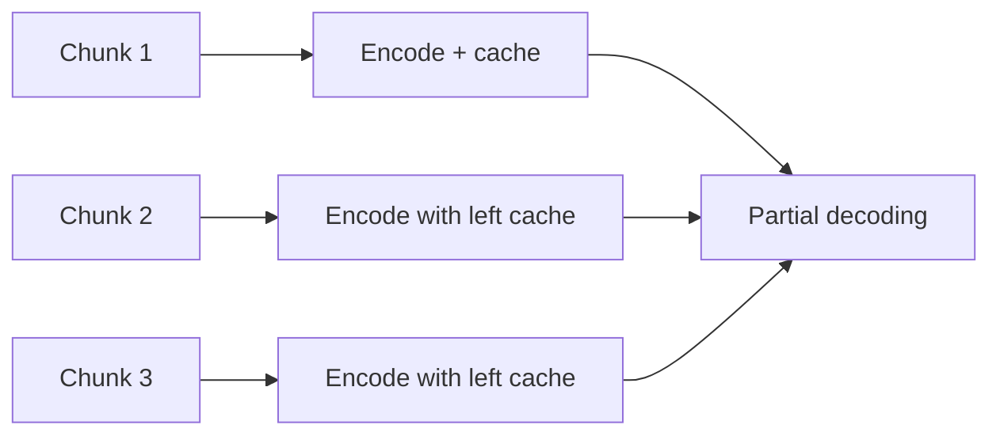

# Chương 7: Streaming ASR

## Vì sao chương này quan trọng

Streaming ASR là điều kiện cần cho mọi voice product real-time: trợ lý ảo, voice agent, live captioning, in-car voice, dictation. Khác với offline ASR (đầu vào toàn bộ utterance trước khi sinh output), streaming ASR phải bắt đầu sinh transcript ngay khi audio bắt đầu chảy vào, với độ trễ chỉ vài trăm mili-giây.

Yêu cầu này đặt ra ba ràng buộc kỹ thuật chính:

- **Causal hoặc chunked attention**: không được nhìn vào frame tương lai vô hạn.
- **Endpointing**: phát hiện khi nào người dùng kết thúc câu để chốt output.
- **Partial hypotheses**: cập nhật transcript "đang nói" trong khi user vẫn đang nói.

Chương này trình bày cả ba ràng buộc và các kiến trúc giải quyết chúng (RNN-T, streaming Conformer, chunk-based attention), kèm các trade-off thực tế giữa latency, accuracy, và compute.

> **Cấu trúc chương**
>
> - **Phần 1**: yêu cầu streaming, latency budget, partial vs final hypothesis.
> - **Phần 2**: RNN-Transducer trong vai trò architecture chuẩn cho streaming.
> - **Phần 3**: streaming Conformer và chunk-based attention.
> - **Phần 4**: endpointing, VAD, và turn-taking.
> - **Phần 5**: production patterns, latency optimization, integration với voice agent.

### Bản đồ vòng đời một utterance streaming



Streaming ASR không chỉ là “ASR nhanh hơn”. Nó là một hệ thống tương tác, nơi partial transcript, endpointing và latency perception quyết định cảm giác tự nhiên của hội thoại.

## Tổng quan

Streaming ASR (hay Online ASR) là bài toán nhận dạng giọng nói **real-time** - model phải output text **trong khi người dùng đang nói**, không chờ toàn bộ utterance. Đây là yêu cầu bắt buộc cho voice assistants, live captioning, và call center AI.

> **📝 Offline vs Streaming ASR**
>
> - **Offline ASR**: Nhận toàn bộ audio → output transcript. Latency không quan trọng, chỉ cần accuracy.
> - **Streaming ASR**: Nhận audio từng chunk → output **partial results** liên tục. Phải cân bằng **accuracy vs latency**.

Một ví dụ UX:

| Thời điểm | Audio vừa nhận | Partial transcript |
|---:|---|---|
| 0.4s | “tôi...” | “tôi” |
| 0.9s | “tôi muốn...” | “tôi muốn” |
| 1.4s | “tôi muốn đổi...” | “tôi muốn đổi” |
| 2.1s | “tôi muốn đổi mật khẩu” | “tôi muốn đổi mật khẩu” |
| endpoint | im lặng đủ lâu | final transcript được chốt |

Nếu partial thay đổi quá nhiều, người dùng thấy chữ “nhảy”. Nếu endpoint quá chậm, voice agent trả lời trễ. Nếu endpoint quá sớm, agent cắt lời người dùng.


## Offline vs Online: Phân tích Chi tiết

### Bảng So sánh

| Tiêu chí | Offline ASR | Streaming ASR |
|----------|------------|---------------|
| Input | Toàn bộ utterance | Từng chunk (10-640ms) |
| Attention | Bidirectional (full context) | Causal / limited context |
| Latency | Không phải ràng buộc chính | thường nhắm vài trăm ms cho partial và dưới khoảng 1s cho turn response |
| WER | thường tốt hơn nhờ full context | thường kém hơn nếu look-ahead bị giới hạn |
| Use case | Transcription, subtitles | Voice assistant, live caption |
| Decoding | Beam search (offline) | Greedy / streaming beam |

: So sánh Offline vs Streaming ASR <a id="tbl-offline-vs-streaming"></a>

### Latency Budget

Tổng latency của một voice AI system:

<a id="eq-latency-budget"></a>

$$
L_{\text{total}} = L_{\text{audio}} + L_{\text{endpointing}} + L_{\text{ASR}} + L_{\text{NLU}} + L_{\text{TTS}}
$$

Trong đó:

- $L_{\text{audio}}$: Audio buffering (chunk size) - 80-640ms
- $L_{\text{endpointing}}$: Phát hiện người dùng ngừng nói - 200-800ms
- $L_{\text{ASR}}$: Inference time - 50-200ms
- $L_{\text{NLU}}$: Language understanding - 100-500ms
- $L_{\text{TTS}}$: Tổng hợp giọng nói - 100-300ms

> **⚠️ Latency Target**
>
> Với voice agent, người dùng thường cảm nhận rõ độ trễ sau khi họ ngừng nói. Mục tiêu thực tế phụ thuộc sản phẩm, nhưng hệ thống hội thoại tự nhiên thường cố giữ thời gian từ endpoint đến first audio response dưới khoảng 1 giây. Streaming ASR nên phát partial nhanh hơn nhiều so với final turn response.

### Latency budget mẫu cho voice agent

| Thành phần | Mục tiêu tham khảo | Ghi chú |
|---|---:|---|
| Audio chunk/buffering | 20-100 ms | chunk nhỏ giảm latency nhưng tăng overhead |
| ASR partial update | 50-200 ms | người dùng thấy transcript chạy realtime |
| Endpointing | 200-800 ms | trade-off cắt lời vs chờ lâu |
| LLM first token | 100-700 ms | phụ thuộc model, prompt, tool call |
| TTS first audio | 100-500 ms | streaming TTS giảm perceived latency |

Điểm quan trọng là **latency cộng dồn**. Một thành phần chỉ chậm thêm 200 ms có thể làm toàn hệ thống mất cảm giác tự nhiên.


### CTC-based Streaming

CTC tự nhiên hỗ trợ streaming vì output tại mỗi frame **độc lập** (conditional independence):

<a id="eq-ctc-streaming"></a>

$$
p(\mathbf{y} | \mathbf{x}) = \sum_{\boldsymbol{\pi} \in \mathcal{B}^{-1}(\mathbf{y})} \prod_{t=1}^{T} p(\pi_t | \mathbf{x}_{\leq t})
$$

Chỉ cần **causal encoder** (không nhìn future frames) là có thể streaming.

CTC streaming đơn giản và nhanh, nhưng thường cần cơ chế ổn định output vì frame-level predictions có thể dao động. Với tiếng Việt, dao động dấu thanh hoặc âm cuối trong partial transcript có thể gây UX khó chịu nếu hiển thị quá sớm.

### RNN-Transducer Streaming

RNN-T [^graves2012sequence] là kiến trúc streaming phổ biến nhất trong production:

<a id="eq-rnnt-streaming"></a>

$$
p(y_u | \mathbf{x}_{\leq t}, y_{<u}) = \text{JointNet}(\text{Encoder}(\mathbf{x}_{\leq t}), \text{Predictor}(y_{<u}))
$$

- **Encoder**: Causal (chỉ nhìn past + current)
- **Predictor**: Autoregressive trên previous tokens
- **Joint Network**: Kết hợp encoder và predictor

### Streaming Conformer

Conformer gốc thường dùng bidirectional context, nhưng có thể chuyển sang streaming bằng một số kỹ thuật:

| Kỹ thuật | Ý tưởng | Trade-off |
|---|---|---|
| Causal convolution | conv chỉ nhìn quá khứ | latency thấp hơn, ít context hơn |
| Chunked self-attention | attention trong chunk + left context | cân bằng accuracy/latency |
| Limited right context | cho nhìn trước vài frames | tăng accuracy nhưng thêm latency |
| Cache encoder states | lưu K/V hoặc hidden states cũ | giảm compute khi stream |



### Chunked Attention

Thay vì full bidirectional attention, chunked attention [^zhang2020streaming] chia audio thành chunks:

<a id="eq-chunked-attention"></a>

$$
\text{Attention}(\mathbf{Q}_c, \mathbf{K}_c, \mathbf{V}_c) = \text{softmax}\left(\frac{\mathbf{Q}_c \mathbf{K}_c^T}{\sqrt{d_k}}\right) \mathbf{V}_c
$$

trong đó $c$ là chunk index, và keys/values chỉ từ:

- Current chunk
- Left context (previous $L$ chunks)
- Optional: Right context (future $R$ frames - thêm latency)

### Dynamic Chunk Training

**Unified model** [^zhang2022wenet] train với **random chunk sizes** để một model duy nhất hoạt động ở nhiều latency modes:

<a id="eq-dynamic-chunk"></a>

$$
\text{chunk size} \sim \text{Uniform}(\{1, 2, 4, 8, 16, \infty\}) \times \text{subsampling factor}
$$

- chunk_size = $\infty$ → offline mode (full attention)
- chunk_size = 1 → streaming mode (minimum latency)
- chunk_size = 4-8 → balanced mode

```python
#| eval: false
#| code-fold: true
#| code-summary: "Dynamic Chunk Attention Mask"
import torch
from torch import Tensor

def create_chunk_mask(
    seq_len: int,
    chunk_size: int,
    left_context: int = -1,  # -1 means unlimited
) -> Tensor:
    """Create attention mask for chunked streaming ASR.

    Args:
        seq_len: Sequence length T
        chunk_size: Size of each chunk in frames
        left_context: Number of left chunks to attend to (-1 = all)

    Returns:
        mask: [T, T] boolean mask, True = can attend
    """
    mask: Tensor = torch.zeros(
        seq_len, seq_len, dtype=torch.bool
    )  # [T, T] - bool

    for i in range(seq_len):
        chunk_idx: int = i // chunk_size
        # Can attend to frames in same chunk
        chunk_start: int = chunk_idx * chunk_size
        chunk_end: int = min((chunk_idx + 1) * chunk_size, seq_len)
        mask[i, chunk_start:chunk_end] = True

        # Can attend to left context
        if left_context == -1:
            mask[i, :chunk_start] = True  # unlimited left context
        else:
            left_start: int = max(
                0, (chunk_idx - left_context) * chunk_size
            )
            mask[i, left_start:chunk_start] = True

    return mask  # [T, T] - bool

# Example: chunk_size=4, left_context=2
mask = create_chunk_mask(seq_len=16, chunk_size=4, left_context=2)
print(f"Mask shape: {mask.shape}")  # [16, 16]
print(f"Sparsity: {(~mask).float().mean():.1%}")
```

## Endpointing

### Tại sao Endpointing quan trọng?

Endpointing (Voice Activity Detection + End-of-Query detection) quyết định **khi nào người dùng ngừng nói** để trigger response generation:

<a id="eq-endpointing"></a>

$$
\text{endpoint} = \begin{cases}
\text{True} & \text{nếu } \text{silence duration} > \tau_{\text{threshold}} \\
\text{False} & \text{ngược lại}
\end{cases}
$$

### 3 Chiến lược Endpointing

1. **VAD-based**: Đơn giản, dùng energy/model-based VAD
   - Silero VAD: ONNX, ~1ms inference
   - Threshold: 300-800ms silence

2. **Token-based**: Dựa trên ASR output
   - Nếu ASR output `<eos>` token → endpoint
   - Hoặc: N consecutive blank tokens trong CTC

3. **Neural Endpointer**: Learned model
   - Input: Audio features + ASR state
   - Output: Probability of end-of-query
   - Neural endpointer có thể giảm độ trễ endpointing trong một số hệ thống, nhưng cần benchmark theo domain

## Production patterns cho voice agent

Một voice agent realtime thường không dùng ASR như một hàm batch `audio -> text`. Nó dùng event stream:

| Event | Ý nghĩa | Consumer |
|---|---|---|
| `speech_started` | VAD phát hiện người dùng bắt đầu nói | UI, barge-in logic |
| `partial_transcript` | ASR hypothesis tạm thời | caption, live intent detection |
| `stable_prefix` | phần transcript ít khả năng đổi | incremental NLU |
| `speech_ended` | endpointer chốt lượt nói | LLM turn start |
| `final_transcript` | transcript cuối | logging, NLU, analytics |

Với full-duplex agents, ASR còn phải xử lý **barge-in**: người dùng nói chen khi TTS đang phát. Khi đó hệ thống cần dừng hoặc hạ âm TTS, tiếp tục nhận audio người dùng, và tránh ASR transcribe chính giọng TTS của agent.

## Streaming ASR trong Industry

### NVIDIA streaming ASR stack

Các mô hình/recipe ASR trong hệ sinh thái NVIDIA thường nhấn mạnh FastConformer, cache-based streaming và deployment trên GPU NVIDIA:

- **FastConformer** encoder với cache-based streaming
- Hybrid CTC/RNNT decoding
- **Multi-blank CTC**: Skip blank frames, giảm decoding time
- RTF thấp trong các cấu hình benchmark được báo cáo; cần đo lại theo hardware, batch và decoding thực tế

### NVIDIA Canary

Canary [^nvidia2024canary] là họ mô hình multilingual/multitask trong NeMo; khả năng streaming phụ thuộc checkpoint và recipe triển khai cụ thể:

- Multi-task: ASR + Translation + Language ID
- Streaming via chunked attention
- coverage ngôn ngữ phụ thuộc model card/checkpoint cụ thể

### WeNet Unified Framework

WeNet [^zhang2022wenet] cung cấp **unified streaming/non-streaming ASR**:

- Single model, switchable modes (chunk size = 1 → $\infty$)
- Dynamic chunk training
- runtime C++ phục vụ triển khai thực tế
- ONNX + TensorRT export

### Google USM (Universal Speech Model)

USM [^zhang2023google] là mô hình quy mô lớn của Google cho ASR đa ngôn ngữ:

- Pre-trained trên 12M hours unlabeled audio
- Fine-tuned cho 300+ languages
- Streaming via causal attention + look-ahead

| Engine | Kiến trúc | Streaming | Languages | RTF |
|--------|----------|-----------|-----------|-----|
| Whisper | Encoder-Decoder | chủ yếu offline/chunked wrapper | multilingual | phụ thuộc implementation |
| NVIDIA FastConformer stack | FastConformer CTC/RNNT | Có theo recipe | tùy checkpoint | cần benchmark lại |
| Canary | encoder-decoder / NeMo | tùy checkpoint/recipe | tùy model card | cần benchmark lại |
| WeNet | Conformer-CTC/RNNT | Có (unified) | configurable | phụ thuộc runtime |
| USM | Conformer-style large ASR | Có trong hệ thống được báo cáo | multilingual | không phải public deployment đơn giản |

: So sánh các Streaming ASR engines <a id="tbl-streaming-asr-engines"></a>

## Metrics đánh giá Streaming ASR

Ngoài WER (Word Error Rate), streaming ASR cần thêm:

| Metric | Công thức | Ý nghĩa |
|--------|----------|---------|
| **RTF** (Real-Time Factor) | $\frac{T_{\text{process}}}{T_{\text{audio}}}$ | < 1.0 = real-time |
| **Latency** | $T_{\text{first token}} - T_{\text{speech end}}$ | Thời gian chờ kết quả |
| **EL** (Emission Latency) | Average delay per token | Token-level latency |
| **WER** | $\frac{S + D + I}{N}$ | Accuracy |
| **Partial stability** | % partial results không thay đổi | UX quality |

: Metrics cho Streaming ASR <a id="tbl-streaming-metrics"></a>

### Đánh giá riêng cho tiếng Việt streaming

Với tiếng Việt, streaming ASR cần thêm các lát cắt evaluation:

- **Thanh điệu trong partial**: dấu có ổn định sớm không, hay sửa liên tục ở cuối âm tiết?
- **Âm cuối**: `/n/`, `/ŋ/`, `/t/`, `/k/` thường xuất hiện muộn, partial quá sớm dễ sai.
- **Phương ngữ**: endpointing có bị ảnh hưởng bởi tốc độ nói và nhịp vùng miền không?
- **Code-switching**: language ID có dao động khi người dùng chèn từ tiếng Anh không?
- **Tên riêng và số**: partial/final có giữ đúng entity quan trọng không?

Một WER trung bình tốt chưa đủ. Voice product tiếng Việt cần đo cả **partial stability theo dấu thanh** và lỗi entity quan trọng.

## Tóm tắt

1. **Streaming ASR** là nền tảng của voice AI realtime, nhưng nó là bài toán hệ thống chứ không chỉ là model nhanh.
2. **CTC** hỗ trợ streaming đơn giản; **RNN-T** thêm dependency theo output và rất phù hợp partial decoding.
3. **Chunked attention** và streaming Conformer cho phép kiểm soát trade-off giữa latency và accuracy.
4. **Endpointing** quyết định trải nghiệm hội thoại: quá sớm thì cắt lời, quá muộn thì agent phản hồi chậm.
5. **Partial stability** là metric UX quan trọng không kém WER trong live captioning và voice agent.
6. Với tiếng Việt, cần đánh giá riêng lỗi dấu thanh, âm cuối, phương ngữ, code-switching và entity quan trọng.

### Checklist thiết kế Streaming ASR

- Chọn chunk size dựa trên latency target, không chỉ dựa trên WER.
- Tách partial transcript và final transcript trong API.
- Có VAD/endpointer riêng, không chỉ dựa vào ASR text.
- Đo first-token latency, endpoint latency, RTF và partial stability.
- Benchmark theo thiết bị thật: browser, mobile, telephony, microphone xa/gần.
- Với voice agent, thiết kế barge-in và echo cancellation ngay từ đầu.


---

<!-- References (auto-generated from .bib) -->
[^graves2012sequence]: Graves, Alex, "Sequence Transduction with Recurrent Neural Networks", arXiv preprint arXiv:1211.3711
[^zhang2020streaming]: Zhang, Shiliang and others, "Streaming Transformer ASR with Attention-based Chunk Approaches", IEEE International Conference on Acoustics, Speech and Signal Processing
[^zhang2022wenet]: Zhang, Binbin and Wu, Di and Peng, Zhendong and others, "WeNet 2.0: More Productive End-to-End Speech Recognition Toolkit", Interspeech
[^nvidia2024nemotron]: {NVIDIA}, "Streaming ASR and FastConformer resources", NVIDIA NeMo documentation and model cards
[^nvidia2024canary]: {NVIDIA}, "Canary: Multi-Lingual Multi-Task ASR and Translation Model", NVIDIA NeMo Toolkit Documentation
[^zhang2023google]: Zhang, Yu and Han, Wei and Qin, James and others, "Google USM: Scaling Automatic Speech Recognition Beyond 100 Languages", arXiv preprint arXiv:2303.01037
