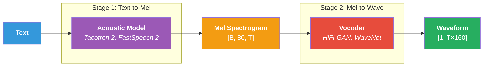
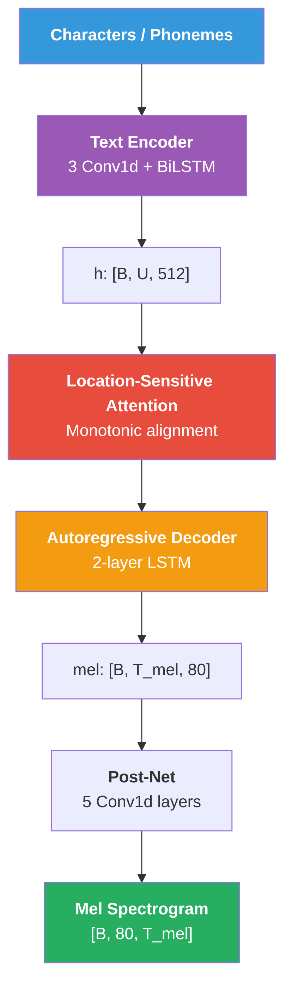
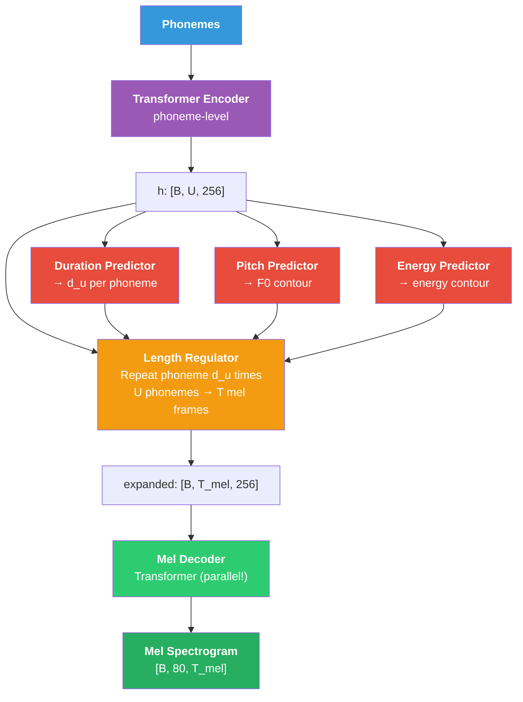

# Chương 8: TTS Foundations và Vocoders

## Vì sao chương này quan trọng

Text-to-Speech (TTS) là chiều ngược của ASR: input là text, output là waveform âm thanh giọng nói. Đối với người làm NLP/LLM, TTS là một ứng dụng generative quan trọng cùng họ với image generation và text generation, nhưng có ràng buộc riêng: đầu ra phải nghe tự nhiên, phù hợp văn hoá ngôn ngữ, và sinh được realtime cho voice agent.

Chương này phát triển các thành phần cốt lõi của TTS pipeline cổ điển và hiện đại:

- **Variance adaptor** cho duration, pitch, energy: dự đoán prosody trước khi sinh acoustic.
- **Mel decoder**: sinh mel spectrogram từ text representation (Tacotron 2, FastSpeech 2).
- **Vocoder**: chuyển mel spectrogram thành waveform (HiFi-GAN, BigVGAN, WaveNet legacy).
- **Evaluation**: MOS (Mean Opinion Score), MUSHRA, các metric chủ quan và khách quan.

Chương 9 sẽ tiếp tục với các mô hình end-to-end (VITS, F5-TTS, VALL-E) và Chương 10 với neural audio codec là nền tảng cho Speech LLM. Chương 8 đặt nền tảng cho cả hai bằng cách hiểu pipeline cổ điển hai giai đoạn (text → mel → waveform) trước khi compress nó vào một mô hình duy nhất.

> **Cấu trúc chương**
>
> - **Phần 1**: bài toán TTS và metric đánh giá (MOS, MUSHRA, các metric tự động).
> - **Phần 2**: Tacotron 2, attention-based encoder-decoder cho TTS.
> - **Phần 3**: FastSpeech 2, non-autoregressive với variance adaptor.
> - **Phần 4**: vocoder (HiFi-GAN, BigVGAN), mel-to-wave.
> - **Phần 5**: pipeline production và các trade-off giữa naturalness, latency, controllability.

## Phần 1 — Bài toán Text-to-Speech

Text-to-Speech (TTS) là bài toán ngược của ASR  -  chuyển text thành waveform:

<a id="eq-tts-objective"></a>

$$
\hat{\mathbf{x}} = \arg\max_{\mathbf{x}} P(\mathbf{x} \mid Y)
$$

trong đó $Y = (y_1, \ldots, y_U)$ là chuỗi text tokens và $\mathbf{x}$ là waveform.

### Two-Stage Pipeline

Hầu hết TTS systems chia thành 2 giai đoạn:

<figure id="fig-tts-pipeline">
  
  <figcaption><strong>Hình:</strong> Two-Stage TTS Pipeline</figcaption>
</figure>

**Tại sao 2 stages?**

- Mel spectrogram là intermediate representation **compact** (80 dims × 100 fps)
- Waveform là **high-dimensional** (16,000 samples/sec)
- Tách 2 stages cho phép **optimize từng phần** independently

> **💡 NLP Parallel**
>
> Two-stage TTS giống **retrieval-augmented generation (RAG)**: Stage 1 tạo "plan" (mel), Stage 2 "execute" (vocoder). End-to-end TTS (VITS) giống standard autoregressive LM  -  xem Chương 7.


## Tacotron 2

### Architecture

Tacotron 2 [^shen2018natural] là attention-based seq2seq model cho Text-to-Mel:

<figure id="fig-tacotron2-arch">
  
  <figcaption><strong>Hình:</strong> Kiến trúc Tacotron 2</figcaption>
</figure>

### Location-Sensitive Attention

Attention cho TTS phải **monotonic**  -  không được nhảy lùi. Location-sensitive attention thêm convolution trên previous attention weights:

<a id="eq-location-attention"></a>

$$
\begin{aligned}
f_i &= F * \alpha_{i-1} & \text{// Conv1d on previous alignment} \\
e_{i,j} &= \mathbf{v}^\top \tanh(\mathbf{W}_s \mathbf{s}_i + \mathbf{W}_h \mathbf{h}_j + \mathbf{W}_f f_{i,j} + \mathbf{b}) \\
\alpha_{i,j} &= \text{softmax}(e_{i,:})_j & \text{// Attention weights}
\end{aligned}
$$

trong đó $\alpha_{i-1}$ là attention weights từ decoder step trước.

### Decoder

Autoregressive prediction  -  mỗi step predict 1 mel frame (hoặc $r$ frames với reduction factor):

<a id="eq-tacotron-decoder"></a>

$$
\begin{aligned}
\mathbf{c}_i &= \sum_j \alpha_{i,j} \mathbf{h}_j & \text{// Context vector} \\
(\mathbf{s}_i, \mathbf{o}_i) &= \text{LSTM}([\text{PreNet}(\hat{\mathbf{m}}_{i-1}); \mathbf{c}_i], \mathbf{s}_{i-1}) \\
\hat{\mathbf{m}}_i &= \text{Linear}([\mathbf{o}_i; \mathbf{c}_i]) & \text{// [80] mel prediction}
\end{aligned}
$$

### Stop Token

Binary classifier dự đoán khi nào dừng generation:

<a id="eq-stop-token"></a>

$$
p_{\text{stop}}(i) = \sigma(\mathbf{w}_{\text{stop}}^\top [\mathbf{o}_i; \mathbf{c}_i] + b_{\text{stop}})
$$

### Hạn chế của Tacotron 2

| Vấn đề | Nguyên nhân |
|--------|-------------|
| **Robustness** | Attention alignment có thể fail (repeats, skips) |
| **Speed** | Autoregressive → sequential (không parallel) |
| **Controllability** | Không control được duration, pitch trực tiếp |
| **Quality** | Tốt nhưng cần vocoder riêng |

: Tacotron 2 limitations <a id="tbl-tacotron-limits"></a>

## FastSpeech 2

### Key Innovation: Non-Autoregressive

FastSpeech 2 [^ren2020fastspeech] giải quyết tất cả hạn chế của Tacotron 2 bằng **parallel generation** + **explicit duration prediction**:

<figure id="fig-fastspeech2-arch">
  
  <figcaption><strong>Hình:</strong> Kiến trúc FastSpeech 2: Non-Autoregressive TTS</figcaption>
</figure>

### Variance Adaptors

**Duration predictor:**

<a id="eq-duration-predictor"></a>

$$
\hat{d}_u = \text{ReLU}(\text{DurationPredictor}(\mathbf{h}_u)), \quad d_u \in \mathbb{Z}^+
$$

Trained với L2 loss trên log-duration (ground truth từ forced alignment):

<a id="eq-duration-loss"></a>

$$
\mathcal{L}_{\text{dur}} = \frac{1}{U} \sum_{u=1}^{U} \left(\log(\hat{d}_u + 1) - \log(d_u + 1)\right)^2
$$

**Pitch predictor** (F0):

<a id="eq-pitch-predictor"></a>

$$
\hat{f}_0(t) = \text{PitchPredictor}(\mathbf{h}_{u(t)})
$$

**Energy predictor:**

<a id="eq-energy-predictor"></a>

$$
\hat{e}(t) = \text{EnergyPredictor}(\mathbf{h}_{u(t)})
$$

### Length Regulator

Biến phoneme-level sequence thành mel-level sequence bằng cách repeat:

<a id="eq-length-regulator"></a>

$$
\text{LR}(\mathbf{H}, \mathbf{d}) = [\underbrace{\mathbf{h}_1, \ldots, \mathbf{h}_1}_{d_1 \text{ times}}, \underbrace{\mathbf{h}_2, \ldots, \mathbf{h}_2}_{d_2 \text{ times}}, \ldots]
$$

Output length: $T_{\text{mel}} = \sum_{u=1}^{U} d_u$

### Total Loss

<a id="eq-fastspeech-loss"></a>

$$
\mathcal{L} = \mathcal{L}_{\text{mel}} + \lambda_d \mathcal{L}_{\text{dur}} + \lambda_p \mathcal{L}_{\text{pitch}} + \lambda_e \mathcal{L}_{\text{energy}}
$$

### Speed Comparison

| Model | Inference Speed (vs real-time) | Parallelizable | Robustness |
|-------|-------------------------------|----------------|------------|
| Tacotron 2 | ~0.5× (slower than RT) | No | Attention failures |
| FastSpeech 2 | **50×** faster | **Yes** | **No attention failures** |

: FastSpeech 2 vs Tacotron 2 speed <a id="tbl-fastspeech-speed"></a>

> **⚠️ Latency Warning**
>
> FastSpeech 2 mel generation rất nhanh (~50× real-time) nhưng **vocoder vẫn là bottleneck**. Pipeline latency = mel generation + vocoder. Cần HiFi-GAN (realtime) thay vì WaveNet (100× slower than RT).


```python
#| eval: false
#| code-fold: true
#| code-summary: "FastSpeech 2 variance adaptors"
import torch
import torch.nn as nn
from torch import Tensor


class VariancePredictor(nn.Module):
    """Variance predictor for duration/pitch/energy.

    2 Conv1d + Linear → scalar per frame.
    """

    def __init__(
        self,
        d_model: int = 256,
        kernel_size: int = 3,
        dropout: float = 0.1,
    ) -> None:
        super().__init__()
        padding: int = (kernel_size - 1) // 2
        self.conv1 = nn.Conv1d(
            d_model, d_model, kernel_size=kernel_size, padding=padding,
        )
        self.conv2 = nn.Conv1d(
            d_model, d_model, kernel_size=kernel_size, padding=padding,
        )
        self.ln1 = nn.LayerNorm(d_model)
        self.ln2 = nn.LayerNorm(d_model)
        self.proj = nn.Linear(d_model, 1)
        self.relu = nn.ReLU()
        self.dropout = nn.Dropout(dropout)

    def forward(self, x: Tensor) -> Tensor:
        """Predict variance (duration/pitch/energy).

        Args:
            x: [batch, seq_len, d_model] - float32

        Returns:
            pred: [batch, seq_len] - float32
        """
        h: Tensor = x.transpose(1, 2)  # [B, D, L] - float32
        h = self.dropout(self.relu(self.ln1(self.conv1(h).transpose(1, 2))))
        # [B, L, D] - float32
        h = h.transpose(1, 2)  # [B, D, L]
        h = self.dropout(self.relu(self.ln2(self.conv2(h).transpose(1, 2))))
        # [B, L, D] - float32
        pred: Tensor = self.proj(h).squeeze(-1)  # [B, L] - float32
        return pred


class LengthRegulator(nn.Module):
    """Expand phoneme-level features to mel-level using durations."""

    def forward(
        self,
        x: Tensor,         # [batch, U, d_model] - float32
        durations: Tensor,  # [batch, U] - int64 (predicted durations)
    ) -> Tensor:
        """Regulate length by repeating each phoneme d_u times.

        Args:
            x: Phoneme features [B, U, D] - float32
            durations: Duration per phoneme [B, U] - int64

        Returns:
            expanded: Mel-level features [B, T_mel, D] - float32
        """
        expanded_list: list[Tensor] = []
        for b in range(x.size(0)):
            repeated: list[Tensor] = []
            for u in range(x.size(1)):
                d: int = max(1, durations[b, u].item())
                repeated.append(
                    x[b, u].unsqueeze(0).expand(d, -1)
                )  # [d, D] - float32
            expanded_list.append(torch.cat(repeated, dim=0))  # [T_mel_b, D]

        # Pad to max length in batch
        max_len: int = max(t.size(0) for t in expanded_list)
        batch_size: int = x.size(0)
        d_model: int = x.size(2)

        expanded: Tensor = torch.zeros(
            batch_size, max_len, d_model,
            device=x.device, dtype=x.dtype,
        )  # [B, T_mel, D] - float32

        for b, t in enumerate(expanded_list):
            expanded[b, :t.size(0)] = t

        return expanded
```

## Vocoders

### Bài toán Vocoder

Vocoder chuyển mel spectrogram thành waveform  -  bài toán **super-resolution** vì mel (80 dims, 100 fps) chứa ít thông tin hơn waveform (1 dim, 16000 fps):

<a id="eq-vocoder"></a>

$$
\hat{\mathbf{x}} = \text{Vocoder}(\mathbf{S}_{\text{mel}}), \quad \mathbf{S}_{\text{mel}} \in \mathbb{R}^{80 \times T}, \quad \hat{\mathbf{x}} \in \mathbb{R}^{160 \cdot T}
$$

### WaveNet (2016)

WaveNet [^oord2016wavenet]  -  vocoder đầu tiên cho chất lượng human-level:

<a id="eq-wavenet"></a>

$$
P(\mathbf{x}) = \prod_{n=1}^{N} P(x_n \mid x_1, \ldots, x_{n-1})
$$

**Autoregressive**: Generate 1 sample at a time → 16,000 steps/sec → **cực kỳ chậm**.

> **⚠️ Latency Warning**
>
> WaveNet inference: ~0.01× real-time trên GPU (100× chậm hơn real-time). 1 giây audio cần ~100 giây compute. **Không khả thi cho production.**


### HiFi-GAN (2020)

HiFi-GAN [^kong2020hifigan]  -  vocoder hiện đại, **nhanh** và **chất lượng cao**:

**Generator**: Upsample mel → waveform qua transposed convolutions:

<a id="eq-hifigan-upsample"></a>

$$
\text{Mel} \xrightarrow{\text{Upsample}_{8\times}} \xrightarrow{\text{Upsample}_{8\times}} \xrightarrow{\text{Upsample}_{2\times}} \xrightarrow{\text{Upsample}_{2\times}} \text{Waveform}
$$

Total upsampling factor: $8 \times 8 \times 2 \times 2 = 256$ (matches hop_length=256 ở 22.05kHz, hoặc 160 ở 16kHz).

**Multi-Period Discriminator (MPD)** + **Multi-Scale Discriminator (MSD)**:

<a id="eq-hifigan-loss"></a>

$$
\mathcal{L}_G = \mathcal{L}_{\text{adv}}(G) + \lambda_{\text{fm}} \mathcal{L}_{\text{fm}}(G) + \lambda_{\text{mel}} \mathcal{L}_{\text{mel}}(G)
$$

trong đó:

- $\mathcal{L}_{\text{adv}}$: Adversarial loss (fool discriminators)
- $\mathcal{L}_{\text{fm}}$: Feature matching loss (intermediate discriminator features)
- $\mathcal{L}_{\text{mel}}$: Mel reconstruction loss (stability)

```python
#| eval: false
#| code-fold: true
#| code-summary: "HiFi-GAN Generator (simplified)"
import torch
import torch.nn as nn
from torch import Tensor


class ResBlock(nn.Module):
    """Residual block with dilated convolutions."""

    def __init__(
        self,
        channels: int,
        kernel_size: int = 3,
        dilations: tuple[int, ...] = (1, 3, 5),
    ) -> None:
        super().__init__()
        self.convs = nn.ModuleList()
        for d in dilations:
            self.convs.append(
                nn.Sequential(
                    nn.LeakyReLU(0.1),
                    nn.Conv1d(
                        channels, channels,
                        kernel_size=kernel_size,
                        dilation=d,
                        padding=(kernel_size * d - d) // 2,
                    ),
                )
            )

    def forward(self, x: Tensor) -> Tensor:
        """Forward with residual connections.

        Args:
            x: [batch, channels, T] - float32

        Returns:
            out: [batch, channels, T] - float32
        """
        for conv in self.convs:
            x = x + conv(x)  # [B, C, T] - float32
        return x


class HiFiGANGenerator(nn.Module):
    """HiFi-GAN vocoder generator.

    Mel spectrogram → Waveform via transposed convolutions.
    """

    def __init__(
        self,
        n_mels: int = 80,
        upsample_initial: int = 512,
        upsample_rates: tuple[int, ...] = (8, 8, 2, 2, 2),
        upsample_kernels: tuple[int, ...] = (16, 16, 4, 4, 4),
        resblock_kernels: tuple[int, ...] = (3, 7, 11),
        resblock_dilations: tuple[tuple[int, ...], ...] = (
            (1, 3, 5), (1, 3, 5), (1, 3, 5),
        ),
    ) -> None:
        super().__init__()
        # Input projection
        self.conv_pre = nn.Conv1d(
            n_mels, upsample_initial, kernel_size=7, padding=3,
        )  # [B, 80, T] -> [B, 512, T]

        # Upsampling blocks
        self.ups = nn.ModuleList()
        self.resblocks = nn.ModuleList()

        ch: int = upsample_initial
        for i, (rate, kernel) in enumerate(
            zip(upsample_rates, upsample_kernels)
        ):
            ch_out: int = ch // 2
            self.ups.append(
                nn.ConvTranspose1d(
                    ch, ch_out,
                    kernel_size=kernel,
                    stride=rate,
                    padding=(kernel - rate) // 2,
                )
            )
            # Multi-receptive-field fusion (MRF)
            for k in resblock_kernels:
                self.resblocks.append(
                    ResBlock(ch_out, kernel_size=k, dilations=resblock_dilations[0])
                )
            ch = ch_out

        self.conv_post = nn.Conv1d(
            ch, 1, kernel_size=7, padding=3,
        )  # [B, ch, T_wav] -> [B, 1, T_wav]
        self.tanh = nn.Tanh()

        self.n_resblocks_per_up: int = len(resblock_kernels)

    def forward(self, mel: Tensor) -> Tensor:
        """Generate waveform from mel spectrogram.

        Args:
            mel: [batch, n_mels, T_frames] - float32

        Returns:
            waveform: [batch, 1, T_samples] - float32
        """
        x: Tensor = self.conv_pre(mel)  # [B, 512, T] - float32

        for i, up in enumerate(self.ups):
            x = nn.functional.leaky_relu(x, 0.1)
            x = up(x)  # [B, ch//2, T*rate] - float32

            # Sum multi-receptive-field outputs
            xs: Tensor = torch.zeros_like(x)
            for j in range(self.n_resblocks_per_up):
                idx: int = i * self.n_resblocks_per_up + j
                xs = xs + self.resblocks[idx](x)
            x = xs / self.n_resblocks_per_up

        x = nn.functional.leaky_relu(x, 0.1)
        x = self.conv_post(x)  # [B, 1, T_samples] - float32
        waveform: Tensor = self.tanh(x)  # [B, 1, T_samples] - float32

        return waveform
```

### Vocoder Comparison

| Vocoder | Year | Type | Speed (RTF) | Quality (MOS) |
|---------|------|------|-------------|----------------|
| WaveNet | 2016 | Autoregressive | 0.01× | 4.21 |
| WaveRNN | 2018 | Autoregressive | 1× | 4.15 |
| WaveGlow | 2019 | Flow-based | 20× | 4.09 |
| **HiFi-GAN** | 2020 | GAN | **80×** | **4.23** |
| BigVGAN | 2022 | GAN | 60× | **4.30** |

: Vocoder comparison <a id="tbl-vocoder-comparison"></a>

## Tóm tắt

| Component | Model | Key Idea | Speed |
|-----------|-------|----------|-------|
| Acoustic Model | Tacotron 2 | Attention-based autoregressive | Slow |
| Acoustic Model | FastSpeech 2 | Non-autoregressive + variance adaptors | **Fast** |
| Vocoder | WaveNet | Autoregressive sample-by-sample | Very slow |
| Vocoder | HiFi-GAN | GAN + multi-scale discriminators | **Very fast** |
| Best Pipeline | FastSpeech 2 + HiFi-GAN | Parallel mel + fast vocoder | Production-ready |

: TTS pipeline summary <a id="tbl-tts-summary"></a>

Chương tiếp theo sẽ khám phá **End-to-End TTS**  -  VITS, VALL-E, và F5-TTS: các model bỏ qua two-stage pipeline.


---

<!-- References (auto-generated from .bib) -->
[^shen2018natural]: Shen, Jonathan and Pang, Ruoming and others, "Natural TTS Synthesis by Conditioning WaveNet on Mel Spectrogram Predictions", IEEE International Conference on Acoustics, Speech and Signal Processing
[^ren2020fastspeech]: Ren, Yi and Hu, Chenxu and Tan, Xu and Qin, Tao and others, "FastSpeech 2: Fast and High-Quality End-to-End Text to Speech", International Conference on Learning Representations
[^oord2016wavenet]: van den Oord, A{\"a}ron and Dieleman, Sander and Zen, Heiga and others, "WaveNet: A Generative Model for Raw Audio", arXiv preprint arXiv:1609.03499
[^kong2020hifigan]: Kong, Jungil and Kim, Jaehyeon and Bae, Jaekyoung, "HiFi-GAN: Generative Adversarial Networks for Efficient and High Fidelity Speech Synthesis", Advances in Neural Information Processing Systems
