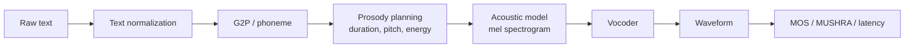
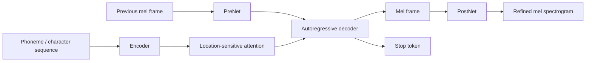
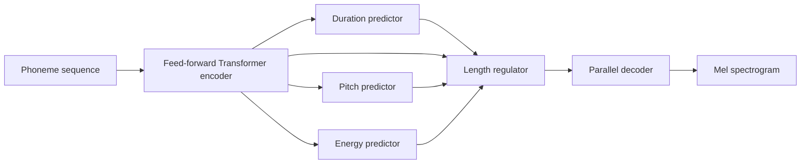
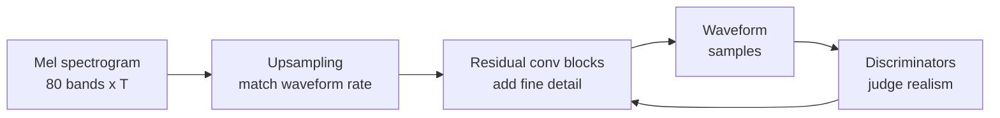

# Chương 8: TTS Foundations và Vocoders

## Vì sao chương này quan trọng

Text-to-Speech (TTS) là chiều ngược của ASR: input là text, output là waveform âm thanh giọng nói. Đối với người làm NLP/LLM, TTS là một ứng dụng generative quan trọng cùng họ với image generation và text generation, nhưng có ràng buộc riêng: đầu ra phải nghe tự nhiên, phù hợp văn hoá ngôn ngữ, và sinh được realtime cho voice agent.

Chương này phát triển các thành phần cốt lõi của TTS pipeline cổ điển và hiện đại:

- **Variance adaptor** cho duration, pitch, energy: dự đoán prosody trước khi sinh acoustic.
- **Mel decoder**: sinh mel spectrogram từ text representation (Tacotron 2, FastSpeech 2).
- **Vocoder**: chuyển mel spectrogram thành waveform (HiFi-GAN, BigVGAN, WaveNet legacy).
- **Evaluation**: MOS (Mean Opinion Score), MUSHRA, các metric chủ quan và khách quan.

Chương 9 sẽ tiếp tục với các mô hình end-to-end (VITS, F5-TTS, VALL-E) và Chương 10 với neural audio codec là nền tảng cho Speech LLM. Chương 8 đặt nền tảng cho cả hai bằng cách hiểu pipeline cổ điển hai giai đoạn (text → mel → waveform) trước khi compress nó vào một mô hình duy nhất.

> **Cấu trúc chương**
>
> - **Phần 1**: bài toán TTS và metric đánh giá (MOS, MUSHRA, các metric tự động).
> - **Phần 2**: Tacotron 2, attention-based encoder-decoder cho TTS.
> - **Phần 3**: FastSpeech 2, non-autoregressive với variance adaptor.
> - **Phần 4**: vocoder (HiFi-GAN, BigVGAN), mel-to-wave.
> - **Phần 5**: pipeline production và các trade-off giữa naturalness, latency, controllability.

### Bản đồ tư duy của Chương 8



Nếu ASR là bài toán “nghe và viết lại”, TTS là bài toán “đọc và diễn xuất”. Đọc đúng chữ chỉ là điều kiện cần. Một hệ TTS tốt phải biết ngắt nghỉ, nhấn trọng âm, giữ tone, giữ speaker identity và không tạo artifact nghe khó chịu.

### TTS khác text generation ở đâu?

| Text generation | TTS |
|---|---|
| Output là chuỗi token rời rạc | Output cuối là waveform liên tục |
| Lỗi nhỏ có thể sửa bằng edit text | Artifact âm thanh nghe thấy ngay |
| Evaluation có BLEU/ROUGE/LLM judge | Evaluation cần human perception |
| Latency tính theo token | Latency tính theo first audio và realtime factor |
| Style là văn phong | Style là prosody, emotion, speaker, room tone |

## Phần 1 — Bài toán Text-to-Speech

Text-to-Speech (TTS) là bài toán ngược của ASR  -  chuyển text thành waveform:

<a id="eq-tts-objective"></a>

$$
\hat{\mathbf{x}} = \arg\max_{\mathbf{x}} P(\mathbf{x} \mid Y)
$$

trong đó $Y = (y_1, \ldots, y_U)$ là chuỗi text tokens và $\mathbf{x}$ là waveform.

Trong TTS production, $Y$ hiếm khi là raw text trực tiếp. Nó thường đi qua nhiều bước chuẩn hóa:

| Raw input | Text normalization mong muốn |
|---|---|
| “1.5 giây” | “một phẩy năm giây” |
| “TP.HCM” | “Thành phố Hồ Chí Minh” hoặc chính sách đọc viết tắt |
| “Qwen3-Omni” | quy tắc đọc tên model nhất quán |
| “10/05/2026” | ngày mười tháng năm năm hai nghìn không trăm hai mươi sáu, tùy locale |
| “$12.50” | mười hai đô la năm mươi xu, nếu đọc tiếng Việt theo ngữ cảnh |

Vì vậy, TTS không bắt đầu ở neural acoustic model. Nó bắt đầu ở **text normalization policy**.

### Two-Stage Pipeline

Hầu hết TTS systems chia thành 2 giai đoạn:


**Hình:** Pipeline TTS hai giai đoạn. Acoustic model học cấu trúc ngôn ngữ và prosody ở mức mel spectrogram; vocoder chịu trách nhiệm chuyển biểu diễn phổ thành waveform nghe được.

**Tại sao 2 stages?**

- Mel spectrogram là intermediate representation **compact** (80 dims × 100 fps).
- Waveform là **high-dimensional** (16,000 samples/sec hoặc cao hơn).
- Tách 2 stages cho phép **tối ưu từng phần** độc lập.
- Debug dễ hơn: nếu mel sai prosody, lỗi nằm ở acoustic model; nếu mel ổn nhưng audio rè, lỗi nằm ở vocoder.

| Stage | Câu hỏi cần trả lời | Lỗi thường gặp |
|---|---|---|
| Text normalization | đọc chữ/số/ký hiệu như thế nào? | đọc sai số, viết tắt, tên riêng |
| G2P/phoneme | chuỗi chữ phát âm thành âm nào? | sai từ ngoại lai, code-switching |
| Acoustic model | prosody và mel ra sao? | đều đều, sai duration, sai pitch |
| Vocoder | waveform nghe tự nhiên không? | rè, metallic, noise, mất âm cuối |

> **💡 NLP Parallel**
>
> Two-stage TTS có thể xem như một pipeline “plan rồi render”: acoustic model tạo kế hoạch âm học ở dạng mel, vocoder render kế hoạch đó thành waveform. End-to-end TTS ở Chương 9 cố gắng học hai bước này trong một objective thống nhất hơn.


## Frontend: Text normalization và G2P

Trước khi vào Tacotron hoặc FastSpeech, text cần được biến thành đơn vị phát âm ổn định. Với tiếng Việt, chữ viết tương đối gần âm đọc, nhưng frontend vẫn rất quan trọng.

### Text normalization

Text normalization xử lý các dạng không nên đọc nguyên ký tự:

| Loại | Ví dụ | Cách đọc phụ thuộc ngữ cảnh |
|---|---|---|
| Số | “2026” | “hai nghìn không trăm hai mươi sáu” hoặc “hai không hai sáu” |
| Đơn vị | “5kg” | “năm ki lô gam” |
| Tiền tệ | “100k” | “một trăm nghìn” |
| URL/email | “a@b.com” | đọc từng phần hoặc bỏ qua tùy sản phẩm |
| Viết tắt | “AI”, “GPU”, “TP.HCM” | đọc tiếng Anh, tiếng Việt, hoặc expand |

### G2P và phoneme policy

G2P trả lời câu hỏi: text đã chuẩn hóa nên được phát âm thành chuỗi âm nào. Trong tiếng Việt, phần khó thường nằm ở:

- tên riêng Việt Nam có nhiều biến thể vùng miền;
- từ tiếng Anh trong câu tiếng Việt;
- acronym công nghệ;
- dấu thanh và âm cuối;
- lựa chọn giọng Bắc/Trung/Nam.

> **Bài học production**
>
> Không có một cách đọc đúng tuyệt đối cho mọi sản phẩm. Một trợ lý ngân hàng có thể cần đọc số tiền rất chuẩn; một app học tiếng Anh cần đọc từ ngoại lai khác; một audiobook cần ngắt nghỉ tự nhiên hơn đọc từng ký tự.

## Tacotron 2

### Architecture

Tacotron 2 [^shen2018natural] là attention-based seq2seq model cho Text-to-Mel:



**Hình:** Tacotron 2 là seq2seq autoregressive. Attention alignment là thành phần then chốt, vì nếu alignment lệch, model có thể lặp từ, bỏ từ hoặc dừng sai thời điểm.

### Alignment trong TTS: vì sao khó?

Trong TTS, alignment đi từ text/phoneme sang mel frames. Khác ASR, output audio thường dài hơn nhiều so với input text. Một phoneme có thể kéo dài 3 frames hoặc 30 frames tùy tốc độ, ngữ cảnh, cảm xúc và dấu câu.

| Alignment lỗi | Biểu hiện khi nghe | Nguyên nhân |
|---|---|---|
| Skip | bỏ mất từ/âm tiết | attention nhảy quá nhanh |
| Repeat | lặp từ hoặc kéo dài âm | attention kẹt một token |
| Early stop | câu bị cắt ngang | stop token dự đoán sớm |
| Late stop | thêm noise/âm vô nghĩa cuối câu | stop token không chốt |
| Non-monotonic | đọc đảo trật tự | attention không bị ràng buộc đủ |

### Location-Sensitive Attention

Attention cho TTS phải **monotonic**  -  không được nhảy lùi. Location-sensitive attention thêm convolution trên previous attention weights:

<a id="eq-location-attention"></a>

$$
\begin{aligned}
f_i &= F * \alpha_{i-1} & \text{// Conv1d on previous alignment} \\
e_{i,j} &= \mathbf{v}^\top \tanh(\mathbf{W}_s \mathbf{s}_i + \mathbf{W}_h \mathbf{h}_j + \mathbf{W}_f f_{i,j} + \mathbf{b}) \\
\alpha_{i,j} &= \text{softmax}(e_{i,:})_j & \text{// Attention weights}
\end{aligned}
$$

trong đó $\alpha_{i-1}$ là attention weights từ decoder step trước.

### Decoder

Autoregressive prediction  -  mỗi step predict 1 mel frame (hoặc $r$ frames với reduction factor):

<a id="eq-tacotron-decoder"></a>

$$
\begin{aligned}
\mathbf{c}_i &= \sum_j \alpha_{i,j} \mathbf{h}_j & \text{// Context vector} \\
(\mathbf{s}_i, \mathbf{o}_i) &= \text{LSTM}([\text{PreNet}(\hat{\mathbf{m}}_{i-1}); \mathbf{c}_i], \mathbf{s}_{i-1}) \\
\hat{\mathbf{m}}_i &= \text{Linear}([\mathbf{o}_i; \mathbf{c}_i]) & \text{// [80] mel prediction}
\end{aligned}
$$

### Stop Token

Binary classifier dự đoán khi nào dừng generation:

<a id="eq-stop-token"></a>

$$
p_{\text{stop}}(i) = \sigma(\mathbf{w}_{\text{stop}}^\top [\mathbf{o}_i; \mathbf{c}_i] + b_{\text{stop}})
$$

### Hạn chế của Tacotron 2

| Vấn đề | Nguyên nhân |
|--------|-------------|
| **Robustness** | Attention alignment có thể fail (repeats, skips) |
| **Speed** | Autoregressive → sequential (không parallel) |
| **Controllability** | Không control được duration, pitch trực tiếp |
| **Quality** | Tốt nhưng cần vocoder riêng |

: Tacotron 2 limitations <a id="tbl-tacotron-limits"></a>

## FastSpeech 2

### Key Innovation: Non-Autoregressive

FastSpeech 2 [^ren2020fastspeech] giải quyết tất cả hạn chế của Tacotron 2 bằng **parallel generation** + **explicit duration prediction**:



**Hình:** FastSpeech 2 thay attention autoregressive bằng duration prediction và length regulator. Thiết kế này giúp inference song song hơn và kiểm soát trực tiếp duration, pitch, energy.

### Vì sao duration, pitch, energy quan trọng?

FastSpeech 2 đưa prosody ra thành các biến explicit. Đây là bước rất quan trọng về mặt sư phạm: giọng nói tự nhiên không chỉ là “đúng phoneme”, mà là đúng thời lượng, cao độ và độ mạnh.

| Biến | Người nghe cảm nhận là gì? | Lỗi nếu dự đoán sai |
|---|---|---|
| Duration | tốc độ, ngắt nghỉ, kéo dài âm | robot, quá nhanh, nuốt chữ |
| Pitch / F0 | cao độ, tone, câu hỏi/cảm xúc | sai thanh điệu, thiếu tự nhiên |
| Energy | độ nhấn, loudness tương đối | đều đều, thiếu trọng âm |

Với tiếng Việt, pitch/F0 đặc biệt quan trọng vì thanh điệu phân biệt nghĩa. Một TTS tiếng Việt có thể phát âm đúng phụ âm/nguyên âm nhưng vẫn sai nghĩa nếu contour thanh điệu không đúng.

### Variance Adaptors

**Duration predictor:**

<a id="eq-duration-predictor"></a>

$$
\hat{d}_u = \text{ReLU}(\text{DurationPredictor}(\mathbf{h}_u)), \quad d_u \in \mathbb{Z}^+
$$

Trained với L2 loss trên log-duration (ground truth từ forced alignment):

<a id="eq-duration-loss"></a>

$$
\mathcal{L}_{\text{dur}} = \frac{1}{U} \sum_{u=1}^{U} \left(\log(\hat{d}_u + 1) - \log(d_u + 1)\right)^2
$$

**Pitch predictor** (F0):

<a id="eq-pitch-predictor"></a>

$$
\hat{f}_0(t) = \text{PitchPredictor}(\mathbf{h}_{u(t)})
$$

**Energy predictor:**

<a id="eq-energy-predictor"></a>

$$
\hat{e}(t) = \text{EnergyPredictor}(\mathbf{h}_{u(t)})
$$

### Ví dụ length regulator

Giả sử phoneme sequence có 3 đơn vị `[a, n, _]` với durations `[3, 2, 1]`. Length regulator biến sequence phoneme-level thành mel-level:

| Phoneme | Duration | Mel-level expansion |
|---|---:|---|
| `a` | 3 | `a a a` |
| `n` | 2 | `n n` |
| silence | 1 | `_` |

Kết quả là chuỗi 6 frame-level representations. Decoder sau đó sinh mel spectrogram song song từ chuỗi đã được kéo dài này. Đây là lý do FastSpeech 2 nhanh hơn Tacotron: nó không cần autoregressive attention để quyết định token nào được đọc ở từng frame.

### Length Regulator

Biến phoneme-level sequence thành mel-level sequence bằng cách repeat:

<a id="eq-length-regulator"></a>

$$
\text{LR}(\mathbf{H}, \mathbf{d}) = [\underbrace{\mathbf{h}_1, \ldots, \mathbf{h}_1}_{d_1 \text{ times}}, \underbrace{\mathbf{h}_2, \ldots, \mathbf{h}_2}_{d_2 \text{ times}}, \ldots]
$$

Output length: $T_{\text{mel}} = \sum_{u=1}^{U} d_u$

### Total Loss

<a id="eq-fastspeech-loss"></a>

$$
\mathcal{L} = \mathcal{L}_{\text{mel}} + \lambda_d \mathcal{L}_{\text{dur}} + \lambda_p \mathcal{L}_{\text{pitch}} + \lambda_e \mathcal{L}_{\text{energy}}
$$

### Speed Comparison

| Model | Inference speed | Parallelizable | Robustness |
|-------|-----------------|----------------|------------|
| Tacotron 2 | chậm hơn do autoregressive decoder | Không | có thể gặp attention failures |
| FastSpeech 2 | thường nhanh hơn đáng kể | Có | tránh attention autoregressive, nhưng phụ thuộc alignment/duration |

: FastSpeech 2 vs Tacotron 2 speed <a id="tbl-fastspeech-speed"></a>

> **⚠️ Latency Warning**
>
> FastSpeech 2 mel generation thường rất nhanh, nhưng **vocoder vẫn có thể là bottleneck**. Pipeline latency = mel generation + vocoder. Với realtime TTS, cần vocoder non-autoregressive như HiFi-GAN/BigVGAN-style thay vì vocoder autoregressive kiểu WaveNet.


```python
#| eval: false
#| code-fold: true
#| code-summary: "FastSpeech 2 variance adaptors"
import torch
import torch.nn as nn
from torch import Tensor


class VariancePredictor(nn.Module):
    """Variance predictor for duration/pitch/energy.

    2 Conv1d + Linear → scalar per frame.
    """

    def __init__(
        self,
        d_model: int = 256,
        kernel_size: int = 3,
        dropout: float = 0.1,
    ) -> None:
        super().__init__()
        padding: int = (kernel_size - 1) // 2
        self.conv1 = nn.Conv1d(
            d_model, d_model, kernel_size=kernel_size, padding=padding,
        )
        self.conv2 = nn.Conv1d(
            d_model, d_model, kernel_size=kernel_size, padding=padding,
        )
        self.ln1 = nn.LayerNorm(d_model)
        self.ln2 = nn.LayerNorm(d_model)
        self.proj = nn.Linear(d_model, 1)
        self.relu = nn.ReLU()
        self.dropout = nn.Dropout(dropout)

    def forward(self, x: Tensor) -> Tensor:
        """Predict variance (duration/pitch/energy).

        Args:
            x: [batch, seq_len, d_model] - float32

        Returns:
            pred: [batch, seq_len] - float32
        """
        h: Tensor = x.transpose(1, 2)  # [B, D, L] - float32
        h = self.dropout(self.relu(self.ln1(self.conv1(h).transpose(1, 2))))
        # [B, L, D] - float32
        h = h.transpose(1, 2)  # [B, D, L]
        h = self.dropout(self.relu(self.ln2(self.conv2(h).transpose(1, 2))))
        # [B, L, D] - float32
        pred: Tensor = self.proj(h).squeeze(-1)  # [B, L] - float32
        return pred


class LengthRegulator(nn.Module):
    """Expand phoneme-level features to mel-level using durations."""

    def forward(
        self,
        x: Tensor,         # [batch, U, d_model] - float32
        durations: Tensor,  # [batch, U] - int64 (predicted durations)
    ) -> Tensor:
        """Regulate length by repeating each phoneme d_u times.

        Args:
            x: Phoneme features [B, U, D] - float32
            durations: Duration per phoneme [B, U] - int64

        Returns:
            expanded: Mel-level features [B, T_mel, D] - float32
        """
        expanded_list: list[Tensor] = []
        for b in range(x.size(0)):
            repeated: list[Tensor] = []
            for u in range(x.size(1)):
                d: int = max(1, durations[b, u].item())
                repeated.append(
                    x[b, u].unsqueeze(0).expand(d, -1)
                )  # [d, D] - float32
            expanded_list.append(torch.cat(repeated, dim=0))  # [T_mel_b, D]

        # Pad to max length in batch
        max_len: int = max(t.size(0) for t in expanded_list)
        batch_size: int = x.size(0)
        d_model: int = x.size(2)

        expanded: Tensor = torch.zeros(
            batch_size, max_len, d_model,
            device=x.device, dtype=x.dtype,
        )  # [B, T_mel, D] - float32

        for b, t in enumerate(expanded_list):
            expanded[b, :t.size(0)] = t

        return expanded
```

## Vocoders

### Trực giác vocoder

Mel spectrogram giống một bản nhạc tổng phổ rút gọn: nó nói năng lượng ở từng dải tần thay đổi ra sao theo thời gian, nhưng không giữ đầy đủ phase và chi tiết waveform. Vocoder phải “điền lại” chi tiết bị mất để tạo sóng âm nghe tự nhiên.



Một acoustic model tốt nhưng vocoder kém sẽ tạo giọng rè/kim loại. Ngược lại, vocoder tốt không thể cứu hoàn toàn mel spectrogram sai prosody hoặc sai phoneme.

### Bài toán Vocoder

Vocoder chuyển mel spectrogram thành waveform  -  bài toán **super-resolution** vì mel (80 dims, 100 fps) chứa ít thông tin hơn waveform (1 dim, 16000 fps):

<a id="eq-vocoder"></a>

$$
\hat{\mathbf{x}} = \text{Vocoder}(\mathbf{S}_{\text{mel}}), \quad \mathbf{S}_{\text{mel}} \in \mathbb{R}^{80 \times T}, \quad \hat{\mathbf{x}} \in \mathbb{R}^{160 \cdot T}
$$

### WaveNet (2016)

WaveNet [^oord2016wavenet] là vocoder autoregressive có ảnh hưởng rất lớn trong lịch sử neural speech synthesis:

<a id="eq-wavenet"></a>

$$
P(\mathbf{x}) = \prod_{n=1}^{N} P(x_n \mid x_1, \ldots, x_{n-1})
$$

**Autoregressive**: Generate 1 sample at a time → 16,000 steps/sec → **cực kỳ chậm**.

> **⚠️ Latency Warning**
>
> WaveNet autoregressive rất chậm vì sinh từng sample tuần tự. Các triển khai gốc không phù hợp realtime production nếu không có distillation hoặc tối ưu đặc biệt.


### HiFi-GAN (2020)

HiFi-GAN [^kong2020hifigan] là vocoder GAN phổ biến, nhanh hơn nhiều so với vocoder autoregressive và cho chất lượng tốt trong nhiều pipeline TTS:

**Generator**: Upsample mel → waveform qua transposed convolutions:

<a id="eq-hifigan-upsample"></a>

$$
\text{Mel} \xrightarrow{\text{Upsample}_{8\times}} \xrightarrow{\text{Upsample}_{8\times}} \xrightarrow{\text{Upsample}_{2\times}} \xrightarrow{\text{Upsample}_{2\times}} \text{Waveform}
$$

Total upsampling factor: $8 \times 8 \times 2 \times 2 = 256$ (matches hop_length=256 ở 22.05kHz, hoặc 160 ở 16kHz).

**Multi-Period Discriminator (MPD)** + **Multi-Scale Discriminator (MSD)**:

<a id="eq-hifigan-loss"></a>

$$
\mathcal{L}_G = \mathcal{L}_{\text{adv}}(G) + \lambda_{\text{fm}} \mathcal{L}_{\text{fm}}(G) + \lambda_{\text{mel}} \mathcal{L}_{\text{mel}}(G)
$$

trong đó:

- $\mathcal{L}_{\text{adv}}$: Adversarial loss (fool discriminators)
- $\mathcal{L}_{\text{fm}}$: Feature matching loss (intermediate discriminator features)
- $\mathcal{L}_{\text{mel}}$: Mel reconstruction loss (stability)

```python
#| eval: false
#| code-fold: true
#| code-summary: "HiFi-GAN Generator (simplified)"
import torch
import torch.nn as nn
from torch import Tensor


class ResBlock(nn.Module):
    """Residual block with dilated convolutions."""

    def __init__(
        self,
        channels: int,
        kernel_size: int = 3,
        dilations: tuple[int, ...] = (1, 3, 5),
    ) -> None:
        super().__init__()
        self.convs = nn.ModuleList()
        for d in dilations:
            self.convs.append(
                nn.Sequential(
                    nn.LeakyReLU(0.1),
                    nn.Conv1d(
                        channels, channels,
                        kernel_size=kernel_size,
                        dilation=d,
                        padding=(kernel_size * d - d) // 2,
                    ),
                )
            )

    def forward(self, x: Tensor) -> Tensor:
        """Forward with residual connections.

        Args:
            x: [batch, channels, T] - float32

        Returns:
            out: [batch, channels, T] - float32
        """
        for conv in self.convs:
            x = x + conv(x)  # [B, C, T] - float32
        return x


class HiFiGANGenerator(nn.Module):
    """HiFi-GAN vocoder generator.

    Mel spectrogram → Waveform via transposed convolutions.
    """

    def __init__(
        self,
        n_mels: int = 80,
        upsample_initial: int = 512,
        upsample_rates: tuple[int, ...] = (8, 8, 2, 2, 2),
        upsample_kernels: tuple[int, ...] = (16, 16, 4, 4, 4),
        resblock_kernels: tuple[int, ...] = (3, 7, 11),
        resblock_dilations: tuple[tuple[int, ...], ...] = (
            (1, 3, 5), (1, 3, 5), (1, 3, 5),
        ),
    ) -> None:
        super().__init__()
        # Input projection
        self.conv_pre = nn.Conv1d(
            n_mels, upsample_initial, kernel_size=7, padding=3,
        )  # [B, 80, T] -> [B, 512, T]

        # Upsampling blocks
        self.ups = nn.ModuleList()
        self.resblocks = nn.ModuleList()

        ch: int = upsample_initial
        for i, (rate, kernel) in enumerate(
            zip(upsample_rates, upsample_kernels)
        ):
            ch_out: int = ch // 2
            self.ups.append(
                nn.ConvTranspose1d(
                    ch, ch_out,
                    kernel_size=kernel,
                    stride=rate,
                    padding=(kernel - rate) // 2,
                )
            )
            # Multi-receptive-field fusion (MRF)
            for k in resblock_kernels:
                self.resblocks.append(
                    ResBlock(ch_out, kernel_size=k, dilations=resblock_dilations[0])
                )
            ch = ch_out

        self.conv_post = nn.Conv1d(
            ch, 1, kernel_size=7, padding=3,
        )  # [B, ch, T_wav] -> [B, 1, T_wav]
        self.tanh = nn.Tanh()

        self.n_resblocks_per_up: int = len(resblock_kernels)

    def forward(self, mel: Tensor) -> Tensor:
        """Generate waveform from mel spectrogram.

        Args:
            mel: [batch, n_mels, T_frames] - float32

        Returns:
            waveform: [batch, 1, T_samples] - float32
        """
        x: Tensor = self.conv_pre(mel)  # [B, 512, T] - float32

        for i, up in enumerate(self.ups):
            x = nn.functional.leaky_relu(x, 0.1)
            x = up(x)  # [B, ch//2, T*rate] - float32

            # Sum multi-receptive-field outputs
            xs: Tensor = torch.zeros_like(x)
            for j in range(self.n_resblocks_per_up):
                idx: int = i * self.n_resblocks_per_up + j
                xs = xs + self.resblocks[idx](x)
            x = xs / self.n_resblocks_per_up

        x = nn.functional.leaky_relu(x, 0.1)
        x = self.conv_post(x)  # [B, 1, T_samples] - float32
        waveform: Tensor = self.tanh(x)  # [B, 1, T_samples] - float32

        return waveform
```

### Vocoder Comparison

| Vocoder | Year | Type | Tốc độ tương đối | Ghi chú chất lượng |
|---------|------|------|------------------|--------------------|
| WaveNet | 2016 | Autoregressive | rất chậm nếu sinh tuần tự | mốc lịch sử quan trọng |
| WaveRNN | 2018 | Autoregressive tối ưu | nhanh hơn WaveNet | vẫn tuần tự |
| WaveGlow | 2019 | Flow-based | parallel hơn | cần nhiều compute |
| HiFi-GAN | 2020 | GAN | realtime-friendly trong nhiều setup | phổ biến trong TTS thực tế |
| BigVGAN | 2022 | GAN | realtime tùy cấu hình | cải thiện fidelity trong nhiều benchmark |

: Vocoder comparison <a id="tbl-vocoder-comparison"></a>

## TTS tiếng Việt: các điểm cần đặc biệt chú ý

| Thành phần | Thách thức tiếng Việt |
|---|---|
| Text normalization | số, đơn vị, viết tắt, tên cơ quan, code-switching |
| G2P | từ tiếng Anh, tên riêng, lựa chọn giọng vùng miền |
| Pitch/F0 | sáu thanh điệu, hỏi/ngã, nặng/sắc trong ngữ cảnh nhanh |
| Duration | tiếng Việt syllable-timed, ngắt nghỉ theo cụm từ |
| Vocoder | giữ âm cuối và tránh metallic artifact ở âm sắc cao |
| Evaluation | MOS cần người nghe bản ngữ theo vùng miền |

Một TTS tiếng Việt “đọc rõ” chưa chắc “đọc hay”. Sản phẩm audiobook, trợ lý ngân hàng và bot tổng đài có tiêu chí prosody khác nhau. Vì vậy cần thiết kế evaluation theo use case.

## Production checklist

- Chuẩn hóa text trước khi training và inference giống nhau.
- Quyết định phoneme inventory và chính sách đọc từ ngoại lai.
- Kiểm tra forced alignment/duration trước khi train FastSpeech-style model.
- Đánh giá riêng acoustic model và vocoder.
- Đo first-audio latency, RTF và memory, không chỉ MOS.
- Với tiếng Việt, tách test theo vùng miền, tone confusion và code-switching.

## Tóm tắt

| Component | Model | Key Idea | Speed |
|-----------|-------|----------|-------|
| Acoustic Model | Tacotron 2 | Attention-based autoregressive | chậm hơn, dễ lỗi alignment |
| Acoustic Model | FastSpeech 2 | Non-autoregressive + variance adaptors | nhanh hơn, dễ kiểm soát hơn |
| Vocoder | WaveNet | Autoregressive sample-by-sample | rất chậm nếu không tối ưu |
| Vocoder | HiFi-GAN | GAN + multi-scale discriminators | realtime-friendly trong nhiều setup |
| Pipeline thực dụng | FastSpeech-style + GAN vocoder | parallel mel + fast vocoder | phù hợp nhiều sản phẩm TTS |

: TTS pipeline summary <a id="tbl-tts-summary"></a>

Chương tiếp theo sẽ khám phá **End-to-End TTS**  -  VITS, VALL-E, và F5-TTS: các model bỏ qua two-stage pipeline.


---

<!-- References (auto-generated from .bib) -->
[^shen2018natural]: Shen, Jonathan and Pang, Ruoming and others, "Natural TTS Synthesis by Conditioning WaveNet on Mel Spectrogram Predictions", IEEE International Conference on Acoustics, Speech and Signal Processing
[^ren2020fastspeech]: Ren, Yi and Hu, Chenxu and Tan, Xu and Qin, Tao and others, "FastSpeech 2: Fast and High-Quality End-to-End Text to Speech", International Conference on Learning Representations
[^oord2016wavenet]: van den Oord, A{\"a}ron and Dieleman, Sander and Zen, Heiga and others, "WaveNet: A Generative Model for Raw Audio", arXiv preprint arXiv:1609.03499
[^kong2020hifigan]: Kong, Jungil and Kim, Jaehyeon and Bae, Jaekyoung, "HiFi-GAN: Generative Adversarial Networks for Efficient and High Fidelity Speech Synthesis", Advances in Neural Information Processing Systems
