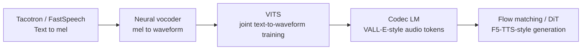
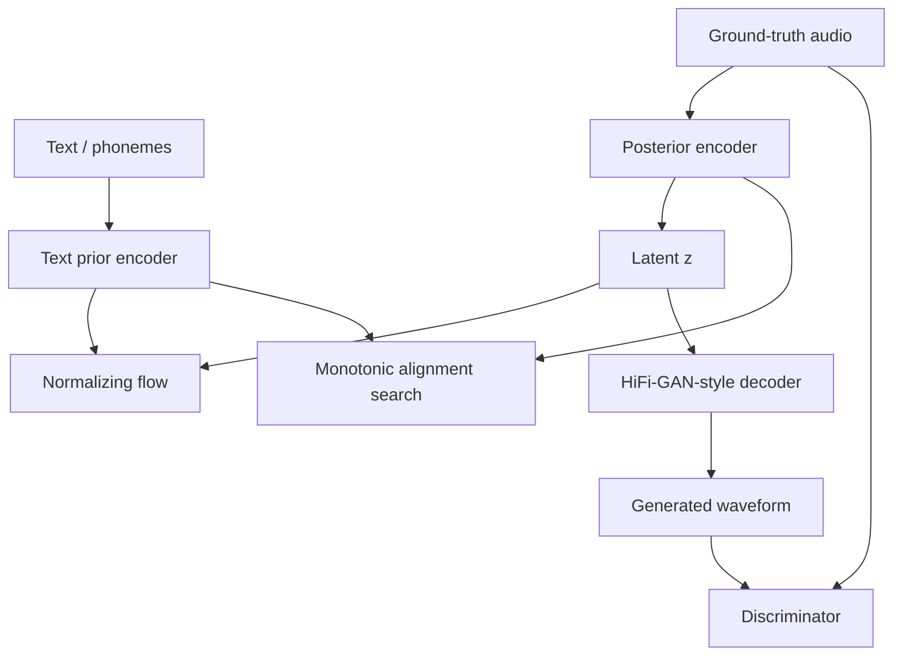
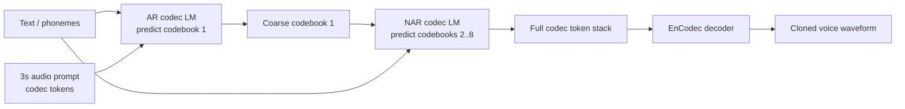
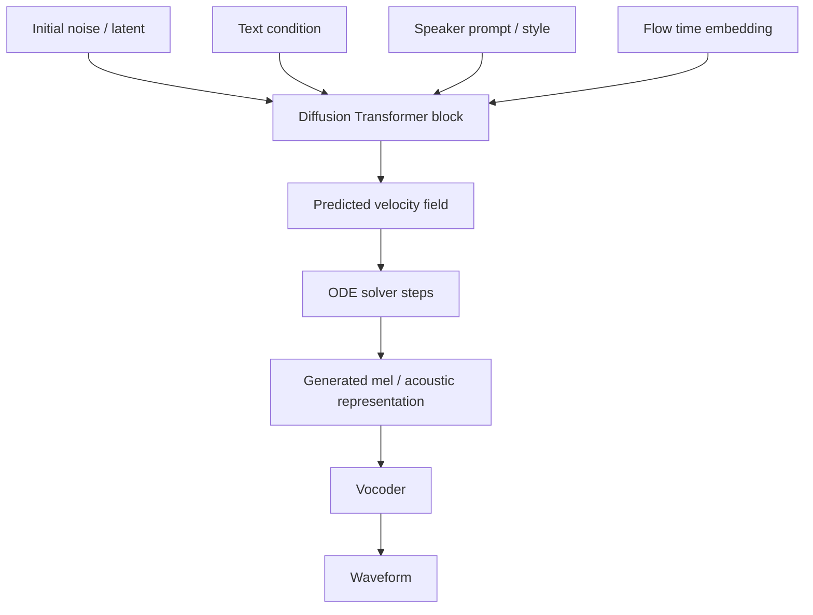

# Chương 9: End-to-End TTS và Zero-Shot Voice Cloning

## Vì sao chương này quan trọng

Chương 8 đã trình bày pipeline TTS hai giai đoạn cổ điển: text → mel spectrogram → waveform. Chương này tiến tới các mô hình **end-to-end**, sinh trực tiếp waveform từ text trong một network duy nhất, đồng thời mở ra khả năng **zero-shot voice cloning**: chỉ với 3-10 giây audio mẫu, mô hình có thể clone giọng nói của bất kỳ ai để đọc text bất kỳ.

Đây là bước tiến quan trọng vì hai lý do. Thứ nhất, end-to-end loại bỏ vấn đề error compounding của pipeline hai giai đoạn (mel imperfection làm vocoder degrade thêm). Thứ hai, voice cloning đơn giản hoá nhiều ứng dụng (audiobook tự động, voiceover localization, accessibility cho người mất tiếng), đồng thời mở ra rủi ro về deepfake và misuse cần được nhìn nhận thẳng thắn.

Chương này phân tích bốn họ kiến trúc chính: VITS (CVAE + adversarial), VALL-E (neural codec LM), NaturalSpeech 3 (factorized diffusion), và F5-TTS (flow matching cộng DiT).

> **Cấu trúc chương**
>
> - **Phần 1**: từ pipeline hai giai đoạn đến end-to-end, động lực và trade-off.
> - **Phần 2**: VITS, Conditional VAE cộng adversarial learning.
> - **Phần 3**: VALL-E, neural codec language model cho zero-shot voice cloning.
> - **Phần 4**: NaturalSpeech 3 và F5-TTS, diffusion và flow matching.
> - **Phần 5**: voice cloning trong production, deepfake và considerations đạo đức.

## Phần 1 — Từ Two-Stage đến End-to-End

Chương trước đã trình bày pipeline **Text → Mel → Waveform** (FastSpeech 2 cộng HiFi-GAN). Chương này khám phá các model **end-to-end**, trực tiếp từ text sang waveform, và đặc biệt là **zero-shot voice cloning**.



**Hình:** TTS hiện đại đi từ pipeline hai giai đoạn sang các mô hình học trực tiếp hơn giữa text, latent/audio tokens và waveform. Mỗi bước giảm một phần mismatch giữa training objective và tín hiệu nghe cuối cùng.

## VITS, Variational Inference with Adversarial Learning

### Key Innovation

VITS [^kim2021conditional] là model **end-to-end** đầu tiên đạt chất lượng ngang two-stage systems. Kết hợp 3 frameworks:

1. **VAE** (Variational Autoencoder): Latent representation learning
2. **Normalizing Flows**: Flexible posterior distribution
3. **GAN**: High-fidelity waveform generation

<a id="eq-vits-formula"></a>

$$
\text{VITS} = \text{VAE} + \text{Normalizing Flow} + \text{Adversarial Training}
$$

### Architecture Overview



**Hình:** VITS kết hợp prior từ text, posterior từ audio, normalizing flow, MAS và adversarial decoder. Đây là lý do VITS vừa học alignment vừa sinh waveform trong một objective thống nhất.

### ELBO Objective

<a id="eq-vits-elbo"></a>

$$
\log p_\theta(\mathbf{x} \mid c) \geq \mathbb{E}_{q_\phi(\mathbf{z}|\mathbf{x})} \left[\log p_\theta(\mathbf{x} \mid \mathbf{z}) - \log \frac{q_\phi(\mathbf{z} \mid \mathbf{x})}{p_\theta(\mathbf{z} \mid c)}\right]
$$

trong đó:

- $p_\theta(\mathbf{x} \mid \mathbf{z})$: Decoder (HiFi-GAN), reconstruct waveform từ latent.
- $q_\phi(\mathbf{z} \mid \mathbf{x})$: Posterior encoder, encode audio sang latent.
- $p_\theta(\mathbf{z} \mid c)$: Prior, text-conditioned prior distribution.

### Normalizing Flow

Flow biến simple distribution thành complex distribution qua invertible transformations:

<a id="eq-vits-flow"></a>

$$
\mathbf{z}_K = f_K \circ f_{K-1} \circ \cdots \circ f_1(\mathbf{z}_0), \quad \mathbf{z}_0 \sim \mathcal{N}(\mu_\theta(c), \sigma_\theta(c))
$$

<a id="eq-vits-flow-density"></a>

$$
\log q_\phi(\mathbf{z}_K \mid \mathbf{x}) = \log q(\mathbf{z}_0) - \sum_{k=1}^{K} \log \left|\det \frac{\partial f_k}{\partial \mathbf{z}_{k-1}}\right|
$$

VITS sử dụng **affine coupling layers** (similar to WaveGlow/Glow):

<a id="eq-affine-coupling"></a>

$$
\begin{aligned}
\mathbf{z}_a, \mathbf{z}_b &= \text{split}(\mathbf{z}) \\
\mathbf{z}_b' &= \mathbf{z}_b \odot \exp(s(\mathbf{z}_a)) + t(\mathbf{z}_a) \\
f(\mathbf{z}) &= \text{concat}(\mathbf{z}_a, \mathbf{z}_b')
\end{aligned}
$$

### Monotonic Alignment Search (MAS)

VITS tìm hard alignment giữa text và latent frames bằng dynamic programming:

<a id="eq-mas"></a>

$$
A^* = \arg\max_{A \in \{0,1\}^{T \times U}} \sum_{t,u} A_{t,u} \log p_\theta(z_t \mid c_u)
$$

subject to monotonicity constraints. Giải bằng DP $O(TU)$.

### Total Loss

<a id="eq-vits-total-loss"></a>

$$
\mathcal{L}_{\text{VITS}} = \mathcal{L}_{\text{recon}} + \mathcal{L}_{\text{KL}} + \mathcal{L}_{\text{dur}} + \mathcal{L}_{\text{adv}} + \mathcal{L}_{\text{fm}}
$$

```python
#| eval: false
#| code-fold: true
#| code-summary: "VITS posterior encoder"
import torch
import torch.nn as nn
from torch import Tensor


class PosteriorEncoder(nn.Module):
    """VITS posterior encoder: Audio → latent z.

    Uses WaveNet-style dilated convolutions.
    """

    def __init__(
        self,
        in_channels: int = 513,      # linear spectrogram bins (n_fft//2+1)
        hidden_channels: int = 192,
        latent_channels: int = 192,
        kernel_size: int = 5,
        n_layers: int = 16,
        dilation_rate: int = 1,
    ) -> None:
        super().__init__()
        self.pre = nn.Conv1d(in_channels, hidden_channels, 1)
        self.enc = nn.ModuleList()
        for i in range(n_layers):
            dilation: int = dilation_rate ** (i % 4)
            padding: int = (kernel_size - 1) * dilation // 2
            self.enc.append(
                nn.Sequential(
                    nn.Conv1d(
                        hidden_channels, 2 * hidden_channels,
                        kernel_size, dilation=dilation, padding=padding,
                    ),
                    nn.GroupNorm(1, 2 * hidden_channels),
                )
            )
        self.proj = nn.Conv1d(hidden_channels, 2 * latent_channels, 1)

    def forward(
        self, x: Tensor,             # [B, in_channels, T] - float32
        x_mask: Tensor | None = None,  # [B, 1, T] - float32
    ) -> tuple[Tensor, Tensor, Tensor]:
        """Encode audio spectrogram to latent distribution.

        Args:
            x: Linear spectrogram [B, 513, T] - float32
            x_mask: Optional mask [B, 1, T] - float32

        Returns:
            z: Sampled latent [B, latent_ch, T] - float32
            mu: Mean [B, latent_ch, T] - float32
            log_sigma: Log std [B, latent_ch, T] - float32
        """
        h: Tensor = self.pre(x)  # [B, hidden, T] - float32
        if x_mask is not None:
            h = h * x_mask

        for layer in self.enc:
            h_gated: Tensor = layer(h)  # [B, 2*hidden, T] - float32
            h_a, h_b = h_gated.chunk(2, dim=1)  # each [B, hidden, T]
            h = h + torch.tanh(h_a) * torch.sigmoid(h_b)  # [B, hidden, T]
            if x_mask is not None:
                h = h * x_mask

        stats: Tensor = self.proj(h)  # [B, 2*latent, T] - float32
        mu, log_sigma = stats.chunk(2, dim=1)  # each [B, latent, T]

        # Reparameterization trick
        z: Tensor = mu + torch.randn_like(mu) * torch.exp(log_sigma)
        # [B, latent, T] - float32

        return z, mu, log_sigma
```

## VALL-E, Neural Codec Language Model for TTS

### Paradigm Shift

VALL-E [^wang2023valle] biến TTS thành **language modeling problem** trên neural codec tokens:

<a id="eq-valle-paradigm"></a>

$$
\text{Traditional TTS: } \text{Text} \to \text{Mel} \to \text{Waveform}
$$

$$
\text{VALL-E: } \text{Text} + \text{Audio Prompt} \to \text{Codec Tokens} \to \text{Waveform}
$$

> **💡 NLP Parallel: GPT for Speech**
>
> VALL-E là **GPT applied to speech**. Thay vì predict next BPE token, nó predict next audio codec token. 3-second audio prompt đóng vai trò **in-context learning**, giống few-shot prompting cho LLM.


### Architecture

VALL-E sử dụng EnCodec (8 RVQ codebooks) và chia thành 2 stages:



**Hình:** VALL-E biến TTS thành language modeling trên codec tokens. Prompt audio ngắn đóng vai trò điều kiện in-context để giữ speaker identity.

### AR Model (Codebook 1)

<a id="eq-valle-ar"></a>

$$
P_{\text{AR}}(\mathbf{c}^{(1)} \mid \mathbf{y}, \tilde{\mathbf{c}}^{(1)}) = \prod_{t=1}^{T} P(c_t^{(1)} \mid c_{<t}^{(1)}, \mathbf{y}, \tilde{\mathbf{c}}^{(1)})
$$

trong đó:

- $\mathbf{y}$: text (phoneme) tokens
- $\tilde{\mathbf{c}}^{(1)}$: first codebook tokens từ 3s audio prompt
- $c_t^{(1)}$: predicted token at time $t$ for codebook 1

### NAR Model (Codebooks 2-8)

<a id="eq-valle-nar"></a>

$$
P_{\text{NAR}}(\mathbf{c}^{(q)} \mid \mathbf{c}^{(1)}, \ldots, \mathbf{c}^{(q-1)}, \mathbf{y}) = \prod_{t=1}^{T} P(c_t^{(q)} \mid \mathbf{c}^{(<q)}, \mathbf{y})
$$

### Zero-Shot Voice Cloning

VALL-E đạt zero-shot voice cloning chỉ với **3 giây** audio prompt:

<a id="eq-valle-cloning"></a>

$$
\text{Voice Cloning} = \text{In-Context Learning trên Codec Tokens}
$$

| Feature | VALL-E | Tacotron 2 | VITS |
|---------|--------|------------|------|
| Voice cloning | **3s prompt** (zero-shot) | Requires fine-tuning | Requires fine-tuning |
| Training data | 60K hours | 24 hours (single speaker) | 24+ hours |
| Naturalness (MOS) | 3.8 | 4.1 | 4.2 |
| Speaker similarity | **0.58** (zero-shot!) | N/A (same speaker) | N/A |

: VALL-E comparison <a id="tbl-valle-comparison"></a>

## F5-TTS, Flow Matching + DiT

### Flow Matching

F5-TTS [^chen2024f5tts] sử dụng **flow matching** [^lipman2023flow], phương pháp mới hơn diffusion:

<a id="eq-flow-matching-ode"></a>

$$
\frac{d\mathbf{x}_t}{dt} = v_\theta(\mathbf{x}_t, t, c), \quad t \in [0, 1]
$$

trong đó:

- $\mathbf{x}_0 \sim \mathcal{N}(0, I)$: noise
- $\mathbf{x}_1$: target mel spectrogram
- $v_\theta$: learned velocity field (neural network)
- $c$: conditioning (text + speaker)

**Training objective** (Conditional Flow Matching):

<a id="eq-cfm-loss"></a>

$$
\mathcal{L}_{\text{CFM}} = \mathbb{E}_{t, \mathbf{x}_0, \mathbf{x}_1} \left[\| v_\theta(\mathbf{x}_t, t, c) - (\mathbf{x}_1 - \mathbf{x}_0) \|^2\right]
$$

với interpolation:

<a id="eq-flow-interpolation"></a>

$$
\mathbf{x}_t = (1-t) \mathbf{x}_0 + t \mathbf{x}_1
$$

> **📝 Flow Matching vs Diffusion**
>
> | | Diffusion | Flow Matching |
> |---|----------|--------------|
> | Path | Stochastic (SDE) | Deterministic (ODE) |
> | Training | Score matching | Velocity matching |
> | Sampling | Many steps (50–1000) | Fewer steps (10–50) |
> | Implementation | Complex noise schedules | **Simple**: linear interpolation |
> | Speed | Slower | **Faster** |


### DiT Architecture (Diffusion Transformer)

F5-TTS sử dụng **DiT** (Diffusion Transformer) thay vì U-Net:



**Hình:** F5-TTS dùng DiT để dự đoán velocity field trong flow matching. So với diffusion cổ điển, flow matching thường cần ít bước sampling hơn và có công thức huấn luyện trực tiếp hơn.

**Adaptive Layer Normalization (AdaLN):**

<a id="eq-adaln"></a>

$$
\text{AdaLN}(\mathbf{h}, t) = \gamma(t) \odot \frac{\mathbf{h} - \mu}{\sigma} + \beta(t)
$$

trong đó $\gamma(t), \beta(t)$ được predict từ time embedding.

### F5-TTS Inference

```python
#| eval: false
#| code-fold: true
#| code-summary: "Flow matching inference (ODE solver)"
import torch
from torch import Tensor


def flow_matching_sample(
    model: torch.nn.Module,
    text_cond: Tensor,       # [B, U, D] - float32, text conditioning
    speaker_cond: Tensor,    # [B, D_spk] - float32, speaker embedding
    n_frames: int = 200,     # number of mel frames to generate
    n_steps: int = 32,       # ODE solver steps (Euler)
    n_mels: int = 80,
) -> Tensor:
    """Generate mel spectrogram via flow matching ODE.

    Args:
        model: Trained velocity network v_θ
        text_cond: Text conditioning [B, U, D] - float32
        speaker_cond: Speaker embedding [B, D_spk] - float32
        n_frames: Number of mel frames to generate
        n_steps: Number of Euler steps
        n_mels: Mel channels

    Returns:
        x: Generated mel spectrogram [B, n_mels, n_frames] - float32
    """
    B: int = text_cond.size(0)
    device: torch.device = text_cond.device

    # Start from noise
    x: Tensor = torch.randn(
        B, n_mels, n_frames, device=device,
    )  # [B, 80, T] - float32

    dt: float = 1.0 / n_steps

    for step in range(n_steps):
        t: float = step / n_steps
        t_tensor: Tensor = torch.full(
            (B,), t, device=device,
        )  # [B] - float32

        # Predict velocity
        v: Tensor = model(
            x, t_tensor, text_cond, speaker_cond,
        )  # [B, 80, T] - float32

        # Euler step
        x = x + v * dt  # [B, 80, T] - float32

    return x  # [B, 80, T] - float32, generated mel
```

### F5-TTS Results

| Model | MOS ↑ | Speaker Sim ↑ | RTF ↓ | Zero-shot? |
|-------|-------|---------------|-------|------------|
| VITS | 4.2 | N/A | 0.01 | No |
| VALL-E | 3.8 | 0.58 | 0.8 | Yes (3s) |
| NaturalSpeech 2 | 4.2 | 0.62 | 0.3 | Yes (3s) |
| **F5-TTS** | **4.3** | **0.68** | **0.15** | **Yes (3s)** |
| CosyVoice | 4.1 | 0.65 | 0.2 | Yes (3s) |

: End-to-end TTS comparison <a id="tbl-e2e-tts"></a>

## TTS Evolution Timeline

| Year | Model | Type | Key Innovation |
|------|-------|------|----------------|
| 2016 | WaveNet | AR vocoder | Sample-level generation |
| 2018 | Tacotron 2 | Attention seq2seq | Location-sensitive attention |
| 2020 | FastSpeech 2 | Non-AR + vocoder | Duration/pitch/energy predictors |
| 2020 | HiFi-GAN | GAN vocoder | Multi-period/scale discriminators |
| 2021 | VITS | End-to-end | VAE + Flow + GAN |
| 2023 | VALL-E | Codec LM | Zero-shot cloning via in-context learning |
| 2024 | F5-TTS | Flow matching | DiT + CFM, fastest zero-shot |

: TTS evolution timeline <a id="tbl-tts-timeline"></a>

> **⚠️ Latency Warning**
>
> Zero-shot TTS models (VALL-E, F5-TTS) có latency cao hơn traditional TTS:
>
> - FastSpeech 2 + HiFi-GAN: **~50ms** cho 5s audio
> - VITS: **~100ms** cho 5s audio
> - VALL-E: **~2s** cho 5s audio (AR decoding bottleneck)
> - F5-TTS: **~500ms** cho 5s audio (32 ODE steps)
>
> Production voice cloning cần cân bằng quality vs latency.


## Tóm tắt

| Model | Approach | Pros | Cons |
|-------|----------|------|------|
| VITS | VAE + Flow + GAN | End-to-end, high quality | Single speaker, no cloning |
| VALL-E | Codec LM (AR + NAR) | Zero-shot cloning | Slow AR decoding |
| F5-TTS | Flow matching + DiT | Fast, high quality, zero-shot | Requires good codec |

: End-to-end TTS summary <a id="tbl-e2e-summary"></a>

Chương tiếp theo sẽ đi sâu vào **Audio Codecs** (EnCodec, DAC, và Mimi), nền tảng cho VALL-E và các Speech LLMs hiện đại.


---

<!-- References (auto-generated from .bib) -->
[^kim2021conditional]: Kim, Jaehyeon and Kong, Jungil and Son, Juhee, "Conditional Variational Autoencoder with Adversarial Learning for End-to-End Text-to-Speech", International Conference on Machine Learning
[^wang2023valle]: Wang, Chengyi and Chen, Sanyuan and Wu, Yu and others, "Neural Codec Language Models are Zero-Shot Text to Speech Synthesizers", arXiv preprint arXiv:2301.02111
[^chen2024f5tts]: Chen, Yushen and others, "F5-TTS: A Fairytaler that Fakes Fluent and Faithful Speech with Flow Matching", arXiv preprint arXiv:2410.06885
[^lipman2023flow]: Lipman, Yaron and Chen, Ricky T Q and Ben-Hamu, Heli and Nickel, Maximilian and Le, Matthew, "Flow Matching for Generative Modeling", International Conference on Learning Representations
