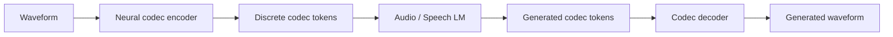
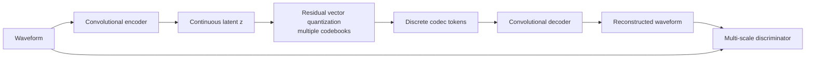
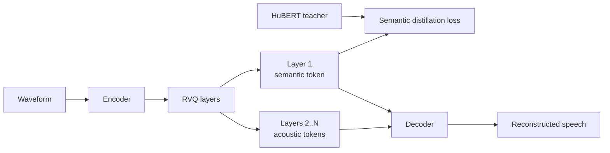

# Chương 10: Neural Audio Codecs và Speech Tokenization

## Vì sao chương này quan trọng

Neural audio codec (EnCodec, DAC, Mimi, SpeechTokenizer) là thành phần engineering chủ chốt cho phép Speech LLM tồn tại. Bằng cách biến tín hiệu audio liên tục thành chuỗi token rời rạc với bitrate thấp, codec tạo ra một dạng “BPE cho audio” và cho phép áp dụng paradigm autoregressive LM trực tiếp lên speech.

Chương này phát triển ba trục cốt lõi của codec:

- **Vector quantization và residual VQ**: cơ chế biến embedding liên tục thành token rời rạc với ít distortion.
- **Bit-rate và quality trade-off**: vì sao frame rate thấp như Mimi (12.5 fps) rất quan trọng cho Speech LLM realtime so với codec token rate cao hơn.
- **Streaming và causal architecture**: yêu cầu kỹ thuật để codec hoạt động realtime cho voice agent.

Hiểu codec là điều kiện cần để đọc paper Speech LLM frontier (Moshi, VALL-E, Qwen3-Omni), và để thiết kế pipeline production voice agent có chi phí và latency hợp lý.

> **Cấu trúc chương**
>
> - **Phần 1**: tại sao cần neural audio codec, so sánh với codec cổ điển (MP3, Opus).
> - **Phần 2**: Vector Quantization và Residual VQ, nền tảng toán học.
> - **Phần 3**: EnCodec (Meta, 2022), kiến trúc và performance.
> - **Phần 4**: DAC, Mimi, SpeechTokenizer, các thế hệ codec cải tiến.
> - **Phần 5**: trade-off bit-rate, latency, quality và lựa chọn cho Speech LLM.

### Bản đồ codec trong Speech LLM



Điểm mấu chốt: LLM không thích waveform raw vì sequence quá dài và liên tục. LLM thích token rời rạc. Codec chính là cầu nối biến audio thành token để transformer có thể học theo kiểu next-token prediction.

### Ba câu hỏi khi đánh giá codec

| Câu hỏi | Ý nghĩa |
|---|---|
| Codec giữ được gì? | nội dung lời nói, speaker, prosody, emotion, noise nền |
| Codec bỏ mất gì? | phase detail, high-frequency fidelity, room tone, nuance nhỏ |
| Token có rẻ cho LM không? | frame rate, số codebooks, bitrate, self-attention cost |

## Phần 1 — Tại sao cần Neural Audio Codec

Neural audio codecs giải quyết bài toán **nén audio thành discrete tokens**  -  cầu nối trực tiếp giữa speech và language modeling:

<a id="eq-codec-overview"></a>

$$
\text{Waveform} \xrightarrow{\text{Encoder}} \text{Latent} \xrightarrow{\text{RVQ}} \text{Discrete Tokens} \xrightarrow{\text{Decoder}} \text{Reconstructed Waveform}
$$

> **💡 NLP Parallel: Tokenizer cho Audio**
>
> | Text Processing | Audio Processing |
> |----------------|------------------|
> | BPE tokenizer | Neural codec (EnCodec/DAC/Mimi) |
> | Vocabulary (32K–128K) | Codebook (ví dụ 1024 entries/layer) |
> | Lossless đối với text | Lossy/perceptual đối với audio |
> | Deterministic sau khi train tokenizer | Learned encoder/decoder + quantizer |
> | Input to GPT/BERT | Input to VALL-E/AudioLM/Moshi-style models |

Tuy nhiên analogy BPE không hoàn hảo. Text tokenization có thể reconstruct lại đúng chuỗi ký tự. Audio codec reconstruct lại waveform gần giống perceptually, nhưng không đảm bảo giống từng sample. Điều này ảnh hưởng trực tiếp tới speaker similarity và naturalness của TTS/voice cloning.


## Vector Quantization (VQ)

### Trực giác trước công thức

Vector quantization giống việc thay một vector liên tục bằng “mã gần nhất” trong một từ điển vector. Nếu encoder tạo ra latent vector biểu diễn 40 ms audio, VQ chọn codebook entry gần nhất và lưu **index** của entry đó. Index này chính là token.

Ví dụ đơn giản với codebook 2D:

| Latent | Codebook gần nhất | Token ID |
|---|---|---:|
| `(0.9, 0.1)` | `e_7 = (1.0, 0.0)` | 7 |
| `(-0.2, 1.1)` | `e_3 = (0.0, 1.0)` | 3 |
| `(0.4, 0.6)` | `e_9 = (0.5, 0.5)` | 9 |

### Basic VQ

Vector Quantization [^oord2017vqvae] ánh xạ continuous vector sang nearest codebook entry:

<a id="eq-vq"></a>

$$
q(\mathbf{z}) = \arg\min_{\mathbf{e}_k \in \mathcal{C}} \|\mathbf{z} - \mathbf{e}_k\|_2
$$

trong đó $\mathcal{C} = \{\mathbf{e}_1, \mathbf{e}_2, \ldots, \mathbf{e}_K\}$ là codebook với $K$ entries.

**Vấn đề**: argmin không differentiable → cần **Straight-Through Estimator (STE)**:

<a id="eq-ste"></a>

$$
\hat{\mathbf{z}} = \mathbf{z} + \text{sg}(\mathbf{e}_{k^*} - \mathbf{z})
$$

trong đó $\text{sg}(\cdot)$ là stop-gradient operator. Forward pass: $\hat{\mathbf{z}} = \mathbf{e}_{k^*}$. Backward pass: gradient flows straight through to $\mathbf{z}$.

### VQ-VAE Loss

<a id="eq-vqvae-loss"></a>

$$
\mathcal{L}_{\text{VQ-VAE}} = \underbrace{\|\mathbf{x} - \hat{\mathbf{x}}\|_2^2}_{\text{reconstruction}} + \underbrace{\|\text{sg}(\mathbf{z}) - \mathbf{e}\|_2^2}_{\text{codebook loss}} + \beta \underbrace{\|\mathbf{z} - \text{sg}(\mathbf{e})\|_2^2}_{\text{commitment loss}}
$$

### Hạn chế của Single VQ

Với codebook size $K = 1024$ và dimension $d = 128$:

- Mỗi frame chỉ chọn 1 trong 1024 entries → **10 bits** per frame
- Ở 50 fps: bitrate = $50 \times 10 = 500$ bps  -  **quá thấp** cho audio quality

→ Cần **Residual Vector Quantization** để tăng capacity.

## Residual Vector Quantization (RVQ)

### Ý tưởng

Thay vì 1 codebook lớn, dùng **nhiều codebooks nhỏ** quantize **residual** (phần dư):

Trực giác RVQ giống vẽ một điểm bằng nhiều nét bút. Codebook đầu tiên vẽ phác thảo lớn; codebook thứ hai sửa phần sai còn lại; các codebook sau thêm chi tiết nhỏ hơn.

| Bước | Việc làm | Kết quả |
|---|---|---|
| 1 | quantize latent gốc | nắm thông tin thô |
| 2 | quantize residual còn lại | sửa lỗi lớn |
| 3..Q | tiếp tục quantize residual | thêm chi tiết acoustic |
| Tổng | cộng tất cả codebook vectors | reconstructed latent |

<a id="eq-rvq"></a>

$$
\begin{aligned}
\mathbf{r}_0 &= \mathbf{z} & \text{// Original latent} \\
\hat{\mathbf{z}}_1 &= q_1(\mathbf{r}_0), \quad \mathbf{r}_1 = \mathbf{r}_0 - \hat{\mathbf{z}}_1 & \text{// Quantize + compute residual} \\
\hat{\mathbf{z}}_2 &= q_2(\mathbf{r}_1), \quad \mathbf{r}_2 = \mathbf{r}_1 - \hat{\mathbf{z}}_2 & \text{// Quantize residual} \\
&\vdots \\
\hat{\mathbf{z}}_Q &= q_Q(\mathbf{r}_{Q-1}) & \text{// Final quantization} \\
\hat{\mathbf{z}} &= \sum_{q=1}^{Q} \hat{\mathbf{z}}_q & \text{// Reconstructed latent}
\end{aligned}
$$

### Bitrate Calculation

Với $Q$ codebooks, mỗi codebook size $K$, ở frame rate $f$:

<a id="eq-rvq-bitrate"></a>

$$
\text{Bitrate} = Q \times \log_2(K) \times f \text{ bps}
$$

**EnCodec example**: $Q=8, K=1024, f=75$:

<a id="eq-encodec-bitrate"></a>

$$
\text{Bitrate} = 8 \times 10 \times 75 = 6{,}000 \text{ bps} = 6 \text{ kbps}
$$

> **📝 RVQ Hierarchy**
>
> Các codebook layers mang thông tin khác nhau:
>
> - **Layer đầu** thường mang nhiều thông tin thô/semantic hơn trong một số thiết kế.
> - **Các layer giữa** bổ sung prosody, speaker và acoustic detail.
> - **Các layer sau** thường thêm fine detail để reconstruction tốt hơn.
>
> Đây là trực giác phía sau nhiều thiết kế AR/NAR: dự đoán coarse/semantic token trước, sau đó bổ sung acoustic detail bằng các codebook còn lại.


```python
#| eval: false
#| code-fold: true
#| code-summary: "Residual Vector Quantization"
import torch
import torch.nn as nn
import torch.nn.functional as F
from torch import Tensor


class VectorQuantize(nn.Module):
    """Single-codebook vector quantization with EMA updates."""

    def __init__(
        self,
        dim: int = 128,
        codebook_size: int = 1024,
        decay: float = 0.99,
    ) -> None:
        super().__init__()
        self.codebook_size: int = codebook_size
        self.decay: float = decay

        self.codebook = nn.Embedding(codebook_size, dim)
        nn.init.uniform_(self.codebook.weight, -1.0 / codebook_size, 1.0 / codebook_size)

    def forward(self, z: Tensor) -> tuple[Tensor, Tensor, Tensor]:
        """Quantize input vectors.

        Args:
            z: [batch, T, dim] - float32

        Returns:
            z_q: Quantized vectors [batch, T, dim] - float32
            indices: Codebook indices [batch, T] - int64
            commit_loss: Commitment loss scalar - float32
        """
        # Find nearest codebook entry
        # z: [B, T, D], codebook: [K, D]
        dist: Tensor = (
            z.pow(2).sum(-1, keepdim=True)          # [B, T, 1]
            - 2 * z @ self.codebook.weight.T         # [B, T, K]
            + self.codebook.weight.pow(2).sum(-1)     # [K]
        )  # [B, T, K] - float32 (squared distances)

        indices: Tensor = dist.argmin(dim=-1)  # [B, T] - int64
        z_q: Tensor = self.codebook(indices)   # [B, T, D] - float32

        # Commitment loss
        commit_loss: Tensor = F.mse_loss(z, z_q.detach())  # scalar

        # Straight-Through Estimator
        z_q = z + (z_q - z).detach()  # [B, T, D] - float32

        return z_q, indices, commit_loss


class ResidualVQ(nn.Module):
    """Residual Vector Quantization with Q codebooks."""

    def __init__(
        self,
        dim: int = 128,
        codebook_size: int = 1024,
        n_quantizers: int = 8,
    ) -> None:
        super().__init__()
        self.n_quantizers: int = n_quantizers
        self.quantizers = nn.ModuleList([
            VectorQuantize(dim=dim, codebook_size=codebook_size)
            for _ in range(n_quantizers)
        ])

    def forward(
        self, z: Tensor,  # [batch, T, dim] - float32
    ) -> tuple[Tensor, Tensor, Tensor]:
        """Apply residual vector quantization.

        Args:
            z: Input latent [B, T, dim] - float32

        Returns:
            z_q: Quantized sum [B, T, dim] - float32
            all_indices: Codebook indices [B, Q, T] - int64
            total_loss: Sum of commitment losses - float32
        """
        residual: Tensor = z.clone()  # [B, T, D] - float32
        z_q: Tensor = torch.zeros_like(z)  # [B, T, D] - float32
        all_indices: list[Tensor] = []
        total_loss: Tensor = torch.tensor(0.0, device=z.device)

        for q, quantizer in enumerate(self.quantizers):
            zq_i, indices_i, loss_i = quantizer(residual)
            # zq_i: [B, T, D], indices_i: [B, T], loss_i: scalar

            residual = residual - zq_i.detach()  # [B, T, D] - float32
            z_q = z_q + zq_i  # [B, T, D] - float32
            all_indices.append(indices_i)
            total_loss = total_loss + loss_i

        indices_stacked: Tensor = torch.stack(
            all_indices, dim=1
        )  # [B, Q, T] - int64

        return z_q, indices_stacked, total_loss
```

## EnCodec

### Architecture

EnCodec [^defossez2022encodec] là neural audio codec của Meta:



**Hình:** EnCodec nén waveform thành codec tokens thông qua RVQ. Các tokens này vừa phục vụ nén audio, vừa trở thành “vocabulary” cho Speech LLM và audio generation.

### EnCodec trong pipeline Speech LLM

EnCodec quan trọng không chỉ vì nén audio, mà vì nó cung cấp token interface cho các mô hình như AudioLM/VALL-E-style systems. Khi chọn EnCodec hoặc codec tương tự cho LLM, bạn cần quan tâm hai đại lượng:

| Đại lượng | Tác động tới LM |
|---|---|
| Frame rate | càng cao thì sequence càng dài |
| Số codebooks | càng nhiều thì mỗi frame có nhiều token/layer hơn |
| Codebook size | ảnh hưởng vocabulary và entropy |
| Bitrate | ảnh hưởng fidelity và cost |
| Causal/non-causal | ảnh hưởng streaming latency |

### Training Losses

<a id="eq-encodec-loss"></a>

$$
\mathcal{L}_{\text{EnCodec}} = \lambda_t \mathcal{L}_{\text{time}} + \lambda_f \mathcal{L}_{\text{freq}} + \lambda_g \mathcal{L}_{\text{gan}} + \lambda_{\text{fm}} \mathcal{L}_{\text{feat}} + \lambda_w \mathcal{L}_{\text{vq}}
$$

| Loss | Formula | Purpose |
|------|---------|---------|
| Time domain | $\|\mathbf{x} - \hat{\mathbf{x}}\|_1$ | Waveform reconstruction |
| Frequency domain | $\sum_s \|\text{STFT}_s(\mathbf{x}) - \text{STFT}_s(\hat{\mathbf{x}})\|_1 + \|\log \text{STFT}_s\|_1$ | Multi-scale spectral |
| GAN | $\sum_k \max(0, 1 - D_k(\mathbf{x})) + \max(0, 1 + D_k(\hat{\mathbf{x}}))$ | Perceptual quality |
| Feature matching | $\sum_k \sum_l \|D_k^l(\mathbf{x}) - D_k^l(\hat{\mathbf{x}})\|_1$ | Discriminator features |
| VQ commitment | $\|\mathbf{z} - \text{sg}(\hat{\mathbf{z}})\|_2^2$ | Encoder-codebook alignment |

: EnCodec loss components <a id="tbl-encodec-losses"></a>

### EnCodec Specifications

| Parameter | Value |
|-----------|-------|
| Sample rate | 24 kHz |
| Encoder stride | 320 (→ 75 fps) |
| Codebook size | 1024 per layer |
| RVQ layers | 1–32 (adjustable) |
| Bitrate | 1.5 / 3 / 6 / 12 / 24 kbps |
| Latent dim | 128 |
| Model params | ~15M |
| Latency | 13.3ms (1 frame at 75 Hz) |

: EnCodec specifications <a id="tbl-encodec-specs"></a>

## DAC (Descript Audio Codec)

DAC [^kumar2024dac] cải tiến EnCodec với:

1. **Improved codebook utilization**: Factorized codes + L2 normalization
2. **Snake activation**: $\text{Snake}(x) = x + \frac{1}{\alpha}\sin^2(\alpha x)$  -  tốt hơn cho periodic signals
3. **Cải thiện chất lượng trong nhiều thiết lập**: đặc biệt đáng chú ý ở bitrate thấp, tùy benchmark

| Codec | Hướng cải tiến | Điểm cần kiểm tra |
|-------|----------------|-------------------|
| EnCodec | codec nền tảng, phổ biến trong nghiên cứu codec LM | token rate và quality theo bitrate |
| DAC | cải thiện codebook usage và fidelity trong nhiều benchmark | license, checkpoint, domain audio |

: Đọc DAC vs EnCodec theo hướng trade-off <a id="tbl-dac-vs-encodec"></a>

## Metric đánh giá codec

Codec không nên được đánh giá chỉ bằng “nghe có giống không”. Với Speech LLM, cần nhiều lớp metric:

| Metric | Đo điều gì | Hạn chế |
|---|---|---|
| PESQ/STOI | intelligibility/speech quality proxy | không luôn khớp human preference |
| ViSQOL | perceptual similarity | phụ thuộc domain và setup |
| Mel/STFT loss | reconstruction phổ | không đủ cho naturalness |
| Speaker similarity | giữ timbre/speaker identity | cần speaker encoder đáng tin |
| ASR WER sau reconstruction | giữ nội dung lời nói | ASR cũng có lỗi riêng |
| Token rate | cost cho LM | thấp quá có thể mất fidelity |
| Latency | streaming feasibility | phụ thuộc implementation |

Với codec cho Speech LLM, một codec “nghe hay” nhưng token rate quá cao có thể không phù hợp realtime. Ngược lại, token rate thấp nhưng mất thanh điệu hoặc speaker identity sẽ gây lỗi ở voice cloning tiếng Việt.

## SpeechTokenizer

### Disentangled Semantic/Acoustic Tokens

SpeechTokenizer tách biệt **semantic** và **acoustic** information:



**Hình:** SpeechTokenizer cố tình tách lớp token semantic khỏi các lớp acoustic. Cách tách này giúp model downstream dùng token ngữ nghĩa cho understanding và token acoustic cho reconstruction hoặc voice style.

Training: Thêm **semantic distillation loss** cho layer 1:

<a id="eq-speechtokenizer"></a>

$$
\mathcal{L}_{\text{semantic}} = \|\hat{\mathbf{z}}^{(1)} - \text{HuBERT}(\mathbf{x})\|_2^2
$$

**Lợi ích**: Speech LLMs có thể xử lý semantic tokens (layer 1) riêng → tốt hơn cho language understanding tasks.

## Mimi  -  Ultra-Low Latency Codec

### Key Innovation

Mimi (dùng trong Moshi [^defossez2024moshi]) nổi bật vì frame rate thấp so với nhiều codec trước đó:

<a id="eq-mimi-framerate"></a>

$$
\text{EnCodec: 75 Hz} \quad \xrightarrow{\text{Mimi}} \quad \text{12.5 Hz}
$$

### Cách đạt 12.5 Hz

1. **Larger encoder stride**: 1920 (vs 320 cho EnCodec)
2. **Transformer layers** trong encoder/decoder: Capture long-range dependencies
3. **Semantic distillation**: Layer 1 aligned với WavLM features
4. **Split RVQ**: 1 semantic codebook + 7 acoustic codebooks

### Tại sao frame rate thấp quan trọng?

<a id="eq-mimi-tokens"></a>

$$
\text{Tokens per second} = 12.5 \times 8 = 100 \text{ tokens/s (total)}
$$

So sánh: EnCodec = $75 \times 8 = 600$ tokens/s. Nếu một codec giảm token rate 6×, chi phí self-attention lý tưởng có thể giảm khoảng 36× theo $O(L^2)$, dù chi phí thực tế còn phụ thuộc batching, architecture và cách sắp xếp codebooks.

> **⚠️ Latency Warning**
>
> | Codec | Frame Rate | Tokens/sec | 10s Audio Tokens | Self-Attn Cost |
> |-------|-----------|------------|-----------------|---------------|
> | EnCodec | 75 Hz | 600 | 6,000 | $O(36M)$ |
> | **Mimi** | 12.5 Hz | 100 | 1,000 | $O(1M)$ |
> | Reduction | 6× | 6× | 6× | **36×** |
>
> Frame rate thấp là một yếu tố rất quan trọng cho full-duplex dialogue, vì nó giảm sequence length mà Speech LM phải xử lý liên tục.


## Codec Comparison

| Codec | Frame rate tương đối | Thiết kế nổi bật | Phù hợp khi | Điểm cần kiểm tra |
|-------|----------------------|------------------|-------------|-------------------|
| EnCodec | cao hơn Mimi | RVQ phổ biến, dễ hiểu | VALL-E/AudioLM-style baseline | token rate, bitrate, domain |
| DAC | cao, quality-oriented | codebook utilization/fidelity | audio quality quan trọng | license, domain, speed |
| SpeechTokenizer | trung bình | semantic/acoustic disentanglement | cần token semantic riêng | downstream task fit |
| Mimi | thấp | semantic + acoustic split, low frame rate | realtime dialogue/Speech LM | fidelity, language/domain coverage |

: Audio codec comparison <a id="tbl-codec-comparison"></a>

Không có codec phù hợp tuyệt đối cho mọi mục tiêu. Codec cho music, codec cho phone-call compression, codec cho TTS cloning và codec cho full-duplex Speech LM có tiêu chí khác nhau.

## Chọn codec theo use case

| Use case | Ưu tiên | Codec/thiết kế nên cân nhắc |
|---|---|---|
| TTS zero-shot | speaker similarity, fidelity | EnCodec/DAC-style hoặc codec được dùng bởi model TTS |
| Full-duplex dialogue | token rate thấp, streaming | Mimi-style low frame-rate codec |
| Speech understanding | semantic token rõ | SpeechTokenizer/semantic distillation |
| Audio compression | perceptual quality/bitrate | DAC/EnCodec-style benchmark kỹ |
| Vietnamese voice agent | tone, speaker, code-switching | benchmark riêng theo tiếng Việt |

### Codec và tiếng Việt

Với tiếng Việt, codec cần giữ tốt các đặc trưng sau:

- contour F0 của sáu thanh điệu;
- âm cuối ngắn như /p/, /t/, /k/;
- khác biệt vùng miền Bắc/Trung/Nam;
- code-switching Việt-Anh;
- speaker identity trong prompt ngắn;
- prosody câu hỏi/câu cảm thán.

Một codec có ViSQOL tốt trên tiếng Anh chưa chắc giữ thanh điệu tiếng Việt đủ tốt cho TTS hoặc Speech LM. Vì vậy, hãy đánh giá codec bằng ASR tiếng Việt sau reconstruction và human listening test bản ngữ.

```python
#| eval: false
#| code-fold: true
#| code-summary: "EnCodec-style encoder architecture"
import torch
import torch.nn as nn
from torch import Tensor


class EnCodecEncoder(nn.Module):
    """Simplified EnCodec encoder.

    Waveform → Latent features via strided convolutions.
    """

    def __init__(
        self,
        in_channels: int = 1,
        latent_dim: int = 128,
        channels: int = 64,
        strides: tuple[int, ...] = (2, 4, 5, 8),  # total = 320
    ) -> None:
        super().__init__()
        self.conv_in = nn.Conv1d(
            in_channels, channels, kernel_size=7, padding=3,
        )

        blocks: list[nn.Module] = []
        ch: int = channels
        for stride in strides:
            ch_out: int = ch * 2
            blocks.extend([
                nn.ELU(),
                nn.Conv1d(ch, ch, kernel_size=3, padding=1),
                nn.ELU(),
                nn.Conv1d(
                    ch, ch_out,
                    kernel_size=2 * stride,
                    stride=stride,
                    padding=stride // 2,
                ),
            ])
            ch = ch_out

        self.encoder = nn.Sequential(*blocks)
        self.conv_out = nn.Sequential(
            nn.ELU(),
            nn.Conv1d(ch, latent_dim, kernel_size=3, padding=1),
        )

    def forward(self, x: Tensor) -> Tensor:
        """Encode waveform to latent features.

        Args:
            x: Waveform [batch, 1, T_samples] - float32

        Returns:
            z: Latent features [batch, latent_dim, T'] - float32
               where T' = T_samples / prod(strides)
        """
        h: Tensor = self.conv_in(x)     # [B, 64, T] - float32
        h = self.encoder(h)              # [B, 1024, T'] - float32
        z: Tensor = self.conv_out(h)     # [B, 128, T'] - float32
        return z
```

## Những lỗi thường gặp khi dùng codec tokens

- **Nhầm bitrate với token rate**: bitrate thấp chưa chắc sequence ngắn nếu frame rate/codebooks vẫn cao.
- **Bỏ qua codec decoder**: LM sinh token tốt nhưng decoder tạo artifact thì audio vẫn kém.
- **Train LM trên token không ổn định**: codebook collapse hoặc unused codes làm LM học phân phối xấu.
- **Không benchmark reconstruction**: trước khi train Speech LM, hãy kiểm tra codec reconstruct audio domain của bạn.
- **Không kiểm tra streaming**: codec non-causal hoặc look-ahead lớn có thể không dùng được cho realtime.

## Tóm tắt

| Concept | Equation | Role |
|---------|----------|------|
| VQ | $q(\mathbf{z}) = \arg\min_k \|\mathbf{z} - \mathbf{e}_k\|$ | Discretize latent |
| STE | $\hat{\mathbf{z}} = \mathbf{z} + \text{sg}(\mathbf{e} - \mathbf{z})$ | Gradient through argmin |
| RVQ | $\hat{\mathbf{z}} = \sum_q q_q(\mathbf{r}_{q-1})$ | Multi-layer quantization |
| Bitrate | $Q \times \log_2(K) \times f$ | Quality control |

: Audio codec key concepts <a id="tbl-codec-summary"></a>

Neural audio codecs là **nền tảng** cho Speech LLMs. Chương tiếp theo sẽ khám phá cách AudioLM, Qwen2-Audio/Qwen3-Omni-style systems, Moshi và các mô hình speech-native xây dựng trên codec tokens hoặc audio embeddings để tạo ra mô hình ngôn ngữ đa phương thức.


---

<!-- References (auto-generated from .bib) -->
[^oord2017vqvae]: van den Oord, A{\"a}ron and Vinyals, Oriol and Kavukcuoglu, Koray, "Neural Discrete Representation Learning", Advances in Neural Information Processing Systems
[^defossez2022encodec]: D{\'e}fossez, Alexandre and Copet, Jade and Synnaeve, Gabriel and Adi, Yossi, "High Fidelity Neural Audio Compression", Transactions on Machine Learning Research
[^kumar2024dac]: Kumar, Rithesh and Seetharaman, Prem and others, "High-Fidelity Audio Compression with Improved RVQGAN", Advances in Neural Information Processing Systems
[^defossez2024moshi]: D{\'e}fossez, Alexandre and Musicant, Laurent and others, "Moshi: A Speech-Text Foundation Model for Real-Time Dialogue", arXiv preprint arXiv:2410.00037
