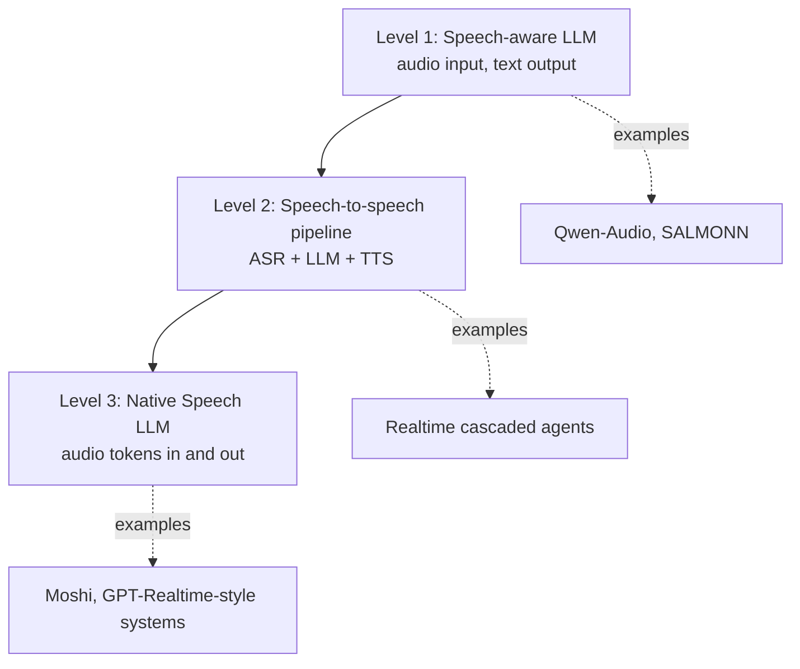
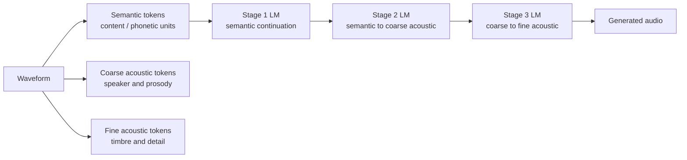
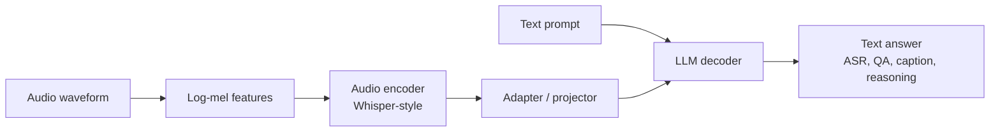
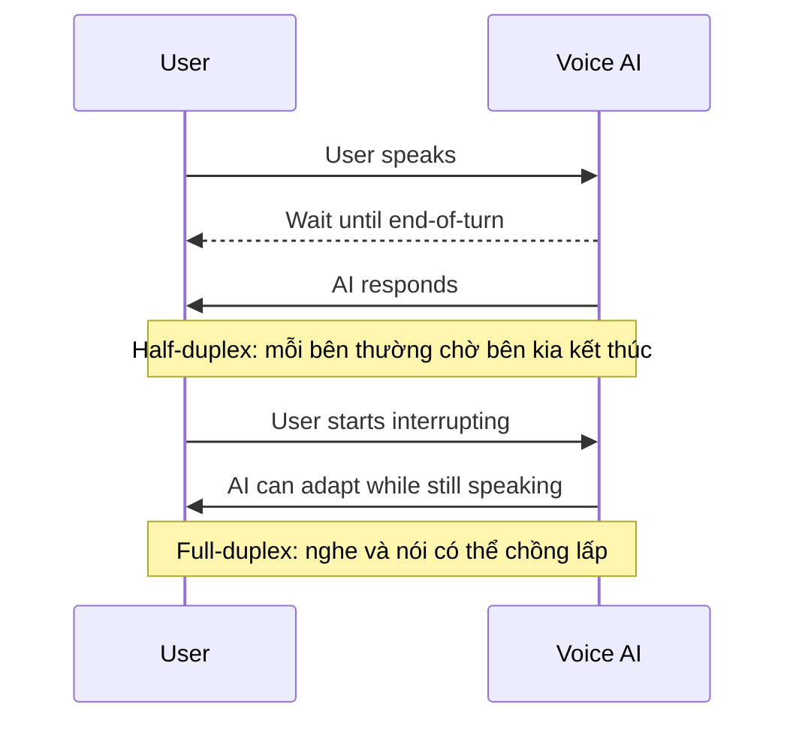
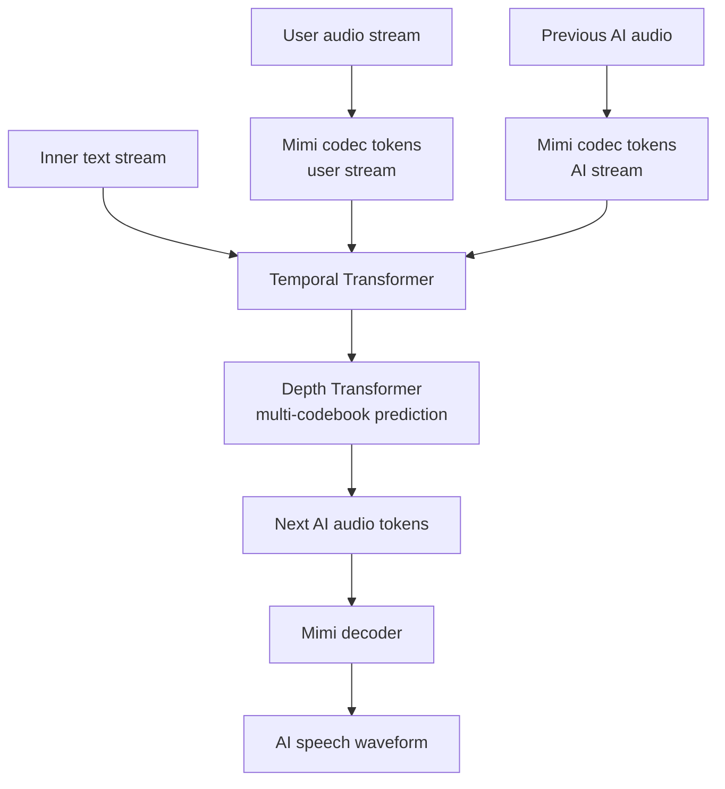
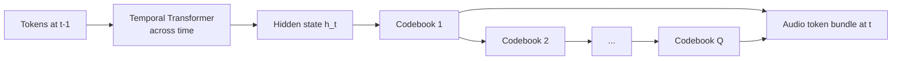

# Chương 11: Speech Language Models

## Vì sao chương này quan trọng

Speech Language Models là điểm hội tụ giữa Speech AI và LLM revolution. Đối với người làm NLP/LLM, đây là lãnh thổ quen thuộc nhất: autoregressive Transformer trên discrete token, KV cache, in-context learning, function calling. Nhưng "token" ở đây không phải BPE text, mà là codec token sinh từ neural audio codec (Chương 10). Hiểu Speech LLM là điều kiện cần để đọc và xây dựng các sản phẩm voice AI hiện đại như Moshi (Kyutai), Qwen3-Omni (Alibaba), GPT-Realtime (OpenAI), Gemini Live (Google).

Chương này phát triển bốn họ kiến trúc theo trình tự lịch sử và độ phức tạp:

- **AudioLM**: hierarchical audio LM, đặt nền móng cho paradigm "audio as language".
- **Qwen2-Audio**: speech-aware LLM với Whisper encoder cộng adapter, ASR + understanding + reasoning.
- **Moshi**: full-duplex dual-stream Speech LLM, end-to-end speech-to-speech với latency dưới 300 ms.
- **Qwen3-Omni và Qwen3.5-Omni**: MoE Thinker-Talker, open-source SOTA năm 2025-2026.

Đồng thời chương cập nhật các release frontier trong Q4 2025 và năm 2026 (GPT-Realtime, MoshiRAG, Gemini 3 Live), để người đọc có bức tranh đầy đủ về landscape tại thời điểm viết.

> **Cấu trúc chương**
>
> - **Phần 1**: ba cấp độ tích hợp Speech vào LLM (cascaded, speech-aware, end-to-end).
> - **Phần 2**: AudioLM, hierarchical audio language model.
> - **Phần 3**: Qwen2-Audio, kiến trúc Whisper encoder cộng adapter cộng LLM.
> - **Phần 4**: Moshi, full-duplex dual-stream và Depth Transformer.
> - **Phần 5**: Q4 2025 và 2026 updates (Qwen3-Omni family, GPT-Realtime, MoshiRAG, Gemini Live).

## Phần 1 — Từ Text LLM đến Speech LLM

Speech Language Models mở rộng paradigm LLM sang audio modality. Có 3 cấp độ tích hợp:



**Hình:** Ba mức tích hợp speech vào LLM. Mức 1 phù hợp cho audio understanding; mức 2 là kiến trúc production phổ biến; mức 3 hướng tới hội thoại audio native với latency thấp hơn và khả năng biểu cảm tốt hơn.

## AudioLM  -  Hierarchical Audio Language Model

### Key Insight

AudioLM [^borsos2023audiolm] là model đầu tiên chứng minh rằng **audio generation = language modeling on discrete tokens**. Sử dụng hierarchical token structure:



**Hình:** AudioLM dùng hierarchy vì một loại token đơn lẻ không đủ. Semantic tokens giữ nội dung, còn acoustic tokens bổ sung speaker identity, prosody và chi tiết tín hiệu.

### Three-Stage Generation

<a id="eq-audiolm-stages"></a>

$$
\begin{aligned}
\text{Stage 1:} \quad & P(\mathbf{s}_{t+1:T} \mid \mathbf{s}_{1:t}) & \text{// Semantic token continuation} \\
\text{Stage 2:} \quad & P(\mathbf{a}^{1:4} \mid \mathbf{s}) & \text{// Semantic → coarse acoustic} \\
\text{Stage 3:} \quad & P(\mathbf{a}^{5:12} \mid \mathbf{a}^{1:4}) & \text{// Coarse → fine acoustic}
\end{aligned}
$$

Mỗi stage là một **autoregressive Transformer**  -  cùng architecture, khác tokenization level.

> **📝 Tại sao Hierarchical?**
>
> Semantic tokens không đủ để reconstruct audio (missing speaker info). Acoustic tokens quá detailed cho LM (sequence quá dài). Hierarchy cho phép:
>
> 1. Plan high-level (semantic) trước
> 2. Fill in details (acoustic) sau
> 3. Giữ sequence lengths manageable cho Transformer


### AudioLM Results

- **Speech continuation**: Nghe tự nhiên, maintain speaker identity
- **Music generation**: Coherent melodies
- **No text conditioning needed**: Purely audio-to-audio

## Qwen2-Audio  -  Universal Audio Understanding

### Architecture

Qwen2-Audio [^chu2023qwen2audio] là Speech-Aware LLM  -  hiểu audio nhưng output text:



**Hình:** Qwen2-Audio thuộc nhóm speech-aware LLM: audio được encode thành embedding, adapter đưa embedding vào không gian LLM, và output cuối vẫn là text.

### Capabilities

Qwen2-Audio hỗ trợ **đa dạng audio tasks** qua text prompting:

| Task | Prompt Example | Output |
|------|---------------|--------|
| ASR | "Transcribe this audio" | Text transcription |
| Translation | "Translate to English" | Translated text |
| Audio QA | "What instrument is playing?" | "Piano" |
| Emotion | "What emotion?" | "Happy, excited" |
| Sound event | "What sounds do you hear?" | "Dog barking, rain" |
| Speaker ID | "How many speakers?" | "2 speakers" |

: Qwen2-Audio capabilities <a id="tbl-qwen2-audio-tasks"></a>

### Training

2-stage training:

<a id="eq-qwen2-training"></a>

$$
\begin{aligned}
\text{Stage 1:} \quad & \text{Audio-text alignment} & \text{(freeze LLM, train adapter)} \\
\text{Stage 2:} \quad & \text{Instruction tuning} & \text{(unfreeze all, multitask)}
\end{aligned}
$$

## Moshi  -  Full-Duplex Speech Dialogue

### What is Full-Duplex?



**Hình:** Half-duplex giống bộ đàm: một bên nói, bên kia chờ. Full-duplex gần hơn với hội thoại tự nhiên vì hệ thống vẫn nghe được người dùng khi đang phát âm thanh.

### Architecture

Moshi [^defossez2024moshi] xử lý **2 audio streams song song** (user + AI):



**Hình:** Moshi xử lý song song user stream, AI stream và text stream nội bộ. Temporal Transformer giữ mạch thời gian, còn Depth Transformer dự đoán các codebook trong cùng một bước audio.

### Dual-Stream Processing

Moshi processes **2 parallel token streams** tại mỗi time step:

<a id="eq-moshi-dual"></a>

$$
P(a_t^{\text{AI}}, w_t \mid a_{<t}^{\text{user}}, a_{<t}^{\text{AI}}, w_{<t})
$$

trong đó:

- $a_t^{\text{user}}$: Mimi tokens từ user audio tại time $t$
- $a_t^{\text{AI}}$: Mimi tokens cho AI audio tại time $t$
- $w_t$: Text token (inner monologue) tại time $t$

### Depth Transformer

Moshi sử dụng **Depth Transformer** để handle multi-codebook prediction:



**Hình:** Temporal Transformer mô hình hoá phụ thuộc theo thời gian; Depth Transformer mô hình hoá phụ thuộc giữa các codebook trong cùng một frame codec.

<a id="eq-depth-transformer"></a>

$$
\begin{aligned}
\mathbf{h}_t &= \text{TemporalTransformer}(\text{tokens}_{1:t-1}) \\
c_t^{(q)} &= \text{DepthTransformer}(\mathbf{h}_t, c_t^{(1)}, \ldots, c_t^{(q-1)})
\end{aligned}
$$

### Inner Monologue

Moshi có khả năng **text reasoning** đồng thời với speech:

<a id="eq-inner-monologue"></a>

$$
\text{Audio tokens (speech)} \parallel \text{Text tokens (reasoning)}
$$

Text stream hoạt động như "inner thought"  -  giúp model plan response trước khi nói.

### Moshi Specifications

| Parameter | Value |
|-----------|-------|
| Audio codec | Mimi (12.5 Hz, 8 codebooks) |
| Total parameters | ~7B |
| Temporal Transformer | 32 layers, 4096 dim |
| Depth Transformer | 6 layers, 1024 dim |
| Latency | **~200ms** (end-to-end) |
| Training data | 7M hours audio |
| Full-duplex | Yes (simultaneous listen + speak) |

: Moshi specifications <a id="tbl-moshi-specs"></a>

> **⚠️ Latency Warning**
>
> Latency breakdown cho Moshi:
>
> | Component | Latency |
> |-----------|---------|
> | Mimi encoder (1 frame) | 80ms (= 1/12.5 Hz) |
> | Temporal Transformer | ~50ms |
> | Depth Transformer (8 codebooks) | ~30ms |
> | Mimi decoder | ~40ms |
> | **Total** | **~200ms** |
>
> 200ms là dưới ngưỡng cảm nhận delay trong conversation (~300ms). Đây là breakthrough so với cascaded pipeline (ASR ~1s + LLM ~1s + TTS ~0.5s = **~2.5s**).


```python
#| eval: false
#| code-fold: true
#| code-summary: "Simplified dual-stream generation"
import torch
import torch.nn as nn
from torch import Tensor


class DualStreamGenerator(nn.Module):
    """Simplified dual-stream speech generation (Moshi-style).

    Processes user and AI audio streams jointly.
    """

    def __init__(
        self,
        vocab_size: int = 1024,       # codec vocabulary
        n_codebooks: int = 8,         # RVQ layers
        d_model: int = 1024,
        n_heads: int = 16,
        n_temporal_layers: int = 12,
        n_depth_layers: int = 4,
        text_vocab_size: int = 32000,
    ) -> None:
        super().__init__()
        self.n_codebooks: int = n_codebooks

        # Embeddings for user/AI codec tokens
        self.user_embed = nn.ModuleList([
            nn.Embedding(vocab_size, d_model // n_codebooks)
            for _ in range(n_codebooks)
        ])
        self.ai_embed = nn.ModuleList([
            nn.Embedding(vocab_size, d_model // n_codebooks)
            for _ in range(n_codebooks)
        ])
        self.text_embed = nn.Embedding(text_vocab_size, d_model)

        # Temporal transformer (processes time steps)
        temporal_layer = nn.TransformerEncoderLayer(
            d_model=d_model,
            nhead=n_heads,
            dim_feedforward=d_model * 4,
            batch_first=True,
        )
        self.temporal = nn.TransformerEncoder(
            temporal_layer, num_layers=n_temporal_layers,
        )

        # Depth transformer (processes codebooks at each time step)
        depth_layer = nn.TransformerEncoderLayer(
            d_model=d_model,
            nhead=n_heads // 2,
            dim_feedforward=d_model * 2,
            batch_first=True,
        )
        self.depth = nn.TransformerEncoder(
            depth_layer, num_layers=n_depth_layers,
        )

        # Output heads
        self.ai_heads = nn.ModuleList([
            nn.Linear(d_model, vocab_size)
            for _ in range(n_codebooks)
        ])
        self.text_head = nn.Linear(d_model, text_vocab_size)

    def forward_temporal(
        self,
        user_tokens: Tensor,    # [B, T, n_codebooks] - int64
        ai_tokens: Tensor,      # [B, T, n_codebooks] - int64
        text_tokens: Tensor,    # [B, T] - int64
    ) -> Tensor:
        """Temporal transformer: process sequence of time steps.

        Args:
            user_tokens: User codec tokens [B, T, Q] - int64
            ai_tokens: AI codec tokens [B, T, Q] - int64
            text_tokens: Text tokens [B, T] - int64

        Returns:
            h: Hidden states [B, T, d_model] - float32
        """
        B, T, Q = user_tokens.shape

        # Embed and sum codebook embeddings
        user_emb: Tensor = torch.cat([
            self.user_embed[q](user_tokens[:, :, q])
            for q in range(Q)
        ], dim=-1)  # [B, T, d_model] - float32

        ai_emb: Tensor = torch.cat([
            self.ai_embed[q](ai_tokens[:, :, q])
            for q in range(Q)
        ], dim=-1)  # [B, T, d_model] - float32

        text_emb: Tensor = self.text_embed(text_tokens)
        # [B, T, d_model] - float32

        # Combine streams
        combined: Tensor = user_emb + ai_emb + text_emb
        # [B, T, d_model] - float32

        # Causal mask
        mask: Tensor = nn.Transformer.generate_square_subsequent_mask(
            T, device=combined.device,
        )  # [T, T]

        h: Tensor = self.temporal(combined, mask=mask)
        # [B, T, d_model] - float32
        return h

    @torch.no_grad()
    def generate_step(
        self,
        h_t: Tensor,  # [B, 1, d_model] - float32 (temporal output at time t)
    ) -> tuple[Tensor, Tensor]:
        """Generate one time step: all codebooks + text token.

        Args:
            h_t: Temporal hidden state [B, 1, d_model] - float32

        Returns:
            ai_codes: Predicted AI codec tokens [B, n_codebooks] - int64
            text_tok: Predicted text token [B] - int64
        """
        # Depth transformer processes codebooks sequentially
        depth_input: Tensor = h_t  # [B, 1, d_model] - float32
        ai_codes: list[Tensor] = []

        for q in range(self.n_codebooks):
            depth_out: Tensor = self.depth(depth_input)
            # [B, q+1, d_model] - float32

            logits_q: Tensor = self.ai_heads[q](
                depth_out[:, -1, :]
            )  # [B, vocab] - float32
            code_q: Tensor = logits_q.argmax(dim=-1)  # [B] - int64
            ai_codes.append(code_q)

            # Add predicted code embedding for next depth step
            code_emb: Tensor = self.ai_embed[q](code_q).unsqueeze(1)
            # [B, 1, d_model//Q] - float32
            padded: Tensor = torch.zeros_like(h_t)
            padded[:, :, :code_emb.size(-1)] = code_emb
            depth_input = torch.cat([depth_input, padded], dim=1)

        # Text token prediction
        text_logits: Tensor = self.text_head(h_t[:, 0, :])
        # [B, text_vocab] - float32
        text_tok: Tensor = text_logits.argmax(dim=-1)  # [B] - int64

        return torch.stack(ai_codes, dim=1), text_tok
        # [B, Q] - int64, [B] - int64
```

## GPT-4o Voice Mode

### Capabilities (2024)

GPT-4o voice mode từ OpenAI là first commercial full-duplex Speech LLM:

- **End-to-end**: Audio in → Audio out (không qua ASR/TTS cascade)
- **Emotion/style control**: Whisper, sing, laugh
- **Multilingual**: Realtime translation
- **Low latency**: ~300ms response time
- **Reasoning**: Full GPT-4 reasoning capabilities

### Kiến trúc (suy đoán)

Dựa trên published information, GPT-4o voice likely uses:

<figure id="fig-gpt4o-arch">
  
  <figcaption><strong>Hình:</strong> GPT-4o Voice (suy đoán): Unified Multimodal Transformer</figcaption>
</figure>

## Comparison of Speech LLMs

| Model | Type | Audio In | Audio Out | Full-Duplex | Latency | Open? |
|-------|------|----------|-----------|-------------|---------|-------|
| Cascaded (ASR+LLM+TTS) | Pipeline | ✓ | ✓ | ✗ | ~2.5s | ✓ |
| Qwen2-Audio | Speech-aware | ✓ | ✗ | ✗ | ~500ms | ✓ |
| AudioLM | Audio LM | ✓ | ✓ | ✗ | ~1s | ✗ |
| VALL-E | TTS LM | ✗ | ✓ | ✗ | ~2s | ✗ |
| **Moshi** | Full-duplex | ✓ | ✓ | **✓** | **~200ms** | **✓** |
| GPT-4o Voice | Full-duplex | ✓ | ✓ | **✓** | **~300ms** | ✗ |

: Speech LLM comparison <a id="tbl-speech-llm-comparison"></a>

## Phần Mở rộng: Q4 2025 + 2026 Updates (Major Releases)

Speech LLMs đã evolve cực nhanh giữa Q4 2025 và 2026. Phần này document các releases mới quan trọng nhất, với specific architectural details và benchmark numbers từ public technical reports.

### Qwen-Omni family (Alibaba, 2024-2026)

Alibaba's Qwen team đã release một series Qwen-Omni models, mỗi thế hệ vượt trội thế hệ trước. Đây là dòng open-source quan trọng nhất cho Speech LLM hiện nay.

#### Qwen2-Audio (Aug 2024)

- Audio encoder: Whisper-large encoder.
- Language model: Qwen2-7B-Instruct.
- Adapter: linear projection từ Whisper encoder → Qwen2 embedding space.
- Capabilities: ASR, audio captioning, audio QA, multi-turn conversation.
- License: Apache 2.0, fully open source.
- Limitations: text output only (no speech generation), no streaming.

#### Qwen2.5-Omni (early 2025)

- Unified architecture: text + audio + image + video trong single transformer.
- **Thinker-Talker design**: Thinker (planning + reasoning) sinh text, Talker (synthesis) sinh speech.
- Audio + image + video encoders → Thinker LLM → Talker streaming speech output.
- Streaming capable.

#### Qwen3-Omni (October 2025) ⭐ Major release

- Architecture: MoE (Mixture-of-Experts) Thinker-Talker.
- Available variants:
  - Qwen3-Omni-30B-A3B-Instruct (text+audio+video input, text+audio output).
  - Qwen3-Omni-30B-A3B-Thinking (chain-of-thought reasoning capable).
  - Qwen3-Omni-30B-A3B-Captioner (audio→text descriptions).
- Languages: 119 text, 19 speech input, 10 speech output.
- Benchmarks: SOTA on 22 of 36 audio/video benchmarks. Open-source SOTA on 32 of 36.
- ASR + audio understanding + voice conversation comparable to Gemini 2.5 Pro.
- License: Apache 2.0.

#### Qwen3-Omni-Flash (Dec 2025)

- Variant optimized for inference latency.
- Real-time streaming voice output prioritized.

#### Qwen3.5-Omni (March 2026) ⭐⭐ Current SOTA Open Source

- Released March 30, 2026.
- Plus variant: 215 SOTA results across audio, audio-video understanding, reasoning, interaction benchmarks.
- **Outperforms Gemini 3.1 Pro** on general audio understanding, reasoning, translation.
- Native multimodal processing (text + image + audio + video in single forward pass).
- Streaming speech output realtime.

### OpenAI Voice Stack Updates

#### GPT-Realtime (August 2025)

- General availability of Realtime API.
- Most advanced speech-to-speech model from OpenAI to date.
- New features: MCP server support, image input, SIP phone calling.
- Better instruction following, tool calling, natural expressive speech.
- Pricing: ~0.03 USD/min input + 0.06 USD/min output.

#### Basic Voice Mode retirement (Sep 2025)

- OpenAI sunset Basic Voice Mode in favor of Realtime API.
- All voice features now use single end-to-end speech-to-speech model.

### Gemini Live (Google, 2024-2026)

- Gemini 2.0 Live (2025): streaming voice + video.
- Gemini 3 Live (2026): improved translation, multi-speaker handling.
- Closed source, available via Vertex AI and Gemini API.

### Kyutai Updates

#### Moshi v2 (2026)

- Kyutai labs continue iterating on Moshi.
- MoshiRAG (April 2026): asynchronous knowledge retrieval, helps Moshi answer tough questions with help from text LLM.
- MoshiVis: image input support for Moshi while preserving real-time latency.

#### Pocket TTS

- 100M params TTS model.
- Matches quality of 10x larger SOTA models.
- Voice cloning support.
- Real-time streaming.

### Updated SOTA comparison (mid-2026)

| Model | Year | Params | Speech-in | Speech-out | Full-duplex | Streaming | Open Source |
|---|---|---|---|---|---|---|---|
| Qwen2-Audio | 2024 | 7B | ✓ | ✗ | ✗ | ✗ | ✓ |
| Qwen2.5-Omni | 2025 | 7B | ✓ | ✓ | partial | ✓ | ✓ |
| Qwen3-Omni | Oct 2025 | 30B-A3B (MoE) | ✓ | ✓ | ✓ | ✓ | ✓ |
| Qwen3-Omni-Flash | Dec 2025 | smaller MoE | ✓ | ✓ | ✓ | ✓ | ✓ |
| Qwen3.5-Omni Plus | Mar 2026 | larger MoE | ✓ | ✓ | ✓ | ✓ | ✓ |
| Moshi v1 | Sep 2024 | 7.6B | ✓ | ✓ | ✓ | ✓ | ✓ |
| Moshi v2 + MoshiRAG | Apr 2026 | 7.6B + RAG | ✓ | ✓ | ✓ | ✓ | ✓ |
| GPT-Realtime | Aug 2025 | undisclosed | ✓ | ✓ | ✓ | ✓ | ✗ |
| Gemini 2.0 Live | 2025 | undisclosed | ✓ | ✓ | ✓ | ✓ | ✗ |
| Gemini 3 Live | 2026 | undisclosed | ✓ | ✓ | ✓ | ✓ | ✗ |

### Key trends observed 2024-2026

1. **MoE architectures dominant**: Qwen3-Omni's MoE Thinker-Talker design provides best efficiency/capability tradeoff.
2. **Native multimodal converging**: separate audio + image + video encoders are being replaced by unified transformers.
3. **Open source catching up to closed**: Qwen3.5-Omni vượt Gemini 3.1 Pro is significant milestone.
4. **Latency targets sub-300ms**: all serious systems now target sub-300ms first-byte for natural conversation.
5. **Tool calling integrated**: GPT-Realtime MCP support, Qwen3-Omni function calling natively.
6. **RAG for speech**: MoshiRAG demonstrates retrieval-augmented speech LMs as new paradigm.

### Practical recommendations cho 2026

| Use case | Recommended model |
|---|---|
| Production voice agent (closed source OK) | GPT-Realtime hoặc Gemini 3 Live |
| Production voice agent (open source preferred) | Qwen3-Omni-Flash or Moshi v2 self-host |
| Multilingual voice agent (Vi support) | Qwen3.5-Omni (native Vi text), GPT-Realtime |
| Edge / mobile deployment | Moshi (smaller variants), Kyutai Pocket TTS |
| Research / fine-tuning | Qwen3-Omni base, Moshi v2 |
| Voice cloning | F5-TTS, VALL-E, Kyutai TTS |

## Tóm tắt

| Evolution | Model | Key Innovation |
|-----------|-------|----------------|
| Audio → Tokens → LM | AudioLM | Hierarchical token LM |
| Audio → LLM → Text | Qwen2-Audio | Audio adapter for LLM |
| Full-duplex dialogue | Moshi | Dual-stream + Depth Transformer |
| MoE Multimodal | Qwen3-Omni | MoE Thinker-Talker, 119 langs |
| Native unified multimodal | Qwen3.5-Omni Plus | Outperform Gemini 3.1 Pro |
| RAG-enhanced speech | MoshiRAG | Async knowledge retrieval |
| Production closed | GPT-Realtime | MCP + SIP phone integration |

: Speech LLM evolution timeline 2023-2026 <a id="tbl-speech-llm-summary"></a>

Chương tiếp theo sẽ khám phá **Vietnamese Speech Processing**, thách thức đặc thù của tiếng Việt (6 tones, dialects) và các solutions hiện có.


---

<!-- References (auto-generated from .bib) -->
[^borsos2023audiolm]: Borsos, Zal{\'a}n and Marinier, Rapha{\"e}l and others, "AudioLM: A Language Modeling Approach to Audio Generation", IEEE/ACM Transactions on Audio, Speech, and Language Processing
[^chu2023qwen2audio]: Chu, Yunfei and Xu, Jin and Zhou, Xiaohuan and others, "Qwen-Audio: Advancing Universal Audio Understanding via Unified Large-Scale Audio-Language Models", arXiv preprint arXiv:2311.07919
[^defossez2024moshi]: D{\'e}fossez, Alexandre and Musicant, Laurent and others, "Moshi: A Speech-Text Foundation Model for Real-Time Dialogue", arXiv preprint arXiv:2410.00037
