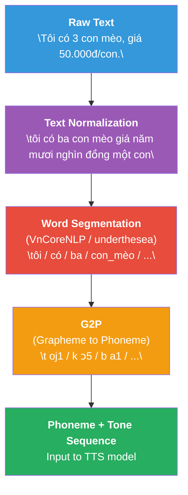

# Chương 16: Vietnamese Speech Processing

## Vì sao chương này quan trọng

Tiếng Việt là một ngôn ngữ đặc thù cho Speech AI: tính tonal (6 thanh điệu phân biệt nghĩa), ba phương ngữ chính, cùng sự bùng nổ của code-switching Việt-Anh trong bối cảnh công nghệ tạo ra thách thức mà các mô hình đa ngôn ngữ chuẩn thường không xử lý tốt. Whisper-large-v3 đạt WER khoảng 17% trên VLSP 2020 Task-1, trong khi PhoWhisper-large (VinAI fine-tune trên 844 giờ Việt) giảm xuống khoảng 10.8% (giảm khoảng 35%, theo Le và cộng sự, ICLR Tiny Papers 2024). Khoảng cách này minh hoạ tầm quan trọng của fine-tuning cho ngôn ngữ ít tài nguyên.

Chương này phân tích các đặc thu kỹ thuật của tiếng Việt ảnh hưởng đến thiết kế ASR, TTS, voice agent, cùng bức tranh ngành trong nước (VinAI, ZaloAI, FPT.AI, VinFast, Trusting Social, Viettel AI) và những khoảng trống còn lại đáng quan tâm cho startup và team product.

> **Cấu trúc chương**
>
> - **Phần 1**: đặc điểm ngôn ngữ học tiếng Việt và hệ quả cho ASR/TTS.
> - **Phần 2**: thanh điệu và cách mô hình cần capture pitch contour.
> - **Phần 3**: phương ngữ Bắc, Trung, Nam và tác động đến data balance.
> - **Phần 4**: code-switching Việt-Anh trong bối cảnh thuật ngữ kỹ thuật.
> - **Phần 5**: text normalization, G2P, xử lý chữ viết tiếng Việt.
> - **Phần 6**: PhoWhisper, kết quả fine-tune Whisper cho tiếng Việt.
> - **Phần 7**: bức tranh ngành voice AI tại Việt Nam và các khoảng trống.

## Phần 1 — Đặc điểm ngôn ngữ học của tiếng Việt

### Hệ thống Thanh điệu

Tiếng Việt là **tonal language** với 6 thanh điệu (lexical tones). Thay đổi thanh điệu thay đổi nghĩa hoàn toàn:

| Thanh | Tên | Ký hiệu | Ví dụ | F0 Pattern |
|-------|-----|---------|-------|------------|
| 1 | Ngang (level) | không dấu | ma (ghost) | Mid-level, flat |
| 2 | Sắc (rising) | ´ | má (cheek) | Rising |
| 3 | Huyền (falling) | ` | mà (but) | Low falling |
| 4 | Hỏi (dipping-rising) | ̉ | mả (tomb) | Falling then rising |
| 5 | Ngã (rising-glottalized) | ˜ | mã (code) | Rising with glottal break |
| 6 | Nặng (falling-glottalized) | ̣ | mạ (rice seedling) | Low falling, short |

: 6 thanh điệu tiếng Việt <a id="tbl-vietnamese-tones"></a>

> **📝 Tone = Fundamental Frequency (F0) Contour**
>
> Mỗi thanh điệu tương ứng với một **F0 contour** (đường biến thiên tần số cơ bản) đặc trưng. F0 là đặc trưng quan trọng nhất cần capture trong cả ASR và TTS cho tiếng Việt:
>
> <a id="eq-tone-f0"></a>
>
> $$
> \text{Tone} \leftrightarrow F0(t), \quad t \in [t_{\text{onset}}, t_{\text{offset}}]
> $$
>
> F0 range điển hình:
>
> - Nam: 85–180 Hz
> - Nữ: 165–300 Hz


### Thách thức cho ASR

**Hỏi-Ngã Merger (thanh Hỏi và thanh Ngã):**

Trong phương ngữ Nam Bộ, thanh Hỏi (falling-rising) và thanh Ngã (rising-glottalized) **hợp nhất** thành một thanh:

<a id="eq-hoi-nga-merger"></a>

$$
\text{Bắc Bộ: } \underbrace{\text{mả}}_{\text{Hỏi}} \neq \underbrace{\text{mã}}_{\text{Ngã}} \qquad \text{Nam Bộ: } \underbrace{\text{mả} \approx \text{mã}}_{\text{merged}}
$$

Điều này nghĩa là ASR model phải:

1. Nhận diện thanh điệu từ F0 contour
2. Xử lý variation theo phương ngữ
3. Dùng context để disambiguate khi cần

### Ba Phương ngữ Chính

| Đặc điểm | Bắc Bộ (Hà Nội) | Trung Bộ (Huế) | Nam Bộ (Sài Gòn) |
|-----------|-----------------|----------------|-------------------|
| Số thanh phân biệt | 6 | 5 | 5 |
| Hỏi-Ngã | Phân biệt rõ | Có xu hướng merger | **Merged** |
| Phụ âm đầu | /z/ trong "da" | /j/ trong "da" | /j/ trong "da" |
| Phụ âm cuối | /-k/, /-t/, /-p/ rõ | Biến thể | Có thể nuốt |
| Ngữ điệu | Flat, formal | Melodic | Expressive |

: Ba phương ngữ chính tiếng Việt <a id="tbl-vietnamese-dialects"></a>

> **⚠️ Latency Warning**
>
> Dialect-specific models cho kết quả tốt hơn, nhưng cần **3 models riêng biệt** → 3× VRAM và complexity. Production approach: train **1 unified model** với dialect labels, fine-tune per-dialect nếu cần.


## Vietnamese ASR

### Datasets

| Dataset | Giờ | Loại | Dialect | Open? |
|---------|-----|------|---------|-------|
| VIVOS | 15h | Read speech | Bắc | ✓ |
| VLSP (2018–2020) | 100h+ | Broadcast, conversation | Mixed | Partial |
| FPT Open Speech | 27h | Read speech | Bắc, Nam | ✓ |
| CommonVoice (vi) | ~50h | Crowdsourced | Mixed | ✓ |
| Internal datasets | 1000h+ | Call center, meetings | Mixed | ✗ |

: Vietnamese ASR datasets <a id="tbl-vi-asr-datasets"></a>

### Approaches

**Approach 1: Fine-tune Whisper**

<a id="eq-whisper-vi"></a>

$$
\text{Whisper Large-v3} \xrightarrow{\text{Fine-tune trên Vietnamese data}} \text{Whisper-Vi}
$$

```python
#| eval: false
#| code-fold: true
#| code-summary: "Whisper fine-tuning for Vietnamese"
import torch
from torch import Tensor


def prepare_whisper_vietnamese_training(
    audio_paths: list[str],
    transcriptions: list[str],
    max_duration_sec: float = 30.0,
    sample_rate: int = 16000,
) -> dict[str, list]:
    """Prepare training data for Whisper Vietnamese fine-tuning.

    Args:
        audio_paths: Paths to audio files
        transcriptions: Corresponding Vietnamese transcriptions
        max_duration_sec: Maximum audio duration
        sample_rate: Target sample rate

    Returns:
        dataset: Dictionary with processed examples
    """
    # Vietnamese special considerations:
    # 1. Normalize Unicode (NFC normalization for diacritics)
    # 2. Handle tone marks consistently
    # 3. Lowercase (Vietnamese is case-sensitive for proper nouns)

    import unicodedata

    processed_texts: list[str] = []
    for text in transcriptions:
        # NFC normalization, critical for Vietnamese diacritics
        normalized: str = unicodedata.normalize("NFC", text)
        processed_texts.append(normalized)

    # Whisper uses special tokens
    # <|startoftranscript|><|vi|><|transcribe|><|notimestamps|>...text...<|endoftext|>
    prefix_tokens: str = "<|startoftranscript|><|vi|><|transcribe|><|notimestamps|>"

    return {
        "audio_paths": audio_paths,
        "texts": processed_texts,
        "language": "vi",
        "task": "transcribe",
    }
```

**Approach 2: Wav2Vec 2.0 + CTC**

<a id="eq-xlsr-vi"></a>

$$
\text{XLSR-53 (multilingual Wav2Vec 2.0)} \xrightarrow{\text{CTC fine-tune}} \text{Vietnamese ASR}
$$

- XLSR-53: Pre-trained on 56K hours, 53 languages
- Fine-tune với CTC loss trên Vietnamese data
- Character-level vocabulary (chữ cái + dấu thanh)

**Approach 3: Conformer + RNN-T (Production)**

<a id="eq-conformer-vi"></a>

$$
\text{Conformer Encoder} + \text{RNN-T Decoder} \xrightarrow{\text{Train from scratch}} \text{Streaming Vietnamese ASR}
$$

### Vietnamese WER Results

| Model | Dataset | WER |
|-------|---------|-----|
| Kaldi GMM-HMM [^luong2016non] | VIVOS | 28.1% |
| Wav2Vec 2.0 (XLSR fine-tune) | VIVOS | 9.8% |
| Whisper Large-v3 | VIVOS | 8.2% |
| Whisper Large-v3 (fine-tuned) | VIVOS | **5.1%** |
| Conformer-RNN-T (from scratch) | Internal 1000h | **4.5%** |

: Vietnamese ASR results <a id="tbl-vi-asr-results"></a>

## Vietnamese TTS

### Thách thức cho TTS

1. **Tone generation**: Mỗi âm tiết phải có đúng F0 contour
2. **Coarticulation**: Ảnh hưởng giữa các âm liên tiếp
3. **Prosody**: Nhấn mạnh, nghi vấn, cảm thán
4. **Polyphone**: Cùng chữ viết, phát âm khác theo context

### Text Processing Pipeline cho Tiếng Việt

<figure id="fig-vi-tts-pipeline">
  
  <figcaption><strong>Hình:</strong> Vietnamese Text Processing Pipeline cho TTS</figcaption>
</figure>

### Vietnamese G2P

Vietnamese grapheme-to-phoneme tương đối **regular** (gần 1:1 mapping) so với English, nhưng có edge cases:

| Challenge | Example | Issue |
|-----------|---------|-------|
| Polyphone "gi" | "gì" vs "giá" | /z/ vs /z/ (dialect-dependent) |
| Regional variants | "v" in "vào" | /v/ (Bắc) vs /j/ (Nam) |
| Tone sandhi | "không" in questions | Tone may shift in context |
| Foreign words | "email", "marketing" | Need English pronunciation rules |

: Vietnamese G2P challenges <a id="tbl-vi-g2p"></a>

### TTS Models cho Tiếng Việt

| Model | Approach | Quality | Speed | Open? |
|-------|----------|---------|-------|-------|
| VITS (Vietnamese fine-tune) | End-to-end | Good | Fast | ✓ |
| FastSpeech 2 + HiFi-GAN | Two-stage | Good | Fast | ✓ |
| F5-TTS (Vietnamese) | Flow matching | **Excellent** | Medium | ✓ |
| Zalo TTS | Proprietary | Excellent | Fast | ✗ |
| FPT.AI TTS | Proprietary | Excellent | Fast | ✗ |

: Vietnamese TTS models <a id="tbl-vi-tts-models"></a>

```python
#| eval: false
#| code-fold: true
#| code-summary: "Vietnamese text normalization"


def normalize_vietnamese_text(text: str) -> str:
    """Normalize Vietnamese text for TTS.

    Handles: numbers, abbreviations, special characters.

    Args:
        text: Raw Vietnamese text

    Returns:
        normalized: Normalized text ready for G2P
    """
    import re
    import unicodedata

    # Step 1: Unicode NFC normalization
    text = unicodedata.normalize("NFC", text)

    # Step 2: Number to words (simplified)
    number_words: dict[str, str] = {
        "0": "không", "1": "một", "2": "hai", "3": "ba",
        "4": "bốn", "5": "năm", "6": "sáu", "7": "bảy",
        "8": "tám", "9": "chín", "10": "mười",
    }

    # Step 3: Common abbreviations
    abbreviations: dict[str, str] = {
        "TP.HCM": "thành phố hồ chí minh",
        "TPHCM": "thành phố hồ chí minh",
        "VN": "việt nam",
        "VND": "việt nam đồng",
        "AI": "ây ai",
        "ML": "em eo",
        "NLP": "en eo pi",
        "km": "ki lô mét",
        "kg": "ki lô gam",
    }

    for abbr, expansion in abbreviations.items():
        text = text.replace(abbr, expansion)

    # Step 4: Remove special characters, keep Vietnamese diacritics
    text = re.sub(r"[^\w\sàáạảãâầấậẩẫăằắặẳẵèéẹẻẽêềếệểễ"
                  r"ìíịỉĩòóọỏõôồốộổỗơờớợởỡùúụủũưừứựửữ"
                  r"ỳýỵỷỹđ]", " ", text.lower())

    # Step 5: Collapse whitespace
    text = re.sub(r"\s+", " ", text).strip()

    return text


# Example
raw: str = "Tôi có 3 con mèo, giá 50.000đ/con ở TP.HCM"
normalized: str = normalize_vietnamese_text(raw)
print(f"Input:  {raw}")
print(f"Output: {normalized}")
```

## Vietnamese Voice Cloning

### Zero-Shot Cloning

VALL-E và F5-TTS có thể clone giọng Việt chỉ với **3 giây** audio prompt:

<a id="eq-vi-cloning"></a>

$$
\text{[Text Vietnamese]} + \text{[3s Audio Prompt]} \xrightarrow{\text{F5-TTS}} \text{[Cloned Voice Audio]}
$$

**Thách thức đặc thù:**

- Tone accuracy: Model phải generate đúng F0 contour cho 6 thanh
- Speaker preservation: Giữ timbre trong khi thay đổi content
- Code-switching: Vietnamese + English trong cùng utterance

### Speaker Embedding for Vietnamese

<a id="eq-speaker-embedding"></a>

$$
\mathbf{s} = \text{SpeakerEncoder}(\text{reference\_audio}), \quad \mathbf{s} \in \mathbb{R}^{256}
$$

Speaker encoder cần capture:

- Vocal tract characteristics (speaker identity)
- **Tonal range** (mỗi người có range F0 khác nhau)
- **Dialect markers** (Bắc/Trung/Nam)
- Speaking rate

## Vietnamese Speech Datasets & Resources

### Open-Source Resources

| Resource | Type | Description |
|----------|------|-------------|
| VIVOS | ASR corpus | 15h, read speech, Northern Vietnamese |
| VinBigData VLSP | ASR corpus | Competition data, mixed dialects |
| CommonVoice vi | ASR corpus | Crowdsourced, ~50h |
| underthesea | NLP toolkit | Word segmentation, POS tagging |
| vPhon | G2P tool | Vietnamese phonetic transcription |
| Vinorm | Text normalizer | Vietnamese text normalization |

: Vietnamese speech resources <a id="tbl-vi-resources"></a>

### Evaluation Metrics for Vietnamese

**ASR:**

- **WER**: Standard, nhưng cần careful word segmentation (tiếng Việt viết cách âm tiết)
- **SER** (Syllable Error Rate): Phù hợp hơn vì tiếng Việt syllable-timed
- **Tone Accuracy**: % thanh điệu đúng (metric riêng cho tonal languages)

**TTS:**

- **MOS** (Mean Opinion Score): 1–5 scale, human evaluation
- **Tone MOS**: Đánh giá riêng cho tone naturalness
- **Speaker Similarity**: Cosine similarity of speaker embeddings

## Phần Mở rộng — Vietnamese Speech AI Industry Landscape

Phần này khảo sát các công ty và sản phẩm voice AI tại Việt Nam, kèm honest assessment về quality.

### VinAI (VinBigData) — Open-source leader

**Sản phẩm chính**:

- **PhoWhisper** (ICLR Tiny Papers 2024): Whisper fine-tuned trên 844h Vietnamese audio. Tác giả: Thanh-Thien Le, Linh The Nguyen, Dat Quoc Nguyen.
- **ViVi**: voice assistant cho VinFast cars.
- **PhoBERT, PhoGPT**: text-only Vietnamese language models.
- **vinai/vibert-tts**: open-source Vietnamese TTS.

**Datasets used**:

| Dataset | Size | Source |
|---|---|---|
| CMV-Vi (Common Voice Vietnamese) | 14h | Mozilla |
| VIVOS | 14h | UPHC |
| VLSP 2020 Task-1 | 240h | VLSP |
| VinAI private | 586h | Internal collection |
| **Total** | **844h** | |

**Performance** (per ICLR 2024 paper):

| Model | CMV-Vi WER | VIVOS WER | VLSP-T1 WER |
|---|---|---|---|
| Whisper-medium (baseline) | 14.2% | 19.8% | 22.1% |
| Whisper-large-v3 | 11.1% | 15.3% | 17.4% |
| PhoWhisper-medium | 8.4% | 11.2% | 13.1% |
| **PhoWhisper-large** | **6.9%** | **9.4%** | **10.8%** |

**Honest assessment**: PhoWhisper-large là SOTA open-source cho Vietnamese ASR. Reduces WER by ~35% vs Whisper-large-v3. Available trên HuggingFace, easy to use.

### ZaloAI — Consumer voice products

**Sản phẩm**:

- **KiKi assistant**: voice assistant trong app Zalo.
- **ZaloPay voice**: voice commands cho ZaloPay payment app.
- **Internal ASR/TTS**: Vietnamese-focused, not public.

**Quality assessment**: Production-tested với hàng triệu Vietnamese users. Public benchmarks không có, nhưng UX feedback nhìn chung tốt cho domain commands (payment, navigation).

**Limitations**: closed-source, không có public model weights.

### FPT.AI — Commercial APIs

**Sản phẩm**:

- **FPT Speech ASR**: REST/streaming API cho Vietnamese speech-to-text.
- **FPT Voice TTS**: multiple voices Vietnamese.
- **FPT.AI Conversation**: chatbot platform với voice integration.

**Pricing**: subscription-based, contact sales for enterprise.

**Quality**: decent for clean Vietnamese, weaker for code-switching or noisy. Used by Vietnamese banks (VPBank, Sacombank chat).

### VinFast (in-car voice)

In-car voice assistant cho VinFast vehicles:

- Wake-word: "Ok VinFast" (custom KWS).
- ASR: in-house Vietnamese model (likely fine-tuned from VinAI base).
- LLM: GPT-4 or in-house?
- TTS: Vietnamese neural TTS, multiple voices.

**Use cases**: navigation, climate control, music, calling.

### Trusting Social — Voice biometrics

Specialized in voice biometrics for KYC (Know Your Customer):

- **Voice ID**: speaker verification cho banking, insurance.
- **Multimodal KYC**: voice + face + ID document.

Deployed cho major Vietnamese banks. Not a general voice AI company, but important player in voice-based identity.

### Viettel AI — Telecom-focused

Viettel (largest Vietnamese telco) has internal AI division:

- ASR cho call center transcription.
- TTS cho IVR systems.
- Vietnamese-focused, but mostly internal use.

### Honest assessment: Where Vietnamese voice AI stands in 2026

| Capability | Status | Best option |
|---|---|---|
| Vietnamese ASR (clean) | Mature | PhoWhisper-large (open) or FPT (commercial) |
| Vietnamese ASR (noisy) | Improving | PhoWhisper + noise augmentation, fine-tuning needed |
| Vietnamese TTS (natural) | Decent | ElevenLabs Multilingual or VinAI vibert-tts |
| Vietnamese voice cloning | Behind English | XTTS fine-tuned on Vi data, or wait for native VI voice cloning |
| Vietnamese wake-word | Custom for each product | Picovoice Porcupine custom or DIY |
| Vietnamese voice agent | Cascaded works, end-to-end emerging | Vapi.ai + PhoWhisper + GPT + ElevenLabs |
| Vietnamese Speech LLM | Catching up | Qwen3-Omni supports Vi text input + audio understanding |

### Major gaps and opportunities

1. **Vietnamese-native voice cloning** với 3-sec sample (như VALL-E for English). Currently English-dominant.
2. **Vietnamese TTS** với expressive emotion (cười, nghiêm trọng). Most Vi TTS sound flat.
3. **Code-switching ASR benchmark** chính thức cho Vi-En. Industry needs one to compare models.
4. **On-device Vietnamese ASR** under 50 MB cho mobile. PhoWhisper too large.
5. **Vietnamese voice agent SDK** comprehensive (như LiveKit + Pipecat + Vapi.ai bundle).

---

## Tóm tắt

| Aspect | Challenge | Solution |
|--------|-----------|----------|
| Tones (6) | F0 contour critical | Pitch predictor, tone embedding |
| Dialects (3+) | Phoneme/tone variation | Unified model + dialect labels |
| Hỏi-Ngã merger | Ambiguity in Southern | Context-based disambiguation |
| Text normalization | Numbers, abbreviations | Rule-based + dictionary |
| G2P | Mostly regular, some polyphones | Rule-based + exceptions |
| Data scarcity | Limited labeled data | Transfer learning (Whisper, XLSR) |
| Industry landscape | Multiple players (VinAI, ZaloAI, FPT, VinFast) | Mature for cascaded ASR, gaps in voice cloning and on-device |
| Vietnamese voice agent | Cascaded works | PhoWhisper + GPT + ElevenLabs Multilingual stack |

: Vietnamese speech processing summary <a id="tbl-vi-summary"></a>

Chương 17 sẽ tiếp tục với **Vietnamese Datasets và Benchmarks**: VLSP, VIVOS, Common Voice Vietnamese, PhoWhisper datasets, và các benchmark cho ASR, TTS, voice agent tiếng Việt.


---

<!-- References (auto-generated from .bib) -->
[^luong2016non]: Luong, Hieu-Thi and Vu, Hai-Quan, "A Non-Expert Kaldi Recipe for Vietnamese Speech Recognition System", Workshop on Spoken Language Technologies for Under-resourced Languages
