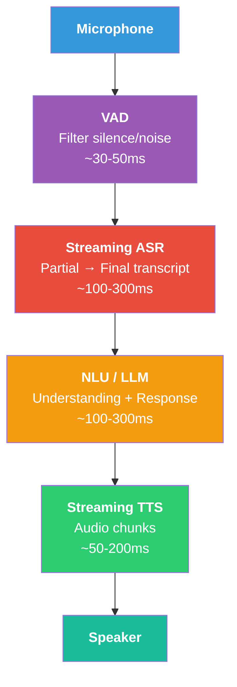
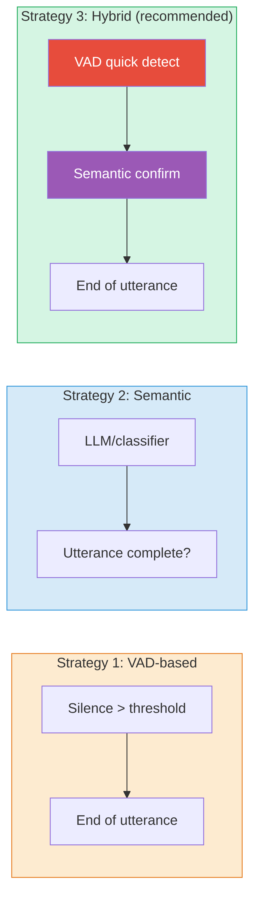
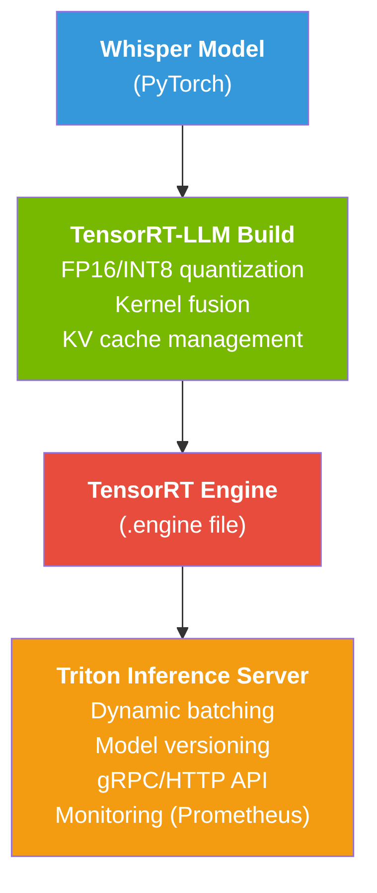
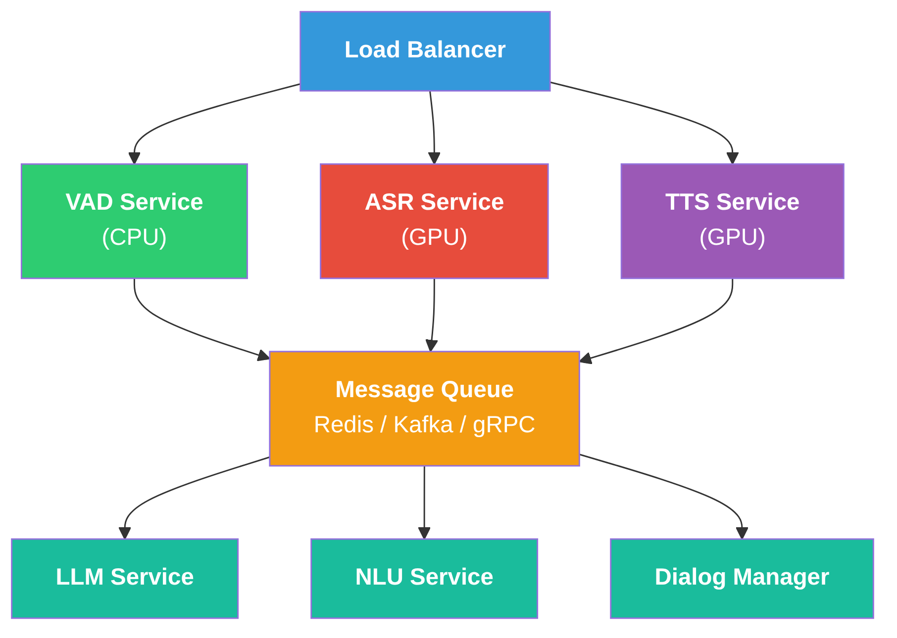

# Production Speech Systems

## End-to-End Voice AI Pipeline

Production voice AI system kết nối nhiều components thành pipeline hoàn chỉnh:

<figure markdown id="fig-voice-ai-pipeline">
  
  <figcaption>End-to-End Voice AI Pipeline (target latency < 1s)</figcaption>
</figure>

### Latency Budget

<a id="eq-latency-budget"></a>

$$
L_{\text{total}} = L_{\text{VAD}} + L_{\text{ASR}} + L_{\text{LLM}} + L_{\text{TTS}} + L_{\text{network}}
$$

| Component | Target Latency | Typical Range |
|-----------|---------------|---------------|
| VAD | 30–50ms | 20–100ms |
| Streaming ASR | 100–300ms | 50–500ms |
| LLM (first token) | 100–300ms | 50ms–2s |
| Streaming TTS | 50–200ms | 30–500ms |
| Network (2× RTT) | 50–100ms | 20–500ms |
| **Total** | **<1s** | **300ms–3s** |

: Latency budget breakdown <a id="tbl-latency-budget"></a>

> **⚠️ Latency Warning**
>
> **1 second rule**: Nghiên cứu UX cho thấy users bắt đầu cảm thấy delay sau **300ms** và **frustrated** sau **1 second**. Conversation flow bị phá vỡ sau **2 seconds**. Target < 1s cho acceptable experience.


## Voice Activity Detection (VAD)

### Bài toán

VAD phân loại mỗi audio frame là **speech** hoặc **non-speech**:

<a id="eq-vad"></a>

$$
\hat{y}_t = \begin{cases} 1 & \text{if frame } t \text{ contains speech} \\ 0 & \text{otherwise} \end{cases}
$$

### Silero VAD

Silero VAD  -  lightweight model phổ biến nhất cho production:

| Feature | Value |
|---------|-------|
| Model size | ~2MB |
| Latency | <1ms per frame |
| Frame size | 30ms / 60ms / 90ms |
| Accuracy | >99% trên clean speech |
| Languages | Language-agnostic |

: Silero VAD specifications <a id="tbl-silero-vad"></a>

```python
#| eval: false
#| code-fold: true
#| code-summary: "VAD-based audio segmentation"
import torch
from torch import Tensor


class VADSegmenter:
    """Voice Activity Detection based audio segmenter.

    Segments continuous audio stream into speech chunks.
    """

    def __init__(
        self,
        threshold: float = 0.5,
        min_speech_ms: int = 250,
        min_silence_ms: int = 300,
        sample_rate: int = 16000,
        window_ms: int = 30,
    ) -> None:
        self.threshold: float = threshold
        self.min_speech_frames: int = min_speech_ms // window_ms
        self.min_silence_frames: int = min_silence_ms // window_ms
        self.sample_rate: int = sample_rate
        self.window_size: int = sample_rate * window_ms // 1000

        # State for streaming
        self.speech_count: int = 0
        self.silence_count: int = 0
        self.is_speaking: bool = False
        self.buffer: list[Tensor] = []

    def process_frame(
        self,
        frame: Tensor,          # [window_size] - float32
        speech_prob: float,     # VAD probability for this frame
    ) -> tuple[bool, Tensor | None]:
        """Process single audio frame.

        Args:
            frame: Audio frame [window_size] - float32
            speech_prob: Speech probability (0-1)

        Returns:
            segment_complete: Whether a complete segment is ready
            segment: Complete speech segment or None
        """
        self.buffer.append(frame)

        if speech_prob >= self.threshold:
            self.speech_count += 1
            self.silence_count = 0

            if not self.is_speaking and self.speech_count >= self.min_speech_frames:
                self.is_speaking = True
        else:
            self.silence_count += 1

            if self.is_speaking and self.silence_count >= self.min_silence_frames:
                # End of speech segment
                self.is_speaking = False
                segment: Tensor = torch.cat(self.buffer)
                # [total_samples] - float32
                self.buffer = []
                self.speech_count = 0
                return True, segment

        return False, None
```

## Streaming ASR

### Streaming vs Offline

| Aspect | Offline | Streaming |
|--------|---------|-----------|
| Input | Complete utterance | Audio chunks |
| Latency | High (wait for end) | Low (process in real-time) |
| Accuracy | Higher (full context) | Lower (partial context) |
| Architecture | Bidirectional encoder | **Causal/chunked** encoder |
| Use case | Transcription | Voice assistant, live caption |

: Streaming vs offline ASR <a id="tbl-streaming-vs-offline"></a>

### Chunked Streaming

Chia audio thành chunks và process incrementally:

<a id="eq-chunked-streaming"></a>

$$
\begin{aligned}
\text{Chunk}_1 &: [0, C] & \to \text{Partial}_1 \\
\text{Chunk}_2 &: [C, 2C] & \to \text{Partial}_2 \\
&\vdots \\
\text{Chunk}_N &: [(N-1)C, NC] & \to \text{Final}
\end{aligned}
$$

với chunk size $C$ thường là 160ms–640ms.

### Latency-Accuracy Trade-off

<a id="eq-streaming-latency"></a>

$$
\text{Latency} \propto C + L_{\text{lookahead}}
$$

| Chunk Size | Lookahead | Latency | WER Increase |
|-----------|-----------|---------|--------------|
| 160ms | 0 | 160ms | +15% relative |
| 320ms | 160ms | 480ms | +8% relative |
| 640ms | 320ms | 960ms | +3% relative |
| Full utterance | Full | >2s | Baseline |

: Streaming ASR latency-accuracy trade-off <a id="tbl-streaming-tradeoff"></a>

### Endpointing

Endpointing quyết định **khi nào user đã nói xong**:

<figure id="fig-endpointing">
  
  <figcaption><strong>Hình:</strong> 3 Endpointing Strategies</figcaption>
</figure>

## Streaming TTS

### Chunk-based Generation

Thay vì generate toàn bộ audio rồi play, streaming TTS tạo và play **từng chunk**:

<a id="eq-streaming-tts"></a>

$$
\text{Text} \xrightarrow{\text{chunk}_1} \text{Audio}_1 \xrightarrow{\text{play}} \text{chunk}_2 \xrightarrow{\text{play}} \cdots
$$

### First-Chunk Latency

<a id="eq-tts-first-chunk"></a>

$$
L_{\text{TTS, first}} = L_{\text{text\_process}} + L_{\text{mel\_first\_chunk}} + L_{\text{vocoder\_first\_chunk}}
$$

| TTS Model | First Chunk Latency | Total RTF |
|-----------|--------------------|---------  |
| FastSpeech 2 + HiFi-GAN | **~30ms** | 0.02 |
| VITS | ~50ms | 0.01 |
| F5-TTS | ~200ms | 0.15 |
| VALL-E | ~1000ms | 0.8 |

: TTS first-chunk latency <a id="tbl-tts-latency"></a>

## Inference Optimization

### Quantization

<a id="eq-quantization-chain"></a>

$$
\text{FP32 (4B)} \xrightarrow{\text{FP16}} \text{FP16 (2B)} \xrightarrow{\text{INT8}} \text{INT8 (1B)} \xrightarrow{\text{INT4}} \text{INT4 (0.5B)}
$$

| Precision | Memory | Speed vs FP32 | Quality Loss |
|-----------|--------|---------------|-------------|
| FP32 | 1× | 1× | None |
| FP16 | 0.5× | 1.5–2× | Negligible |
| INT8 | 0.25× | 2–3× | Minor (<1% WER) |
| INT4 | 0.125× | 3–4× | Moderate (1–3% WER) |

: Quantization trade-offs <a id="tbl-quantization"></a>

> **⚠️ Latency Warning**
>
> Quantization impact varies by model:
>
> - **Whisper**: INT8 ảnh hưởng rất ít (<0.5% WER increase)
> - **TTS models**: FP16 safe, INT8 có thể ảnh hưởng quality (audible artifacts)
> - **Vocoders (HiFi-GAN)**: Rất nhạy cảm  -  recommend FP16 minimum
>
> Rule of thumb: ASR INT8 ok, TTS keep FP16.


### KV Cache Optimization

Cho autoregressive models (Whisper decoder, VALL-E):

<a id="eq-kv-cache"></a>

$$
\text{Memory}_{\text{KV}} = 2 \times n_{\text{layers}} \times n_{\text{heads}} \times d_{\text{head}} \times L_{\text{seq}} \times \text{dtype\_size}
$$

Optimization strategies:

- **Paged Attention** (vLLM): Quản lý KV cache theo pages, tránh fragmentation
- **Multi-Query Attention (MQA)**: Chia sẻ K,V heads → giảm KV cache size
- **Sliding Window**: Chỉ cache $W$ recent tokens thay vì toàn bộ

### Batching Strategies

| Strategy | Throughput | Latency | Use Case |
|----------|-----------|---------|----------|
| No batching | Low | **Lowest** | Single user, real-time |
| Static batching | Medium | Medium | Offline transcription |
| **Dynamic batching** | **High** | Low | Production server |
| Continuous batching | **Highest** | Low | High-traffic API |

: Batching strategies <a id="tbl-batching"></a>

```python
#| eval: false
#| code-fold: true
#| code-summary: "Dynamic batching for ASR"
import torch
import time
from torch import Tensor
from dataclasses import dataclass, field


@dataclass
class ASRRequest:
    """Single ASR request."""

    audio: Tensor            # [1, T_samples] - float32
    request_id: str
    timestamp: float = field(default_factory=time.time)
    result: str | None = None


class DynamicBatcher:
    """Dynamic batching for ASR inference.

    Collects requests and batches them for efficient GPU utilization.
    """

    def __init__(
        self,
        max_batch_size: int = 16,
        max_wait_ms: float = 50.0,
        max_audio_length: int = 480000,  # 30s at 16kHz
    ) -> None:
        self.max_batch_size: int = max_batch_size
        self.max_wait_ms: float = max_wait_ms
        self.max_audio_length: int = max_audio_length
        self.queue: list[ASRRequest] = []

    def add_request(self, request: ASRRequest) -> None:
        """Add request to queue."""
        self.queue.append(request)

    def should_process(self) -> bool:
        """Check if batch should be processed.

        Returns:
            True if batch is ready (full or timeout)
        """
        if len(self.queue) == 0:
            return False
        if len(self.queue) >= self.max_batch_size:
            return True
        # Check timeout
        oldest: float = self.queue[0].timestamp
        wait_ms: float = (time.time() - oldest) * 1000
        return wait_ms >= self.max_wait_ms

    def get_batch(self) -> tuple[Tensor, list[ASRRequest]]:
        """Get padded batch of audio.

        Returns:
            batch: Padded audio [B, max_T] - float32
            requests: Corresponding request objects
        """
        batch_requests: list[ASRRequest] = self.queue[:self.max_batch_size]
        self.queue = self.queue[self.max_batch_size:]

        # Pad to max length in batch
        max_len: int = max(r.audio.size(-1) for r in batch_requests)
        max_len = min(max_len, self.max_audio_length)

        batch_size: int = len(batch_requests)
        batch: Tensor = torch.zeros(
            batch_size, max_len,
        )  # [B, max_T] - float32

        for i, req in enumerate(batch_requests):
            length: int = min(req.audio.size(-1), max_len)
            batch[i, :length] = req.audio[0, :length]

        return batch, batch_requests
```

## TensorRT-LLM & Triton Inference Server

### TensorRT-LLM cho Whisper

<figure id="fig-tensorrt-triton">
  
  <figcaption><strong>Hình:</strong> TensorRT-LLM + Triton Inference Server Pipeline</figcaption>
</figure>

### Performance with TensorRT-LLM

| Configuration | RTF | Throughput | VRAM |
|--------------|-----|------------|------|
| Whisper Large-v3 (PyTorch FP16) | 0.03 | 33× RT | 6 GB |
| Whisper Large-v3 (TRT-LLM FP16) | 0.01 | **100× RT** | 4 GB |
| Whisper Large-v3 (TRT-LLM INT8) | 0.008 | **125× RT** | 2.5 GB |

: TensorRT-LLM Whisper performance <a id="tbl-trt-whisper"></a>

## Production Architecture

### Microservice Architecture

<figure id="fig-microservice-arch">
  
  <figcaption><strong>Hình:</strong> Production Microservice Architecture</figcaption>
</figure>

### GPU Resource Planning

| Component | Model | VRAM | GPU Type |
|-----------|-------|------|----------|
| ASR | Whisper Large-v3 (INT8) | 2.5 GB | T4 / L4 |
| TTS | VITS / FastSpeech 2 (FP16) | 1 GB | T4 / L4 |
| LLM | Qwen2-7B (INT4) | 4 GB | A10G / L4 |
| Voice Cloning | F5-TTS (FP16) | 3 GB | A10G |
| **Total** | - | **~10.5 GB** | **1× A10G (24GB)** |

: GPU resource planning <a id="tbl-gpu-planning"></a>

> **📝 Cost Optimization**
>
> - **Spot/preemptible instances**: 60–70% cheaper, OK cho batch processing
> - **Autoscaling**: Scale GPU pods dựa trên request queue length
> - **Model sharing**: Nhiều models trên 1 GPU với time-sharing
> - **CPU fallback**: VAD, text normalization, G2P chạy trên CPU


## Monitoring & Observability

### Key Metrics

| Metric | Target | Alert Threshold |
|--------|--------|----------------|
| E2E latency (P50) | <800ms | >1.2s |
| E2E latency (P99) | <2s | >3s |
| ASR WER | <10% | >15% |
| TTS MOS (auto) | >3.5 | <3.0 |
| Availability | 99.9% | <99.5% |
| GPU utilization | 60–80% | <30% or >95% |

: Production monitoring metrics <a id="tbl-monitoring"></a>

## Tóm tắt

| Topic | Key Takeaway |
|-------|-------------|
| Pipeline | VAD → ASR → LLM → TTS, target <1s E2E |
| Streaming | Chunked processing cho cả ASR và TTS |
| Optimization | INT8 cho ASR, FP16 cho TTS, dynamic batching |
| Infrastructure | TensorRT-LLM + Triton, microservice architecture |
| Monitoring | P50/P99 latency, WER, MOS, GPU utilization |

: Production speech systems summary <a id="tbl-production-summary"></a>

<a id="eq-production-formula"></a>

$$
\text{Production Speech AI} = \text{Model Quality} \times \text{Inference Speed} \times \text{System Reliability}
$$

Mỗi yếu tố đều quan trọng  -  model tốt nhưng chậm sẽ không được users chấp nhận, model nhanh nhưng kém chất lượng sẽ bị bỏ qua.
