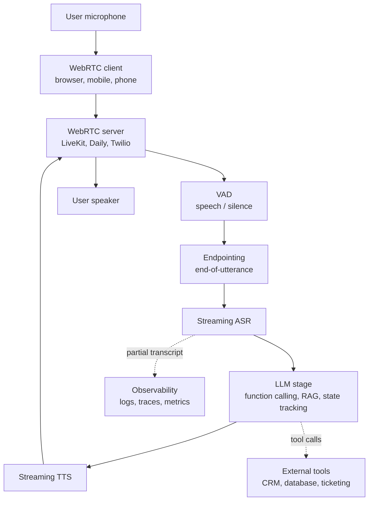

# Chương 20: Production Speech Systems

## Mở đầu: Vì sao “train được model tốt” chưa đồng nghĩa với “triển khai được sản phẩm tốt”

Trong môi trường nghiên cứu, một hệ thống speech thường được đánh giá bằng benchmark có dữ liệu sạch, protocol cố định và metric rõ ràng như WER, MOS hoặc real-time factor. Khi đưa hệ thống đó vào sản phẩm, điều kiện vận hành thay đổi căn bản: người dùng nói qua microphone kém, có tiếng ồn nền, ngắt lời giữa chừng, code-switch giữa tiếng Việt và tiếng Anh, hoặc sử dụng thiết bị mạng không ổn định. Vì vậy, một model đạt kết quả tốt trong phòng thí nghiệm vẫn có thể tạo trải nghiệm kém nếu latency cao, endpointing sai, chi phí inference vượt ngân sách, hoặc observability không đủ để truy vết lỗi.

Chương này đặt trọng tâm vào khoảng cách giữa **model quality** và **product quality**. Thay vì chỉ hỏi “WER thấp đến đâu?”, ta cần hỏi thêm: p95 latency là bao nhiêu, hệ thống chịu được bao nhiêu phiên đồng thời, chi phí trên mỗi phút hội thoại là gì, fallback hoạt động ra sao khi một vendor lỗi, và team vận hành sẽ debug một cuộc gọi thất bại bằng dữ liệu nào. Đây là những câu hỏi quyết định khả năng triển khai voice AI trong doanh nghiệp.

Mục tiêu của chương là cung cấp một khung phân tích thực dụng cho production speech systems: latency budget, cost economics, observability, deployment patterns, failure modes, và các trade-off thường không xuất hiện đầy đủ trong paper.

> **📝 Cấu trúc chương**
>
> Phần 1-2: production constraints reality (latency, concurrency, cost, SLA).
> Phần 3-4: architecture chi tiết cho voice agent đa năng + latency optimization.
> Phần 5-6: real production stacks (case studies từ ElevenLabs, Cartesia, Deepgram, OpenAI Realtime) + cost engineering.
> Phần 7-8: deployment patterns + observability.
> Phần 9: production pitfalls và root cause analysis.
> Phần 10: Vietnamese production reality (ZaloAI, VinAI, Trusting Social context).
> Phần 11: recommended starter stack + summary.

> **Lưu ý về số liệu**
>
> Các con số trong chương này được diễn giải từ nguồn công khai như pricing pages, tài liệu kỹ thuật, bài viết engineering hoặc talk công khai. Những giá trị mang tính ước lượng sẽ được ghi rõ là `estimated` hoặc `approximate`. Khi không có dữ liệu công khai đáng tin cậy, chương này sẽ nói rõ “không có public data” thay vì suy đoán.

---

## Phần 1 — Production Constraints Reality Check

Khi chuyển từ môi trường nghiên cứu sang production, bốn ràng buộc thường tạo khác biệt lớn nhất là latency, concurrency, cost và SLA. Phần này phân tích từng ràng buộc theo cách có thể dùng để thiết kế hệ thống thật.

### 1.1 Latency: con người không kiên nhẫn như benchmark

Trong nghiên cứu, latency đôi khi được báo cáo gián tiếp qua real-time factor, ví dụ xử lý 10 giờ audio trong 1 giờ tương ứng RTF 0.1. Chỉ số này đo **throughput**, không đo trực tiếp **interactive latency** mà người dùng cảm nhận trong hội thoại.

Trong sản phẩm voice agent, latency nên được đo từ thời điểm người dùng kết thúc lượt nói đến khi họ nghe được phản hồi đầu tiên. Trong hội thoại tự nhiên giữa người với người, khoảng ngắt giữa hai lượt nói thường rất ngắn, nên khi voice AI vượt 1 giây, độ trễ đã bắt đầu trở nên rõ ràng. Khi vượt 2 giây, nhiều người dùng sẽ lặp lại câu hỏi hoặc rời bỏ tương tác.

Bảng sau tóm tắt một cách thực dụng mối liên hệ giữa latency và cảm nhận của người dùng:

| Latency | Cảm nhận của người dùng |
|---|---|
| < 200 ms | Như đối thoại người với người (natural turn-taking) |
| 200-500 ms | Chấp nhận được, bắt đầu có cảm giác hơi trễ |
| 500 ms-1 s | Cảm giác hệ thống đang suy nghĩ, độ trễ đã rõ |
| 1-2 s | Người dùng bắt đầu mất nhịp hội thoại |
| > 2 s | Người dùng có xu hướng lặp lại yêu cầu hoặc rời bỏ tương tác |

> **Vì sao mốc 200 ms thường được nhắc đến?**
>
> Nghiên cứu về turn-taking trong hội thoại (Stivers et al., 2009) cho thấy khoảng ngắt giữa hai lượt nói của con người thường quanh vài trăm mili-giây, với trung vị xấp xỉ 200 ms trong nhiều ngôn ngữ. Đây không phải một ngưỡng cứng, nhưng là mốc tham chiếu hữu ích khi thiết kế voice agent tương tác thời gian thực.
>
> Vì vậy, production voice agents thường đặt mục tiêu dưới 1 giây cho phản hồi đầu tiên. Mỗi 100 ms giảm được ở endpointing, ASR, LLM hoặc TTS đều có thể cải thiện đáng kể cảm nhận hội thoại.

### 1.2 Concurrency: từ một phiên thử nghiệm đến hàng nghìn phiên đồng thời

Trong thử nghiệm nghiên cứu, ta thường đánh giá từng sample hoặc từng batch offline. Trong production, hệ thống phải phục vụ hàng trăm đến hàng nghìn phiên đồng thời, và điều này tạo ra các hệ quả kiến trúc rất cụ thể:

1. **GPU sharing**: một GPU H100 có thể phục vụ bao nhiêu phiên Whisper streaming phụ thuộc mạnh vào batch scheduler, context length, precision và model size. Con số thực tế phải được đo bằng load test, không suy ra trực tiếp từ benchmark offline.
2. **Memory pressure**: KV cache cho ASR streaming, LLM và TTS có thể tăng nhanh theo số phiên. Ví dụ 100 phiên, mỗi phiên dùng khoảng 200 MB trạng thái trung gian, đã tiêu thụ khoảng 20 GB RAM. Vì vậy cần quản lý bộ nhớ theo trang, offloading hoặc giới hạn context hợp lý.
3. **Network bandwidth**: một stream audio 16 kHz, 16-bit mono tương đương khoảng 256 kbps trước nén. Với 1000 phiên đồng thời, băng thông thô có thể lên tới khoảng 250 Mbps. Thiết kế production cần tính cả overhead WebRTC, retransmission và region routing.
4. **Database/queue throughput**: nếu log mọi partial transcript vào database, 1000 phiên đồng thời với 4 bản ghi mỗi giây tạo ra 4000 writes/sec. Đây là tải lớn với một instance Postgres đơn lẻ nếu không có batching, queue hoặc sampling.

### 1.3 Cost: economics quyết định khả thi

Voice AI agent có cấu trúc chi phí phức tạp hơn text chatbot vì mỗi phút hội thoại kích hoạt nhiều lớp hạ tầng: WebRTC, VAD, ASR, LLM, TTS, logging và orchestration.

**Per-minute cost cho voice agent đa năng (estimated từ public pricing tháng 11/2025)**:

| Component | Vendor (example) | Cost/min |
|---|---|---|
| WebRTC infrastructure | LiveKit | 0.002-0.005 USD |
| Streaming ASR | Deepgram Nova-3 | 0.0036 USD |
| LLM (GPT-4o-mini, 1 round per 5 sec) | OpenAI | ~0.005-0.015 USD |
| Streaming TTS | Cartesia Sonic | ~0.005-0.020 USD (depends on chars) |
| Voice agent orchestration | Vapi.ai bundle | 0.05 USD |
| **TỔNG ESTIMATE** | (various) | **~0.05-0.15 USD/min** |

Nếu một người dùng nói 30 phút mỗi ngày trong 30 ngày, tổng thời lượng là 900 phút/tháng. Với chi phí ước lượng 0.10 USD/phút, chi phí hạ tầng riêng cho voice đã khoảng 90 USD/tháng cho mỗi người dùng. Đây là mức cao so với nhiều sản phẩm subscription dạng text, vì vậy bài toán monetization và cost reduction phải được đặt từ đầu.

**Ý nghĩa thực tế**: để voice AI phù hợp với consumer mass market, chi phí cần giảm đáng kể. Các hướng như codec bitrate thấp, on-device inference, mô hình nhỏ chuyên biệt và caching theo phiên đều nhằm giảm bandwidth, cloud inference và chi phí orchestration.

### 1.4 SLA: 99.9% và downtime planning

Khách hàng enterprise thường kỳ vọng SLA 99.9% (downtime khoảng 43 phút/tháng) hoặc 99.99% (khoảng 4 phút/tháng). Với voice AI, mục tiêu này khó hơn web API thông thường vì:

- GPU instances có failure rate cao hơn CPU.
- Streaming sessions khó khôi phục mượt mà khi server restart giữa cuộc gọi.
- Multi-region failover khó với stateful conversations.

Các chiến lược thực dụng gồm:

1. **Multi-region active-active**: deploy ở 2+ regions, route based on health.
2. **Graceful degradation**: nếu cloud LLM down, fallback to canned responses.
3. **Session state replication**: replicate session state cross-region (Redis cluster).
4. **Health checks ở mọi layer**: WebRTC, ASR, LLM, TTS, mỗi cái có readiness probe riêng.

---

## Phần 2 — End-to-End Architecture cho Voice Agent

Bây giờ vào kiến trúc cụ thể. Đây là blueprint cho voice agent đa năng, được dùng bởi Vapi, ElevenLabs, LiveKit + custom stacks.

### 2.1 Pipeline tổng quan



**Hình:** Pipeline voice agent production là một hệ thống streaming end-to-end. Mỗi cạnh trong sơ đồ đều có latency, failure mode và telemetry riêng; vì vậy tối ưu production cần quan sát toàn bộ chuỗi thay vì chỉ tối ưu model ASR hoặc TTS riêng lẻ.

### 2.2 Voice Activity Detection (VAD)

VAD là bước đầu tiên: detect khi user đang nói (vs silent). Tại sao cần?

1. **Save compute**: không gửi silent audio đến ASR.
2. **Detect end of utterance**: combined với endpointing.
3. **Detect interruptions**: nếu user nói khi AI đang nói, cần barge-in handling.

**Popular VAD options**:

- **Silero VAD** (open source): 100ms windows, very accurate, dùng được trên CPU.
- **WebRTC VAD** (Google): rất nhanh nhưng kém accurate hơn.
- **Picovoice Cobra** (commercial): proprietary, optimized cho on-device.

VAD output là binary signal "speech / not speech" per audio frame (typically 10-30ms).

### 2.3 Endpointing

Endpointing đặc biệt khó. Cần distinguish:

- Pause ngắn giữa words (continue listening): ~100-300ms.
- Pause cuối câu (begin processing): ~500-1500ms.
- User confusion / hesitation (continue listening): vary.

Strategy thường dùng:

1. **Silence-based threshold**: end nếu silence > X ms (X = 500-1500 tuỳ adjust per user).
2. **Acoustic features**: detect falling intonation (end of statement) vs rising (question incomplete).
3. **LLM-based**: send partial transcript to LLM, ask "is this complete utterance?". Slow nhưng accurate.

Modern voice agents use hybrid: silence threshold + LLM check for edge cases.

### 2.4 Streaming ASR pipeline details

Cho streaming ASR, có 2 output types:

- **Interim** (partial): low-confidence, updates frequently (every 100-200ms).
- **Final**: high-confidence, only emitted khi endpoint detected.

LLM được prompt khi final result available. Interim results dùng để hiển thị "you said: ..." UI feedback.

### 2.5 LLM stage với function calling

LLM stage không chỉ generate text response. Modern voice agents support:

1. **Function calling**: agent gọi tools (book appointment, query database, send email).
2. **RAG**: retrieve context từ knowledge base trước khi answer.
3. **State tracking**: maintain conversation state across turns.
4. **Persona conditioning**: system prompt với personality, brand voice.

Cost optimization: dùng smaller models (GPT-4o-mini, Claude Haiku) cho most queries, escalate to larger only khi cần.

### 2.6 Streaming TTS với streaming output

TTS phải start outputting audio ngay khi text bắt đầu generate, không chờ LLM finish. Đây là **streaming-to-streaming pipeline**.

```python
async def stream_response(user_audio_stream):
    async for partial_transcript in streaming_asr(user_audio_stream):
        yield ("interim", partial_transcript)
    
    final_transcript = await wait_for_final()
    yield ("final", final_transcript)
    
    async for text_chunk in llm_stream(final_transcript):
        async for audio_chunk in tts_stream(text_chunk):
            yield ("audio", audio_chunk)
```

Latency-critical: TTS first byte phải đến trước khi LLM finish generating, để user nghe response ngay.

### 2.7 Interruption handling (barge-in)

Khi user nói khi AI đang phát, cần:

1. Stop TTS playback immediately.
2. Cancel current LLM generation.
3. Start ASR on new user audio.
4. Resume conversation flow with new context.

Đây là một trong những điểm khó nhất của full-duplex voice agents. Moshi giải quyết bằng dual-stream architecture native. Cascaded systems phải handle manually qua state machine.

---

## Phần 3 — Latency Optimization Deep Dive

Cho voice agent, latency là king. Phần này về các techniques để giảm latency.

### 3.1 Latency budget allocation

Cho target tổng < 1 sec end-to-end, breakdown typical:

| Stage | Budget |
|---|---|
| Audio capture + WebRTC roundtrip | 50-100 ms |
| VAD + Endpointing | 100-300 ms |
| Streaming ASR (final result) | 200-400 ms |
| LLM first token | 200-500 ms |
| TTS first byte | 75-200 ms |
| Audio playback + WebRTC roundtrip | 50-100 ms |
| **Total** | **675-1600 ms** |

Khó đạt sub-second consistently. Aim for p50 < 1s, p95 < 1.5s, p99 < 3s.

### 3.2 First-byte latency vs end-to-end latency

Distinguish hai metrics:

- **First-byte (FB)**: time from "user finished speaking" to "first audio sample of response plays".
- **End-to-end (E2E)**: time from "user start speaking" to "AI finished response".

FB matters cho UX (user perceive "responsiveness"). E2E matters cho throughput (sessions per second per server).

Optimize FB by:

1. Speculative LLM execution (predict response before user finish).
2. Streaming TTS với rất low first-byte (Cartesia Flash ~75ms).
3. Pre-fetch common responses (greetings, fallbacks).

### 3.3 Speculative decoding for TTS

Cho LLM-driven voice agent, LLM thường output text faster than TTS can speak. Bạn có thể:

1. Generate full LLM response.
2. Send to TTS in chunks (sentence-by-sentence).
3. TTS starts speaking first chunk while later chunks queue.

Modern TTS (Cartesia Sonic 2) support "predictive" mode: TTS guesses next phoneme while previous is still being generated.

### 3.4 KV cache management cho streaming

Cho LLM driving voice agent, KV cache grows với conversation length. After 30 minutes of conversation, KV cache có thể 5-10GB. Management strategies:

1. **Truncation**: drop oldest tokens after X tokens.
2. **Summarization**: every N turns, summarize history into shorter prompt.
3. **Memory tiering**: hot tokens in HBM (GPU), warm in DDR (CPU), cold in SSD.

vLLM PagedAttention được dùng rộng rãi cho efficient KV cache.

### 3.5 Mel-to-wave streaming pipeline

Cho TTS streaming, có 2 paths:

**Path A (slower)**: text → mel spectrogram (full sentence) → vocoder → waveform → play.

**Path B (faster, streaming)**: text → mel mel-chunk-by-chunk → streaming vocoder → waveform chunks → play immediately.

Cartesia Sonic, ElevenLabs Flash dùng Path B với latency 75-200ms first byte.

### 3.6 GPU warm-start

Cold-start một LLM instance trên GPU có thể tốn 30-60 sec. Cho voice agent:

1. Keep instances warm (always-on).
2. Multi-instance pre-warmed pool.
3. Predict load và scale ahead.

Tools: Triton Inference Server, KServe, custom orchestrator.

---

## Phần 4 — Real Production Stacks (Case Studies)

Phần này khảo sát các production stacks thực tế. Tất cả info từ public docs, blog posts, conference talks. Không có insider info.

### 4.1 ElevenLabs Conversational AI

ElevenLabs cung cấp full voice agent platform:

- **ASR**: in-house ASR (model details không public).
- **LLM**: bring-your-own (OpenAI, Anthropic, Google) hoặc ElevenLabs default.
- **TTS**: ElevenLabs Multilingual v2, Flash v2 (75ms first byte).
- **Orchestration**: ElevenLabs Conversational AI platform.

Pricing (public per nov 2025): starts at 0.08-0.12 USD/min for voice agent (bundled).

### 4.2 Cartesia Sonic

Cartesia focus on TTS specifically, có Sonic và Sonic 2:

- **Sonic**: streaming TTS, 75-150ms first byte.
- **Sonic 2** (2024): improved naturalness, voice cloning với 3-sec sample.
- **Use case**: pair with any ASR (Deepgram) + any LLM.

Pricing: 0.022 USD/1k chars (Sonic), 0.04 USD/1k chars (Sonic 2).

### 4.3 Deepgram Aura + Nova

Deepgram offers full stack:

- **Nova-3 ASR**: streaming, multilingual, 0.0036 USD/min.
- **Aura-2 TTS**: streaming, ~100-200ms first byte.
- **Voice Agent API**: bundled STT + LLM + TTS với orchestration.

Pricing voice agent: ~0.05 USD/min (bundled).

### 4.4 OpenAI Realtime API (GPT-Realtime, Aug 2025)

OpenAI direct speech-to-speech via single model:

- **Model**: gpt-realtime (GA Aug 2025).
- **Features**: MCP server support, image input, SIP phone calling.
- **Latency**: target sub-500ms (per public docs).
- **Pricing**: ~0.03 USD/min input + 0.06 USD/min output.

Differences vs cascaded: GPT-Realtime is single model, no separate ASR/LLM/TTS stages. Better naturalness và faster latency, but harder to debug và less control.

### 4.5 LiveKit + Pipecat + Vapi.ai open-source stack

For developers wanting full control:

- **LiveKit**: WebRTC infrastructure (open source, self-host or cloud).
- **Pipecat**: pipeline framework cho voice agent (open source, Python).
- **Vapi.ai**: voice agent platform (commercial, but with self-host option).

Stack example:

```
LiveKit (WebRTC) → Pipecat orchestrator → 
  Deepgram (ASR) → 
  OpenAI GPT-4o-mini (LLM) → 
  Cartesia (TTS) → 
LiveKit (playback)
```

Total cost: ~0.05 USD/min if using cloud APIs, lower if self-hosting components.

### 4.6 Moshi self-host

Cho team muốn fully open-source và self-host:

- **Model**: Moshi 7.6B params, single end-to-end speech-to-speech.
- **Hardware**: 1x A100 80GB or 2x A100 40GB cho realtime.
- **Latency**: ~200ms theoretical, ~300ms practical.
- **Setup**: pip install moshi, requires PyTorch + MLX (Mac).
- **Limitations**: English only, smaller knowledge base than GPT-4.

Use case: research, learning, or specific deployment với strict data privacy.

---

## Phần 5 — Cost Engineering

Voice AI cost structure unique và đáng quan tâm.

### 5.1 LLM inference cost breakdown

Cho voice agent typical 30-phút conversation:

- User utterances: ~50 total, avg 5 sec each (250 sec total).
- AI responses: ~50 total, avg 10 sec each (500 sec total).
- LLM context: builds up to ~2000-5000 tokens by end.

Cost per session:

- GPT-4o-mini input tokens: ~50 turns × ~500 tokens context = 25000 tokens = 0.15 × 25000/M = 0.004 USD.
- GPT-4o-mini output tokens: ~50 turns × ~50 tokens response = 2500 tokens = 0.60 × 2500/M = 0.0015 USD.
- LLM total per session: ~0.005-0.010 USD.

Per minute: ~0.003-0.005 USD chỉ riêng LLM.

### 5.2 TTS cost per character

TTS cost = chars synthesized × rate.

Average voice agent response ~50 words ~250 chars. 50 responses × 250 chars = 12,500 chars per session.

- Cartesia Sonic: 12,500 / 1000 × 0.022 = 0.275 USD per 30-min session.
- ElevenLabs Flash: 12,500 / 1000 × 0.18 = 2.25 USD per 30-min session (much more expensive).

Per minute: Cartesia ~0.009 USD, ElevenLabs ~0.075 USD. ElevenLabs justified by voice quality.

### 5.3 ASR cost per minute

Most ASR providers price per minute of input audio (input = user speaking time, ~50% of session = 15 min):

- Deepgram Nova-3: 15 × 0.0036 = 0.054 USD per session.
- AssemblyAI: 15 × 0.0067 = 0.10 USD per session.

Per minute: ~0.002-0.003 USD.

### 5.4 GPU utilization optimization

If self-hosting:

- Batched inference (process multiple sessions simultaneously) saves 2-5x cost.
- Quantization (INT8 ASR, fp8 TTS) saves 2-3x memory enable more sessions per GPU.
- Speculative decoding cho LLM saves 1.5-2x latency.

Real cost savings example (self-host vs API):

- 1000 hours/month voice usage.
- API cost (Vapi.ai): 1000 × 60 × 0.10 = 6000 USD/month.
- Self-host (4× A100 80GB at AWS): ~5000 USD/month + engineering overhead.

Self-host break-even ~10,000 hours/month. Below that, API cheaper.

### 5.5 Quantization cho speech models

Quantization strategies:

- **Whisper INT8**: 2x memory, 1.5x speed, <0.5% WER degradation.
- **TTS fp8**: 2x memory, 1.8x speed, MOS drop ~0.1 (acceptable).
- **LLM INT4 (AWQ, GPTQ)**: 4x memory, 2x speed, slight quality loss.

Use cases for production:

1. Edge deployment (mobile): INT8 or smaller for size.
2. High throughput servers: fp8 or INT8 for cost.
3. Low-latency endpoints: keep fp16 for max accuracy, scale horizontally.

---

## Phần 6 — Deployment Patterns

Pattern selection phụ thuộc constraints: latency, cost, privacy, scale.

### 6.1 Cloud (managed APIs)

**Pros**: zero infrastructure, scale on demand, pay per use.
**Cons**: vendor lock-in, recurring cost, data privacy concerns.
**Best for**: startups, prototypes, low-volume production.

### 6.2 Cloud (self-hosted)

Deploy own models on AWS/GCP/Azure GPUs.

**Pros**: control, customization, potentially cheaper at scale.
**Cons**: ops overhead, infrastructure expertise required.
**Best for**: enterprise with ML team, high-volume.

### 6.3 On-prem deployment

Self-hosted on customer hardware (datacenter).

**Pros**: full data privacy, compliance (GDPR, HIPAA), one-time hardware cost.
**Cons**: high initial investment, hardware maintenance, ops team needed.
**Best for**: healthcare, government, defense, financial services.

### 6.4 Edge deployment (mobile, embedded)

Run inference on user device.

**Pros**: zero network latency, full privacy, no cloud cost per use.
**Cons**: limited model size, battery drain, OS-specific optimization.
**Best for**: wake-word detection, on-device assistants (Siri, Google Assistant local mode).

Tools: TFLite, ONNX Runtime Mobile, Core ML (Apple), MediaPipe.

### 6.5 Multi-region for low latency

Voice latency matters globally. Multi-region strategy:

1. Deploy inference servers ở US-East, EU-West, AP-Southeast minimum.
2. Route user to nearest region (Anycast IP or DNS-based).
3. Replicate models across regions (S3 cross-region replication).
4. Session state in region (Redis cluster per region).

Typical latency reduction: 100-300ms cho cross-continent users.

---

## Phần 7 — Observability & A/B Testing

Cannot improve what cannot measure. Production voice systems cần extensive observability.

### 7.1 Latency monitoring

Track p50, p95, p99 for each stage:

- WebRTC RTT.
- VAD trigger time.
- ASR final result time.
- LLM first token time.
- LLM full response time.
- TTS first byte time.
- TTS full audio time.
- End-to-end perceived latency.

Tools: Datadog, Grafana, custom Prometheus.

### 7.2 WER monitoring (sample-based)

Cannot calculate WER realtime (need ground truth). Strategy:

1. Sample 1% of sessions for human transcription.
2. Calculate WER against human transcript.
3. Alert if WER > threshold (e.g., 15% in noisy environments, 5% in clean).

Tools: Snorkel, Label Studio, internal annotation platforms.

### 7.3 User-side metrics

What matters most:

- **Completion rate**: % conversations user finished without abandoning.
- **CSAT**: post-conversation rating (1-5 stars).
- **Resolution rate**: % conversations that resolved user issue.
- **NPS**: Net Promoter Score (would recommend?).

These correlate with business outcomes more than WER does.

### 7.4 Voice quality monitoring (MOS proxy)

DNSMOS or UTMOS can predict MOS without human rating:

```python
from dnsmos import DNSMOS

dnsmos = DNSMOS()
sample_audio = load_tts_output()
mos_score = dnsmos.predict(sample_audio)
# Track distribution of mos_score over time
```

Alert if avg MOS drops > 0.3 (indicating quality regression).

### 7.5 A/B testing infrastructure

Voice agent A/B test khó hơn web A/B test vì:

1. Session-level (not page-level).
2. Long sessions ↔ slow signal.
3. Multiple components to test (ASR vs LLM vs TTS).

Best practices:

- A/B test ONE component at a time.
- Run for minimum 2 weeks (capture weekly patterns).
- Statistical power: minimum 1000 sessions per arm.
- Metric: completion rate + CSAT, not WER (WER doesn't correlate strongly with UX).

---

## Phần 8 — Common Production Pitfalls và Root Cause Analysis

Phần này tổng hợp các lỗi thường gặp khi triển khai voice AI trong production. Mỗi nhóm lỗi được diễn giải theo hướng root cause analysis để người đọc có thể thiết kế logging, monitoring và fallback phù hợp.

### 8.1 Whisper hallucination in silence periods

**Symptom**: Whisper output "Thank you for watching" or "Subscribe to the channel" khi input là pure silence.

**Cause**: Training data từ YouTube includes lots of "subscribe" outros. Whisper learned association silence ↔ generic closing phrases.

**Solution**:

1. VAD pre-filter (don't send silence to Whisper).
2. Confidence threshold (drop low-confidence outputs).
3. Word-level confidence rather than utterance-level.

### 8.2 Voice cloning drift

**Symptom**: Voice clone sounds correct cho first 5 seconds, then gradually drift to different voice.

**Cause**: Streaming TTS cumulative error in voice embedding.

**Solution**:

1. Re-anchor voice embedding every N seconds (re-prompt with original sample).
2. Use VALL-E style model với explicit voice token at start of each chunk.

### 8.3 Streaming TTS clicks/pops

**Symptom**: Audible "click" sound when TTS chunks join together.

**Cause**: Phase discontinuity at chunk boundaries (waveform doesn't match).

**Solution**:

1. Crossfade chunks (small overlap with linear blending).
2. Use phase-aware vocoder (HiFi-GAN with continuous phase).
3. Generate slightly overlapping chunks.

### 8.4 Cold-start GPU latency

**Symptom**: First inference takes 30-60 sec, subsequent are 100ms.

**Cause**: GPU kernel compilation, model loading, JIT warmup.

**Solution**:

1. Pre-warm GPU instances (run sample inference at startup).
2. Always-on pool (don't scale to zero).
3. Trigger predictive scaling before traffic spike.

### 8.5 Memory leak in streaming sessions

**Symptom**: After 30 minutes of streaming, memory usage grows linearly until OOM.

**Cause**: KV cache or streaming buffer not freed when session ends.

**Solution**:

1. Strict session lifecycle (explicit cleanup on disconnect).
2. Memory profiling (use py-spy or similar).
3. Periodic garbage collection of inactive sessions.

### 8.6 Code-switching breaks ASR

**Symptom**: Vietnamese ASR outputs garbage khi user say English brand names.

**Cause**: ASR vocabulary doesn't include English tokens, model tries to phonetically transcribe.

**Solution**:

1. Multilingual ASR (Whisper handles natively).
2. Vocab augmentation (add common English words to Vietnamese ASR vocab).
3. LM rescoring with mixed-language LM.

### 8.7 Echo cancellation issues

**Symptom**: AI hears its own voice as user input, gets confused.

**Cause**: Speaker output reaches microphone, no echo cancellation.

**Solution**:

1. Use AEC (Acoustic Echo Cancellation) library: WebRTC built-in, Speex.
2. Hardware echo cancellation on supported devices (smart speakers).
3. Detect AI voice characteristics, filter out.

---

## Phần 9 — Vietnamese Production Reality

Specific to Vietnamese market.

### 9.1 Voice AI ecosystem Vietnam 2026

| Công ty | Sản phẩm | Approach |
|---|---|---|
| **VinAI/VinBigData** | PhoWhisper, ViVi | Open-source models, fine-tune Whisper on 844h Vi data |
| **ZaloAI** | KiKi assistant, ZaloPay voice | In-house ASR, private models |
| **FPT.AI** | FPT Speech | Commercial API, in-house ASR/TTS |
| **VinFast** | In-car voice | OEM voice assistant, partnership likely |
| **Trusting Social** | Voice biometrics, KYC | Identity verification via voice |
| **Viettel AI** | Various B2B | Telecom-oriented, large infrastructure |

### 9.2 Vietnamese-specific challenges

1. **Tonal language**: 6 tones, mispronunciation = wrong meaning. ASR must capture tones accurately.
2. **Three regional dialects**: Bắc, Trung, Nam có significant phonetic differences. Most models train mostly Bắc.
3. **Code-switching**: heavy mixing Vi + En in tech/business contexts.
4. **Limited data**: <1000h public Vi speech data (vs >100K hours English).

### 9.3 Production stack recommendation cho Vietnamese voice agent

Realistic recommendation cho startup Vietnam:

1. **ASR**: PhoWhisper-large (open source, free, ~5-8% WER on clean Vi).
2. **LLM**: GPT-4o-mini or Claude Haiku (commercial, ~0.005 USD/min for voice agent typical context).
3. **TTS**: ElevenLabs Multilingual v2 (has Vi voices, ~0.075 USD/min).
4. **Orchestration**: Vapi.ai or LiveKit + Pipecat self-host.
5. **WebRTC**: LiveKit (open source).

Total cost: ~0.10-0.15 USD/min. Acceptable cho B2B use case (banking customer service, healthcare).

### 9.4 Open challenges for Vietnamese voice AI

- **Vietnamese-native TTS**: cần voice quality, prosody và emotion tự nhiên hơn cho từng phương ngữ, thay vì chỉ dựa vào model multilingual tổng quát.
- **On-device Vietnamese ASR**: cần model distilled dưới khoảng 50 MB cho mobile và embedded devices, vì các biến thể Whisper/PhoWhisper còn quá lớn cho nhiều thiết bị biên.
- **Code-switching benchmark**: hiện chưa có benchmark công khai mạnh cho Vi-En code-switched speech, trong khi nhu cầu production rất rõ ở call center, giáo dục và fintech.
- **Vietnamese voice cloning**: cần benchmark, consent workflow và abuse prevention nghiêm túc trước khi đưa vào sản phẩm cho celebrity voice, brand voice hoặc customer support voice.

---

## Phần 10 — Recommended Starter Stack & Roadmap

Cho team mới bắt đầu build voice agent:

### 10.1 Tier 1 — Prototype (1 week to working demo)

- WebRTC: LiveKit Cloud (free tier).
- ASR: Deepgram Nova-3 (1500 free hours).
- LLM: OpenAI GPT-4o-mini (cheap).
- TTS: Cartesia Sonic (start with their free tier).
- Glue code: Pipecat framework.

Goal: working demo trong 1 tuần. Cost: ~10-50 USD trong tháng đầu.

### 10.2 Tier 2 — Production MVP (1-3 months to first paying customers)

- Add monitoring: Datadog or self-host Grafana.
- Add fallback responses cho LLM downtime.
- Add session state replication (Redis).
- Add basic A/B testing infrastructure.

Goal: 99% uptime, < 1.5s p95 latency, support 100 concurrent users.

### 10.3 Tier 3 — Scale (6+ months, large customer base)

- Multi-region deployment.
- Self-host some components for cost savings.
- Build internal eval team for WER monitoring.
- Add advanced features (interruption handling, function calling).

Goal: 99.9% uptime, support 1000+ concurrent, cost < 0.05 USD/min.

### 10.4 Roadmap for cost reduction

Path to sub-0.05 USD/min voice agent:

1. **Self-host Whisper INT8**: replace API ASR, save 0.0036 → 0.001 USD/min.
2. **Self-host smaller LLM** (Llama 3 8B, Qwen 2.5 7B): replace GPT-4o-mini, save ~50%.
3. **Self-host TTS** (XTTS, Coqui): replace ElevenLabs, save ~80%.

End state: ~0.02-0.04 USD/min, but with significant ops overhead.

---

## Phần 11 — Tóm tắt & Bài học

### 11.1 Những bài học chính

1. **Production speech systems sống trong thế giới khác hẳn academic**: latency p99 quan trọng hơn average WER, cost dominates accuracy improvements, code-switching và noise dominate clean benchmarks.

2. **Latency budget < 1.5s cho voice agent đa năng** là khó nhưng achievable với streaming everything (ASR, LLM, TTS).

3. **Cost per minute là metric trung tâm**: 0.05-0.15 USD/min cho voice agent typical, có thể giảm xuống 0.02 USD/min với heavy self-hosting.

4. **Choose stack theo scale**: cloud APIs for < 10,000 hours/month, self-host above that.

5. **Observability quan trọng hơn fancy models**: monitoring latency, sampling WER, tracking CSAT mới là measurable quality.

6. **Common pitfalls có solutions known**: hallucination, drift, clicks, cold-start, code-switching đều có patterns mature để giải quyết.

7. **Vietnamese voice AI ecosystem đang trưởng**: VinAI mở source, ZaloAI/FPT có commercial APIs, opportunity còn nhiều cho Vi-native quality.

### 11.2 Lưu ý về phạm vi số liệu

- Mọi con số trong chương này là estimates từ public sources, không phải insider data.
- Vendors thay đổi pricing thường xuyên, verify trước khi commit budget.
- Production stacks thay đổi nhanh; một cấu hình được xem là frontier ở tháng 11/2025 có thể đã lỗi thời giữa năm 2026.

### 11.3 Chương tiếp theo

Chương 21 (mới) sẽ deep dive về Wake-Word Detection, một bài toán specific nhưng cực kỳ quan trọng cho voice products (Siri, Alexa, Google Assistant). Production engineering of wake-word systems share nhiều principle với voice agent nhưng có unique challenges về power budget và edge deployment.

---

## Tài liệu tham khảo

1. Stivers, T. et al. (2009). Universals and cultural variation in turn-taking in conversation. PNAS.
2. OpenAI (Aug 2025). Introducing gpt-realtime and Realtime API updates for production voice agents. <https://openai.com/index/introducing-gpt-realtime>.
3. ElevenLabs (2025). Conversational AI documentation. <https://elevenlabs.io/docs/conversational-ai>.
4. Cartesia (2024). Sonic 2 release notes.
5. Deepgram (2025). Aura-2 TTS launch. <https://deepgram.com/learn>.
6. Vapi.ai (2025). Voice agent pricing. <https://vapi.ai/pricing>.
7. LiveKit (2024). LiveKit Agents framework documentation. <https://docs.livekit.io/agents>.
8. Kyutai (2024). Moshi technical report.
9. VinAI (2024). PhoWhisper paper, ICLR Tiny Papers.
10. WebRTC ABE (Acoustic Echo Cancellation) reference implementation in browsers.
